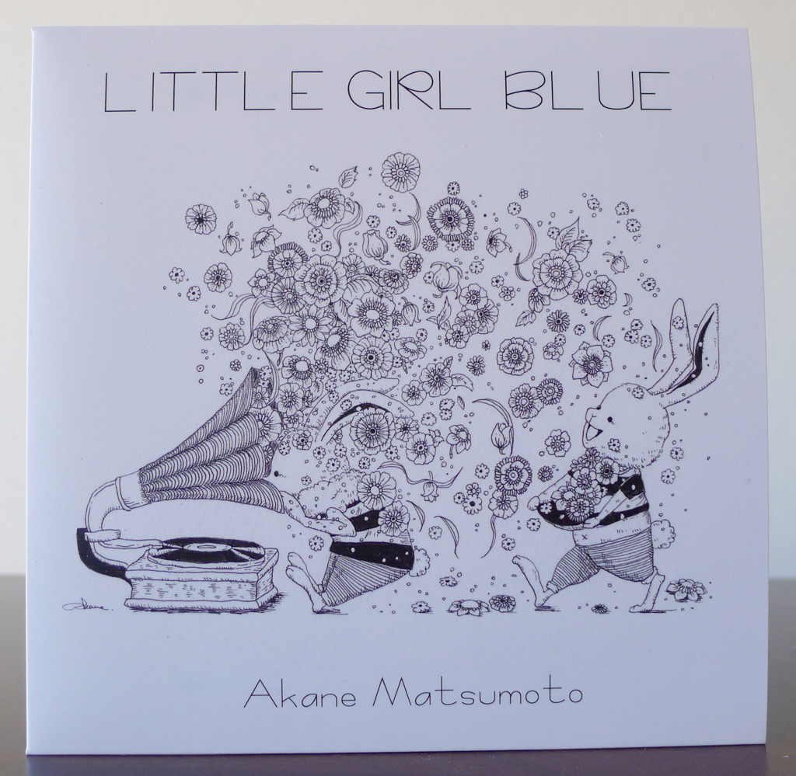
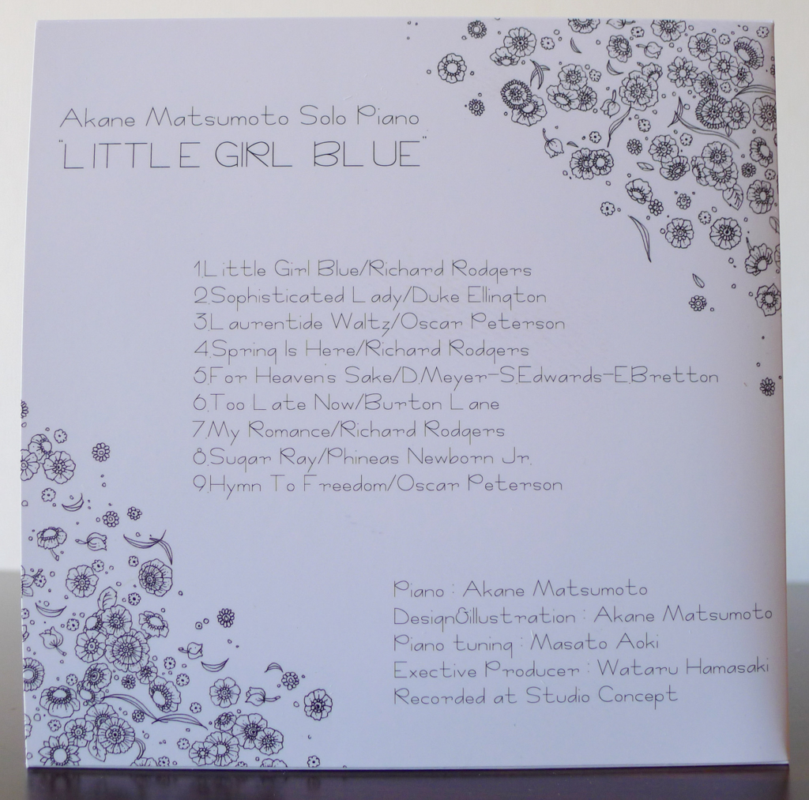
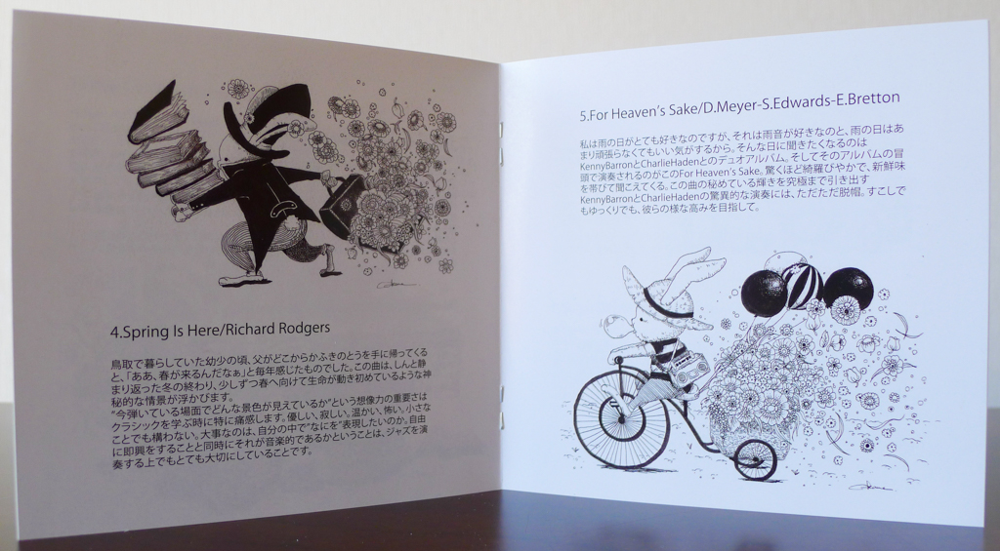

+++
title = "Akane Matsumoto: Little Girl Blue"
author = ["Brian McCrory"]
publishDate = 2023-11-20
keywords = ["akane-matsumoto-playing-new-york", "akane-matsumoto-memories-of-you", "akane-matsumoto-night-and-day", "akane-matsumoto-nanami-haruta-for"]
tags = ["Akane Matsumoto", "松本茜"]
categories = ["albums"]
draft = false
aliases = ["/archive/akane-matsumoto-little-girl-blue/", "/p/akane-matsumoto-little-girl-blue/"]
[cover]
  image = "akane-matsumoto-little-girl-blue-460.jpeg"
  caption = ""
  relative = true
+++

Akane Matsumoto’s solo piano album _Little Girl Blue_ from 2022 is full of good moods and good vibes, definitely different from any downcast implications that the album title may imply. A comfortable 42 minutes of traditional jazz standards from the 1930s-60s, this is feel-good music, happy jazz with a heartfelt beat, and even the most melancholy song, “Too Late Now”, is more likely to evoke a wistful smile than sorrowful tears.

As the music hops along through the tracks, many lighthearted, expressive, pretty, and sweet moments emerge, as Matsumoto mixes rubato passages, mid-tempo swing grooves, and joyful touches of stride piano and blues to keep toes tapping and spirits buoyed. For melodic and catchy choices, the music of the influential Richard Rodgers is prominently featured on three tunes: “Little Girl Blue”, “Spring is Here”, and “My Romance”.

The final tracks in particular (“My Romance”, “Sugar Ray”, and “Hymn to Freedom”) are upliftingly brimming, and also shine a light on two more of Matsumoto’s piano heroes, Phineas Newborn Jr. and Oscar Peterson. Peterson’s music is featured with two songs (the lovely “Laurentide Waltz” and “Hymn to Freedom” with its bursting fireworks of spirit) and is regularly heard at Matsumoto’s live shows as well. As for the stained-glass ornateness of Phineas Newborn Jr.’s “Sugar Ray”, Matsumoto brilliantly uses the music’s rhythmic shifts, bass thumps, and flowing licks to evoke the distinct parts of a piano trio alone on solo piano. Incidentally, true to form, Akane Mastumoto’s first album was called “Falling in Love With Phineas”, an album that was recorded while she was still in her teenage years.

The simple black-and-white of the album design featuring line art illustrations is also worth mentioning. Definitely a far cry from typical jazz album covers conveying smoky coolness and serious expressions, _Little Girl Blue_ highlights another side of pianist Akane Matsumoto. Her visual artistry with simple, honest drawings stands apart from other more reserved or attitudinally imposing covers… including her own more glamorous album covers as seen on this album’s _obi_. In addition to the old-fashioned scene of happy bunnies with flowers and a gramophone on the cover, the inside booklet contains more illustrations from the pianist with bunnies surrounded by favorite books, balloons, or flowers, and cooking, playing, or traveling while wearing fancy clothes.

Matsumoto’s musical art is perhaps of a kind with these detailed black-and-white drawings, as the intricate fluidity and good-natured warmth of her spirit are also given life through the black-and-white keys of her piano. In both mediums, the soft lines, gentle shading, and nimble accents of Matsumoto’s art overflow with optimism and expressiveness, wide-armed and embracing the world.



## Liner Notes {#liner-notes}

_(Translated from the original Japanese liner notes written by Akane Matsumoto.)_

1.  Little Girl Blue/Richard Rodgers

I chose this song to be first on this solo album. I learned that this song had such a cute verse section at a performance of the great Mulgrew Miller, someone who passed away much too soon. I saw Mulgrew in 2011 at the Monterey Jazz Festival, and I remember the impact that his live performance had on me. He had such a power of expression, an exquisitely balanced fusion of traditional and modern elements — a poetic spirit filled with details of technical playing. He was truly a star player, always exciting the audience and bearing a grand atmosphere. Offstage, as he greeted the audience politely, he was a model of gentlemanly behavior. I still carry the photo that we took together in my notebook as if it were an amulet.

2.  Sophisticated Lady/Duke Ellington

When I was in high school, I was called to the principal’s office just because I was playing jazz (tears). But some adults understood me. For example, my homeroom teacher in my third year of high school. Once, during a one-to-one lesson, I was asked “Do you like Sonny Clark?”… I was surprised!

My teacher, who listened to jazz at home on big speakers, said that there was a jazz cafe in Tokyo that they wanted to go to someday. After I graduated, my teacher still continued to support me, even coming to my concerts with bottles of sake (laughs).

As for this song, I’ve heard that Ellington wrote it for a wonderful female teacher whom he admired in his student days. This is one of my favorite songs, and it reminds me of my homeroom teacher.

3.  Laurentide Waltz/Oscar Peterson

Canadiana Suite, composed by Oscar Peterson for his homeland of Canada. This especially is a song that I love, love, love, and I’ll certainly still be playing it until I’m an old lady. Many of Peterson’s originals have a classical music atmosphere, yet within this element, the music can still be taken to bluesy places. Such is the worldview of Peterson. This is a secret masterpiece that combines elegance and fun. I’m happiest when I’m playing this song, and also when I go to bed at night (laughs).

4.  Spring Is Here/Richard Rodgers

When I was a child living in Tottori and my father would come home from somewhere with butterbur in hand, every year I would think “Ah, spring is here.” This song evokes a mysterious scene as if the deathly silent winter’s return has ended, and little by little life slowly begins to move towards spring.

When studying classical music, I especially feel the importance of imagination: “Right now, for the scene you are playing, what can you see?” Kind and lonely. Warm and frightening. Even small things, it doesn’t matter. The important thing is to ask yourself “what” do you want to express of yourself. Even when performing jazz or freely improvising, something I value highly is asking myself, it is musical?

5.  For Heaven’s Sake/D.Meyer-S.Edwards-E.Bretton

I really like rainy days. Not only do I like the sound of rain, but also I feel that I don’t need to try too hard on rainy days. On such days, I like to listen to the duo album from Kenny Barron and Charlie Haden [/Night and the City/, 1998]. And the beginning of this album includes this song, “For Heaven’s Sake”. It sounds so dazzling and fresh. I really admire the hidden brilliance drawn out to the ultimate degree in Kenny Barron and Charlie Haden’s marvelous performance. Even if just a little bit, even if slowly, aim for such heights as these two.

6.  Too Late Now/Burton Lane

Life as a musician has completely changed due to the global pandemic. For months, I haven’t been able to perform in front of people or to perform together with anyone. Performing our favorite music with our favorite musicians every day, and sharing this joy together with jazz lovers, has all but disappeared from our daily lives. For us, this distress was more painful than the financial hardship. In the midst of that, I received as a gift a CD from a fan who worried about and encouraged me in various ways. The title song from that album is this song, “Too Late Now”. While I may be a very weak person in some ways, because of the kindness of you all I’m encouraged to never lose heart.

7.  My Romance/Richard Rodgers

As you all surely know, when one mentions Richard Rodgers, you must remember singing the “Do Re Mi” song in elementary school music class. In “My Romance”, a song loved by all, you can also hear the “Rodgers knack” for using scales skillfully.

When I was in elementary school, I hated music class. The reason was that I didn’t want to be made to sing in front of others (laughs). Even at the music school I attended I stubbornly refused to sing, and I, and only I, was made to stay behind for detention lessons — a weekly routine. I still love my teacher to this day, but I remember at the time not being allowed to go home until I sang, so I would reluctantly do so while staring at my feet.

I never dreamed that I would become a professional musician, playing the piano in front of people almost every night. (But actually, even now I’m still not very comfortable playing in front of people (pained smile)).

8.  Sugar Ray/Phineas Newborn Jr.

Phineas Newborn Jr. (one of my idols since I was a child), started playing on an old upright piano at his school. Although it was in poor condition, it seemed that he could make it sound like the brilliant resonance of a Steinway. It’s something he can do because of his deep knowledge of “a beautiful sound”, his precise technique, and his ability to instantly grasp the condition of the instrument and draw out the best parts. It’s exactly like the saying “A good workman never blames his tools.”

I love this anecdote. As I played different pianos in different places every day for work, I started to enjoy seeing how quickly I could become friends with any particular piano, no matter what it was.

The title of this song refers to Sugar Ray Robinson, the greatest boxer of all time. In a piano trio format, this hit song is funky and catchy and highlights each instrument. Here, I have daringly attempted it on solo piano. With Love to Phineas.

9.  Hymn To Freedom/Oscar Peterson

My grandfather was interned in Siberia for four years after the war. He would often say “There’s no night that doesn’t end.” [“It’s always darkest before the dawn,” or “There’s a light at the end of the tunnel.”] The more I thought about my grandfather living under such unimaginably harsh conditions for four years, the more I felt the weight of his saying. This is something that always inspires me in these uncertain times.

This song was written during the civil rights movement, and it must have become a great support to all the people who were trying to regain the freedom that is often taken for granted. This is a powerful message from Peterson, a wish for a peaceful and free world.



## Little Girl Blue by Akane Matsumoto {#little-girl-blue-by-akane-matsumoto}

-   [Akane Matsumoto](/tags/akane-matsumoto) - piano

Released in 2022 on Concept Records as CR-14.

_Japanese names: 松本茜 Matsumoto Akane_

## Audio and Video {#audio-and-video}

-   [Promotional video for “Little Girl Blue”, track #1 on this album:](https://youtu.be/XwR65NNVMqQ)



-   [A live version of “Sugar Ray”, track #8 on this album:](https://youtu.be/T93GC7846UU)



-   Excerpt from track #3: “Laurentide Waltz” [mix #9](https://www.jazzofjapan.com/archive/audio/#mix-9)


