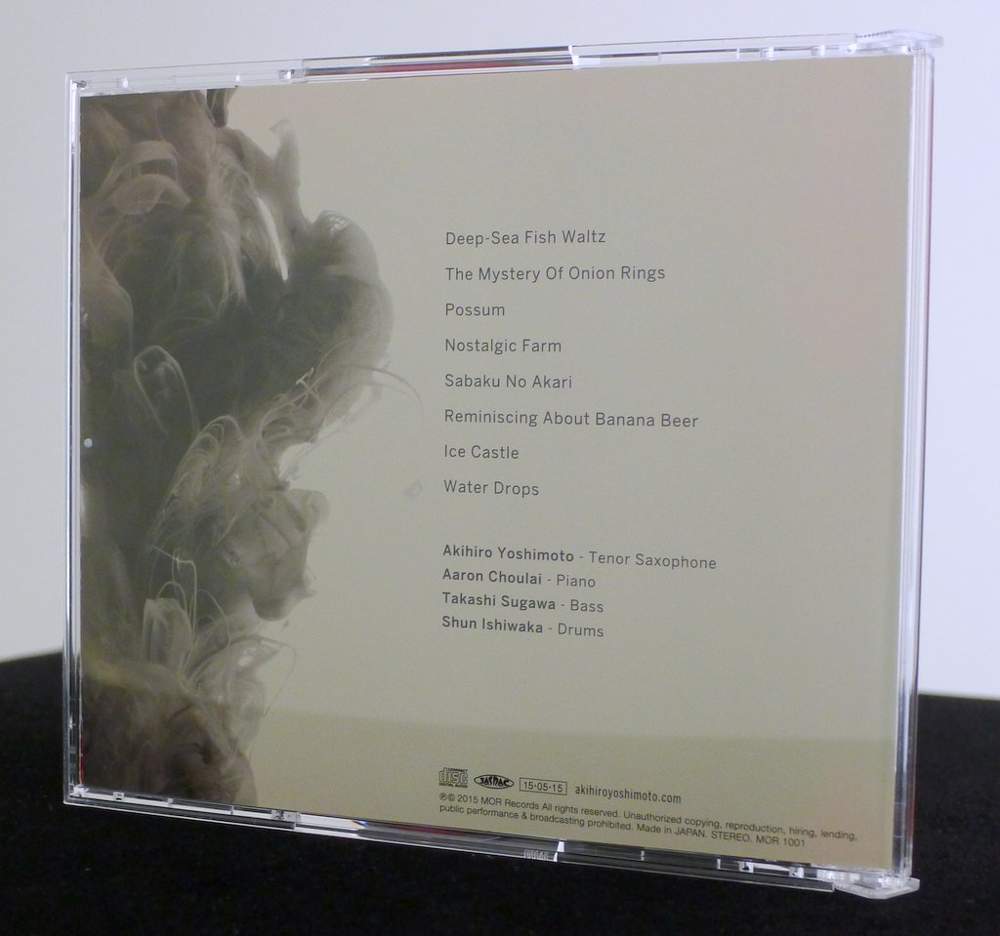
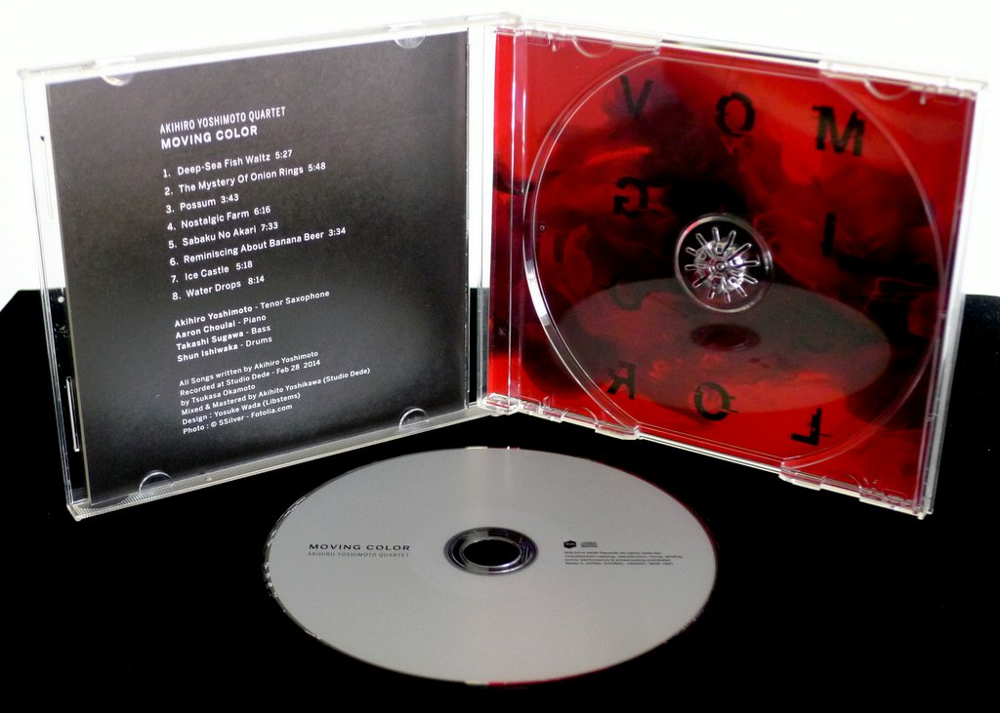

+++
title = "Akihiro Yoshimoto Quartet: Moving Color"
author = ["Brian McCrory"]
publishDate = 2018-08-18
keywords = ["motoi-kanamori-my-soul-meeting", "keisuke-nakamura-humadope-2", "nanami-haruta-ii", "akihiro-yoshimoto-quartet-64-charlesgate"]
lastmod = 2024-04-06
tags = ["Akihiro Yoshimoto", "吉本章紘", "Aaron Choulai", "アーロン・チューライ", "Takashi Sugawa", "須川崇志", "Shun Ishiwaka", "石若駿"]
categories = ["albums"]
draft = false
[cover]
  image = "akihiroyoshimoto-moving-460.jpeg"
  relative = true
+++

_Moving Color_ is the second album from saxophonist Akihiro Yoshimoto and his quartet. With eight original songs drawn from his palette, he blends serious musical exploration and improvisation with elements of modernity, jazz tradition, and a bit of humor. Strength in composition and group cohesion is clear: the quartet plays confidently, as if they are disclosing a secret bit by bit, modestly exhibiting their skills yet playing with brimming energy and a locked-together sense of where they are going.

The tracks are solidly modern jazz tunes, with sizzling improvisation from Yoshimoto and pianist Choulai melodically laying out fiery, stimulating lines. There are a few moments of avant-garde exploration, where Sugawa’s bowed bass is used extremely effectively.

A brooding atmosphere arises on #4 “Nostalgic Farm” and especially #7 “Ice Castle”, where a museum-like calm settles, foreboding and somewhat Nordic with its dark, chilling sound. There’s even a bit of goofy humor on two songs (#2 “The Mystery of Onion Rings” and #6 “Reminiscing About Banana Beer”), where Monkish exuberance and swing add a loose, jolly balance to the album.

The two longest tracks, #5 “Sabaku No Akari” and #8 “Water Drops”, build patiently. These two compositions portray Yoshimoto’s thoughtful and edgy songwriting strength, masterfully refined in balancing honed compositions with space for group dynamics and spontaneity.

These tracks and #3 “Possom” also summon a sense of Wayne Shorter’s modern quartet. This is exciting jazz with unextinguishable energy powered locomotively by drummer Ishiwaka and bassist Sugawa. All throughout, Yoshimoto’s liquid tenor swings over the chords like a daredevil trapeze artist, flowing and moving colorfully in impressive patterns.

## Liner Notes {#liner-notes}

_(Translated from the original Japanese liner notes written by Toshihiko Hoshino, music writer.)_

Often, when seeing the children of family members after a long time, you can be surprised at how much they’ve grown. I was struck by a similar sensation when I heard this album. This was in spite of the fact that I went to almost all of this group’s live shows in Tokyo and should have recognized their growth firsthand.

The debut release _Blending Tone_ from the Akihiro Yoshimoto Quartet pairs the ideal combination of allies Akihiro Yoshimoto and Aaron Choulai with the addition of the youthful rhythm section of Takashi Sugawa and Shun Ishiwaka. This was an epoch-making album from 2012.

A band grows by keeping its members fixed and regularly performing together. When I listened to _Blending Tone_ and _Moving Color_ in succession, a clear evolution in the band’s sound became apparent.

There are two dimensions to this evolution: maturity and transformation. Maturity refers firstly to the greatness of the Yoshimoto and Choulai combination. This is exactly what the phrase “Aun breathing” (_two people performing together in sync and in harmony_) is all about. In particular, hats off to Choulai, who perfectly understands Yoshimoto’s musicality and adds his own unique musical personality to it. There are probably not many pianists with such chord stacking, striking, timing, and pace that can be heard just from their backing accompaniment.

The beautiful interaction between tenor sax and piano on the ballad “Nostalgic Farm” is breathtaking. On “The Mystery of Onion Rings”, while the style is contemporary, traditional jazz roots are also filled with humorous playing through their personally-stamped homage to good old-fashioned jazz. For encores, this band often plays standards like ballads and bebop tunes, and being able to mix cutting-edge originals with traditional standards without any sense of unease is an example of the depth of their understanding.

While the previous release _Blending Tone_ was aiming towards a band sound, it’s undeniable that Yoshimoto’s and Choulai’s collaboration played a large role at that time. Yet with each live performance by the band, the rhythm section’s involvement grew larger and the band’s individuality became established. This transformation is one of the key successes of this album.

It would not be improper to say that Shun Ishiwaka has become the number one young player today. Not only in this quartet, but Ishikawa and Choulai have also involved each other in their own groups, maintaining an unshakably trusting relationship. Highlights of their live performances include the moments when Ishiwaka and Choulai react through eye contact and engage aggressively with Yoshimoto’s tenor.

Check out Ishiwaka’s drumming in “Sabaku No Akari” behind Choulai’s piano solo, when a switch is suddenly flipped and the drums start pounding away. Just at the point behind the piano solo where Ishikawa may have gone too far to the edge of collapse, Choulai responds and starts to play furiously. Their momentum continues as the two fiercely and mercilessly challenge Yoshimoto’s tenor, a highlight of the middle portion of the album.

In December 2012, bassist Takuya Sakazaki left the group and Takashi Sugawa joined as a new member. Sugawa has been a long-standing member of the Terumasa Hino group and can be called the number one young bassist. He’s also an old friend of Yoshimoto and Choulai. While Sakazaki’s bass was of the unsung hero type, Sugawa’s bass is a type that aggressively connects with the front. The addition of Sugawa also resulted in a clear transformation of the band’s sound, such as the bowed melody on “Ice Castle” and the avant-garde solo on “Reminiscing About Banana Beer”.

The culmination of this evolution surely must be the last number, “Water Drops”.  The mysterious melody is covered in darkness, led by a striking bass phrase. Yoshimoto’s tenor starts quietly, uses bold low-note phrases effectively, and ascends towards the climax. Perfectly closing in on this tenor, Choulai’s piano comping shape-shifts like a kaleidoscope, adding an amazing sense of color. Ishiwaka’s drums respond to the soloist’s phrases instantly and inject explosive energy.

Yoshimoto’s excellent music and leadership together with the strong individuality of the members has resulted in a band sound that has come to fruition. At over eight minutes, and the longest performance on the album, this dense world of sound doesn’t reveal any flaws and shines brightly on this album.

The shape of Akihiro Yoshimoto Quartet, which has achieved remarkable growth, was recorded in February 2014. As they continue to evolve day by day, we look forward to the sounds they express when they next appear before us.

_Toshihiko Hoshino 星野利彦 / Music Writer_



## Moving Color by Akihiro Yoshimoto Quartet {#moving-color-by-akihiro-yoshimoto-quartet}

-   [Akihiro Yoshimoto](/tags/akihiro-yoshimoto) - saxophone
-   [Aaron Choulai](/tags/aaron-choulai) - piano
-   [Takashi Sugawa](/tags/takashi-sugawa) - bass
-   [Shun Ishiwaka](/tags/shun-ishiwaka) - drums

Released in 2015 on MOR Records as MOR-1001.

_Japanese names: 吉本章紘 Yoshimoto Akihiro アーロン・チューライ Choulai Aaron 須川崇志 Sugawa Takashi 石若駿 Ishiwaka Shun_

## Audio and Video {#audio-and-video}

-   [The Akihiro Quartet playing live in 2012:](https://youtu.be/IG8jxrYenzg)



-   Excerpt from track #5: “Sabaku No Akari” [mix #3](https://www.jazzofjapan.com/archive/audio/#mix-3)


