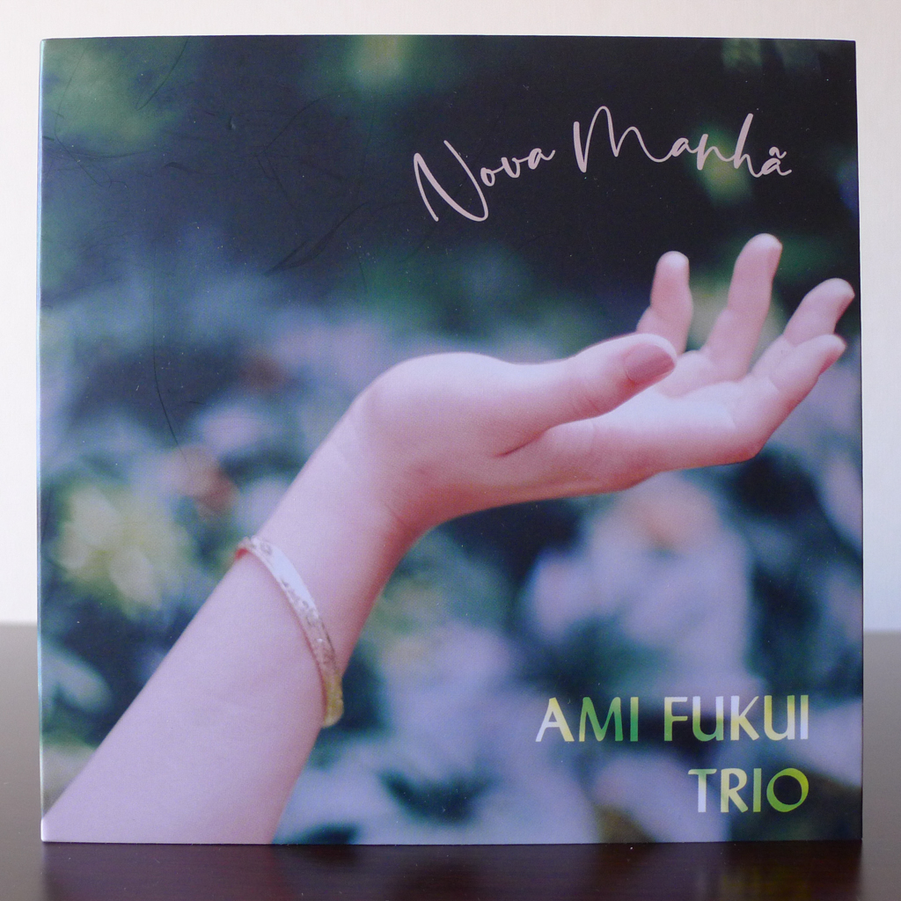
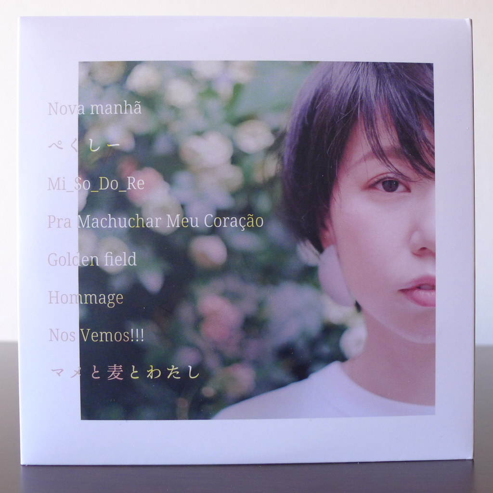
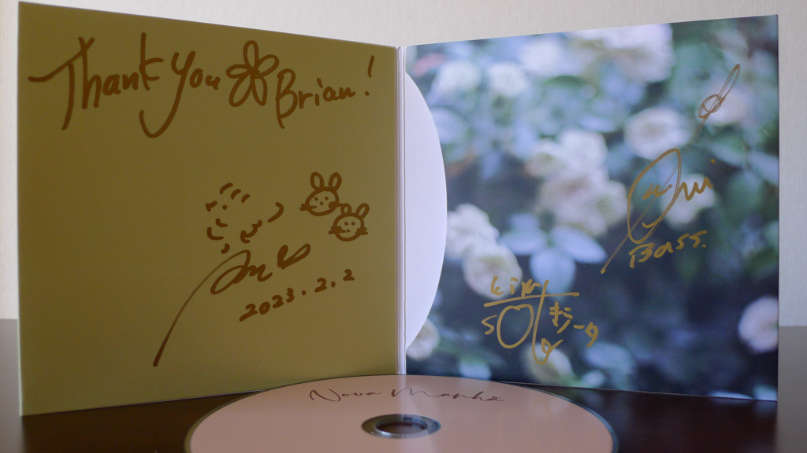
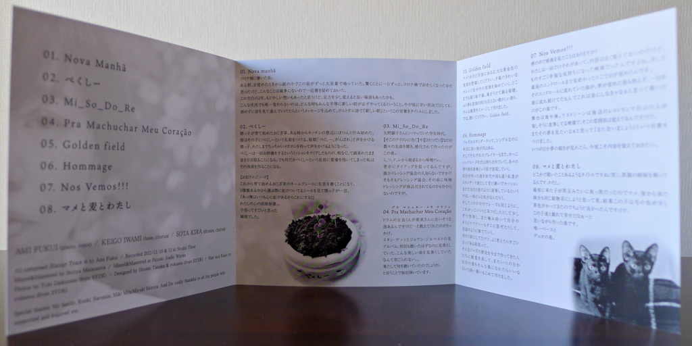

+++
title = "Ami Fukui Trio: Nova Manhã"
author = ["Brian McCrory"]
publishDate = 2024-01-26
keywords = ["ami-fukui-trio-urban-clutter", "ami-fukui-amizm", "ami-fukui-trio-new-journey"]
tags = ["Ami Fukui 福井亜実", "Keigo Iwami 岩見継吾", "Sota Kira 吉良創太"]
categories = ["albums"]
draft = false
[cover]
  image = "ami-fukui-nova-manha-460.jpeg"
  relative = true
+++

Pianist Ami Fukui continues her original jazz journey with _Nova Manhã_, her fourth leader album from 2022 with eight tracks running at about 45 minutes.

As with her previous releases _[Urban Clutter](https://www.jazzofjapan.com/archive/ami-fukui-trio-urban-clutter)_ (2010), _[Amizm](https://www.jazzofjapan.com/archive/ami-fukui-amizm)_ (2013), and _[New Journey](https://www.jazzofjapan.com/archive/ami-fukui-trio-new-journey)_ (2016), this creative musician focuses her original music on the specific sound of her trio and her concept this time out. Seven of the eight tracks on this album are her own compositions. Her music is often colorful, perhaps with more calming hues on this release, and her unique blend of cool beats and pop melodies with a soulful smile runs through the music.

Fukui’s music often uses a modern jazz style beat almost like light neo-jazz with a groovy Latin backbone, as compared to a traditional swing rhythm or blues shuffle. Right from the album title, the jazzy opening track “Nova Manhã” (“new morning” in Portuguese) is underpinned by a subtly compelling rhythm similar to Brazilian or Afro-Cuban rhythms found in some EDM/electronic dance and pop music, but through a jazz lens.

The Latin feel is most apparent on the Brazilian song “Pra Machuchar Meu Coração”, the sole cover song on the album, and a gem that Fukui humorously describes overlooking on the well-known and much-played album by Stan Getz and João Gilberto (see liner notes below).

In addition, Fukui’s original “Nos Vemos!!” conveys a similar Latin sound with a tropical island feel. While it may be going too far to call these trademarks, this cross-genre flexibility is similar to previous compositions where Fukui combines conventional jazz with elements from club jazz, Latin, and pop music.

In particular, the Latin influence is felt on this album more than on previous releases, perhaps to add an overall calm and relaxing vibe to the music. Fukui and the trio also use their voices in wordless harmonies in a few spots in a very warm and welcoming way.

This is not to say that the album as a whole is a trance-inducing or zone-out experience. Maybe it’s the sense that a guiding angel inhabited the environment, aiming the music towards peaceful harmonies and away from over-stimulating roughness.

Fukui’s musical concept on this album of serenity and calmness may even be influenced by her focus on yoga, Ayurveda, and mindfulness, involved as a practitioner and instructor who offers online yoga lessons. It is interesting to consider how her dedicated training of body and mind may also be shaping her musical ideas and performances as well.

Most of all though, the pianist’s attention to her compositions and her jazz piano trio is comfortable and balanced, right in the Goldilocks zone of being not too simple, not too complex, but feeling just right.

## Liner Notes {#liner-notes}

_(Translated from Ami Fukui’s original Japanese liner notes.)_

To everyone who purchased this, to those who know me as well as first-timers, thank you so much for picking up this album among all the CDs available.

This is my first album since my last release about five and a half years ago. Many things have dramatically changed in the past two years due to the coronavirus epidemic, and I think that my life and my heart have been greatly affected as well.

Rather than heart-pounding excitement, I aimed for gentle calmness. I created this album with this concept in mind. It’s also an album that feels like a collection of essays that have been compiled out of my daily life.

Many people helped out, and it greatly pleases me that we could bring this special collection to fruition. I hope that this album becomes music to bring peace to the hearts of those who listen to it.

_Ami Fukui_

01.Nova manhã

A song written during the coronavirus pandemic. One morning after waking up, this song was running through my head at high volume. Surprisingly it lasted all day. I wondered, is this strange incident somehow related to the coronavirus? Since this was a rare occurrence, I decided to write the song down just in case.

These two years were a blank. There were frustrating moments, but also some good things, if I changed my perspective just a bit.

Even in this situation or at any time, one thing that doesn’t change is that all are equal in the fact that a new morning will come no matter what. The message is that even if things are tough, keep looking forward and don’t give up. I chose the title based on the Portuguese word for “new morning”.

02.Pexy

My nephew started growing a touch-me-not plant. At some point, it was sitting alone near the kitchen window. He called the plant Pexy. Every morning, my nephew called out “Pexy, go for it!”. He even began to use a small megaphone, and the sound also reached as far as to me.

Although Pexy completed its mission of bowing once, not long after that it took its last breath with its head bowed. For some reason, the name Pexy stuck with me, and so I wrote this song.

_Bonus Episode_

As my nephew was choosing a nameplate for his touch-me-not plant, from the three available options he chose the one with a rainbow sticker on it. “Oh, since I always have a rainbow in my heart, I’ll get this one!”

I was moved to tears. It was a moment when I felt “Children are so amazing, aren’t they?”

03.Mi_So_Do_Re

When I was a student I was obsessed with Akiko Yano. This song was inspired by several famous songs I listened to, such as “Soko no Iron ni Tsugu” and “Hitotsu Dake”.

“Miso dressing” starts with the letters “mi so do re” [in Japanese, ミ、ソ、ド、レ]. I’m secretly looking to collaborate, so does anyone have a contact in the salad dressing industry? Actually, I don’t know which came first, miso dressing or the dressing industry…

04.Pra Machuchar Meu Coração

The origin of playing this song was when Kira (drums) told me that he had a song that seemed to suit me.

The famous album by Stan Getz and João Gilberto. Although I’ve listened to it so many times, I overlooked this song. I can’t believe I missed such a beautiful song. What exactly was I listening to? Like so, I play it every time.

05.Golden field

Imagine a vast golden wheat field in an American countryside. The setting sun begins to dye the wheat field a pretty orange color. A horizon that never ends. Ears of rice plants dancing in the wind. The indescribably nostalgic scent of a wheat field drifts by. I wrote this song with an image of that landscape. Well, please listen. Golden field…

06.Hommage

Many jazz standard songs are simple but so good. It can also be said of the musicians who have so many cool melodic phrases on hand, expressing themselves through unique characteristics in the form of their performance. I wonder how it feels to write songs that have been passed down as standards through different generations and countries, beloved to the point of being performed as a natural part of sessions.

And, the same with phrases used in solos. To hear a part and think “This is cool!!”, to copy it by ear, to practice, break it down, add our own ideas, and perform it as a language. We take it for granted but, thinking about it, it’s so amazing. I wrote this song as an expression of appreciation to those who created this history of jazz up to now, and with the faint hope that someday my own music can become part of it as well.

07.Nos Vemos!!!

Have you ever watched a movie in your dreams?

It happened to me just once. I can’t remember the story at all, but it was a movie that made me feel extremely happy. And after the final credits finished, I woke up. There was a song playing through the credits that didn’t go away even after I woke up. It stayed in my head all day, so I figured I had to write down this song.

The setting is the Mediterranean Sea. The last scene is at a restaurant by the sea where everyone is happily sharing a meal. I can remember that atmosphere. As I wanted to have that dream again, I chose the words “Let’s meet again.” If someday that dream continues, I want to remember it this time.

08.Mame to Mugi to Watashi

It seems like a title I’ve heard somewhere before (haha). [The title uses the same form as a hit J-Pop song “Heya to Y-shirt to Watashi” (1992).]

I have two black cats who are sisters. The one who came first was pitch black like black beans, so she’s Mame [bean]. I wanted to use the same type of grain for the younger sister who came after, so she’s Mugi [wheat]. This girl’s fur turned out to become a little brownish so it was just right.

I wrote this song thinking about how fun it is to play with these kitties. The song is a duo with a great bassist.



## Nova Manhã by Ami Fukui Trio {#nova-manhã-by-ami-fukui-trio}

-   [Ami Fukui](https://amifukui.com/) - piano
-   [Keigo Iwami](http://keigoiwami.blog110.fc2.com/) - bass
-   [Sota Kira](https://kirasota.jimdofree.com/) - drums

Released in 2022 on MAM Records as MR-001.

_Japanese names: 福井亜実 Fukui Ami 岩見継吾 Iwami Keigo 吉良創太 Kira Sota_

## Audio and Video {#audio-and-video}

-   [Promotional video with excerpts from “Nova manhã”, “Pra Machuchar Meu Coração”, and “Pexy”:](https://youtu.be/xwgK4zaU87I)



-   [Promotional video for “Mame to Mugi to Watashi”, track #8 from this album:](https://youtu.be/7nTgk3jYni4)



-   Excerpt from track #6: “Hommage” [mix #10](https://www.jazzofjapan.com/archive/audio/#mix-10)



## Other Links {#other-links}

-   [Online yoga lessons link provided by Ami Fukui](https://mosh.jp/services/93414)
