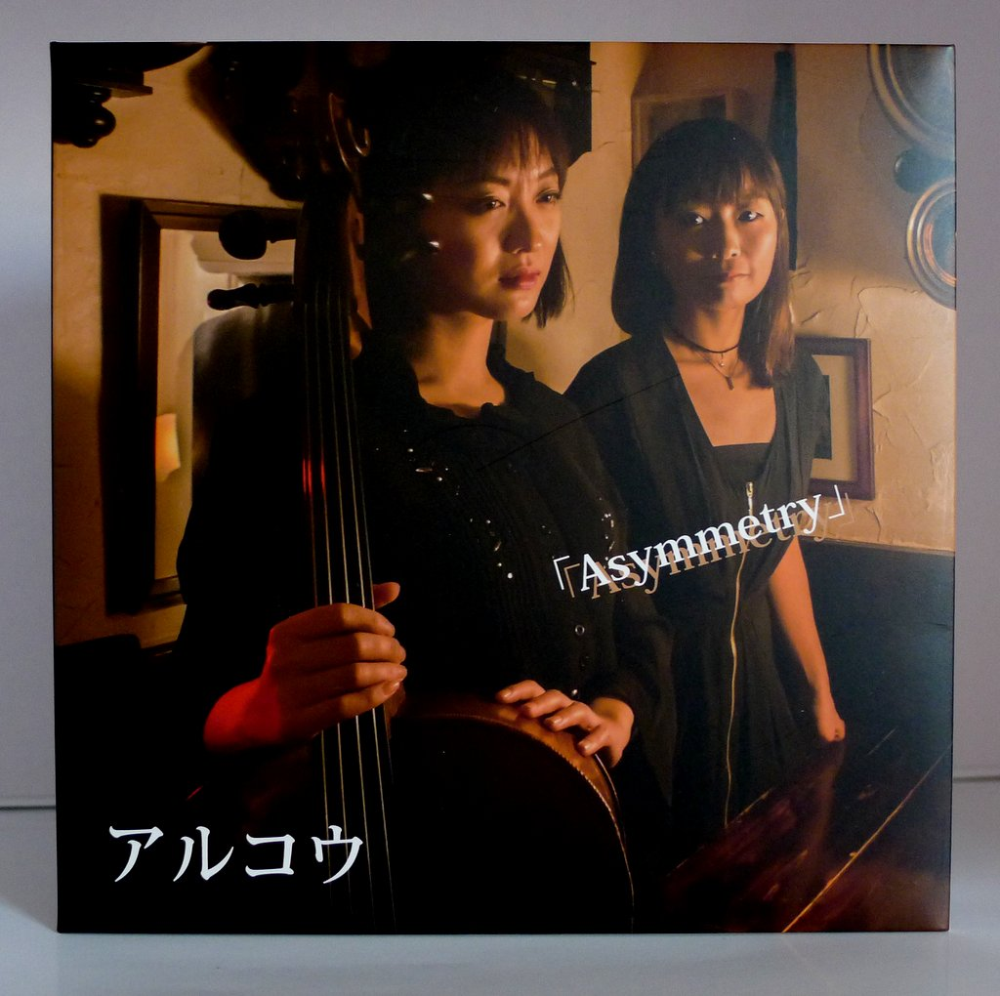
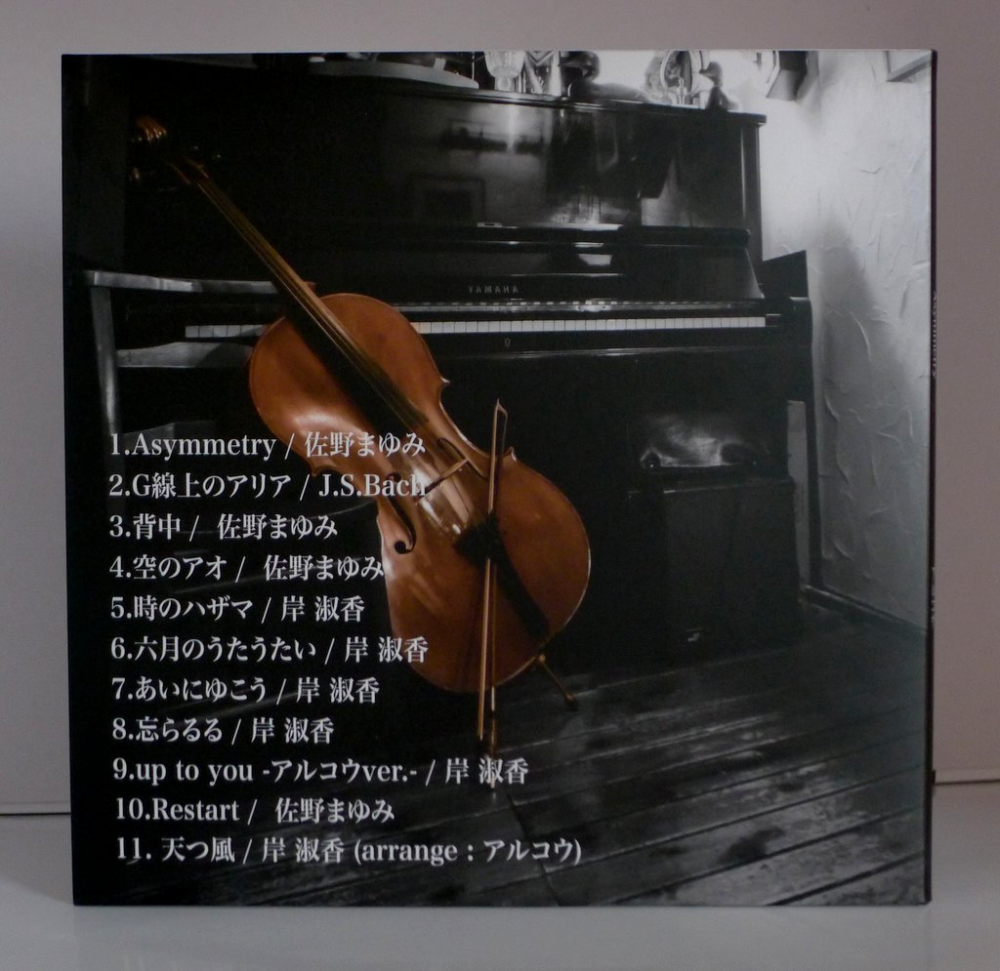
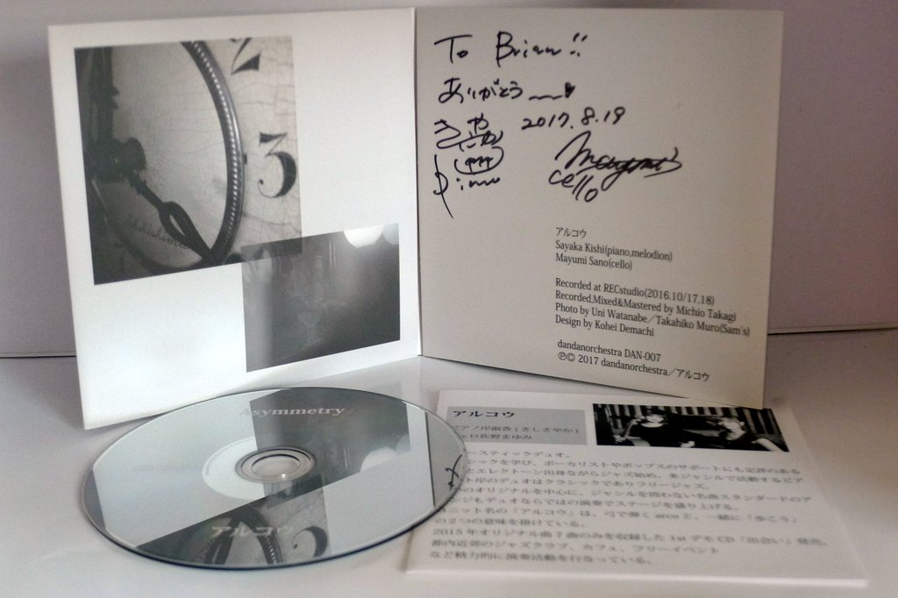

+++
title = "Arco: Asymmetry"
author = ["Brian McCrory"]
publishDate = 2018-01-31
tags = ["Sayaka Kishi 岸淑香", "Mayumi Sano 佐野まゆみ"]
categories = ["albums"]
draft = false
[cover]
  image = "arco-asymmetry-460.jpeg"
  relative = true
+++

Pianist Sayaki Kishi and cellist Mayumi Sano released their first album together under the moniker Arco with _Asymmetry_ in 2017. The pair’s music consists of original songs with a single Bach composition, all played in lovely and skillful arrangements. With more than a slight touch of classical elegance, the music spans various moods with verve: upbeat, fresh, somber, and refined. Although it may be apt to call this music classical-pop or pop-classical rather than typical jazz, the improvisational spirit and composed musicianship are definitely on display and quite enjoyable.

## Asymmetry by Arco {#asymmetry-by-arco}

-   [Sayaka Kishi](http://www.sayaketto.net/) - piano, melodion
-   [Mayumi Sano](http://sanomayumi.com/) - cello

Released in 2017 on dandanorchestra as DAN-007.

_Japanese names: 岸淑香 Kishi Sayaka 佐野まゆみ Sano Mayumi_

## Audio and Video {#audio-and-video}

-   [Promotional video with samples from the album:](https://youtu.be/oY8PypPVPuY)



-   Excerpt from track #1: “Asymmetry” [mix #1](https://www.jazzofjapan.com/archive/audio/#mix-1)


