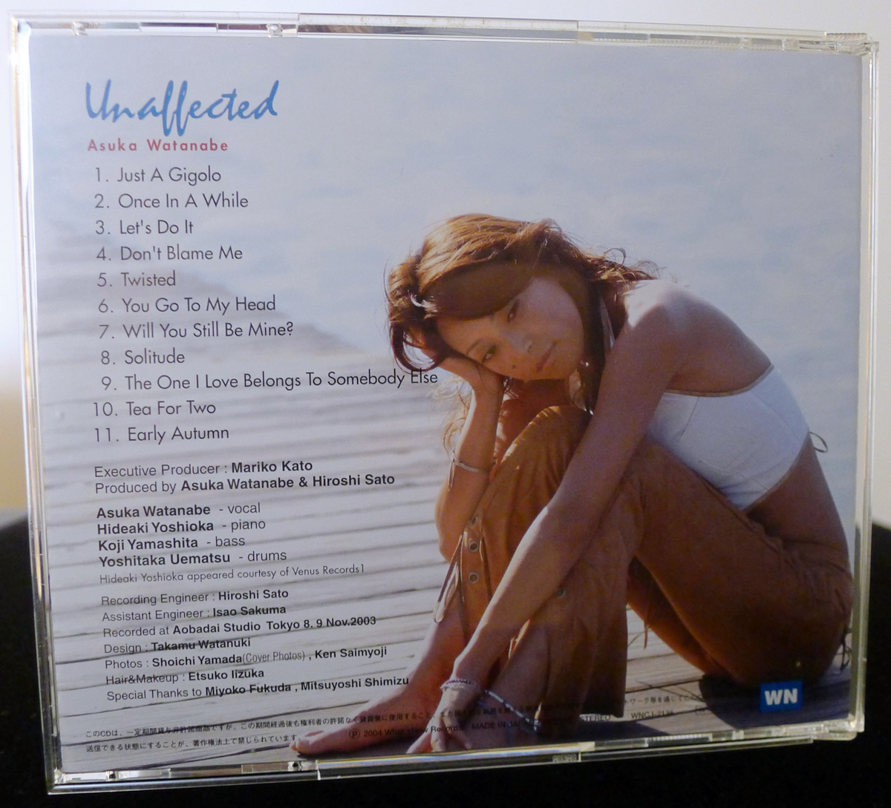
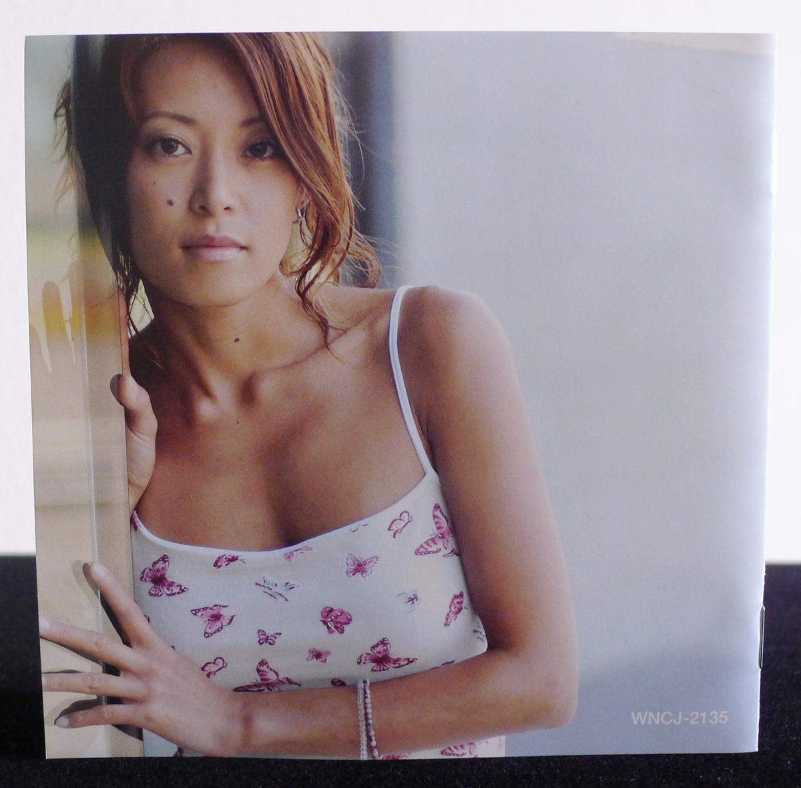
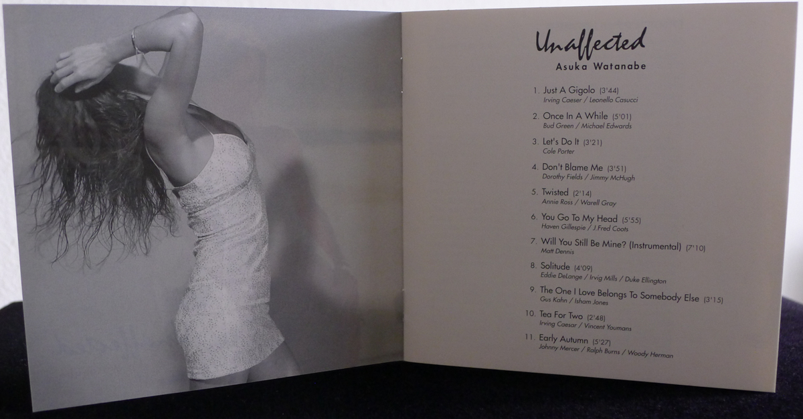
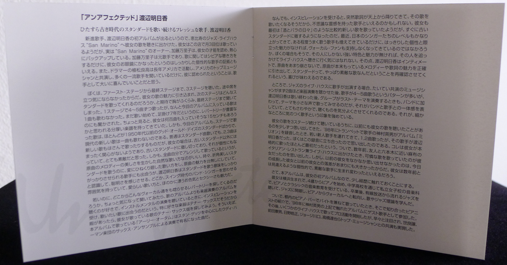
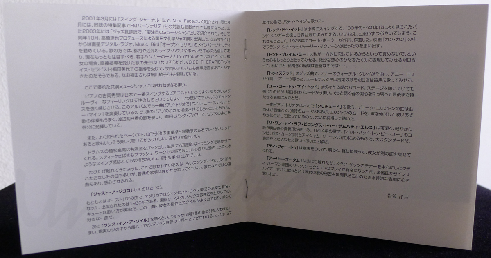
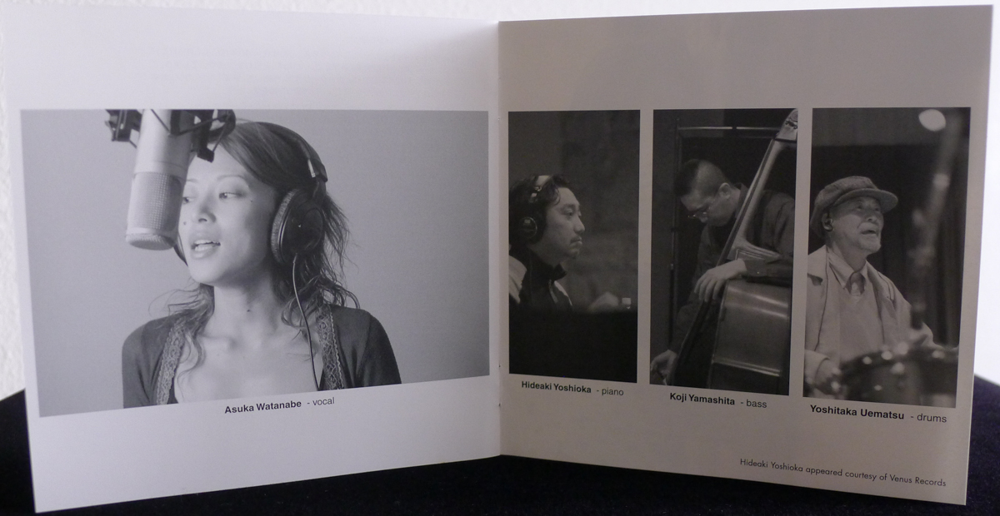
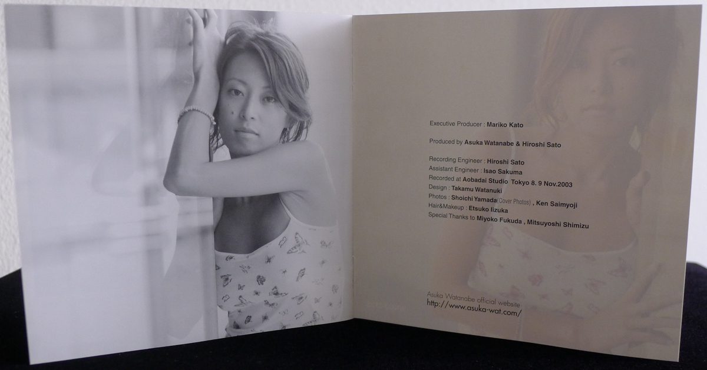

+++
title = "Asuka Watanabe: Unaffected"
author = ["Brian McCrory"]
publishDate = 2026-03-23
keywords = ["azumi-almost-like-being-in-love", "naoko-akimoto-no-one-else", "yako-horikita-shining-hour", "mie-joke-etrenne", "layla-tomomi-sakai-stolen-moments", "miwo-tranquillo", "rie-taguchi-the-gift-ii", "yoshiko-saita-back-in-time-to-boston"]
tags = ["Asuka Watanabe 渡辺明日香", "Hideaki Yoshioka 吉岡秀晃", "Koji Yamashita 山下弘治", "Yoshitaka Uematsu 植松良高"]
categories = ["albums"]
draft = false
[cover]
  image = "asuka-watanabe-unaffected-460.jpeg"
  relative = true
+++

In Japan, Asuka Watanabe is a recognizable name for fans of old jazz standards and Japanese vocals. Her emergence in the live jazz scene in the early 2000s was elevated by her 2004 debut album, _Unaffected_. The album’s title fits the meaning of unpretentious sincerity, and that is what the music here is all about. Fans of classic jazz will appreciate Watanabe’s great selection of familiar tunes centered on her straight-forward singing without affectation, presented in the traditional format of a jazz vocalist backed up by a jazz piano trio. Her locked-in trio for this recording features equally Hideaki Yoshioka on piano, Koji Yamashita on bass, and Yoshitaka Uematsu on drums.

As jazz standards go, the music is true to form without varying too much from the usual patterns. The musicians honor the music, stay true to the charts, and enhance the character of each song with their personalities without overdoing it or mishandling the music that jazz fans continue to appreciate throughout the years. It’s good-feeling music enjoyed by musicians who love that classic style and want to share it with similarly minded listeners, and it’s good to see and hear that this kind of devotion lives on.

_Unaffected_ is a 47-minute album with 11 tracks, most in the short-and-sweet range of three to six minutes each. A few uptempo tunes are even shorter (the wild Annie Ross-inspired “Twisted” at 2:17 and a quick “Tea for Two” at 2:48), while the longest track is an instrumental version of “Will You Still Be Mine?” (7:11) where Watanabe steps aside as the piano trio performs this song in a bouncy, Red Garland-inspired version.



## Liner Notes {#liner-notes}

_(Translated from Yozo Iwanami’s original Japanese liner notes.)_

**_Unaffected_ Asuka Watanabe**

_Asuka Watanabe, a fresh new singer who devotedly continues to sing old era standards_

The debut album of up-and-coming singer Asuka Watanabe was about to be released, so I went to the jazz venue San Marino in Ebisu to listen to her sing. It seems that she sings there about three times a month, and the owner of San Marino, Mariko Kato, recognizes her talent and supports her enthusiastically. As a former singer, Mariko Kato has a discerning ear when it comes to singing, and that fact that Asuka Watanabe caught her attention is proof that she is a strong, distinctive singer. Also, drummer Yoshitaka Uematsu has performed in the US for many years with top American musicians, and he has listened to a great number of first-class singers, and being recognized by him is a great blessing as a vocalist.

I listened to all three sets that night, from the first to the last, as I didn’t feel like leaving my seat throughout. I was drawn in by the charm of her singing, and I kept wondering what standards she would bring out for the next set. With that sort of anticipation filling my chest, I ended up staying through to the end. She sang four to five songs for each set, by somehow none of those songs ended up being included in this album. I was surprised at how extensive her repertoire was, as she had only been singing for about seven years since starting out. I even caught of glance of the thick folder of music charts that she had brought. It was about 15 centimeters thick and must have contained hundreds of songs. The songs she sang on stage, as well as on this album, were all standards from the good old days of the 1950s and earlier. Not a single new song from the modern era was sung. Usually, when vocalists are singing standards, they may also include two or three newer songs in the mix. But Asuka Watanabe seems to have no interest in singing anything other than the old standards, and she is completely devoted to those songs. It’s wonderful that this has even become part of her distinctive personality. What’s more, she arranges all the songs that she sings to bring forth the beauty of the original melodies through her natural style of singing. Sometimes, singers intentionally pick beautiful standards and then fiddle with them by adding a novel style or a strange approach that ruins the allure of the original composition. Asuka Watanabe identifies resolutely with what it means to sing standards, and sings them with propriety. Somehow, she embodies a lovable singing style that exudes the atmosphere of a swing era big band singer combined with a subtly glamorous feminine presence and sexiness.

How does someone so young find a repertoire that impresses even seasoned vocalists? I was curious, and when I asked about this, she told me that she prefers listening to albums with instrumental performances more than vocal albums. When she listens to instrumental performances, she gets inspired and feels like singing those songs. It seems that she likes tenor saxophone in particular, and it would be nice someday to track down some tenor sax versions of the songs she sings. Come to think of it, regarding “Early Autumn” on this album, there was a famous version of this song performed by the Woody Herman Orchestra starring Stan Getz in a saxophone ensemble.

When Asuka is inspired by a song, it seems somehow as if the lyrics suddenly descended from heaven, and she begins to feel the urge to sing that song. So in that sense you could call her a vocalist with a mysterious sixth sense. At first, she tended to sing relatively newer songs like “The Days of Wine and Roses,” but she soon became enamored with older standards and became absorbed with those. Lately, the ability of Japanese singers has been rising. With an increase in the number of skillful vocalists comes a potential decrease in those fans of vocal jazz who support a particular singer, especially that singer lacks a distinctive personality or outstanding magnetism. I even noticed that in myself, when I don’t feel like going to hear someone sing at a jazz club if I can’t sense their special qualities or unique charm. On that point, Asuka Watanabe honors the songs intimately. She brings out the appeal of the original melody and lyrics without mangling them, sharing the pleasure of rediscovering how wonderful the original songs are after all.

By the way, usually when a vocalist performs at a live jazz club, it’s common for the band to play up to two instrumental songs first, after which the vocalist joins to sing about four to five songs. As for Asuka Watanabe, when the band is playing their last theme, or after she is done singing, she joins the band and sings the melody softly, creating a sense of oneness of the band and singer. This results in a good feeling all around that also envelops the listeners, and strengthens the impression of being a singer who pays attention to fine details.

As I was listening to her singing through the three sets, I gradually began to remember that I had heard her sing before. In 1998, when vocalist/trumpet player Hideo Kamimura recorded his album _Million,_ he introduced a new young vocalist who sang one or two songs. That singer was Asuka Watanabe. I remembered because I was present at this recording. This was essentially the first time she had sung seriously. Then, I remembered that a few years before, a friend and I were at an Roppongi-area Azabu Italian restaurant with live music, and she was there singing some lovely songs. However, the reason I could hardly remember her from before was because the gap between that woman and this grown-up version was so tremendous. You could say that she transformed into a wonderful singer with an individuality so different from several years earlier.

Now, as this is her first album, I’ll briefly touch on her background. She was born Yokohama and started piano lessons at four years old. Throughout middle and high school in private girls school, she studied piano and received a classical music education. After graduating, she listened to jazz through cable broadcasting, and she became spiritually awoken by the jazz she heard. She switched from piano to vocals and studied singing and jazz theory.

Then, while she was working and singing at a Tokyo piano bar, an acquaintance introduced her to Hideo Kamimura, and this led to her being a guest singer in 1998 on the album mentioned above. Following that, she started singing professionally at several live music venues and quickly gained attention, appearing with top jazz musicians including Yuzuru Sera, Norio Maeda, Terumasa Hino, George Kawaguchi, and Tatsuya Takahashi.

In March 2001, she was introduced as a New Face [/up-and-coming talent/] in the jazz magazine _Swing Journal_. In August of the same year, the magazine published a feature interview with her and a radio personality, which also attracted attention. Then, in 2003 she was introduced as “a musician to watch” in the magazine _Jazz Hihyou_. In October of that year, she appeared at the National Culture Festival Jazz Festival produced by Tatsuya Takahashi. Now, starting in April of this year, she has been the main personality for the Music Bird satellite digital radio show _Open Sesame_. As a singer, she is an active in Tokyo and surrounding suburbs at live music venues and hotels, and is regarded as one of the top young singers deserving of attention even through now. Although it seemed she never had direct instruction from a vocal teacher, she received training from voice therapist Miyoko Fukuda and successfully recorded this album without any problems. By the way, Fukuda-san also coaches Ayako Hosokawa and others.

Here, I need to mention the excellent musicians costars.

You could call this album’s pianist, Hideaki Yoshioka, a player with the best swing in Japan. He has an innately good-feeling groove that causes listeners to absorb the essence of jazz whenever they hear it. There is a piano trio performance for one song on this album,  “Will You Still Be Mine?”, that gives us a full serving of Yoshioka’s magnificent piano. Of course, when accompanying Asuka Watanabe’s vocal tunes, he is also a gentle and delicate back up player, fully demonstrating his superb musical sense.

Additionally, the heaviness and dynamics of well-known bassist Koji Yamashita’s supporting playing makes the music even more pleasurable to listen to. His warm tone is also great.

Drummer Yoshitaka Uematsu pushes his fellow musicians with drumming that is ideal for inspiration. His amazing stick and brush work has a great swing that seems to rise from the depths of the earth. I’d love for young players to regard him as a model.

As mentioned several times already, this performance consists of old standards, including many familiar songs. But there are also songs that ordinary vocalists rarely sing, selections that only someone like Asuka Watanabe would pick, impressively.

**“Just a Gigolo”** is one of those selections.

Originally from Austria, this song became famous in the United States when performed by the Vincent Lopez and his Orchestra. It was published in 1930. Her cute style of singing brings out the unaffected and nostalgic atmosphere, and it’s simply wonderful. This is a song that really shows her personality and style, and it’s one of my favorites.

The next song is **“Once in a While.”** Asuka’s vocals completely draw you in and invite you to leave reality behind to enter a dream world of romance. This 1937 song was also sung by Patti Page.

**“Let’s Do It”** swings stylishly. It brings back the delightful atmosphere of big band singers that were often heard in the 1930s and 40s. I couldn’t help but whisper “Yeah, nice...” This is an even earlier song from 1928, with music and lyrics by Cole Porter. I remember Frank Sinatra and Shirley MacLaine singing this in the movie _Can Can_.

The singing on **“Don’t Blame Me”** gracefully expresses the feeling of a woman’s heart saying “Don’t blame for me for loving with you one-sidedly.” Asuka may be young, but she expresses the subtle details of love skillfully with what could be a deep knowledge of the complications of love...

**“Twisted”** is a song composed by tenor saxophonist Wardell Gray that was sung by Annie Ross with her own lyrics. Asuka deftly sings the humorous lyrics filled with tongue twisters.

**“You Go to My Head** is a passionate love ballad. As I felt when I heard her sing on stage, Asuka is very good at ballads. It’s amazing how her expressions can completely grab listeners’ attention all the way through to the end.

After one piano trio song, she sings **“Solitude.”** Duke Ellington’s songs are distinctive in and of themselves with their characteristic moods. Asuka stretches out with her voice to vividly bring the Ellington mood to life, something I greatly appreciated as I listened.

**“The One I Love Belongs to Somebody Else”** is an adorably light song where Asuka’s true self can be heard. This 1924 song is a distinguished standard written by Gus Khan (lyrics) and Isham Jones (music). The manner in which she sings, wavering with pathos, is perfect.

On **“Tea for Two,”** she shows us another side as she surprises us with bright and cheerful singing.

As mentioned above, **“Early Autumn”** is a song that was made famous by the performance of the saxophone section in the Woody Herman Orchestra featuring Stan Getz. These poetic expressions can steal your heart and offer a glimpse into the secret of her singing, which lies in being inspired by instrumental pieces.

岩浪洋三  _Yozo Iwanami_

## Obi Notes {#obi-notes}

You’re invited to spend a sublime sophisticated time with mellow singing that is as smooth and gentle as silk and fragrant as a full-bodied wine! The debut album from a new jazz vocal star, Asuka Watanabe.



## Unaffected by Asuka Watanabe {#unaffected-by-asuka-watanabe}

-   [Asuka Watanabe](http://asuka-wat.com/) - vocal
-   [Hideaki Yoshioka](http://hideakiyoshioka.com/) - piano
-   [Koji Yamashita](https://jazzshiryokan.net/jazzDB/musician_detail.php?serialNumber=1835) - bass
-   [Yoshitaka Uematsu](https://jazzshiryokan.net/jazzDB/musician_detail.php?recordID=M2443) - drums

Released in 2004 on What’s New Records as WNCJ-2135.

_Japanese names: 渡辺明日香 Watanabe Asuka 吉岡秀晃 Yoshioka Hideaki 山下弘治 Yamashita Koji 植松良高 Uematsu Yoshitaka_

## Audio and Video {#audio-and-video}

-   [“Just a Gigolo” - track #1 from this album:](https://youtu.be/RwVjfRAau08)



-   [“Sweet Georgia Brown” (live):](https://youtu.be/Pi-8UrNoP2o)



-   [“This Is No Laughing Matter” (live):](https://youtu.be/agZLugQzEFU)



-   [“Sometimes I’m Happy” (live):](https://youtu.be/fZd0Vzv85D0)



-   [“All The Things You Are” (live):](https://youtu.be/CVcYSQP4o5I)



-   [Album playlist (YouTube)](https://youtube.com/playlist?list=OLAK5uy_kQNVi7rxVpybmTE7_7EKzwV5xgfm9LXO8)

-   Excerpt from track #3: “Let's Do It” [mix #15](https://www.jazzofjapan.com/archive/audio/#mix-15)


