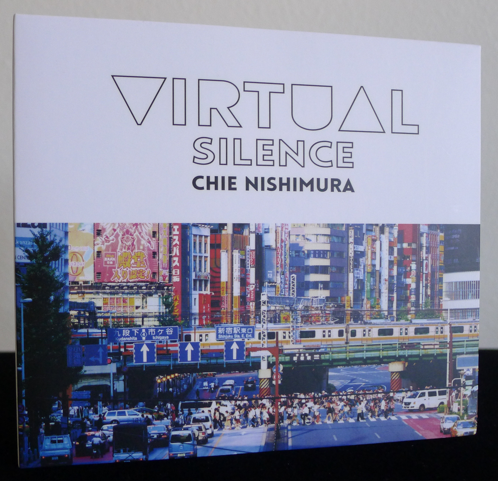
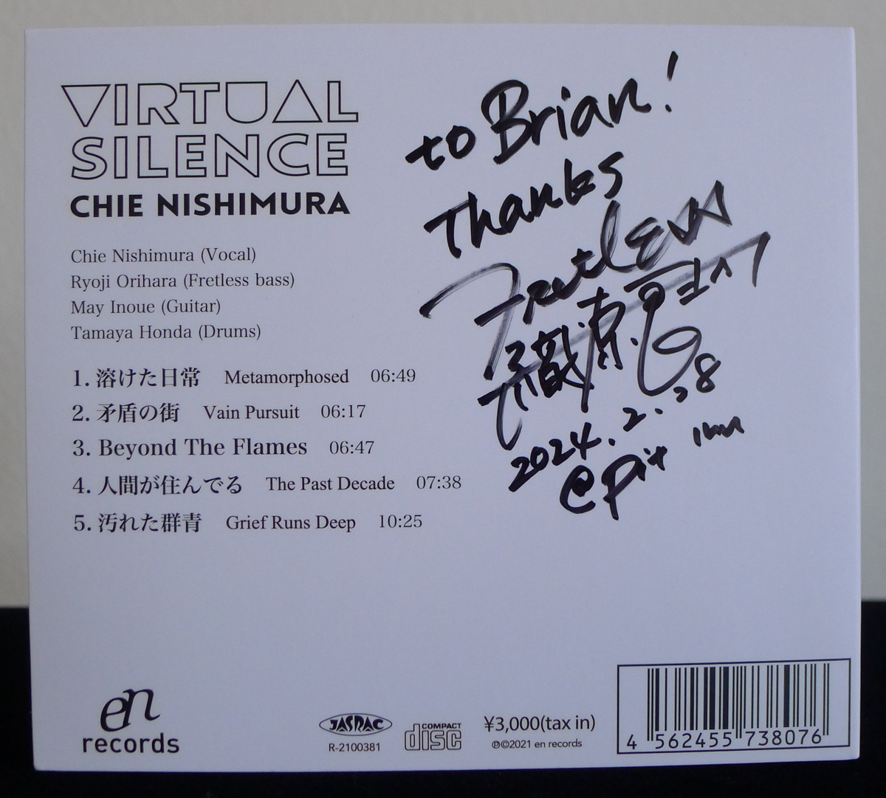
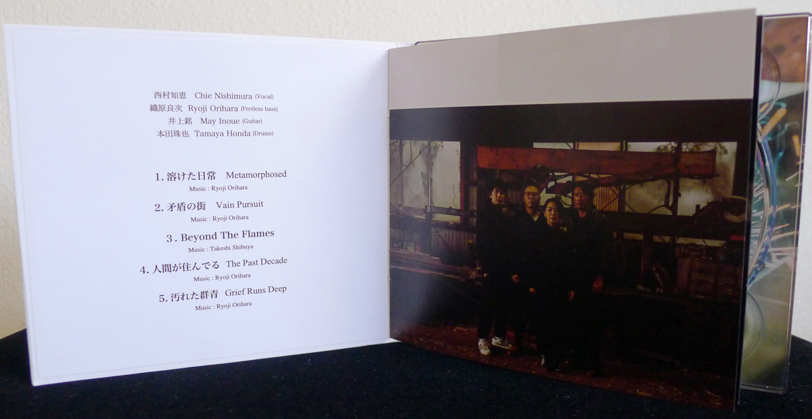
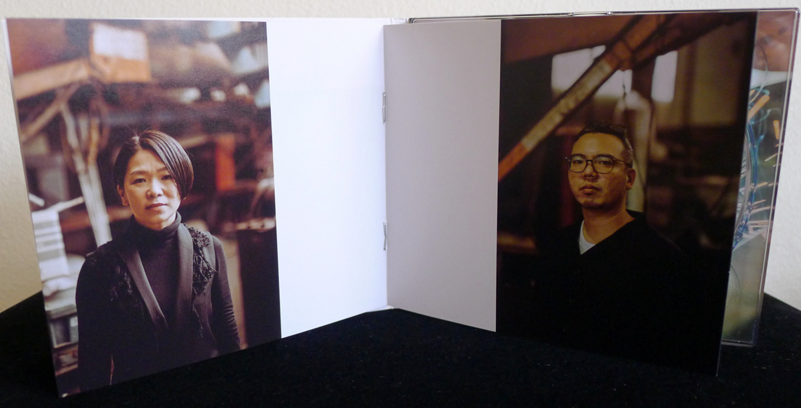

+++
title = "Chie Nishimura: Virtual Silence"
author = ["Brian McCrory"]
publishDate = 2024-10-25
keywords = ["ryosuke-hashizume-group-wordless", "ryosuke-hashizume-group-acoustic", "ryosuke-hashizume-group-visible-invisible", "harumi-nomoto-trio-virgo", "ryosuke-hashizume-group-incomplete-voices", "nhorhm-extra-edition"]
tags = ["Chie Nishimura", "西村知恵", "Ryoji Orihara", "織原良次", "May Inoue", "井上銘", "Tamaya Honda", "本田珠也"]
categories = ["albums"]
draft = false
aliases = ["/archive/chie-nishimura-virtual-silence/", "/p/chie-nishimura-virtual-silence/"]
[cover]
  image = "chie-nishimura-virtual-silence-460.jpeg"
  caption = ""
  relative = true
+++

_Virtual Silence_ (2022) is a 38-minute experience in five chapters, a project born of a moodily lit and ambient concept from bassist Ryoji Orihara and vocalist Chie Nishimura. On their first album, the pair are joined by guests May Inoue on guitar and Tamaya Honda on drums, an addition that marvelously decorates the simple but evocative themes with ethereal dimensions and deep textures. Throughout, Nishimura’s voice is used as a melodic instrument alongside guitar and bass, singing minimalistically on all five tracks with no lyrics or words.

One of bassist Ryoji Orihara’s many projects is his solo work BGA (Back Ground Ambient), where he conjures transparent or intangible furniture to create ambience, as opposed to playing a standard live set with starts, ends, and discrete songs. This seems to be the seed from which _Virtual Silence_ grew. The BGA sound transforms the space of a room through his fretless electric bass and effects like guitar pedals, loopers, Jaco Pastorius-style playing, and a stringed bow for atmospheric drone notes. In addition to writing four of the five songs on _Virtual Silence_, he also contributed the original artwork, design, logos, sales, and video editing.

Vocalist Chie Nishimura’s background and previous albums exhibit a love for classic jazz that started at a young age (with an influential Ella Fitzgerald phase), training in classical and opera, and experience with R&amp;B and jazz performance. Although jazz standards have been a mainstay, her recent albums include more impressionistic and grand views of music. This vision permeates _Virtual Silence_, which began as Orihara’s duo project with Nishimura. Playing in a duo format with bass is not new for the vocalist, and her previous album _Funky Duo_ also follows this format. She has a deep appreciation for singing with a bassist, an experience that stretches back to her early years as a jazz singer.

There are no lyrics sung on the five tracks of _Virtual Silence_ and the stories are not told through words, yet the song titles describe the mood of the music. Orihara’s four compositions have both Japanese and English titles printed in the track listing, with some interesting differences between the two:



<ol class="org-ol">
<li value="1">溶けた日常 (Metamorphosed) / _toketa nichijo, “dissolved daily life”_</li>
<li value="2">矛盾の街 (Vain Pursuit) / _mujun no machi, “city of contradictions”_</li>
<li value="3">Beyond The Flames</li>
<li value="4">人間が住んでる (The Past Decade) / _ningen ga sunderu, “humans are living”_</li>
<li value="5">汚れた群青 (Grief Runs Deep) / _kegareta gunjo, “dirty ultramarine blue”_</li>
</ol>

[An excellent Mikiki article](https://mikiki.tokyo.jp/articles/-/30506) with an interview from 2021 explains the songs and background ideas. In summary, Nishiyumura and Orihara alight on the importance of sound, dynamics, and restraint: From starting very quiet and grabbing attention, to having tightly controlled and compressed sounds and voices with patience and layered sounds; from the influence of certain ECM records and bassist’s solos to the use of ambience, ostinatos, and loops, and how every member and no member is the solo instrument; how being simple but passionate is a constant goal, arrived at most powerfully on the last track.

As the songs progress, the flow mutates from quiet and calm at the outset to larger and more chaotic towards the final stretch, helping the album as a whole to feel like a concept or an encapsulated experience. There is the feeling of being part of a rapt audience during a live performance. Immersed in the music from track #1, a haunting combination of fretless electric bass and voice sing together and imagine an abandoned factory with sheet metal echoes. Loose drumset accents and guitar effects float and linger like dust in the air. As with much of the music, a simple theme is established in union by bass or guitar with voice and repeated slowly. Simple linear steps of melody rise slowly toward high ceilings, tempting meditative moods.

The next four tracks slowly turn up the heat like one extended crescendo, with musical roiling, rumbling, and riffing, layers abutting and adjoining, superimposing and repeating. Free and floating space alternates with thick, steady rhythms. A David Lynchian feel comes into focus at times with odd, lovely, and nostalgic oldness and a slightly sinister feeling. Guitar improvisation and overdrive level increase the drama on the last two tracks, where the stepwise up-and-down themes invoke spiral staircases slowly turning. Although Nishiyama’s voice dynamics are often intentionally moderated for a controlled effect, Nishimura begins to roar and peak on the last two tracks, the plaintive _oohs_ and _aahs_ spinning deep with universal gravity.

The guitar tones and drum patterns veer between heavy density and light ambience, adding quite a lot to the quartet’s distinct, atmospheric qualities. Each instrument (voice included along with guitar, bass, and drums) contributes to the overall sound of shimmering, bright, melodic, and melancholic. Effects like delay, reverb, and chorus flicker like New Wave music (early Radiohead or The Cure, minus alt-rock hooks, plus Norma Winstone and Azimuth colors), where the spacious textures create a mosaic of background effects, smoothed loops, and jangly accents.

Particularly impactful, the last track #5 “Grief Runs Deep” starts with a heavy drum beat resembling the iconic booming of John Bonham’s drum intro to “When the Levee Breaks” (and perhaps it’s no coincidence that drummer Tamaya Honda is a member of ZEK3, an all-Led-Zepplin-songs jazz trio). This head-turning beat maintains its rock rhythm framing as guitar riffing and band jamming layer in near-psychedelic grunge riffs and painted streaks of Nishimura’s slow, soul-piercing vocals. Led Zeppelin meets Pink Floyd with Jimi Hendrix and Faith No More swirling in the stars, a dramatic high point to end the experience, and to return safely to earth.



## Virtual Silence by Chie Nishimura {#virtual-silence-by-chie-nishimura}

-   [Chie Nishimura](/tags/chie-nishimura) - vocal
-   [Ryoji Orihara](/tags/ryoji-orihara) - fretless bass
-   [May Inoue](/tags/may-inoue) - guitar
-   [Tamaya Honda](/tags/tamaya-honda) - drums

Released in 2021 on en records as Virtual Silence / Chie Nishimura.

_Japanese names: 西村知恵 Nishimura Chie 織原良次 Orihara Ryoji 井上銘 Inoue May 本田珠也 Honda Tamaya_

## Audio and Video {#audio-and-video}

-   [Promotional video for #5 “Grief Runs Deep”:](https://youtu.be/0k8dcM8sAlE)



-   [Excerpts from the album release concert:](https://youtu.be/x_2MLU2CCTg)



-   [Impressions and an excerpt from #4 “The Past Decade” (at 17:45):](https://youtu.be/63mGcX26KoM)



-   [Live rehearsal for #5 “Grief Runs Deep”:](https://youtu.be/dn7k-ePNVpc)



-   Excerpt from track #2: “矛盾の街 (Vain Pursuit) (_City of Contradiction (Vain Pursuit)_)” [mix #12](https://www.jazzofjapan.com/archive/audio/#mix-12)



## Other Links {#other-links}

-   [Album introduction and song descriptions from bassist Ryoji Orihara](https://note.com/ryojiorihara/n/n2ca587e7aa8a)

-   [Mikiki article and interview with Chie Nishimura and Ryoji Orihara](https://mikiki.tokyo.jp/articles/-/30506)

-   [Label information](https://enrecords.thebase.in/items/54731145)
