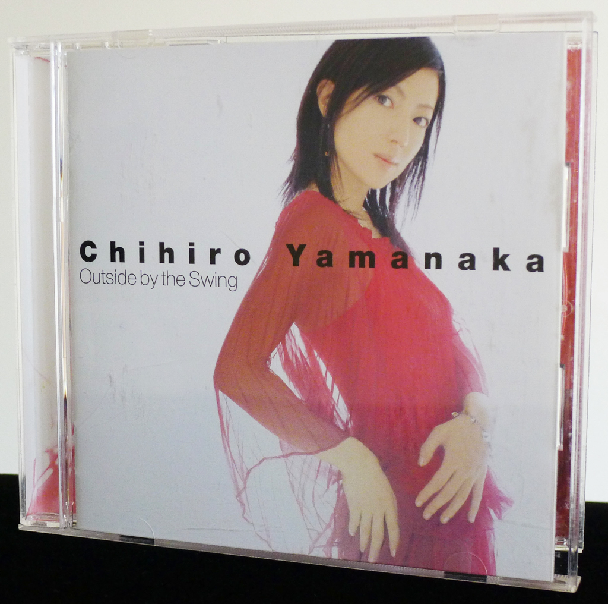
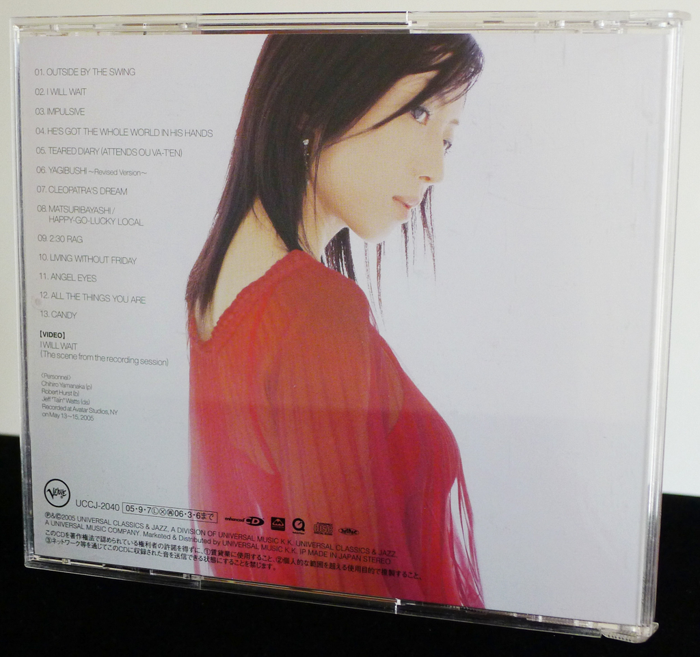
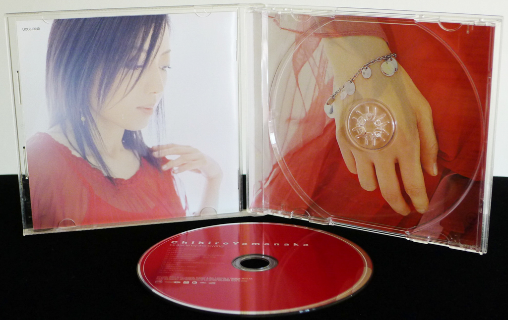
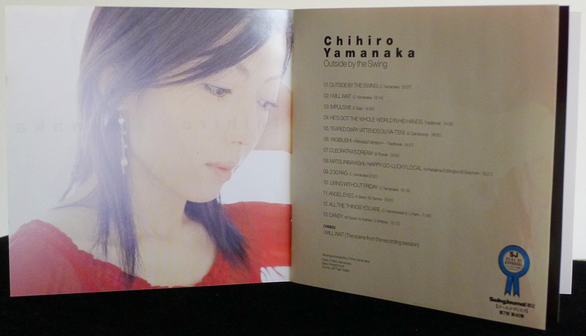

+++
title = "Chihiro Yamanaka: Outside by the Swing"
author = ["Brian McCrory"]
publishDate = 2023-05-11
tags = ["Chihiro Yamanaka", "山中千尋", "Robert Hurst", "Jeff “Tain” Watts"]
categories = ["albums"]
draft = false
[cover]
  image = "chihiroyamanaka-outsideby-460.jpeg"
  relative = true
+++

Chihiro Yamanaka’s _Outside By The Swing_ (2005) is her fourth piano trio album and continues her annual series of releases since bursting on the scene with her 2001 debut _Living Without Friday_. While previous releases were on the Osaka boutique jazz label Atelier Sawano, this release marks her first in a long run with Verve Records.

The album contains a baker’s dozen of fun jazz tracks, some quite short but mostly in the four-to-six minute range, plenty enough to showcase Yamanaka’s piano filled with percussive fire and melodic creativity.

With acrobatic thrills and exciting jazz runs, Yamanaka’s piano is definitely the featured instrument in the trio. Her improvisational runs and fluid technique is on display and easily grab the listener’s attention. Whether playing on uptempo tracks like “Impulsive” or “2:30 Rag”, or slower grooves such as “Angel Eyes” or “Teared Diary”, Yamanaka soars in the spotlight on center stage, justifiably garnering the praise her attention to detail and facility receives.

Perfectly in line with the direct reference in the album title, pure, simple, straightforward swinging jazz is honored here to a high degree. Along with fleet-fingered lines on Bud Powell’s “Cleopatra’s Dream”, the second track, “I Will Wait”, is a great example of pure swing and scratches that itch perfectly. There is even a behind-the-scenes video for this song with scenes from the recording session. Track six, “Yagibushi - Revised Version” is another highlight, first heard on Yamanaka’s second album _When October Goes_ (2002) and updated here in a refreshing and exciting arrangement.

## Outside by the Swing by Chihiro Yamanaka {#outside-by-the-swing-by-chihiro-yamanaka}

-   [Chihiro Yamanaka](/tags/chihiro-yamanaka) - piano
-   [Robert Hurst](/tags/robert-hurst) - bass
-   [Jeff “Tain” Watts](/tags/jeff-tain-watts) - drums

Released in 2005 on Verve as UCCJ-2040.

_Japanese names: 山中千尋 Yamanaka Chihiro_

## Audio and Video {#audio-and-video}

-   [Video for “I Will Wait”, track #2 from this album, with scenes from the recording session:](https://youtu.be/cHvC_A7tFbU)



-   Excerpt from track #1: “OUTSIDE BY THE SWING” [mix #8](https://www.jazzofjapan.com/archive/audio/#mix-8)


