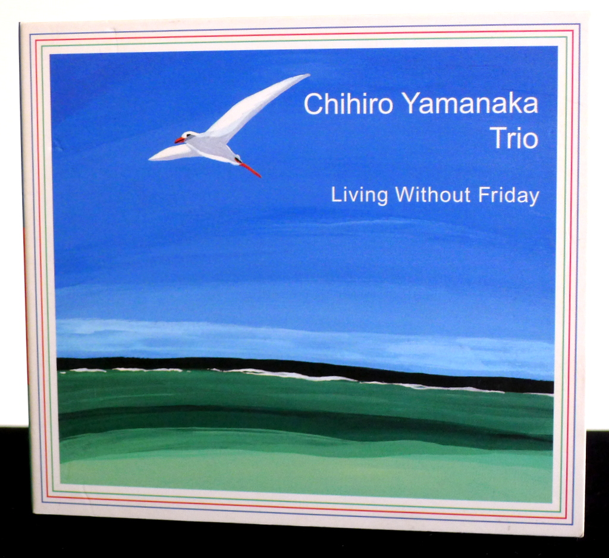
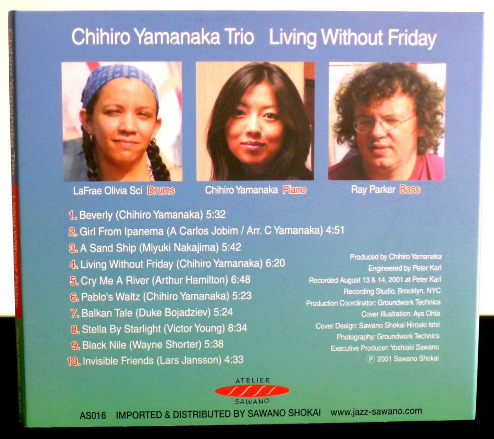
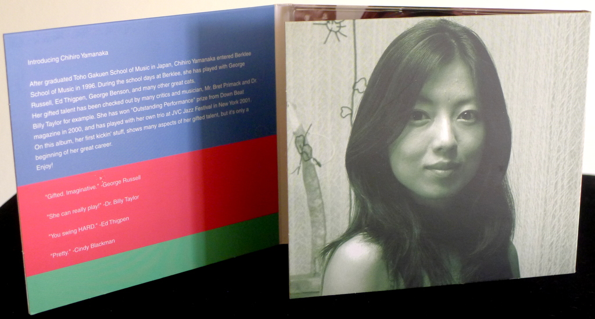

+++
title = "Chihiro Yamanaka Trio: Living Without Friday"
author = ["Brian McCrory"]
publishDate = 2020-02-21
tags = ["Chihiro Yamanaka", "山中千尋", "Ray Parker", "LaFrae Olivia Sci"]
categories = ["albums"]
draft = false
aliases = ["/archive/chihiro-yamanaka-trio-living-without-friday/", "/p/chihiro-yamanaka-trio-living-without-friday/"]
[cover]
  image = "chihiroyamanaka-living-460.jpeg"
  caption = ""
  relative = true
+++

Jazz pianist Chihiro Yamanaka’s debut album _Living Without Friday_ turns 20 years old today! Released modestly on October 5, 2001, this album kicked off an impressive run of releases, setting the stage with memorable originals and reinvented standards while introducing new listeners to her amazing technique and creativity.

Popular and in-demand on albums and live events, Yamanaka is based in New York and is a well-known representative for jazz piano from modern-day Japanese musicians. The ultra-proficient and prolific musician has been releasing new albums every year, impressively spanning a multidecade recording career with no signs of slowing down. _Living Without Friday_ caught early attention and hinted at the potential to be unveiled through her many subsequent albums and her penchant for creative arrangements that suit her modern bop and swing jazz style.

This ten-track album contains a mix of jazz standards and several originals, including the sweet “Beverly”, the cute “Pablo’s Waltz”, and the high-energy showstopper “Living Without Friday”. The rearranged standards include a funky and chic “Girl From Ipanema” and the mystical “Balkan Tale” played in mesmerizing 5/4 time, which along with the stirring “A Sand Ship” are two highlights on the album for lyrical power. Throughout, Yamanaka’s playing is always fascinating, especially in moments where her long piano lines unspool through the music in fast, graceful streams of notes, swooping over harmonic changes like the bird soaring over the sea on the cover.

With her impeccable technique and twisty improvisations, Yamanaka’s dexterity and endurance deliver boiling excitement on uptempo tunes, yet she also has a melodic finesse used to great effect on slower ballads and subdued waltzes, all providing a great introduction to a jazz pianist offering much more to come.

This album hit #1 on the HMV Modern Jazz Chart for four weeks after release, despite being released without any media or advertising support at the time.



## Living Without Friday by Chihiro Yamanaka Trio {#living-without-friday-by-chihiro-yamanaka-trio}

-   [Chihiro Yamanaka](/tags/chihiro-yamanaka) - piano
-   [Ray Parker](/tags/ray-parker) - bass
-   [LaFrae Olivia Sci](/tags/lafrae-olivia-sci) - drums

Released in 2001 on Atelier Sawano as AS-016.

_Japanese names: 山中千尋 Yamanaka Chihiro_

## Audio and Video {#audio-and-video}

-   [Chihiro Yamanaka playing “Living Without Friday” live from 2013:](https://youtu.be/ittfMkakJCo)



-   Excerpt from track #7: “Balkan Tale” [mix #6](https://www.jazzofjapan.com/archive/audio/#mix-6)


