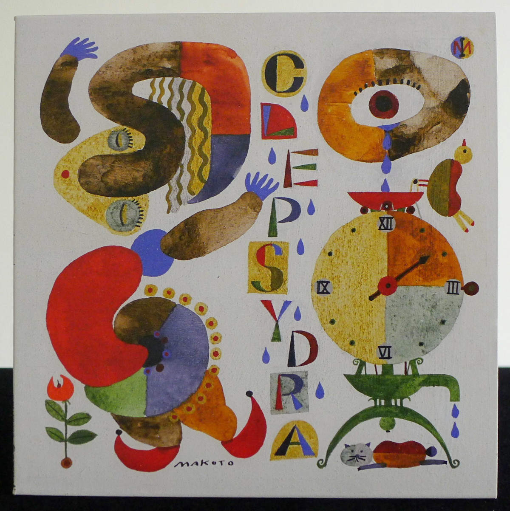
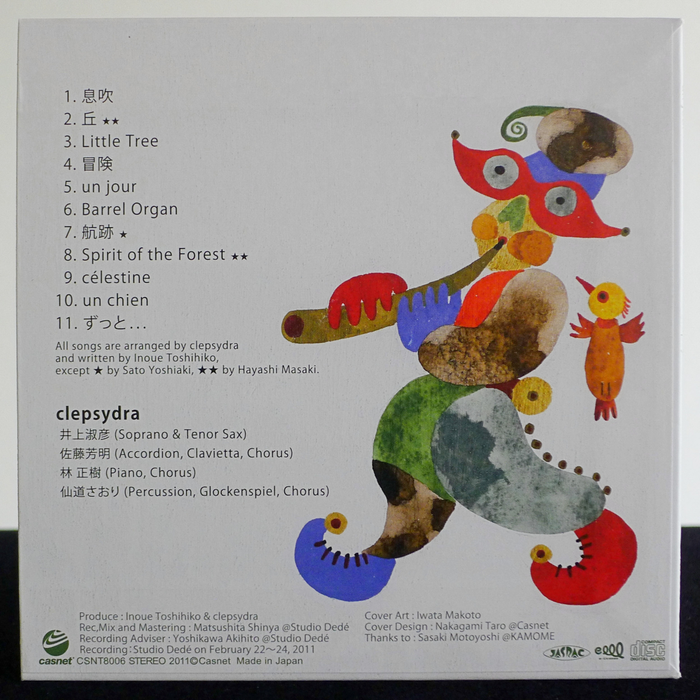
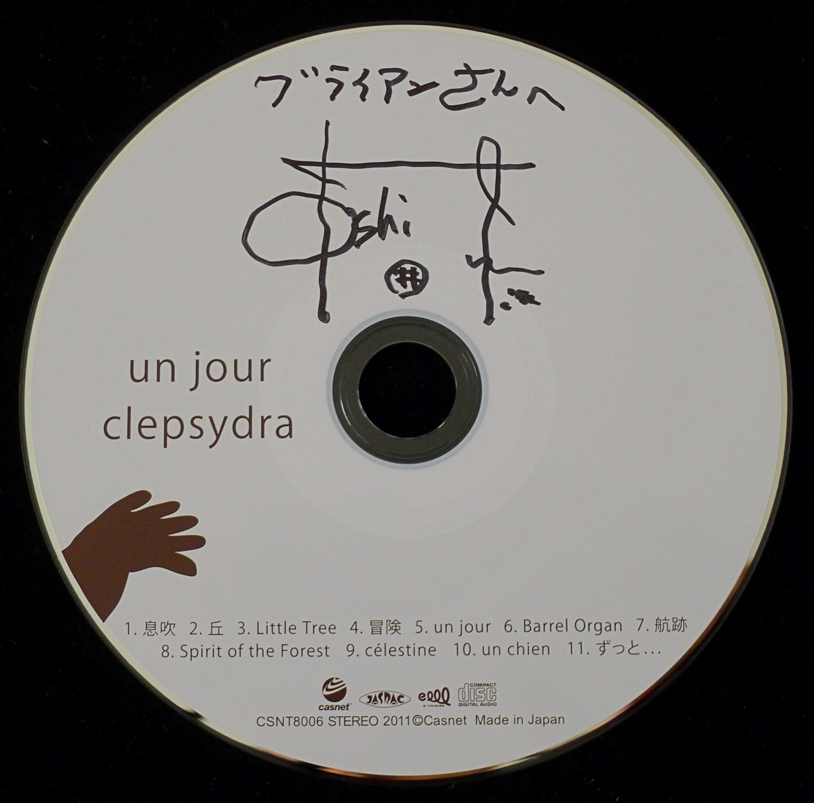

+++
title = "Clepsydra: Un Jour"
author = ["Brian McCrory"]
publishDate = 2024-09-20
keywords = ["fuse-live-fuse", "eriko-shimizu-sora", "toshihiko-inoue-and-masaki-hayashi", "zephyr-zephyr", "toshihiko-inoue-vayu"]
tags = ["Toshihiko Inoue", "井上淑彦", "Yoshiaki Sato", "佐藤芳明", "Masaki Hayashi", "林正樹", "Saori Sendo", "仙道さおり"]
categories = ["albums"]
draft = false
[cover]
  image = "clepsydra-un-jour-460.jpeg"
  relative = true
+++

Clepsydra’s album _Un Jour_ from 2011 is an eclectic collection of eleven original songs that the quartet often played at live events throughout their musical journey (roughly 2006-2015). Their unusual name may be difficult to read and pronounce initially but is easy to remember when parsed as the three syllables _clep-sih-dra_. The meaning of the word is an ancient water clock, a device for telling time based on the movement of water through its construction. A charming storybook-style image of a clepsydra appears on the album cover.

The group is made up of four members drawn from other projects: Toshihiko Inoue on saxes, Yoshiaki Sato on accordion, Masaki Hayashi on piano, and Saori Sendo on percussion. Apart from their musical and performance credentials, Clepsydra’s appeal includes inventing their simply perfect melodies to capture moods and attentions.

Clepsydra also creates songs that feature melodies repeated, cycle-like, between the different instruments and through dynamic or harmonic changes. Textural sound changes are played out by the exchanges between lead instruments—alto and soprano saxes (Inoue’s sounds could be blisteringly modern or softly tender), accordion and clavietta, and piano—and finely enhanced by the variety of Sendo’s drum set and percussion with cajón, chimes, bells, glockenspiel, whistles, wood shakers, and other pinpoint-perfect sounds.

Though the band has an understated and modest presentation, the moods on _Un Jour_ are quite evocative. With jazz as an underpinning, the jazz spirit of improvisation and fun odd-time manipulations does come through in the playing, but the spotlight is filled by Clepsydra’s focus on mood-building through their music.

These moods and sounds are subtly evocative of different worlds, like fantasy universes, folk villages, medieval events, or unfamiliar places full of communal power. Often, a gentle sense of love and support comes through their music. This uplifting effect is further heightened in a few anthem-like parts when the musicians add their voices as an inviting chorus section to the jams, as parts of #5 “un jour” and #10 “un chien”.

These songs spur excitement and reflection through their various landscapes. Uptempo gallops, hummable melodies, and irresistible loops, chords, and rhythms are offered up. Elements of nature and surprise are reinforced through the immediately sensed wood instruments and assorted percussion, and a breath of life expands through the uniquely different wind-based organic sounds of the accordions and saxophones.

The pages of the Clepsydra storybook flit creatively through adventurous, wistful, and reassuringly comfortable scenes. Two of the longer tracks, #5 “un jour” (12:13) and #10 “un chien” (10:42) are themselves multi-chapter songs that build and transform between abstract delicacy, folk cycles, soft rock, and hard fusion jazz. Some tracks are shorter three-minute compositions, such as #3 “Little Tree”, #6 “Barrel Organ”, and #9 “célestine”, and are sketches exploring simple ideas beautifully for memorable and sweet musical treats.

Clepsydra’s _Un Jour /includes eight songs by Toshihiko Inoue, two by Masaki Hayashi, and one by Yoshiaki Sato. Other than this album, their recorded legacy consists of a live concert DVD with five songs from /Un Jour_ which can viewed through a video link below.

## Obi Notes {#obi-notes}

The first album from Toshihiko Inoue’s “Clepsydra”.

> clepsydra
>
> ~ ancient water clock ~
>
> lively, charming,
>
> humorous, sad,
>
> cherished
>
> human tears moving a clock

(_...Sadly, saxophonist Toshihiko Inoue passed away far too soon in 2015. I was lucky enough to be able to hear him live numerous times. In fact, Inoue played at some of the first live jazz concerts I ever attended in Japan and imprinted on me an indelible impression of his music and of jazz in Japan. I am deeply grateful to have been not only his fan but also his friend._)



## Un Jour by Clepsydra {#un-jour-by-clepsydra}

-   [Toshihiko Inoue](/tags/toshihiko-inoue) - tenor sax, soprano sax
-   [Yoshiaki Sato](/tags/yoshiaki-sato) - accordion, clavietta, chorus
-   [Masaki Hayashi](/tags/masaki-hayashi) - piano, chorus
-   [Saori Sendo](/tags/saori-sendo) - percussion, glockenspiel, chorus

Released in 2011 on Casnet Music as CSNT-8006.

_Japanese names: 井上淑彦 Inoue Toshihiko 佐藤芳明 Sato Yoshiaki 林正樹 Hayashi Masaki 仙道さおり Sendo Saori_

## Audio and Video {#audio-and-video}

-   [Live performance of #3 “Little Tree”:](https://youtu.be/Fm_s3Qq5R8Q)



-   [Live performance of #4 “冒険 (Bouken)”:](https://youtu.be/hbowqOyp5OA)



-   [Live performance of #8 “Spirit of the Forest”:](https://youtu.be/sxGVMrt8pFA)



-   [Live performance of #11 “ずっと。。。 (Zutto…)”:](https://youtu.be/4TJBI__ULOc)



-   [Live performances of “Little Tree” (18:59), “un chien” (23:09), “丘 (Oka)” (58:12), “un jour” (1:07:02), and “ずっと。。。 (Zutto…)” (1:32:27) from Live Lab Clepsydra DVD:](https://youtu.be/A9da1TZF3v8)



-   Excerpt from track #1: “息吹 (_Breath_)” [mix #11](https://www.jazzofjapan.com/archive/audio/#mix-11)


