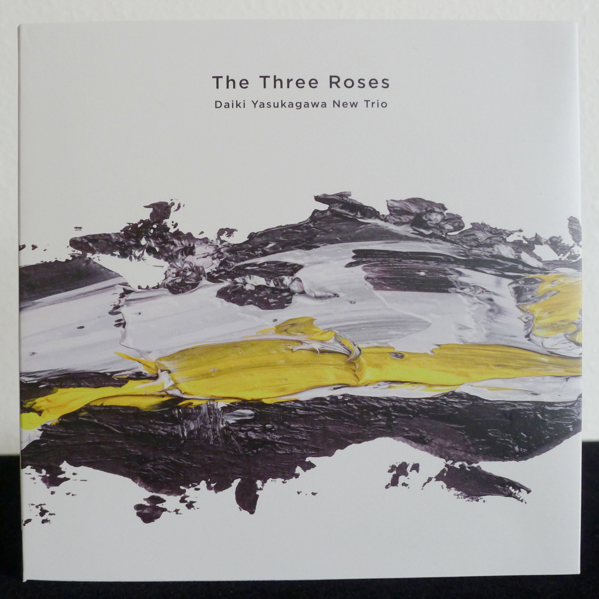
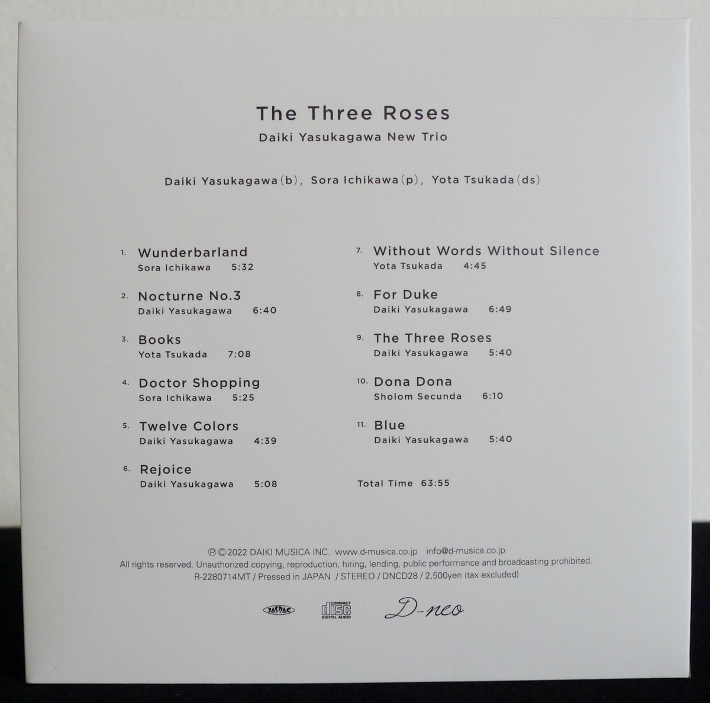
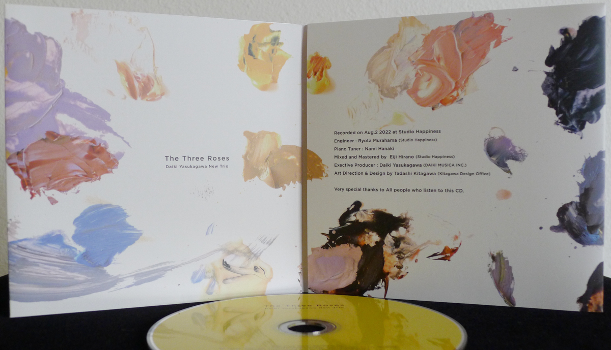

+++
title = "Daiki Yasukagawa New Trio: The Three Roses"
author = ["Brian McCrory"]
publishDate = 2025-01-19
keywords = ["hideaki-hori-trio-in-my-words", "daiki-yasukagawa-trio-kanmai", "taihei-asakawa-trio-touch-of-winter", "daiki-yasukagawa-trio-trios-ii", "naoko-tanaka-trio-memories", "tcq-memories-of-t", "miwo-tranquillo", "sayaka-kishi-trio-banquet"]
tags = ["Daiki Yasukagawa 安ヵ川大樹", "Sora Ichikawa 市川空", "Yota Tsukada 塚田陽太"]
categories = ["albums"]
draft = false
[cover]
  image = "daiki-yasukagawa-new-trio-three-roses-460.jpeg"
  relative = true
+++

Renowned jazz bassist Daiki Yasukagawa is actively engaged in a variety of fascinating projects within the Japanese jazz scene. One of those, the Daiki Yasukagawa New Trio, released their first recording with this 2022 album, _The Three Roses_.

The trio’s music and production are in good hands, being led by the veteran bassist and lecturer who consistently appears in live performances and recordings. Yasukagawa has also been running his own music label, D-musica, for many years, uniquely spotlighting select musicians from the Japanese jazz music scene, including some of his albums as well.

Balancing the years scale, the New Trio is filled out by two young up-and-coming musicians. At the time of the recording, pianist Sora Ichikawa and drummer Yota Tsukada were only 23 and 22 years old, respectively. Despite their relative youth and freshness, their skills and sound portray a deep appreciation and study of jazz music.

The album contains eleven tracks, ten original compositions and one rearranged cover. Six of the originals are by Yasukagawa, and two each come from Ichikawa and Tsukada. The one cover song (also arranged by Yasukagawa) is the poignant anti-oppression anthem “Dona Dona” by Sholom Secunda, the composer of “Bei Mir Bist Du Schön”.

The music gets straight to the point in delivering new jazz from a new trio. That is, the songs don’t stray too far from the conventional modern jazz piano trio sound and format. They swing as they are interesting and fun, groovy, or delicate as the individual tracks require.

Yet, the music is spiced with enough new changes and the appropriate moods (whether solid walking, gentle lightness, straight-ahead jazz with twists, somber reflections, or modern mellow grooves) to highlight the imagination and ambition of the young players fused with the experience and leadership of Yasukagawa.

The bassist’s six contributions comfortably span these and other territories, and the younger two players also confidently contribute their own songs infused with their original personalities. The risk-taking spirit of youth is never extravagantly out of place here, though, and fits finely into the solid bedrock of jazz that Yasukagawa provides as the musical leader and mentor, no doubt, for his new trio.

## Obi Notes {#obi-notes}

Bassist Daiki Yasukagawa formed his new piano trio Daiki Yasukagawa New Trio in 2022 with 23-year-old pianist Sora Ichikawa and 22-year-old drummer Yota Tsukada. A combination of originality and the backbone of orthodox jazz, the story is told through 11 songs interwoven with creative compositions from the young and energetic musicians and the increasingly passionate and sensitive playing of Yasukagawa—a memorable debut album.



## The Three Roses by Daiki Yasukagawa New Trio {#the-three-roses-by-daiki-yasukagawa-new-trio}

-   [Daiki Yasukagawa](http://daikiyasukagawa.com/) - bass
-   [Sora Ichikawa](https://chikainokotoba.wixsite.com/soraichikawa) - piano
-   [Yota Tsukada](https://www.yotatsukada.com/) - drums

Released in 2022 on Daiki Musika D-neo as DNCD-28.

_Japanese names: 安ヵ川大樹 Yasukagawa Daiki 市川空 Ichikawa Sora 塚田陽太 Tsukada Yota_

## Audio and Video {#audio-and-video}

-   [Excerpt from a live performance of #9 “The Three Roses”:](https://youtu.be/qDWBqRWcp0k)



-   [Live performance of the Daiki Yasukagawa New Trio performing “Risin”:](https://youtu.be/P0zigvqCZjA)



-   [D-musica page with album information and audio samples](https://d-musica.co.jp/?p=316)

-   Excerpt from track #1: “Wunderbarland” [mix #12](https://www.jazzofjapan.com/archive/audio/#mix-12)


