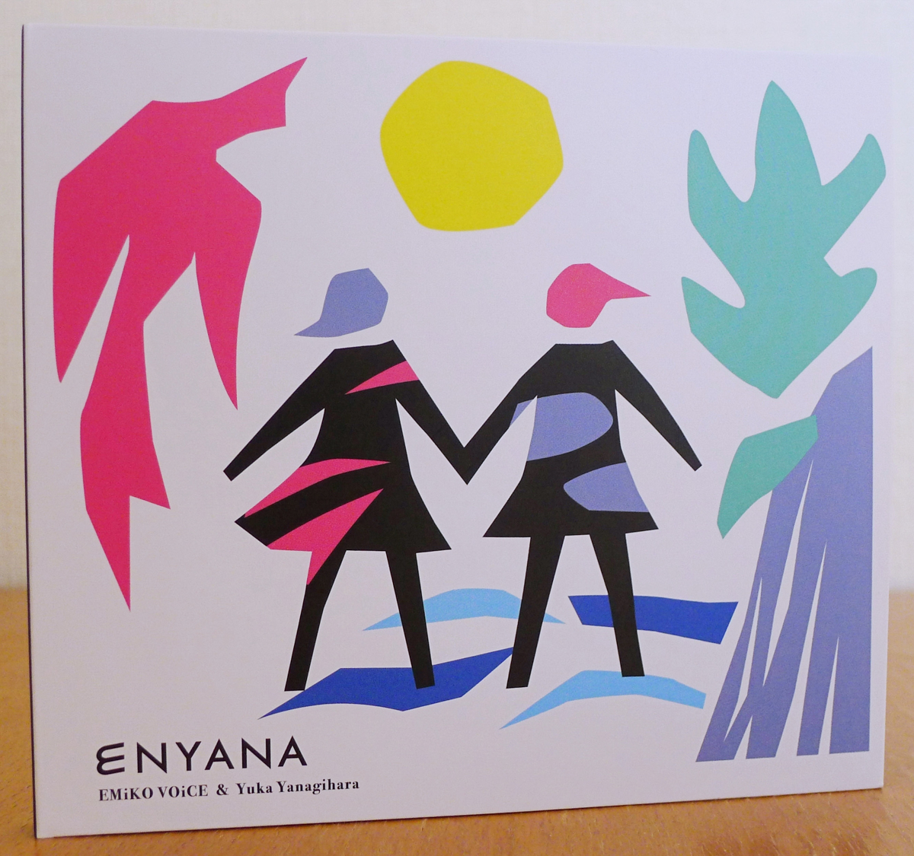
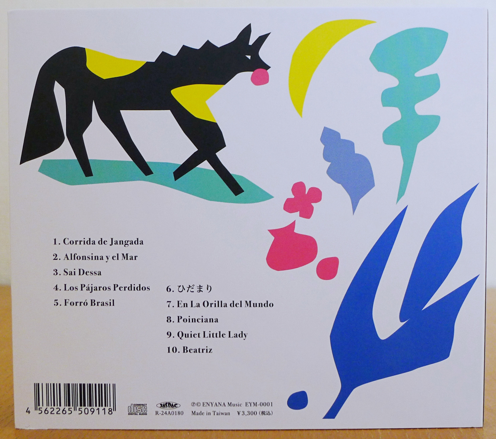
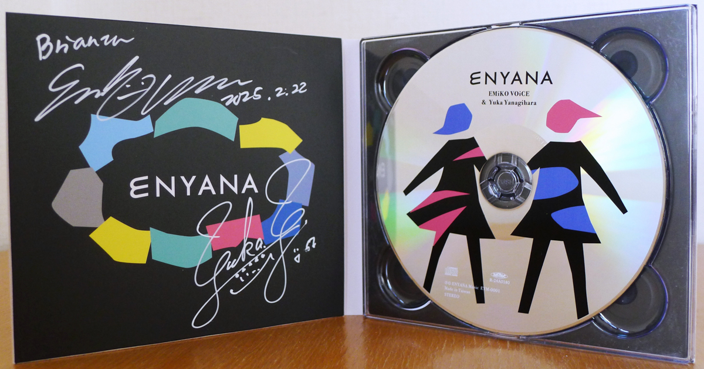
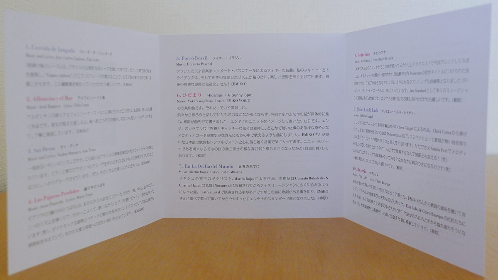
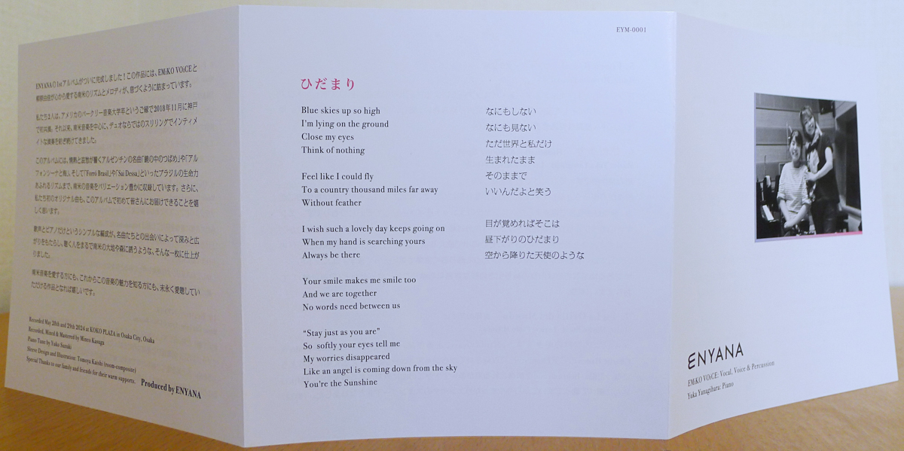

+++
title = "Emiko Voice & Yuka Yanagihara: Enyana"
author = ["Brian McCrory"]
publishDate = 2025-03-02
keywords = ["emiko-voice-x-suga-dairo-phase-2", "meu-coracao-hall-tone", "meu-coracao-a-tempo", "emiko-voice-carta", "yuka-yanagihara-trio-inner-views", "emiko-voice-standard-trio", "magnolia-el-viento-y-las-flores", "yuka-yanagihara-trio-beloved-ones"]
tags = ["Emiko Voice", "エミコヴォイス", "Yuka Yanagihara", "柳原由佳"]
categories = ["albums"]
draft = false
aliases = ["/archive/emiko-voice-yuka-yanagihara-enyana/", "/p/emiko-voice-yuka-yanagihara-enyana/"]
[cover]
  image = "emiko-voice-yuka-yanagihara-enyana-460.jpeg"
  caption = ""
  relative = true
+++

_Enyana_ is the first collaboration album from vocalist Emiko Voice and pianist Yuka Yanagihara. Their new group and album name, _Enyana_, merges the _EMI_ of Emiko and _YANA_ of Yanagihara. There is also a bit of wordplay on the Japanese phrase _en ga aru /(縁がある) which can mean there’s a connection or linking of fates between people or things in a certain situation. One variation of the phrase is “/enyana!/” (縁やな! /or_ えにゃな!), a playful Kansai-dialect version with a meaning like “It must be fate!”

Just recently released in January 2025, _Enyana_ has ten tracks and runs at forty-two minutes of music. Nine of the songs are from Latin America, from Brazil, Argentina, Mexico, and Cuba, all filtered through the gentle but meticulous lens of these two Japanese musicians. The love and seriousness for the music that the two accomplished musicians bring into focus here is clear through their genuine passion for the songs and the talent to pull it off. The solid rhythms and deep emotions created through just voice and piano increase the intimacy and the impressiveness of their feats as a duo, delivering strong feelings of drama through authenticity.

Adding Japan to the list of countries covered by the music, there is one original song by Emiko and Yanagihara. Throughout, the music grooves with the authentic rhythms and lyrics of the different countries’ rhythms and atmospheres. Lyrics are sung in mainly Portuguese with some Spanish, English, and a bit of Japanese.

Along with her lyrics-based vocals, Emiko’s voice talents include scat singing and percussion. On _Enyana_ she and Yanagihara include two instrumental songs through voice and piano, and a bit of triangle (Emiko’s excellent sense of time and independence also coming through here) at one point for a subtle but effective extra layer of sound and rhythm. Yanagihara loves percussion as well, saying that if she weren’t a pianist she would have been a drummer, and their common bond on this point, together with their impeccable sense of time, is another connection for Enyana in their musical performance and outlook.

The overall feelings generated by the songs sway from cheery, light, fun, and danceable to bittersweet scenes and melancholic storytelling. That is to say, passion. Between the poles of this heartbreak and soul-reviving uptempo pep, Enyana also offers a sweet love song with their first original “Hidamari” and a fantastic “Poinciana”, that catchy classic jazz tune that is rearranged and brightened with colors of Enyana.



## Liner Notes {#liner-notes}

_(Translated from Emiko Voice and Yuka Yanagihara’s original Japanese liner notes.)_

We’ve finally completed Enyana’s first album! This work is filled with the life of the South American rhythms and melodies that EMiKO VOiCE and Yuka Yanagihara love so dearly.

The two of us share a connection we have as graduates of the Berklee College of Music, and we first performed together in Kobe in November 2011.

Since then,  focusing on the music of South America, we’ve been continuing to assemble the type of thrilling yet intimate performances that a duo can deliver.

This recording of this album included a rich variation of South American music, from the passion and pathos of the Argentine classics “The Swallow in the Mirror” and “Alfonsina and the Sea” to the vibrant rhythms of Brazil in the songs “Forró Brasil” and “Sai Dessa”.

We’re also happy to present our first original song as a duo for the first time on this album.

The stripped-down format of just voice and piano is given depth and breadth through these encounters with famous songs, resulting in an album that almost seems to invite the listener to the lands and the forest of South America.

We hope that this can be a release that can be enjoyed for a long time by lovers of South American music, as well as those who are just beginning to discover its charms for the first time.

**1. Corrida de Jangada**

Music and Lyrics: Jose Carlos Capinan, Edu Lobo

“Sailboat Race” is a song that depicts the traditional Brazilian boat races. Voice and piano portray the racer’s movements as the phrase “Vamos embora” piles up and expresses the spirit of a boat racing across the sea. I hope this dynamic energy comes through. (EMiKO)

**2. Alfonsina y el Mar**

Music: Ariel Ramírez   Lyrics: Félix Luna

This is a song that was dedicated to Argentine poet Alfonsina Storni. It’s a piece that touches my heart deeply. Its heartbreaking but beautiful melody thoroughly expresses the sadness that Alfonsina carried, and her determination as she set out to the sea. (EMiKO)

**3. Sai Dessa**

Music and Lyrics: Nathan Marques, Ana Terra

At first, the song has a cheerful samba rhythm, but there is a hidden message criticizing Brazil’s military regime. It’s a considerable challenge to create a samba groove with only voice and piano, but I think we delivered a solid groove in our own way. I hope you enjoy the rhythm. (EMiKO)

**4. Los Pájaros Perdidos**

Music: Astor Piazzolla   Lyrics: Mario Trejo

This song, Piazzolla’s “The Swallow and the Mirror”, is one that I’m truly happy to have come across. In particular, when I hear the piano play the jumba rhythm in the middle, I love it so much that, while singing, I am secretly thinking “Listen to the piano!” (laughs). The contrast between the dynamic development and the quieter ballad section gives this song a dramatic mood, one filled with bittersweet thoughts of lost love and time. (EMiKO)

**5. Forró Brasil**

Music: Hermeto Pascoal

This is a forró masterpiece by the genius musician Hermeto Pascoal of Brazil. The intertwining of my scat singing, triangle playing, and Yuka’s steady rhythm, creates a fun atmosphere. (EMiKO)

**6. Hidamari / A Sunny Spot**

Music: Yuka Yanagihara   Lyrics: EMIKO VOICE

This is our first song written together. For just that reason alone, it’s precious.

We’ve talked about writing together for some time, but it never really took shape. Now that the plans for this album were moving ahead in a detailed way, Yanagihara took the lead in writing a song. We tried to write a song in the image of the Enyana group. Building on Enyana’s colorful worldview and catchy parts, we wrote a song that seems to have a gentle melody and chord progression that you may have heard before, and that seems to sing in your heart. I also really like EMiKO’s Japanese lyrics which are simple, straight to the heart, and soothing. The South American theme of our group also fits the ebb and flow of waves that you can almost hear in the setting (but now I’m self-praising). (Yanagihara)

**7. En la Orilla del Mundo**

Music: Martín Rojas   Lyrics: Pablo Milanés

This is a piece written by Martín Rojas, the talented blind guitarist who was based in Mexico. This song became widely known among jazz fans after being included on Gonzalo Rubalcaba &amp; Charlie Haden’s album _Nocturne_. It’s often performed as an instrumental song, but after discovering that there are lyrics, EMiKO found them to sing here, and it has now completely become a standard Enyana song. (Yanagihara)

**8. Poinciana**

Music: Nat Simon   Lyrics: Buddy Bernier

EMiKO requested to try out this song for Enyana, and I made an arrangement for this album. Originally based on a traditional Cuban folk song whose title refers to the vivid Poinciana flowers that blow in the warm Cuban winds, basing this arrangement around a 7-beat rhythm makes for a really thrilling musical development (stressful!). It has the taste of Enyana and I really like it. The original song has been a jazz standard played by many musicians. I hope that you like this version with the flavor of Enyana. (Yanagihara)

**9. Quiet Little Lady**

Music: Debora Gurgel

This is a piece by Brazilian pianist, composer, and arranger Debora Gurgel. It’s an instrumental song that was inspired by the words of Chick Corea. I think it’s fair to say that one of Enyana’s distinctive characteristics is to take up songs without lyrics. You can also say that taking up an already fast-paced samba feel with dizzying melodies and movements is also reckless for just two people (laughs). However, once you try this kind of thrilling performance, you may find that it’s also quite addictive (laughs). I hope that you can enjoy with along with me. (Yanagihara)

**10. Beatriz**

Music: Edu Lobo   Lyrics: Chico Buarque

When I first heard this, I thought it was such a beautiful song. As EMiKO explained the meaning of the lyrics to me, I could also appreciate the very Brazilian choice of words and expressions. This is a masterpiece by the maestros Edu Lobo &amp; Chico Buarque. I’m so grateful to have encountered this song, as it’s such a delicate and wonderful piece of music, and one that would crumble and fall away from my hands that were so carefully nurturing it, if I were to let my guard down. (Yanagihara)



## Enyana by Emiko Voice &amp; Yuka Yanagihara {#enyana-by-emiko-voice-and-yuka-yanagihara}

-   [Emiko Voice](/tags/emiko-voice) - vocal, voice, percussion
-   [Yuka Yanagihara](/tags/yuka-yanagihara) - piano

Released in 2025 on ENYANA Music as EYM-0001.

_Japanese names: エミコヴォイス Emiko Voice 柳原由佳 Yanagihara Yuka_

## Audio and Video {#audio-and-video}

-   [Promotional video for this album with excerpts from all tracks:](https://youtu.be/zaFXNkqEppE)



-   [Live version of “Corrida de Jangada” (tr. 1) from 2022:](https://youtu.be/EFRAI10oQx8)



-   [Live version of “Alfonsina y el Mar” (tr. 2) from 2021:](https://youtu.be/yNaySGjBz0Y)



-   [Live version of “Sai Dessa” (tr. 3) from 2020:](https://youtu.be/3Osi1LgK40I)



-   [Enyana performing Chick Corea’s “Spain” from 2021:](https://youtu.be/GDaif0JNleI)



-   [Archive video of a live-streamed Enyana performance from 2020, with “Rabo de Nube”, “Águas de Março”, “Alfonsina y el Mar” (tr. 2), “Sai Dessa” (tr. 3), “Los Pajaros Perdidos” (tr. 4), and “Forró Brasil” (tr. 5)](https://www.youtube.com/live/m2JZihv8mes?t=1062)

-   Excerpt from track #8: “Poinciana” [mix #12](https://www.jazzofjapan.com/archive/audio/#mix-12)


