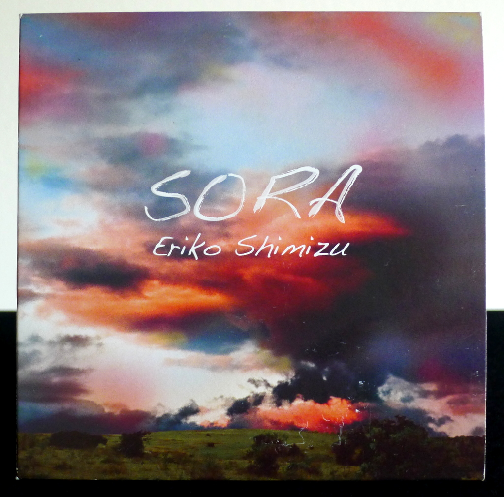
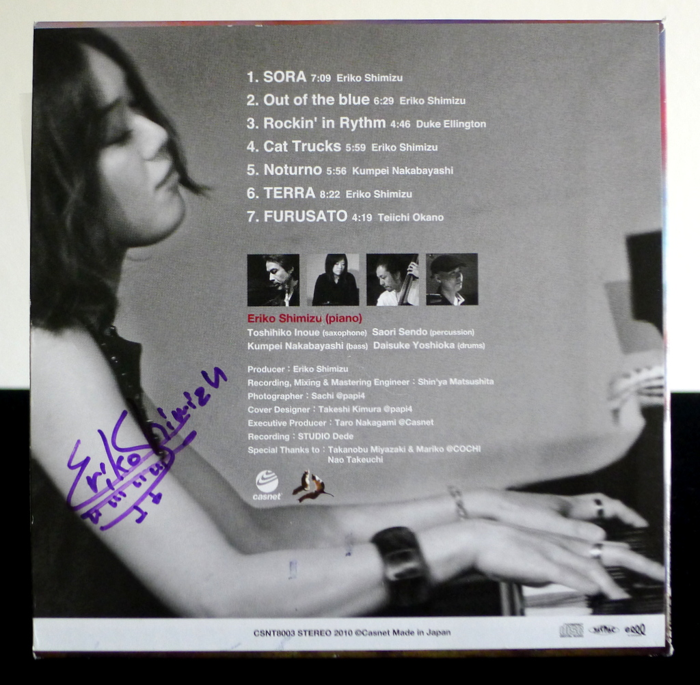

+++
title = "Eriko Shimizu: Sora"
author = ["Brian McCrory"]
publishDate = 2020-03-05
tags = ["Eriko Shimizu", "清水絵理子", "Toshihiko Inoue", "井上淑彦", "Saori Sendo", "仙道さおり", "Kunpei Nakabayashi", "中林薫平", "Daisuke Yoshioka", "吉岡大輔"]
categories = ["albums"]
draft = false
[cover]
  image = "erikoshimizu-sora-460.jpeg"
  relative = true
+++

Pianist Eriko Shimizu’s _Sora_ is her debut album from 2010 on which she leads her jazz combo through seven songs featuring original and colorful arrangements. Shimizu performs with her piano trio augmented with special guests percussionist Saori Sendo, who supplies bells, chimes, and elemental sounds not typically found in jazz piano trios, and saxophonist Toshihiko Inoue who joins on a few tracks.

With two exceptions, the songs are all originals including four from Shimizu. The pianist’s concepts mostly explore modern jazz territory taken at a medium pace with a light rock/country feel and fleeting moments of abstract color, as if influenced by a certain period of Keith Jarrett’s music. The title track “Sora” (_sky_) rolls along comfortably and brings to mind calm nature scenes while opening with rain and wind effects for atmosphere. The music continues smoothly into the bluesy noirish “Out of the Blue”, again invoking images of nature as if materialized out of the blue sky. Shimizu’s “Cat Trucks” is playfully Monkish, and “Terra” heightens the mood even more with simmering modal jazz and by adding Toshihiko Inoue’s Jan Garbarek-style soprano sax embellishments.

Along with original compositions, Duke Ellington’s “Rockin’ In Rhythm” jaunts along at a swinging uptempo pace, and the album closes tenderly with a emotional rendition of the Japanese traditional folk song “Furusato”.



## Sora by Eriko Shimizu {#sora-by-eriko-shimizu}

-   [Eriko Shimizu](/tags/eriko-shimizu) - piano
-   [Toshihiko Inoue](/tags/toshihiko-inoue) - saxophone
-   [Saori Sendo](/tags/saori-sendo) - percussion
-   [Kunpei Nakabayashi](/tags/kunpei-nakabayashi) - bass
-   [Daisuke Yoshioka](/tags/daisuke-yoshioka) - drums

Released in 2010 on Casnet as CSNT-8003.

_Japanese names: 清水絵理子 Shimizu Eriko 井上淑彦 Inoue Toshihiko 仙道さおり Sendo Saori 中林薫平 Nakabayashi Kunpei 吉岡大輔 Yoshioka Daisuke_

## Audio and Video {#audio-and-video}

-   [Promotional video for this album:](https://youtu.be/AGgOdMhmv30)



-   [Eriko Shimizu performing live in 2013:](https://youtu.be/hWM8mchO_oE)



-   Excerpt from track #1: “SORA” [mix #6](https://www.jazzofjapan.com/archive/audio/#mix-6)


