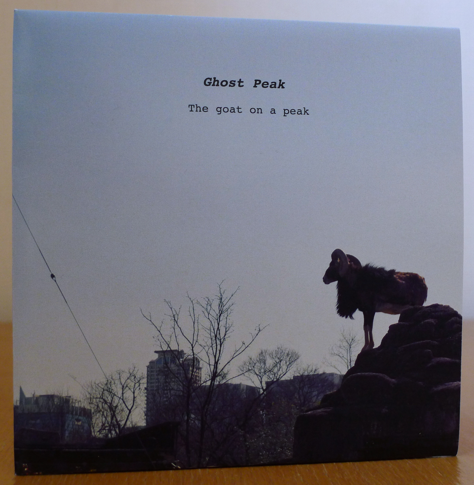
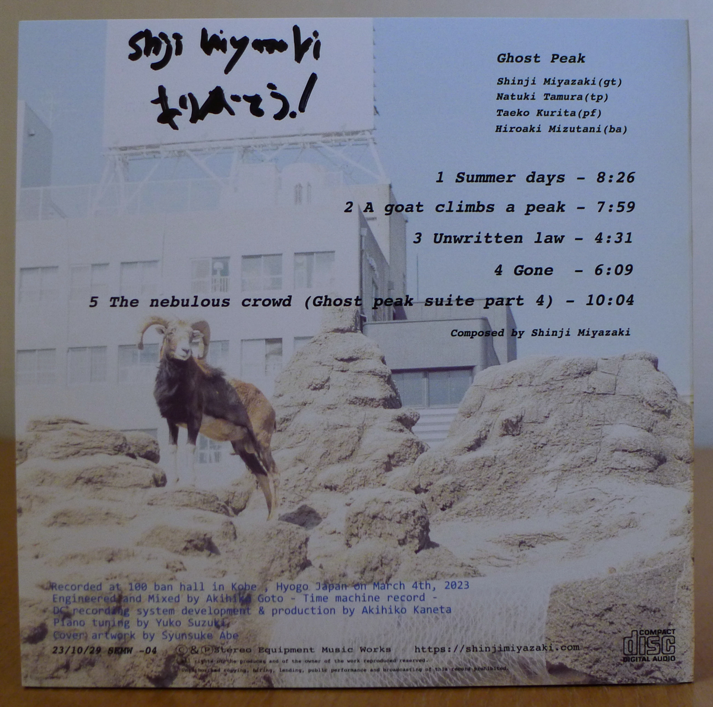

+++
title = "Ghost Peak: The Goat on a Peak"
author = ["Brian McCrory"]
publishDate = 2025-03-09
keywords = ["fuse-live-fuse", "takumi-seino-motohiko-ichino-frozen-dust", "akihiro-yoshimoto-takashi-sugawa-oxymoron", "bungalow-you-already-know", "megumi-yonezawa-masa-kamaguchi-ken-kobayashi-boundary", "tetsuji-yoshida-and-mikiko-nagatake"]
tags = ["Shinji Miyazaki", "宮崎真司", "Natsuki Tamura", "田村夏樹", "Taeko Kurita", "栗田妙子", "Hiroaki Mizutani", "水谷浩章"]
categories = ["albums"]
draft = false
[cover]
  image = "ghost-peak-goat-on-a-peak-460.jpeg"
  relative = true
+++

_The Goat on a Peak_ is a 2023 album from Ghost Peak, a band formed in 2022 by guitarist Shinji Miyazaki with Natsuki Tamura on trumpet, Taeko Kurita on piano, and Hiroaki Mizutani on bass. Guitarist and leader Miyazaki combines his background of modern jazz, improvisation, and a four-year stay in New York, with his jazz, rock, and avant-garde influences on his second Ghost Peak album.

Ghost Peak’s _The Goat on a Peak_ contains five of Miyazaki’s original compositions and was released on the heels of their first release _Ghost Peak 1_. The audio for these two albums was recorded at a live concert in Kobe in 2023. While the first release was an online-only streaming/digital download, this second album was released as a compact disc with a different set of songs.

“Ghost Peak” is not only the band name but also the name of a terrific composition of Miyazaki’s that he plays on solo guitar on his 2022 vinyl/digital release _[Light Colored](https://shinjimiyazaki.bandcamp.com/album/light-colored)_. In addition, “Ghost Peak” is also the name of a four-part suite split between their first album _Ghost Peak 1_, and this album _The Goat on a Peak_. Adding to the _ghost/goat/peak_ intrigue, and separate from the four-part suite, _Ghost Peak 1_ features a song titled “Ghost Views a Peak”, and this second album features a song titled “A Goat Climbs a Peak”. That’s plenty of ghosts, goats, and peaks, but it all works well to ground their style of free jazz and experimental music with a thematic throughline.

Tangentially, the phrase _ghost peak_ refers to those peaks found in graphs in scientific analysis that aren’t related to actual measured substances but are mysterious measurements caused by contamination, faulty instruments, or other errors. A _goat on a peak_ may refer to the striking scene of a goat standing on the summit of a mountain (or, possibly a “G.O.A.T.” champion ascending to a pinnacle), looking over the land and taking it all in with a somewhat triumphant stature. This image also evokes an exciting combination of danger, risk, and adventure that could also symbolize the task undertaken by musicians playing jazz and experimental music.

The five free-jazz or experimental tracks on /Goat on a Peak /are composed by Miyazaki, and a lot of the free feel comes from both the surprising notes the quartet plays (as they strive to avoid conventional licks, scales, and song patterns) but also from the absence of drums and rhythmic cadences. At times, there is no fixed meter or repeated beat, creating a feeling of flexibility. While some parts of each song seem completely open for each player’s spontaneous impulses, it is not “anything goes” to the extent that only discordant noise results (some listeners will feel that they are headed towards that direction, though).

Yet, there are musical ideas or basic structures to each track that are usually most clearly heard in the written-out musical themes and statements played together at the opening and/or ending of certain songs. There are general pre-planned frameworks that direct how the scales, chords, or roots (for example) will assemble and collaborate to a finish. It’s harder to describe than it is to hear, and as experimental music goes, some of the enjoyment is in the hearing, decoding, and understanding of this music, all of which play a part in the multi-layered musical appreciation.

Here are some too-brief glances at the overall album flow: The thirty-seven minutes travel through the gentle prettiness and swelling up of #1 “Summer Days”, the step-stair theme and intensity of #2 “A Goat Climbs a Peak”, the zany madness and flights of fancy on #3 “Unwritten Law”, the beautiful mess of soundscapes of #4 “Gone”, and the quiet serenity of #5 “The Nebulous Crowd (Ghost Peak Suite Part 4)”.



## The Goat on a Peak by Ghost Peak {#the-goat-on-a-peak-by-ghost-peak}

-   [Shinji Miyazaki](/tags/shinji-miyazaki) - guitar
-   [Natsuki Tamura](/tags/natsuki-tamura) - trumpet
-   [Taeko Kurita](/tags/taeko-kurita) - piano
-   [Hiroaki Mizutani](/tags/hiroaki-mizutani) - bass

Released in 2023 on Stereo Equipment Music Works as SEMW-04.

_Japanese names: 宮崎真司 Miyazaki Shinji 田村夏樹 Tamura Natsuki 栗田妙子 Kurita Taeko 水谷浩章 Mizutani Hiroaki_

## Audio and Video {#audio-and-video}

-   [Shinji Miyazaki playing “Ghost Peak” in 2022:](https://youtu.be/nRLIgCJEAiA)



-   [Excerpts from a Ghost Peak live performance in 2022:](https://youtu.be/kR4orFBLqLU)



-   [Ghost Peak live performance in 2025:](https://youtu.be/YwjJ9IhpxOQ)



-   [Ghost Peak 1 (Ghost Peak’s first album](https://shinjimiyazaki.bandcamp.com/album/ghost-peak-1)

-   Excerpt from track #2: “A Goat Climbs A Peak” [mix #12](https://www.jazzofjapan.com/archive/audio/#mix-12)



## Other Links {#other-links}

-   [Album info](https://semwstore.base.shop/items/81158611)
