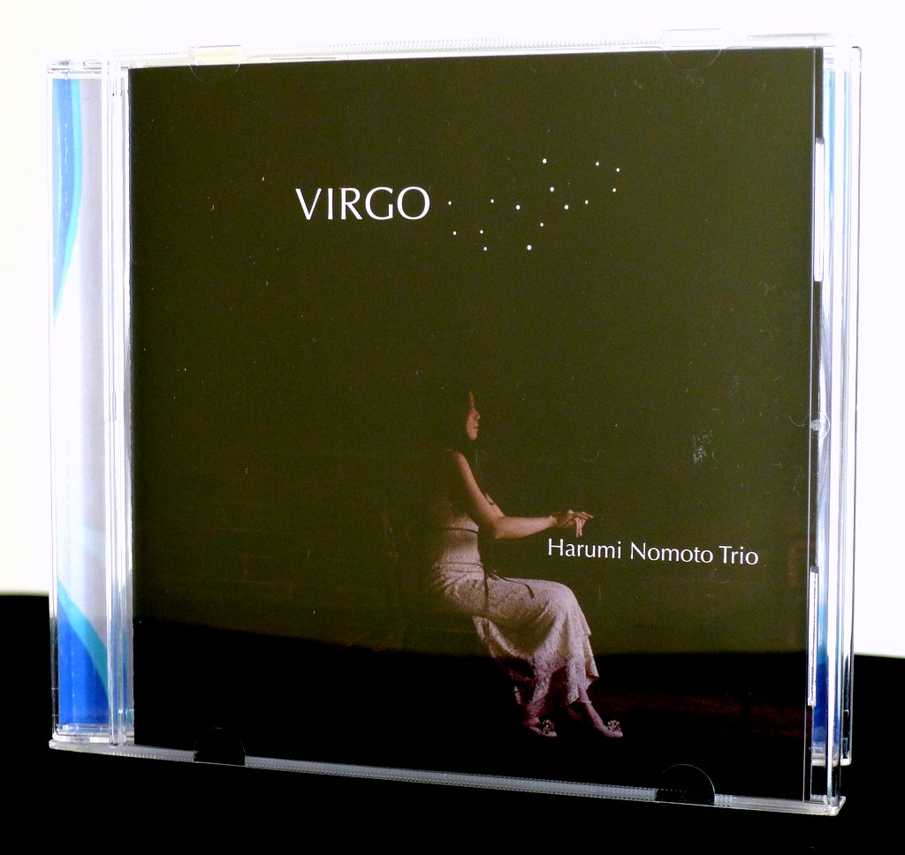
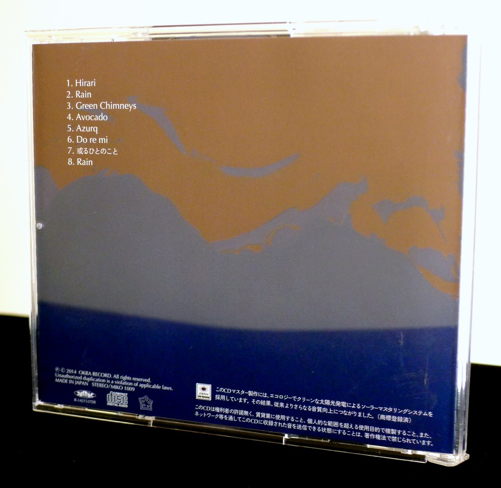
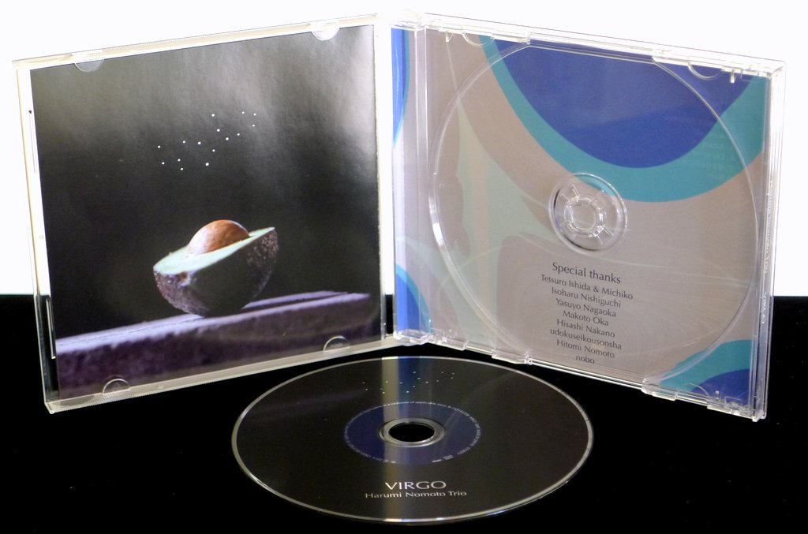

+++
title = "Harumi Nomoto Trio: Virgo"
author = ["Brian McCrory"]
publishDate = 2019-04-03
tags = ["Harumi Nomoto", "野本晴美", "Ryoji Orihara", "織原良次", "Sohnosuke Imaizumi", "今泉総之輔", "Makiko Sugawara", "菅原牧子", "Nao Sakamoto", "坂本直"]
categories = ["albums"]
draft = false
aliases = ["/archive/harumi-nomoto-trio-virgo/", "/p/harumi-nomoto-trio-virgo/"]
[cover]
  image = "haruminomoto-virgo-460.jpeg"
  caption = ""
  relative = true
+++

Pianist Harumi Nomoto’s 2014 release _Virgo_ is a constellation of grooves, moods, and textures, boldly incorporating inter-genre approaches as piano jazz is woven with Eastern sounds, African rhythms, and hip-hop-influenced beats.

_Virgo_ follows the pianist’s previous albums Another Ordinary Day (2002) and Belinda (2007) and completes a trio of records that progressively show an expansion of creative vision and songwriting tact. Through arrangements honed at Japanese jazz clubs through prior years, the music was released to eager fans with this album of seven originals plus an arrangement of Thelonious Monk’s “Green Chimneys”, which gets a unique slow-and-low groove treatment here.

Aside from straight-ahead jazz, leader Harumi Nomoto and bandmates fretless electric bassist Ryoji Orihara and multi-genre jazz drummer Sohnosuke Imaizumi have perfected a jazzy, funky groove for modern jazz, apparent throughout on tracks such as “Green Chimneys”, the effervescently modern and angular “Hirari”, and the entrancingly catchy “Avocado” which kicks into a flashy high-gear for an impressive trio showpiece.

Exotic musical elements also surface on _Virgo_, as African music inspires the strong crowd-pleaser “Do Re Mi”, a joyfully bouncy tune with an upbeat bass and drum groove with fun breaks. Similarly, an adventurous mood arises on “Azurq”, mellow and modal, and evoking foreign vibrations in the vein of Yusef Lateef’s Eastern explorations.

Plenty of peaceful space is also offered and balances the energy well, with the tender ballad “Aru Hito No Koto” and two versions of the song “Rain”, an ode to the beauty of wet weather and contemplative moods.



## Virgo by Harumi Nomoto Trio {#virgo-by-harumi-nomoto-trio}

-   [Harumi Nomoto](/tags/harumi-nomoto) - piano
-   [Ryoji Orihara](/tags/ryoji-orihara) - electric fretless bass
-   [Sohnosuke Imaizumi](/tags/sohnosuke-imaizumi) - drums
-   [Makiko Sugawara](/tags/makiko-sugawara) - violin (track #8)
-   [Nao Sakamoto](/tags/nao-sakamoto) - Chromasomus/prepared guitar (track #8)

Released in 2014 on Okra Record as MIKO-1009.

_Japanese names: 野本晴美 Nomoto Harumi 織原良次 Orihara Ryoji 今泉総之輔 Imaizumi Sohnosuke 菅原牧子 Sugawara Makiko 坂本直 Sakamoto Nao_

## Audio and Video {#audio-and-video}

-   [Album promo video #1:](https://youtu.be/W5JBcd_k7TI)



-   [Album promo video #2:](https://youtu.be/8tPlcOaE55M)



-   [Album promo video #3:](https://youtu.be/LRUNIFiu4-Y)



-   [Album promo video #4:](https://youtu.be/J7Mp74TCldo)



-   Excerpt from track #6: “Do re mi” [mix #4](https://www.jazzofjapan.com/archive/audio/#mix-4)


