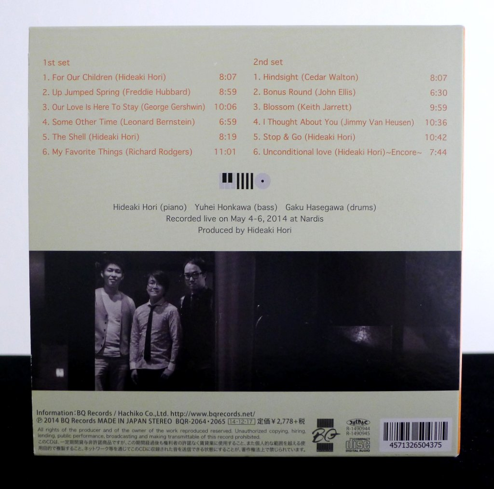
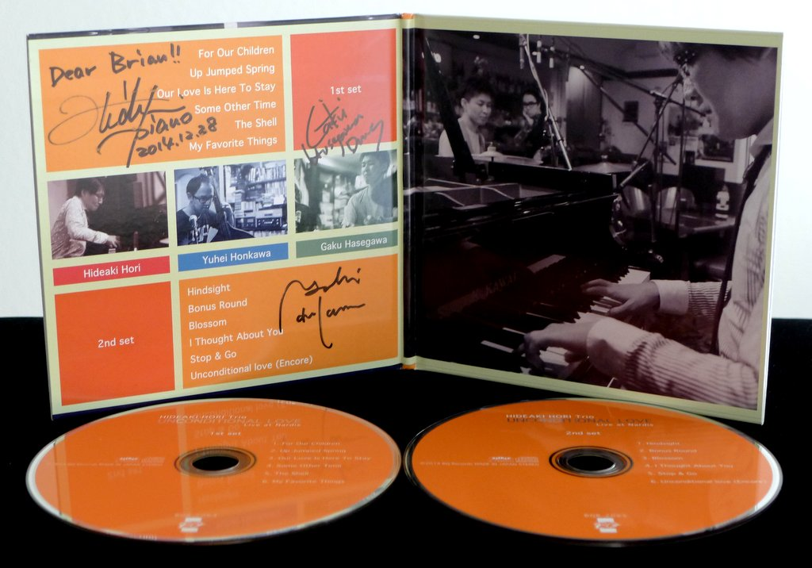
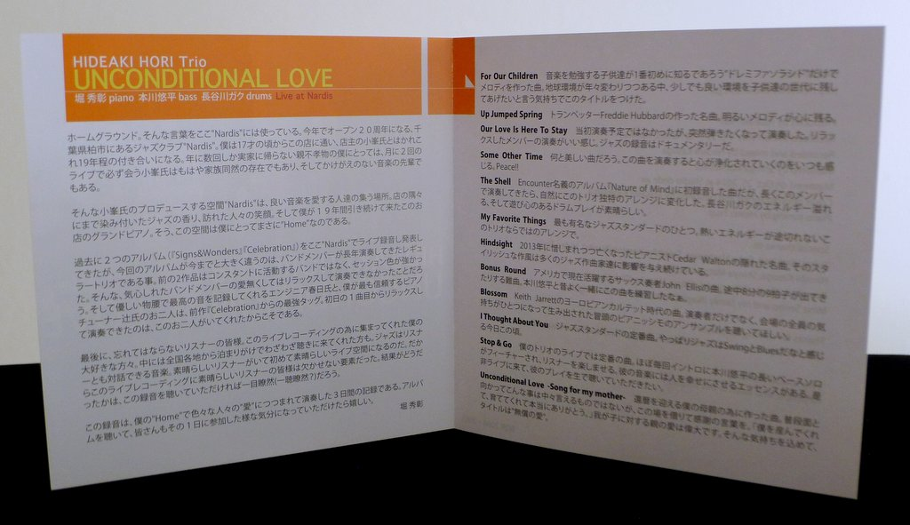
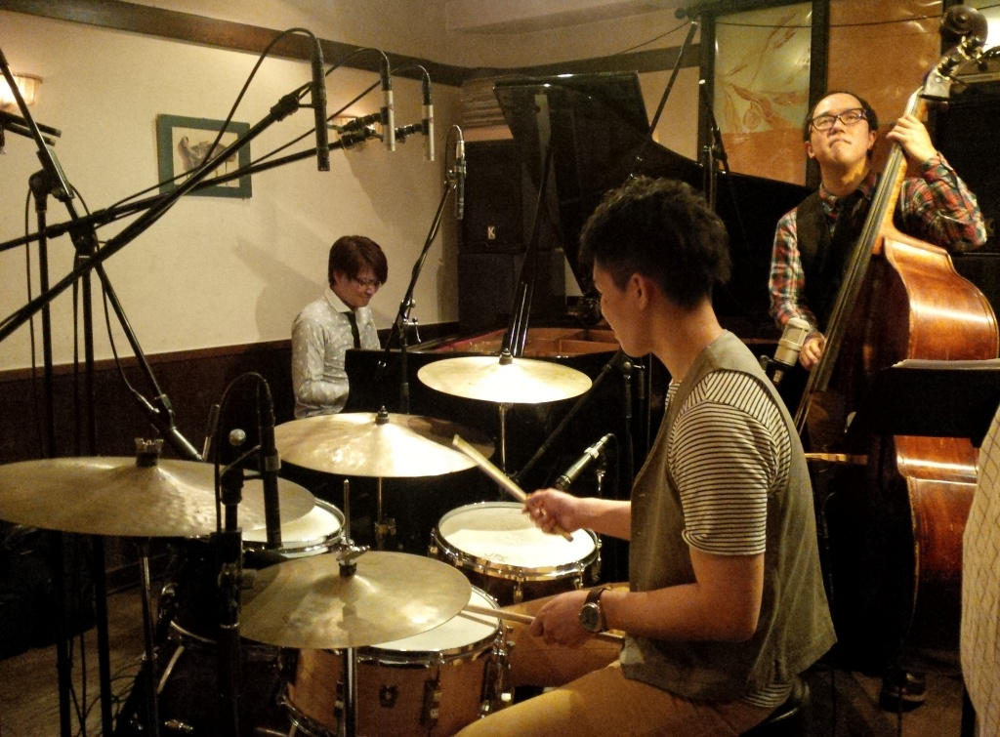

+++
title = "Hideaki Hori Trio: Unconditional Love"
author = ["Brian McCrory"]
publishDate = 2018-08-30
tags = ["Hideaki Hori", "堀秀彰", "Yuhei Honkawa", "本川悠平", "Gaku Hasegawa", "長谷川ガク"]
categories = ["albums"]
draft = false
[cover]
  image = "hideakihori-unconditional-460.jpeg"
  relative = true
+++

_Unconditional Love_ is the 11th album from pianist Hideaki Hori and features his trio playing live at Nardis, a gem among Tokyo’s many respected and intimate jazz bars. Throughout this double album, the trio captures the relaxed and friendly atmosphere that this home-ground bar provides, all while creating top-notch jazz to delight the audience.

_Unconditional Love_ features songs recorded live over three consecutive nights at Nardis. Presented on the two discs as “1st set” and “2nd set”, this arrangement gives the listener the feel of being a part of the in-house audience from the first song to the encore. The long-established trio’s playing is impeccable with high levels of musicianship and solidarity, eliciting joy and affinity from the audience.

The twelve songs include four originals by Hori (the funky “The Shell” and high-energy “Stop &amp; Go” thrill the audience), some classic standards (“Up Jumped Spring”, “I Thought About You”, “My Favorite Things”) and choice modern picks from the likes of Cedar Walton, Keith Jarrett, and John Ellis (his “Bonus Round” is a special treat). Through these carefully chosen pieces, dynamics range from comfortable, mid-tempo swing, to fiery and up-tempo bop. For balance and breathing space, a few pretty ballads are included, including a fascinating version of Keith Jarrett’s “Blossom” which enraptures the club with a musical spell.

## Unconditional Love by Hideaki Hori Trio {#unconditional-love-by-hideaki-hori-trio}

-   [Hideaki Hori](/tags/hideaki-hori) - piano
-   [Yuhei Honkawa](/tags/yuhei-honkawa) - bass
-   [Gaku Hasegawa](/tags/gaku-hasegawa) - drums

Released in 2014 on BQ Records as BQR-2064/2065.

_Japanese names: 堀秀彰 Hori Hideaki 本川悠平 Honkawa Yuhei 長谷川ガク Hasegawa Gaku_

## Audio and Video {#audio-and-video}

-   [A track from this album, the jazz standard “Up Jumped Spring”:](https://youtu.be/bvpbKSbeEhk)



-   Excerpt from track #3: “Our Love Is Here To Stay” [mix #3](https://www.jazzofjapan.com/archive/audio/#mix-3)


