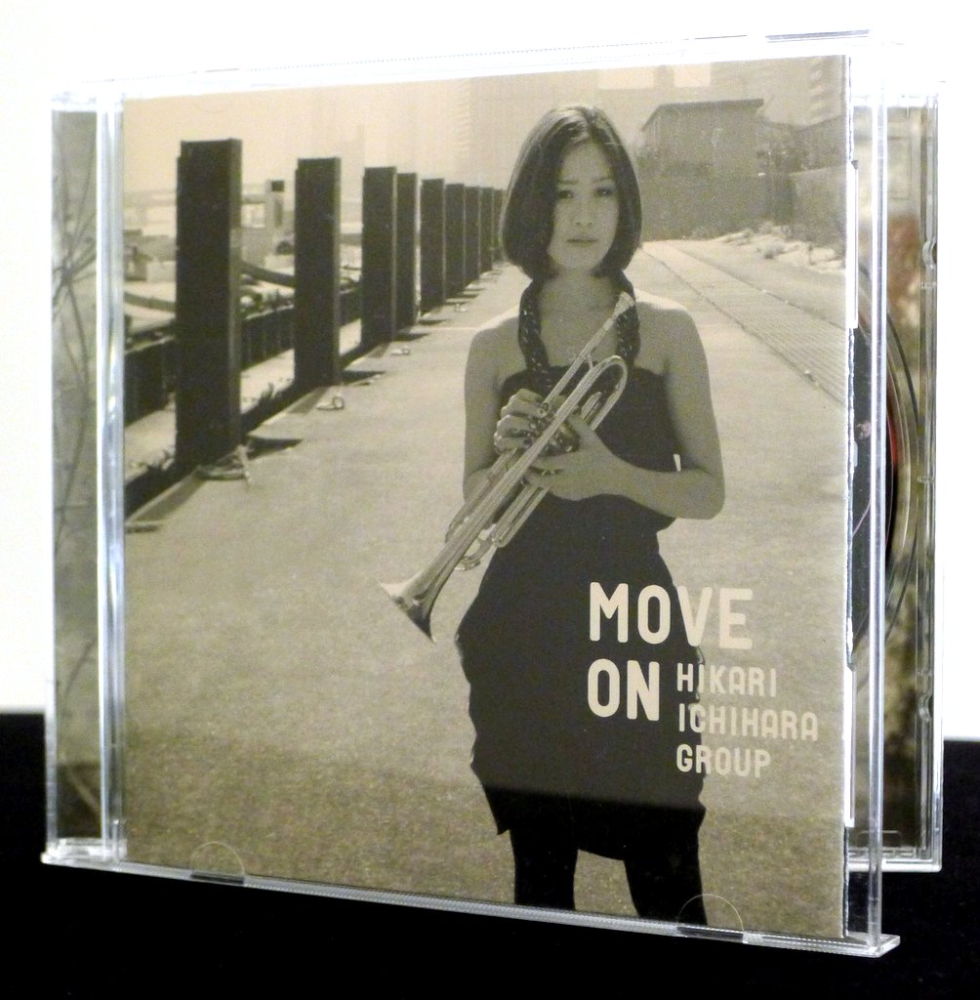
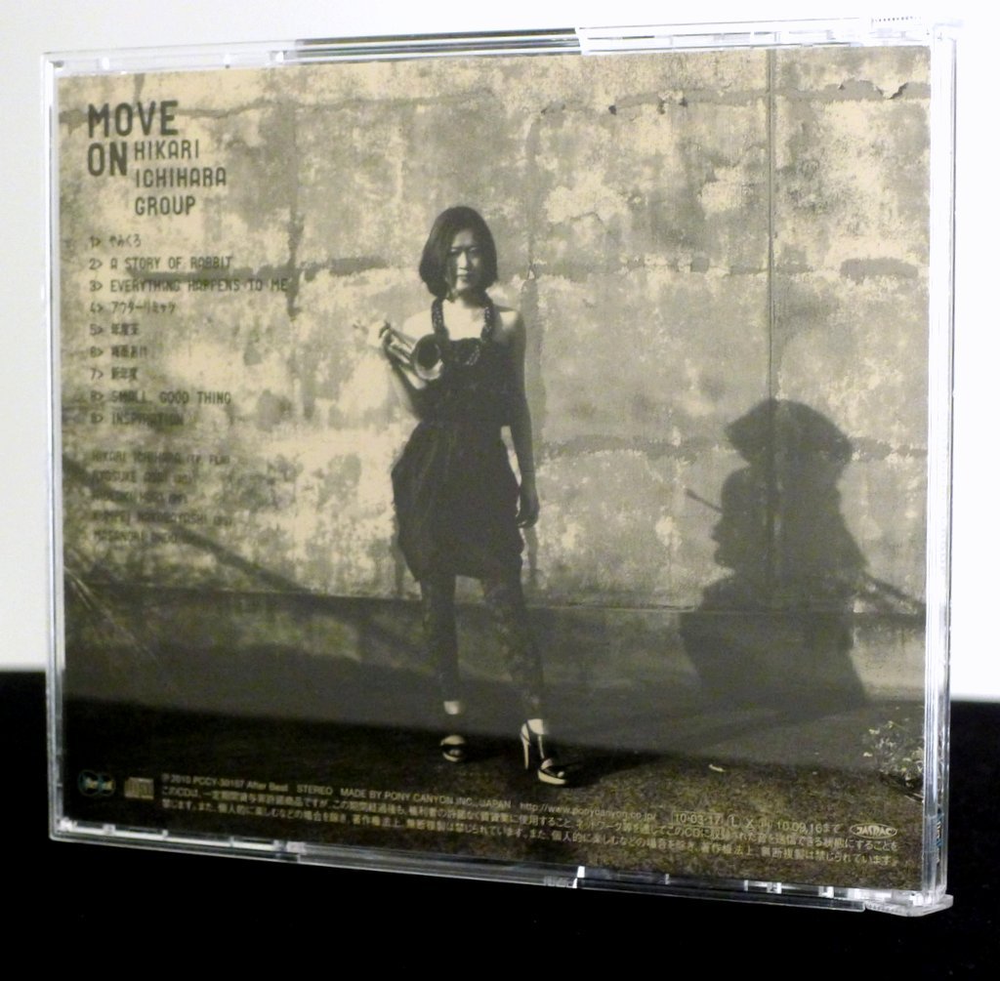
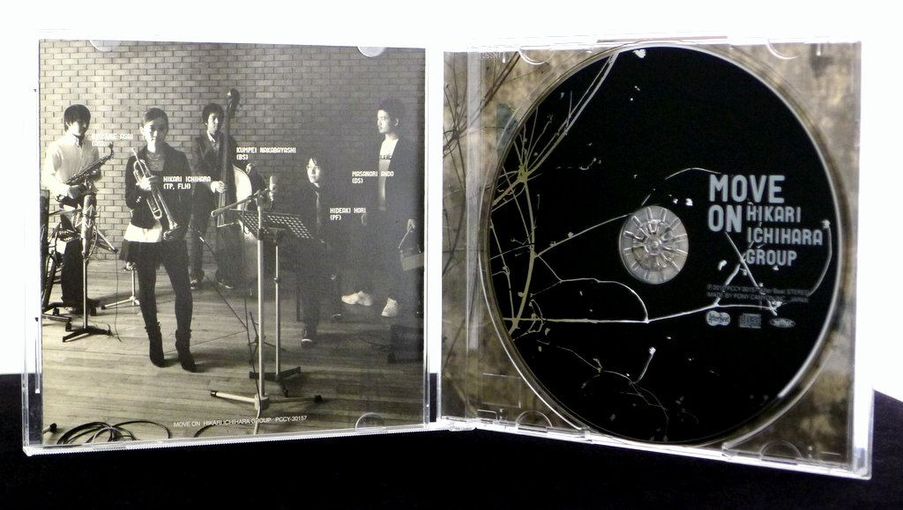
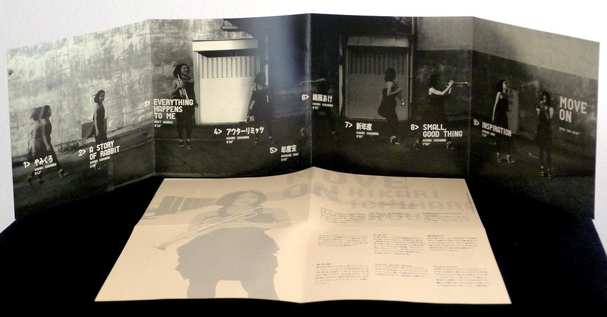
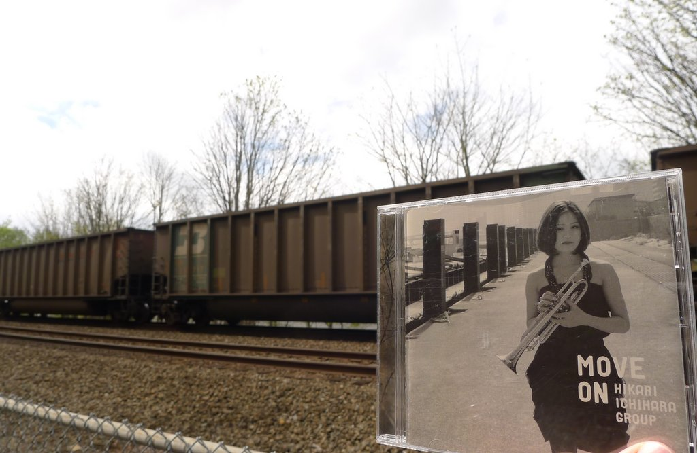

+++
title = "Hikari Ichihara Group: Move On"
author = ["Brian McCrory"]
publishDate = 2019-05-16
tags = ["Hikari Ichihara", "市原ひかり", "Ryosuke Asai", "浅井良将", "Hideaki Hori", "堀秀彰", "Kunpei Nakabayashi", "中林薫平", "Masanori Ando", "安藤正則"]
categories = ["albums"]
draft = false
[cover]
  image = "hikariichihara-moveon-460.jpeg"
  relative = true
+++

Hikari Ichihara’s fifth album _Move On_ features the trumpeter’s quintet performing finely-tuned compositions with jazz integrity and a vibrant sound full of sparkling energy. The tracks range from knife-edge sharp modern jazz, bouncy swing, wistful ballads, and rapid-fire straight ahead jazz. Also included is a single jazz standard, a fresh interpretation of “Everything Happens To Me”, delivered here with a relaxed groove.

The quintet consists of strong, like-minded players who play with a polished yet intimate feeling, creating a solid framework for the improvisers to gracefully leap and flow over. Ichihara’s trumpet solos consistently capture attention, full of impressive decorative swoops and turns, loaded with dramatic soul and a beautifully fluid and organic sound.

Closing brilliantly with pianist Hideaki Hori’s upbeat composition “Inspiration”, this album’s positive energy and satisfying sound will surely have listeners inspired to listen again, and to move on to explore more of Hikari Ichihara’s music as well.

## Move On by Hikari Ichihara Group {#move-on-by-hikari-ichihara-group}

-   [Hikari Ichihara](/tags/hikari-ichihara) - trumpet, flugelhorn
-   [Ryosuke Asai](/tags/ryosuke-asai) - alto sax
-   [Hideaki Hori](/tags/hideaki-hori) - piano
-   [Kunpei Nakabayashi](/tags/kunpei-nakabayashi) - bass
-   [Masanori Ando](/tags/masanori-ando) - drums

Released in 2010 on After Beat as PCCY-30157.

_Japanese names: 市原ひかり Ichihara Hikari 浅井良将 Asai Ryosuke 堀秀彰 Hori Hideaki 中林薫平 Nakabayashi Kunpei 安藤正則 Ando Masanori_

## Audio and Video {#audio-and-video}

-   [Video of Hikari Ichihara playing “Can You Repeat the Past” from the 2014 album “Dear Gatsby”:](https://youtu.be/JV_7YAx3mCA)



-   Excerpt from track #1: “やみくろ (_Dark Black_)” [mix #4](https://www.jazzofjapan.com/archive/audio/#mix-4)


