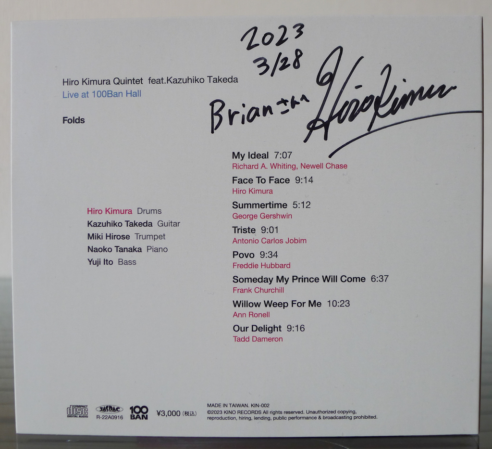
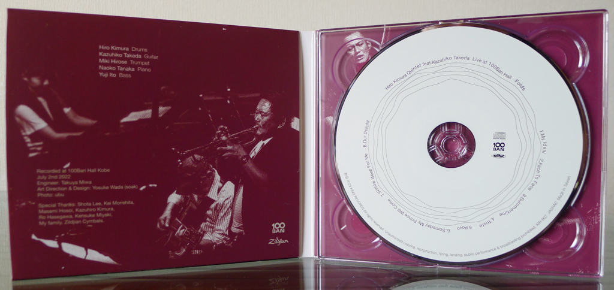
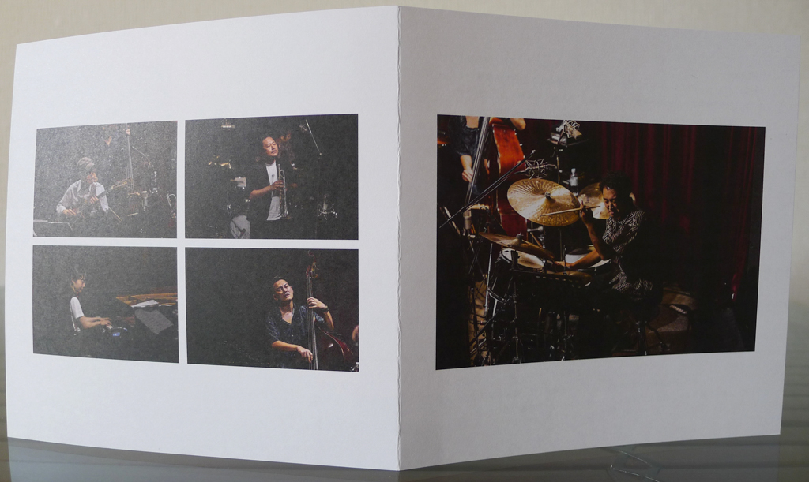

+++
title = "Hiro Kimura Quintet: Folds"
author = ["Brian McCrory"]
publishDate = 2023-06-16
tags = ["Hiro Kimura 木村紘", "Kazuhiko Takeda 竹田一彦", "Miki Hirose 広瀬未来", "Naoko Tanaka 田中菜緒子", "Yuji Ito 伊藤勇司"]
categories = ["albums"]
draft = false
[cover]
  image = "hiro-kimura-folds-460.jpeg"
  relative = true
+++

The full title of this 2023 album sets the stage: “/Folds - Live at 100Ban Hall/ by the Hiro Kimura Quintet featuring Kazuhiko Takeda”.

_Folds_ is a live recording of Kimura’s quintet playing in Kobe in 2022. Drummer Kimura leads the group featuring special guest Kazuhiko Takeda, whose melodic, soulful jazz guitar is exquisitely framed by the relatively younger musicians. Regardless of age, the unit displays talent, harmonious energy, and reverence for the music they create together.

The album contains eight tracks, seven jazz standards and covers plus one original composition from Kimura. Starting with the slow ballad “My Ideal”, the music is straight-ahead, satisfying jazz with a few members each soloing on specific songs.

Takeda’s guitar shines throughout with a warm tone and superb improvisation, a mellow sound that is well-balanced against Hirose’s excellent trumpet notes full of real jazz spirit. The piano sound may seem understated at first, but Naoko Tanaka exhibits a high level of skill with her impressive, jazzy lines and confident comping.

Bassist Yuji Ito and leader Kimura hold down the impeccable bass lines and rhythms throughout the album, and each takes the spotlight on later tracks. Kimura especially, as the leader and rhythmic director, adds ear-catching dynamic variations, rumbling textures, and splashes of sound throughout to support and respond to the musicians as they ad-lib in the moment.

Besides the slow ballad “My Ideal” and the bossa nova “Triste”, most of the songs are mid- to up-tempo numbers that swing with real live vitality, music created in the moment before a rapt audience with fun interplay and imaginative improvisation. Highlights like “Summertime”, “Someday My Prince Will Come”, and “Our Delight” invoke the live spirit and sounds of combos like Art Blakey and the Jazz Messengers. Similarly, the drummer’s original song “Face to Face” has a distinctive Cedar Walton hard-bop style and is a standout with its catchy structure and thrilling solos.

This straight-ahead music combines respect for the art form with modern influences, and it doesn’t disappoint.



## Liner Notes {#liner-notes}

_(Translated from Hiro Kimura’s original Japanese liner notes.)_

1.My Ideal

This is a ballad with a cute melody. This song was played as an encore for that day’s second set. Listen to the warm sound of the band.

2.Face to Face

This is the only “Kimura original”, played here by the quartet without Takeda. It’s a song I wrote during a self-restrained lifestyle imposed by the corona pandemic while thinking about the enjoyment of playing with people. This song was the first song of the first set.

3.Summertime

This is George Gershwin’s well-known melancholic song. We played it simply with a medium swing feel.

4.Triste

Antonio Carlos Jobim’s refreshing song. You can feel the early summer atmosphere present on the day of the recording.

5.Povo

A funky song by trumpeter Freddie Hubbard. Hirose explodes! And definitely check out Takeda’s musical interjections near the end of the last melody statement… it’s so cool.

6.Someday My Prince Will Come

The very famous Disney song. I wonder if it’s rare to be playing this song in this way in the 2020s. We play the song vigorously and at a faster tempo compared to Miles Davis’ famous take.

7.Willow Weep For Me

This is a bluesy song that’s a favorite of Takeda. As for me, when I think of this song I think of Takeda. It’s a beautiful ensemble with him. Please check out the only bass solo on this album.

8.Our Delight

This is a 1964 song from pianist Tadd Dameron. Takeda often played this song in the past, but on this day it seems that it had been several years since he played it. During the rehearsal, we confirmed the melody bit by bit, and we were all moved by the wonderful performance.

Miscellaneous Notes:

I’d love to record with Kazuhiko Takeda.

This has been my [Kimura’s] secret dream for the past several years.

The performance of Kansai’s world-renowned guitar master Kazuhiko Takeda is one of a kind, with frightening sharpness and speed and an original sense of melody that is deeply rooted in jazz.

After meeting Takeda in 2014 we played together many times, but the 2020 corona pandemic made me unable to meet him for over a year.

In the fall of 2021, we finally performed together again. I was astonished by that performance and decided to make a live recording.

The venue was 100Ban Hall in the Takasago Building, a historic building in my hometown of Kobe. This is the spot where my father had an office when I was a child and where I used to come to play, so I feel a strange connection to this venue.

The members for my first album include the ever-reliable pianist Naoko Tanaka and bassist Yuji Ito who I’ve played with the most. In front is the strong trumpeter Miki Hirose, who makes that day’s music the best whenever he is there.

Tanaka and Ito met Takeda for the first time the day before the recording. It’s truly a once-in-a-lifetime recording.

As for the results… let your ears be the judge.

Hiro Kimura



## Folds by Hiro Kimura Quintet {#folds-by-hiro-kimura-quintet}

-   [Hiro Kimura](https://ameblo.jp/pasokimura/) - drums
-   [Kazuhiko Takeda](https://ameblo.jp/kazuhikotakeda/) - guitar
-   [Miki Hirose](https://mikimusic.exblog.jp/) - trumpet
-   [Naoko Tanaka](http://tanakanaoko.com/) - piano
-   [Yuji Ito](https://bassist-jazz-0313.wixsite.com/yujito) - bass

Released in 2023 on KINO Records as KIN-002.

_Japanese names: 木村紘 Kimura Hiro 竹田一彦 Takeda Kazuhiko 広瀬未来 Hirose Miki 田中菜緒子 Tanaka Naoko 伊藤勇司 Ito Yuji_

## Audio and Video {#audio-and-video}

-   [The Hiro Kimura Quintet playing “Triste” from this album:](https://youtu.be/MYuW23qicoE)



-   Excerpt from track #2: “Face To Face” [mix #8](https://www.jazzofjapan.com/archive/audio/#mix-8)


