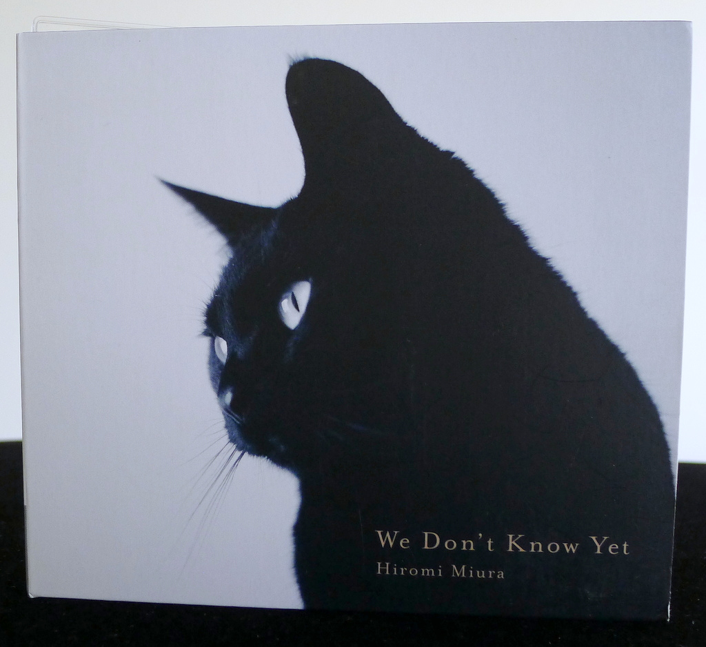
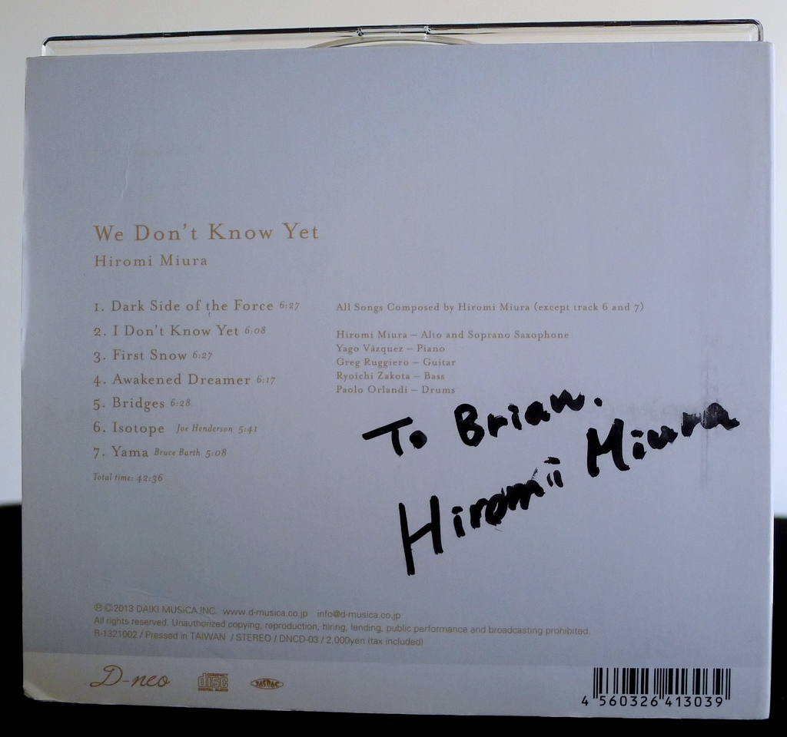
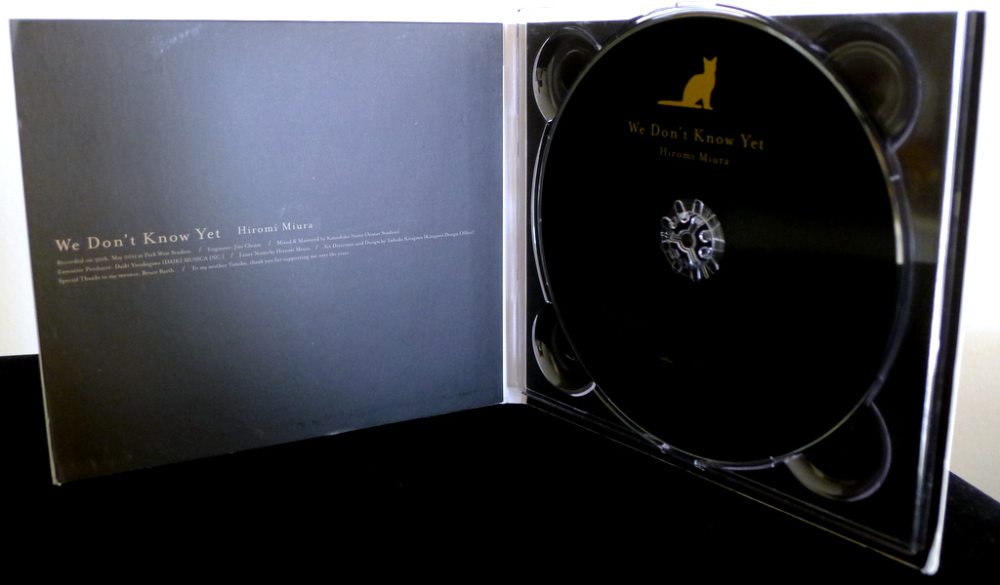
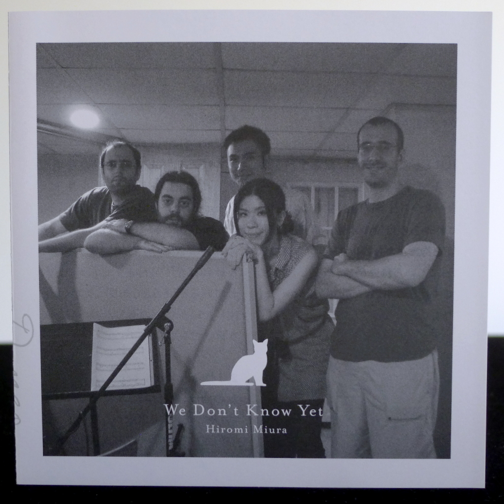
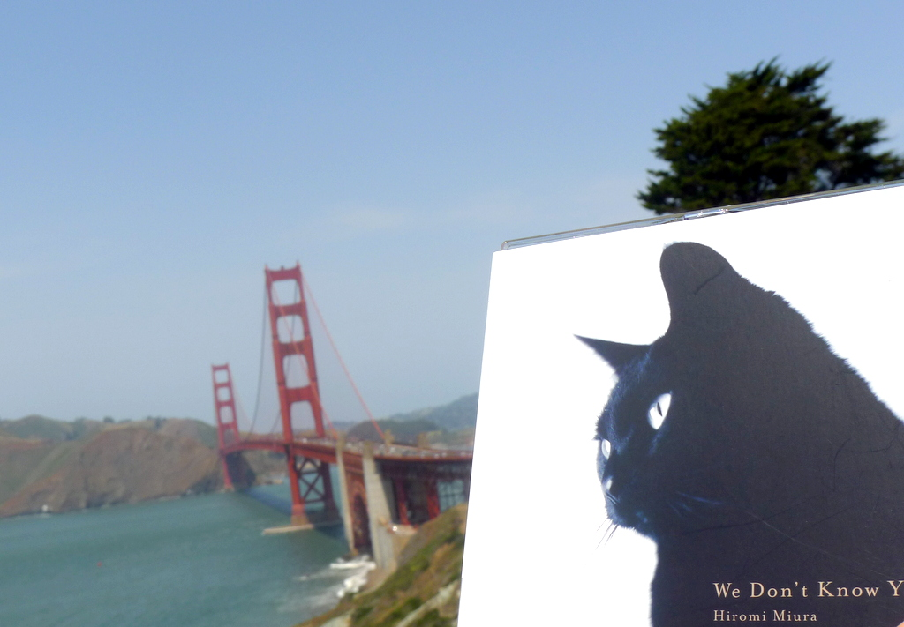

+++
title = "Hiromi Miura: We Don’t Know Yet"
author = ["Brian McCrory"]
publishDate = 2020-02-05
tags = ["Hiromi Miura 三浦裕美", "Yago Vázquez", "Greg Ruggiero", "Ryoichi Zakota 座小田諒一", "Paolo Orlandi"]
categories = ["albums"]
draft = false
[cover]
  image = "hiromimiura-wedont-460.jpeg"
  relative = true
+++

Modern jazz albums like saxophonist Hiromi Miura’s _We Don’t Know Yet_ occupy a special place, offering original compositions with creative elements which remain in the mind and call for repeated listens. Performed with consummate skill from the New York- and Japan-based musicians, the album offers five of Miura’s songs and two cover songs, focusing on intricate modern compositions and interpretations.

Miura’s creative songwriting takes on challenges like constructing sweet melodies over shadowy harmonic intervals, odd-metered rhythms, and subtle dynamic changes, also using less tangible influences from snowy weather to fantasy and space. The album was recorded at a time when reflecting on those uncertain moments between transitions, not knowing what will come next but bravely moving forward.

The playing from the members is aligned and empathetic, skillfully balancing intellect and emotion. Miura’s playing on both alto and soprano saxes is somewhat reminiscent of the playing of jazz musicians like Warne Marsh or Lee Konitz, with vertical ladder-like lines and mellow improvisation where melodic patterns are embroidered into designs of notes like stars aligning in the sky.

Following the five original jazz pieces, an attention-grabbing jazz blues is performed by cleverly overlaying Joe Henderson’s “Isotope” and Thelonious Monk’s “Evidence”, and the album closes peacefully with quiet shades of Japan on “Yama”, a beautiful ballad written by jazz pianist Bruce Barth.

## We Don’t Know Yet by Hiromi Miura {#we-don-t-know-yet-by-hiromi-miura}

-   Hiromi Miura - alto and soprano saxophone
-   [Yago Vázquez](https://yagovazquez.com/) - piano
-   Greg Ruggiero - guitar
-   [Ryoichi Zakota](https://basszakota.exblog.jp/) - bass
-   [Paolo Orlandi](https://www.paoloorlandi.com/) - drums

Released in 2013 on D-neo Daiki Musica as DNCD-03.

_Japanese names: 三浦裕美 Miura Hiromi 座小田諒一 Zakota Ryoichi_

## Audio and Video {#audio-and-video}

-   [Audio samples from this album at D-Musica](https://www.d-musica.co.jp/release/neo/DNCD-03.html)

-   Excerpt from track #2: “I Don't Know Yet” [mix #5](https://www.jazzofjapan.com/archive/audio/#mix-5)


