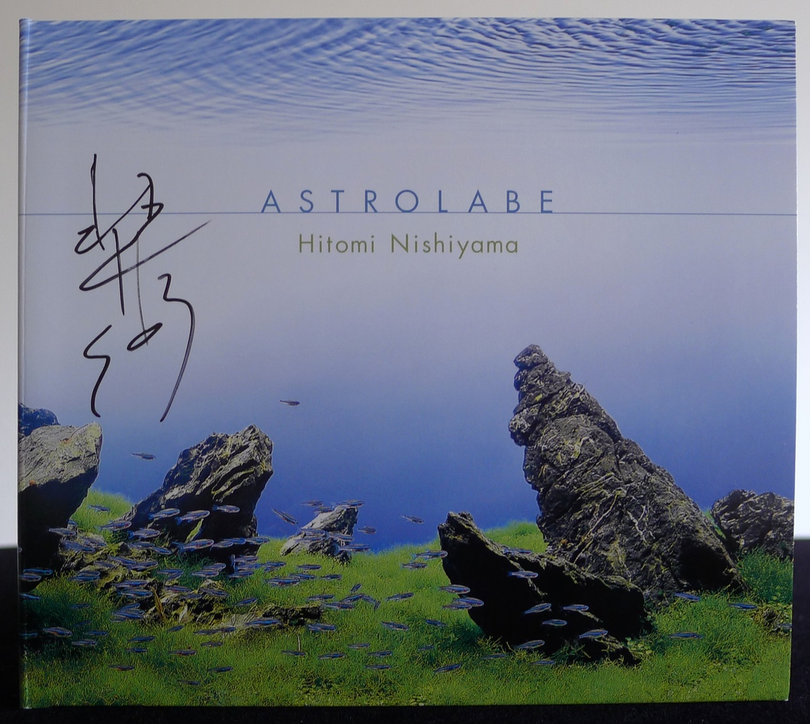
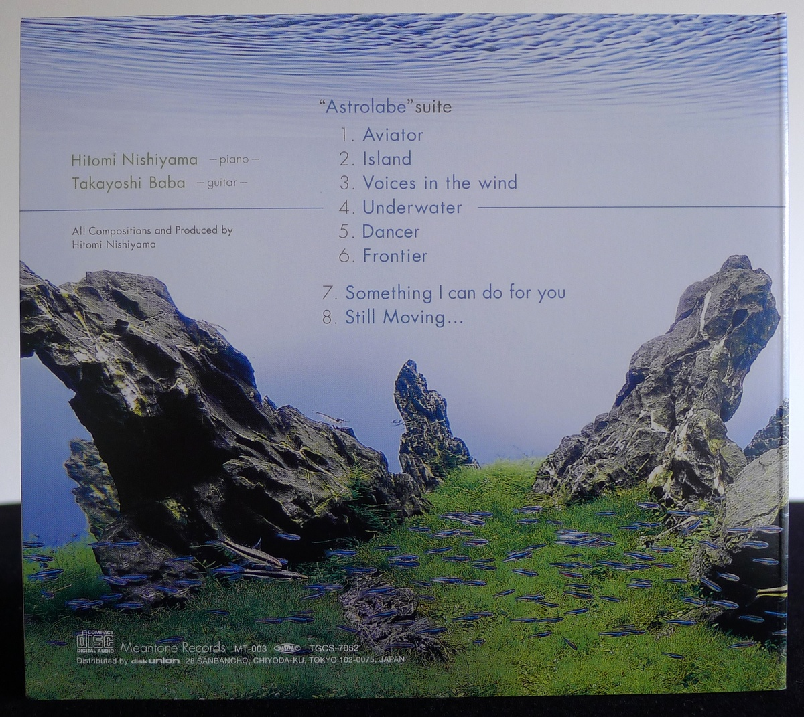
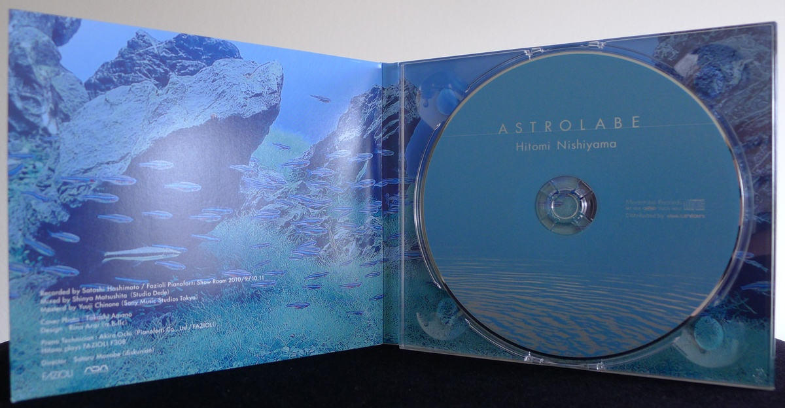
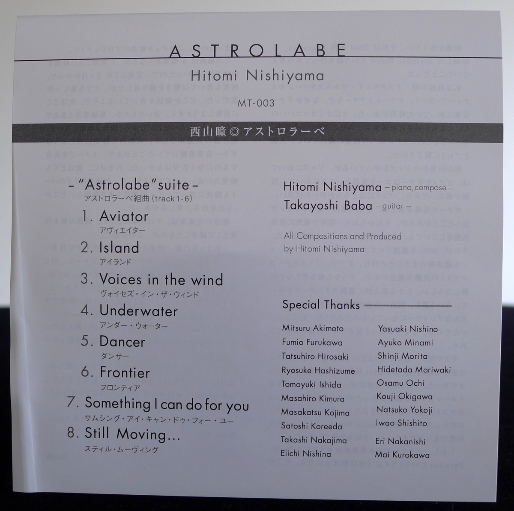
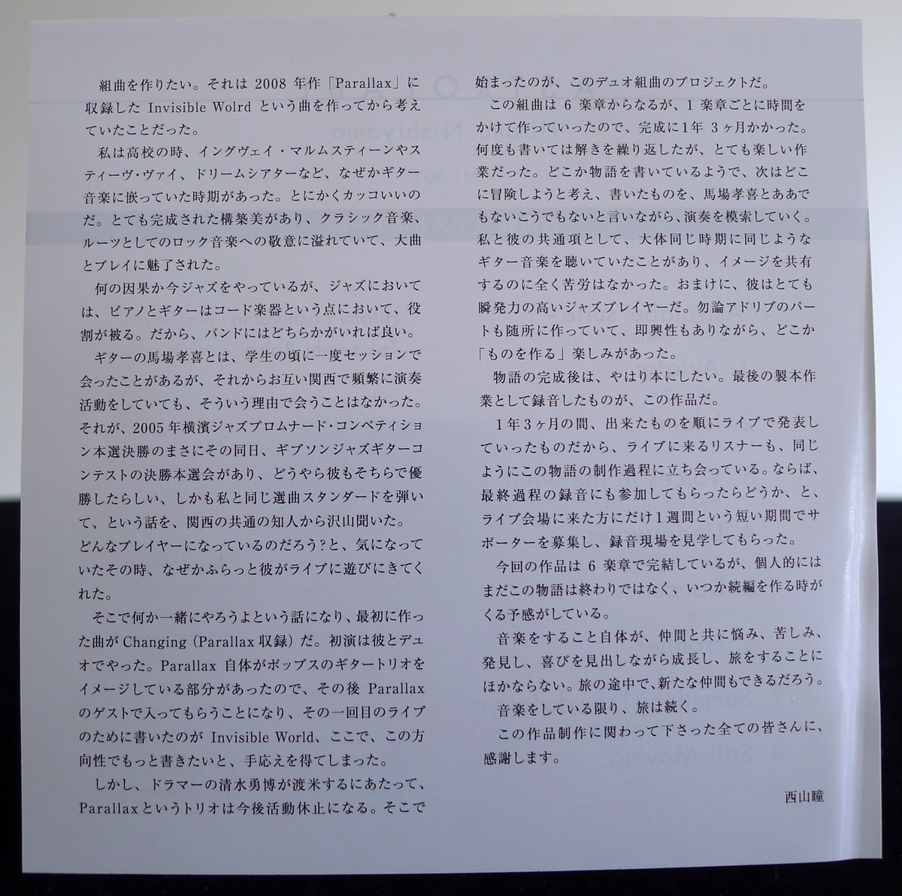

+++
title = "Hitomi Nishiyama: Astrolabe"
author = ["Brian McCrory"]
publishDate = 2025-11-03
keywords = ["nhorhm-new-heritage-of-real-heavy-metal", "hitomi-nishiyama-trio-parallax-live", "duo-tremolo-resonance", "nobie-takayoshi-baba-owari-to-hajimari", "hitomi-nishiyama-echo"]
tags = ["Hitomi Nishiyama 西山瞳", "Takayoshi Baba 馬場孝喜"]
categories = ["albums"]
draft = false
[cover]
  image = "hitomi-nishiyama-astrolabe-460.jpeg"
  relative = true
+++

_Astrolabe_ is an imaginative 2012 album from pianist and composer Hitomi Nishiyama. Nishiyama created the songs and this album with two goals in mind: First, she wanted to compose a story-like suite, a long-form composition that reflected the influence of guitar-based music she listened to as a youth, especially rock and heavy metal. Second, she wanted to record and release an album in a duo format with guitarist Takayoshi Baba, who joins her on this album.

The result is a boundary-pushing and vividly realized album centered around a six-part suite from Nishiyama, brought to life through electric guitar and acoustic piano. The two voices juggle dynamic changes and odd meters, novel structures, and riff-based comping rhythms that push the duo around edges as they race swiftly along paths in the fluid and melodic compositions. The musical story told in the suite seems to be filled with elements of fantasy, classical flourishes, and the energy of jazz fusion.

This is an album originating from two musicians who have a fondness for guitar-based bands like Dream Theater and Yngwie Malmsteen. The idea of the concept album that was popular in the 80s and 90s with groups like these, including Queensrÿche, Iron Maiden, and others, must too be a factor in the creation of this suite.

Nishiyama spent over a year composing _Astrolabe_ and she wrote, edited, adapted, and performed the songs at intervals with Baba. Through it all, she maintained the goal of joining the separate songs in the suite’s tapestry of interweaving themes and patterns to tell a story where the plot moves through changes in tempos, meters, harmonies, and emotional moods.

Released in 2012, _Astrolabe_ roughly falls in Nishiyama’s early-to-middle period between her first debut release [_I’m Missing You_](https://www.jazzofjapan.com/archive/hitomi-nishiyama-trio-im-missing-you) from 2004 and her current latest _Songs_ from 2025. Up to 2012, she had already released several jazz piano trio albums as a leader of the Hitomi Nishiyama Trio and her Hitomi Nishiyama _[“Parallax”](https://www.jazzofjapan.com/archive/hitomi-nishiyama-trio-parallax-live)_ jazz piano trio. Her personal style has always blended smooth European modernism, classical pianist roots, and deep jazz studies. Add to that her equally recognizable compositional style that is filled with sublime melodies and beautifully intricate harmonies and rhythms.

The first six tracks on this album make up the “Astrolabe Suite”. In the liner notes (translated below), Nishiyama explains how the idea of writing a suite came to her, and the storytelling-like process she took with guitarist Baba in developing the chapters of the story over time.

No notes are provided about what the story’s concept is concretely, or if there is a fleshed-out plot with characters, scenes, and story arc, but listeners’ imaginations can be driven by what is gleaned from the song titles and how the music unfolds.

Track #1 “Aviator” flows at an uptempo pace with odd-meter measures and ornate syncopation decorating the piece. With some complex pieces, focusing too hard about what’s going on musically can interfere with the enjoyment of listening listening, such as when trying to identify and categorize the structural parts and how they connect like puzzle pieces. Yet “Aviator”’s opening flows along, rapidly and easily carrying listeners forward through beautiful melodies and mature, symphonic songwriting and playing.

The second movement is titled “Island”. This is a mid-tempo piece with the personality of a sentimental heavy rock ballad. A mysterious feeling arises from the shifting harmonies and close melodies, maintaining the sense of flying that was created on the previous track. The destination hinted at in the story (one possibly interpretation) moves from the perspective of the aviator to some remote island their aircraft landed upon. It seems that the melody and solos are also buffeted smoothly by the waves and glide over the terrain of the island like wind.

The next chapter, #3 “Voices in the Wind”, returns to a faster rhythm based pattern, where Nishiyama’s left hand pins down the rhythms like the chugging of a guitar riff. Still, harmonic grace bloom with refined filigrees of notes as classical, jazz, and rock root meld and the two musicians play with abandon. This part of the story increases the mystery with pulse-racing developments in plot as an unexpected phenomenon appears.

The suite’s fourth movement is “Underwater”. Strict time-keeping starts to dissolve and makes room for the duo’s rubato and flexible synchronicity. The guitar and piano both lead and follow indistinguishably as they stretch out for an interlude-like reflection in the peace and safety of aquatic submersion.

\#5 “Dancer” frames an angular up-and-down march of folk-style joy as the music transforms into dreamy classical arpeggios with a touch of Ghilbi-esque fantasy. The elaborate spell of the dance provides a solution to the mystery or dilemma, but one that must be executed perfectly and step-wise like a dance, with all notes correct in place and in order.

The last movement, “Frontier”, shifts between free and solid time with several inner developments in meter and structure. Precise angles and curves are taken by the piano and guitar together, then piano alone in a solo break, then back together as the five-beat meter and rock-heavy rhythms build to a climax for the story’s satisfying conclusion.

Two more songs follow the six-part suite. #7 “Something I Can Do for You” is a lovely ballad that seems to relate indirectly some themes developed in the suite like memories of a dream. The last track, #8 “Still Moving...” revisits the oceanic tides implied in parts of the suite through a steady pulse and a double-note question of a melodic theme, alternatively comfortable and potentially threatening in its immense embrace.

## Liner Notes {#liner-notes}

_(Translated from Hitomi Nishiyama’s original Japanese liner notes.)_

_I want to make a suite._ This was something I had been thinking about ever since I wrote the song “Invisible World”, included on my 2008 album _Parallax_.

There was a time when I was in high school that I was addicted to guitar-based music like Yngwie Malmsteen, Steve Vai, and Dream Theater. It was just undeniably cool. There was a perfectly constructed beauty that was filled with respect for its roots in classical music and rock music, and I was fascinated by the large-scale compositions and the playing.

As fate would have it, now I’m playing jazz. With jazz music, both the piano and the guitar are chordal instruments, so it’s nice to have either one in a band.

I met guitarist Takayoshi Baba one time at a jam session during my student days, but we didn’t meet again after that, despite the fact that we both often performed in the Kansai region. However, on the very same day as the final round selection of the 2005 Yokohama Jazz Promenade Competition, there was a Gibson Jazz Guitar Contest finals competition. I later heard from many people in Kansai that he also won the grand prize, and what’s more, we ended up playing the same selection of standards at our respective competitions! Just as I was wondering about what kind of player he had become, he showed up at one of my live shows to listen to my performance for some reason.

It was then that we talked about doing something together, and so I wrote the first song “Changing” (included on _Parallax_). We initially performed this as a duo. Since one aspect of Parallax itself contained the image of a pop guitar trio, we later invited Baba Takayoshi to join as a guest for Parallax concerts. I wrote “Invisible World” for our first performance together. That was when I started to feel that I wanted to write more music in this direction.

At that time, however, drummer Takehiro Shimizu was going to be moving to the United States, so the Parallax trio would be on hiatus following that. That was the beginning of this duo suite project.

This suite consists of six movements. Each movement took considerable time to compose, and the entire suite took one year and three months to complete. I rewrote it and unraveled it many times, but it was a very fun process. It was like I was writing a story about a place, thinking about where to head for the next adventure, while talking to Takayoshi Baba about this and that and searching for a way to perform what I’ve written. One thing we had in common was we had both been listening to the same guitar music at around the same time, so it was easy to share the same vision. Additionally, as a jazz player he’s extremely quick-witted. Of course, I was making a lot of parts for ad-libs all over, so while I included the elements of improvisation, there was also the enjoyment of “creating something”.

After completing the story, naturally I wanted to make it a book. Like a bookbinding process at the end, this album represents the final packaging of this recording.

During that one year and three months, at our live shows we were presenting in order the work that had just been completed. The listeners who came to those events were also witnessing the creation of this story in the same way. We thought to ourselves, wouldn’t it also be great to have listeners present in the final recording process as well? During a short one week period, we recruited supporters at our performances and invited them to observe at the recording studio.

For this album, the suite is concluded in six movements. Personally, I feel that the story is not over yet, and I have a sense that the time will come for a sequel someday.

The act of making music is nothing more than growing and traveling together with companions, with all the worries, struggles, discoveries, and joy encountered along the way. Along the journey, you can also make new friends as well.

As long as I am making music, the journey continues.

Much appreciation and thanks go out to everyone involved in the production of this album.

西山瞳 Hitomi Nishiyama

## Obi Notes {#obi-notes}

A collection of songs crafted with overwhelming compositional sense. 
A sublime duo of guitar and piano create and expand a magical sound space of two interweaving instruments!



## Astrolabe by Hitomi Nishiyama {#astrolabe-by-hitomi-nishiyama}

-   [Hitomi Nishiyama](https://hitominishiyama.net/) - piano
-   [Takayoshi Baba](https://babaviolao.wixsite.com/babatakayoshi) - guitar

Released in 2012 on Meantone Record as MT-003.

_Japanese names: 西山瞳 Nishiyama Hitomi 馬場孝喜 Baba Takayoshi_

## Audio and Video {#audio-and-video}

-   [Promotional video for this album:](https://youtu.be/HS5JB0buDyk)



-   Excerpt from track #6: “Frontier” [mix #14](https://www.jazzofjapan.com/archive/audio/#mix-14)


