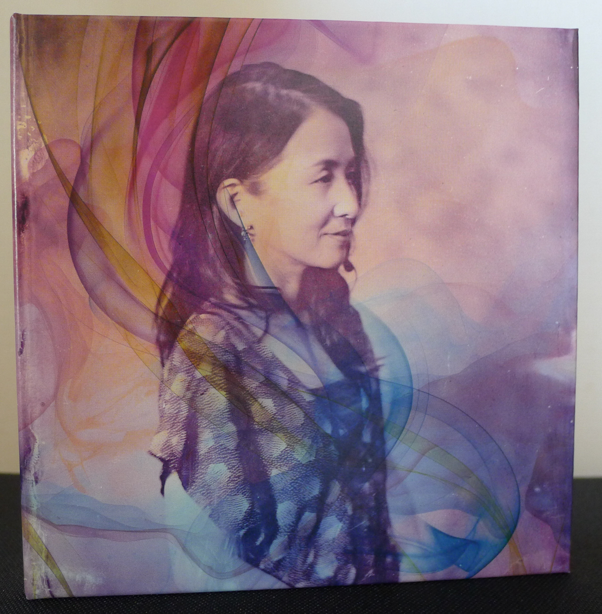
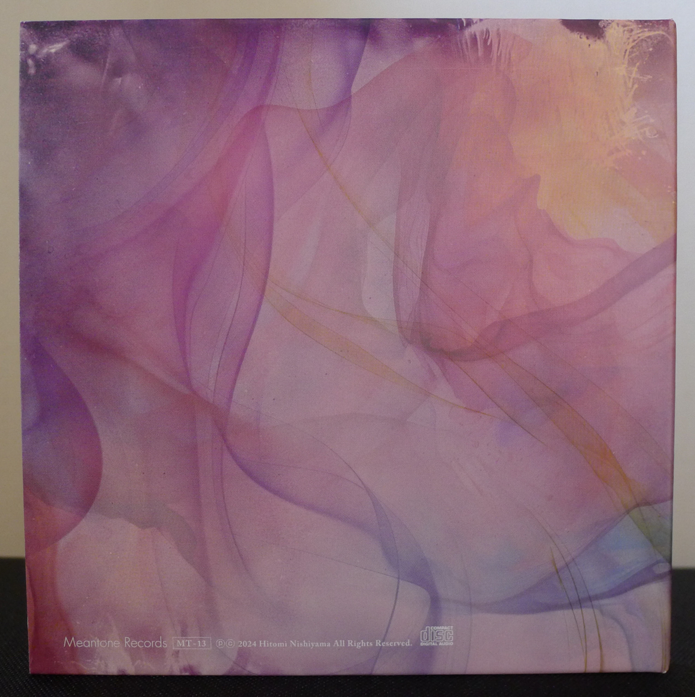
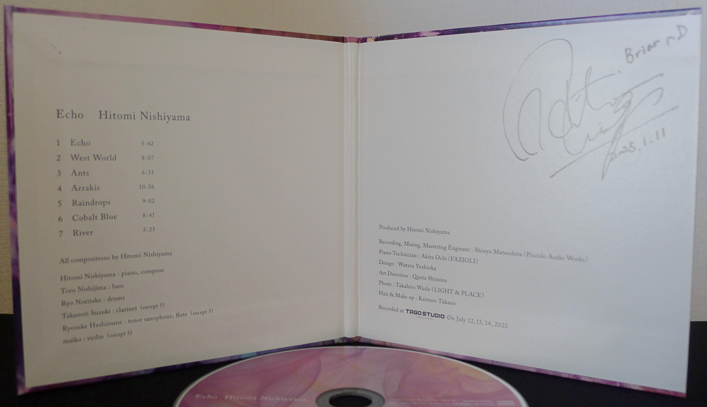
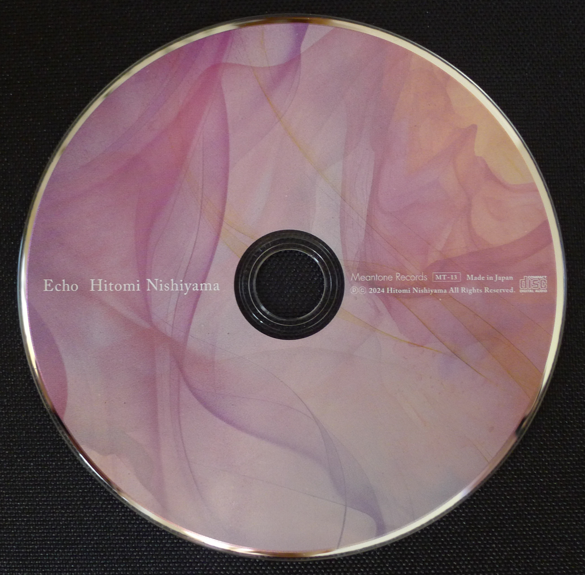

+++
title = "Hitomi Nishiyama: Echo"
author = ["Brian McCrory"]
publishDate = 2025-03-23
keywords = ["hitomi-nishiyama-trio-many-seasons", "hitomi-nishiyama-trio-music-in-you", "hitomi-nishiyama-trio-sympathy", "daiki-yasukagawa-trio-trios-ii", "hitomi-nishiyama-trio-parallax-live", "nhorhm-extra-edition", "hitomi-nishiyama-vibrant", "kaoru-azuma-hitomi-nishiyama-faces", "hitomi-nishiyama-trio-calling", "hitomi-nishiyama-dot"]
tags = ["Hitomi Nishiyama", "西山瞳", "Toru Nishijima", "西嶋徹", "Ryo Noritake", "則武諒", "Takanori Suzuki", "鈴木孝紀", "Ryosuke Hashizume", "橋爪亮督", "maiko", "マイコ"]
categories = ["albums"]
draft = false
aliases = ["/archive/hitomi-nishiyama-echo/", "/p/hitomi-nishiyama-echo/"]
[cover]
  image = "hitomi-nishiyama-echo-460.jpeg"
  caption = ""
  relative = true
+++

_Echo_, from 2024, is pianist/composer Hitomi Nishiyama’s latest album and a response to her previous release _[Dot](https://www.jazzofjapan.com/archive/hitomi-nishiyama-dot)_ from 2023. The music on this album was made with the same group and during the same recording sessions and as such, there are many similarities in sound and direction. In aura and conceptually, however, the differences are effectively portrayed by the separate covers and designs: Where _Dot_ shows a monochrome sketch-like grid of hand-drawn dots, _Echo_ places the pianists’ subtly Mona Lisa smile into a vividly abstract gauze of lilac and cobalt swirls and hues.

There are seven songs on _Echo_ which run from about six to ten minutes each. Nishiyama’s piano trio with bassist Toru Nishijima and drummer Ryo Noritake constitutes the core of the sound, with colorful layers added by the extra trio of Takanori Suzuki on clarinet, Ryosuke Hashizume on tenor sax and flute, and Maiko on violin. Much of the music has the piano trio buffeted by the texturally slow-moving audio pads of clarinet, sax, and violin, creating a plush ambience and quiet invitation to sink into /Echo/’s layers.

One unmistakable strength of these two recent albums is how Nishiyama’s composing style has shifted slightly from her previous modern jazz trio writing, which was often compared to classically tinged European-style jazz and sometimes called richly emotionally or even “sad music” at times. Of course, there are still overtones of introspection on _Echo_ that run throughout. Several of the song’s melodies feature chromatically interesting accidentals or scales with intervals that are subtly surprising and pleasing. Jazz swing beats are rare here, with straight-eights or soft rock drums to enhance the easy movements and slow-to-medium tempos. The violin, clarinet, sax, and flute accompaniments are paintbrushes for the borders and backdrops of Nishiyama’s canvases, where the frontward trio of piano, bass, and drums collaborate on creating and transforming the objects of direct focus. Although the so-called background instruments also come to the front at times, this is moderately done, and the use of their layers and textures as sonic ground and textures is beautiful and effective.

The compositions also feature slow-moving ambient sections that are superbly enhanced by Nishijima’s bowed contrabass, and rock-beat riffs that recall her style on her separate heavy metal-inspired jazz project [NHORHM](https://www.jazzofjapan.com/archive/nhorhm-extra-edition). There are sections of songs where the pianist’s left hand plays solid guitar-like chords, catchy quarter-note pop rhythms, or delicately spun ostinatos to great effect. The overall energy level is calm, somewhat muted, and taken at patient tempos. It’s more like a deeply absorbing novel or modern art piece with layers to uncover, rather than the fast cuts of an action movie or high-paced show. Yet interestingly, parts of these songs feel as if they would fit perfectly as scores to accompany moments of drama or discovery in movie scenes.

Like the design and concept, the songs themselves naturally summon evocative images through Nishiyama’s writing style, orchestration, and arrangements (and her particular choice of song titles, as well). Tracks #1 “Echo” and #2 “West World” (no relation to the recent drama series) are the opening chapters, where she is directed towards aspects of pop music catchiness, hooks, and musical movement that make such affecting hit songs. #3 “Ants” is slow, sparse, and semi-experimental with suite-like section breaks. These characteristics are shared and expanded upon by the grand displays in #4 “Arrakis”, dynamically crystalizing the oppressive tension of the Frank Herbert world-building fantasy with power and exotic mystery.

Track #5 “Raindrops”, the sole piano/bass/drums trio track on the album, explores an absorbing nine minutes of free but coordinated scenes in flexible time, gracefully Debussey-ish arpeggios, bowed contrabass, and hints of ambient music. #6 “Cobalt Blue” features slow chord cushions and subtle piano power chord riffs to allow the background instruments to come to the front for some in-turn and simultaneous improvisation. Finally, the last track #7 “River” moodily balances the major/minor shifts of the album’s overall feel with a soundtrack-like song for a sweet goodbye to a moving and memorable album. The reverberations of both _[Dot](https://www.jazzofjapan.com/archive/hitomi-nishiyama-dot)_ and _Echo_ linger, though, and ensure anticipated return journeys to Nishiyama’s distinctive and penetrating musical worlds in the future.



## Echo by Hitomi Nishiyama {#echo-by-hitomi-nishiyama}

-   [Hitomi Nishiyama](/tags/hitomi-nishiyama) - piano, compositions
-   [Toru Nishijima](/tags/toru-nishijima) - bass
-   [Ryo Noritake](/tags/ryo-noritake) - drums
-   [Takanori Suzuki](/tags/takanori-suzuki) - clarinet (all tracks except #5)
-   [Ryosuke Hashizume](/tags/ryosuke-hashizume) - tenor saxophone and flute (all tracks except #5)
-   [maiko](/tags/maiko) - violin (all tracks except #5)

Released in 2024 on Meantone Records as MT-13.

_Japanese names: 西山瞳 Nishiyama Hitomi 西嶋徹 Nishijima Toru 則武諒 Noritake Ryo 鈴木孝紀 Suzuki Takanori 橋爪亮督 Hashizume Ryosuke マイコ maiko_

## Audio and Video {#audio-and-video}

-   [Promotional video for this album:](https://youtu.be/noBKgt9Gu6E)



-   [Live performance of “Echo”, track #1 on this album:](https://youtu.be/HgQ4do6FdHk)



-   [Excerpts from a live performance of the Hitomi Nishiyama Trio +3 from 2024:](https://youtu.be/T2XMwaawQfY)



-   [Streaming services for this album](https://linkco.re/u7zvtsUN)

-   Excerpt from track #4: “Arrakis” [mix #13](https://www.jazzofjapan.com/archive/audio/#mix-13)


