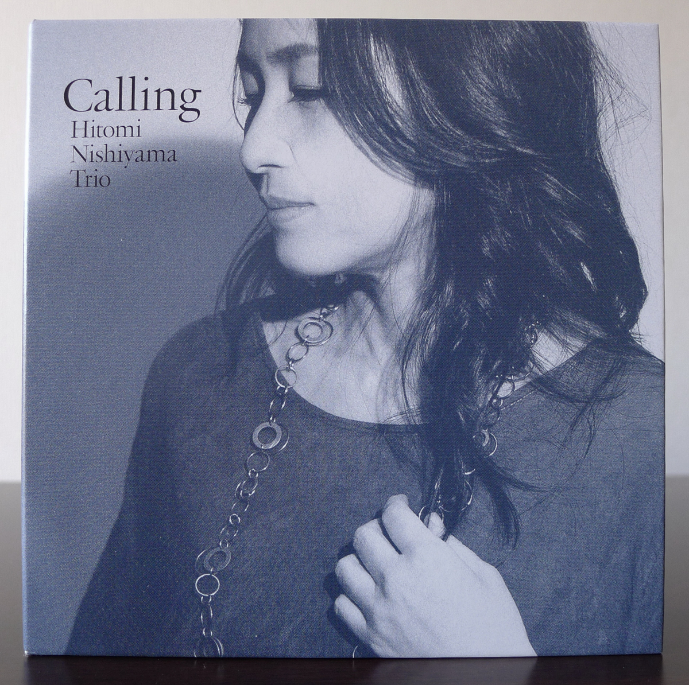
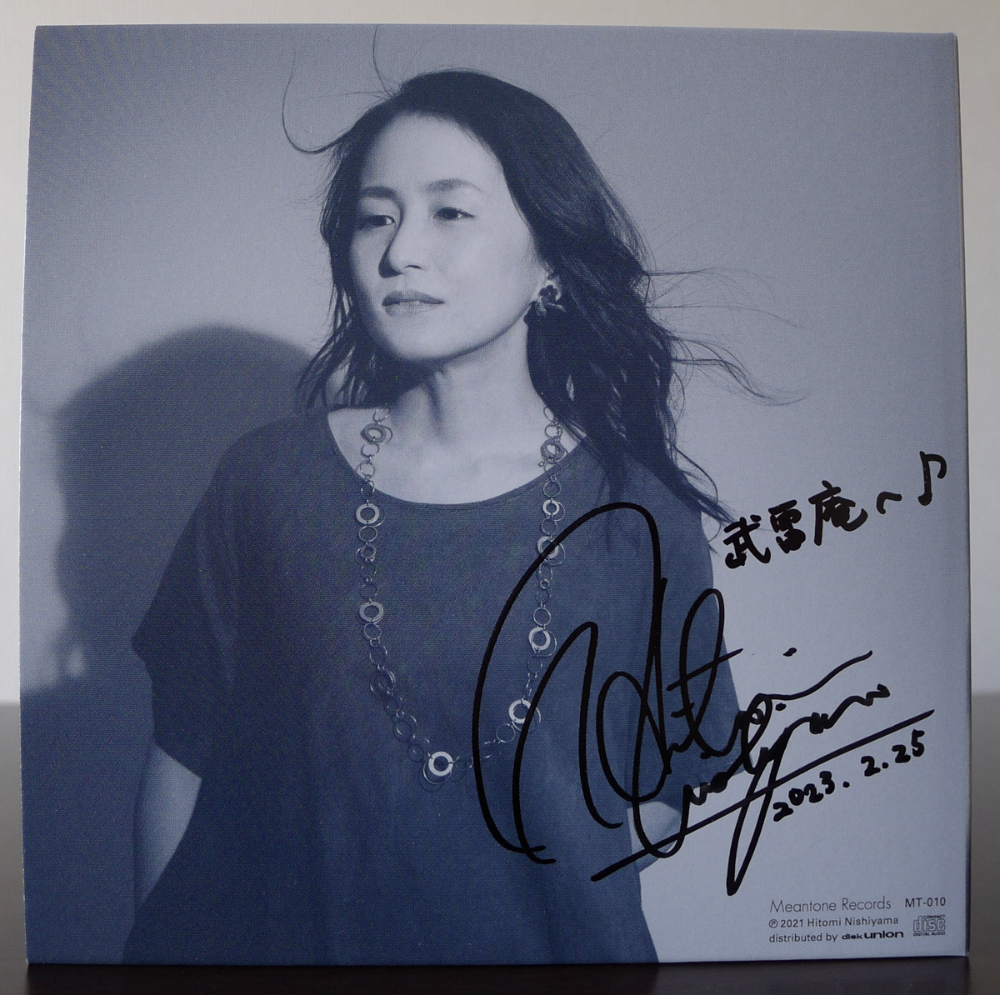
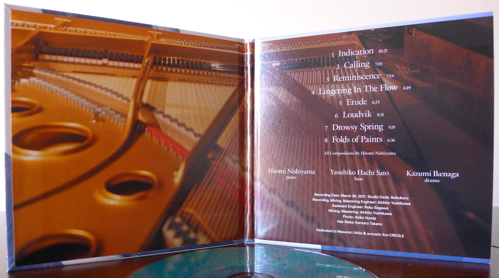
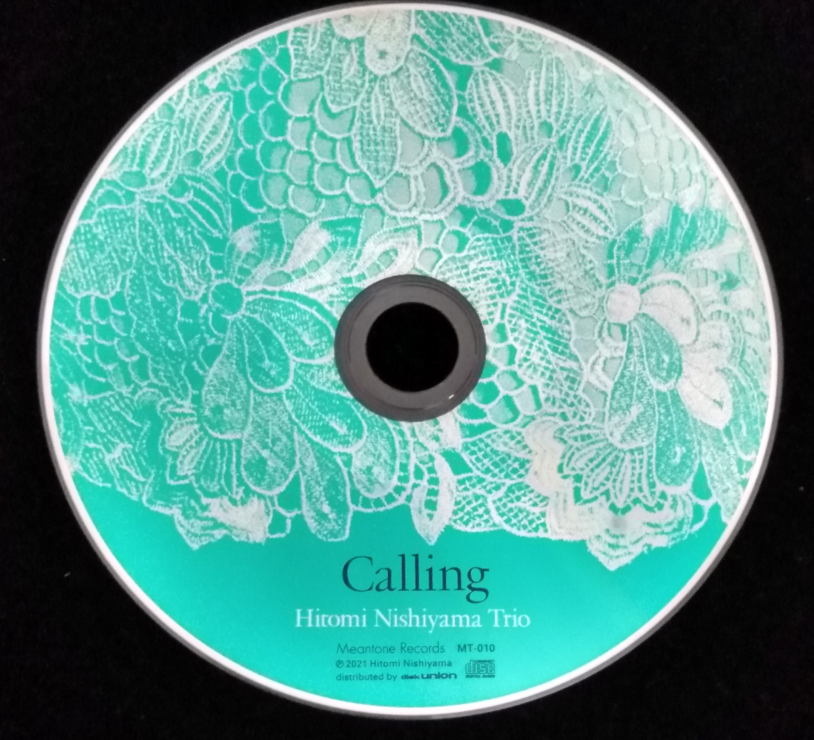

+++
title = "Hitomi Nishiyama Trio: Calling"
author = ["Brian McCrory"]
publishDate = 2024-04-27
keywords = ["hitomi-nishiyama-trio-many-seasons", "hitomi-nishiyama-trio-music-in-you", "hitomi-nishiyama-trio-sympathy", "daiki-yasukagawa-trio-trios-ii", "hitomi-nishiyama-trio-parallax-live", "nhorhm-extra-edition", "hitomi-nishiyama-vibrant", "kaoru-azuma-hitomi-nishiyama-faces"]
tags = ["Hitomi Nishiyama", "西山瞳", "Yasuhiko “Hachi” Sato", "佐藤“ハチ”恭彦", "Kazumi Ikenaga", "池長和美"]
categories = ["albums"]
draft = false
[cover]
  image = "hitomi-nishiyama-trio-calling-460.jpeg"
  relative = true
+++

Among the close to thirty album releases from pianist and composer Hitomi Nishiyama’s catalog, _Calling_ (2021) is the third album recorded with one of her regular trios. This particular trio with bassist Yasuhiko “Hachi” Sato and drummer Kazumi Ikenaga is also featured on Nishiyama’s _[Sympathy](https://www.jazzofjapan.com/archive/hitomi-nishiyama-trio-sympathy)_ (2013) and _[Music in You](https://www.jazzofjapan.com/archive/hitomi-nishiyama-trio-music-in-you)_ (2011).

These three musicians have maintained close musical contact with occasional performances together since then, so this album is not only a long-awaited recording reunion but also a heartfelt response to various bittersweet events described in Nishiyama’s liner notes.

In that manner, Nishiyama strives to get to the heart of the matter with each song on this album. The music is different from previous albums in that wants to distill the music to its simplest yet strongest essence, to create straightforward themes using regular, established musical patterns.

This is a slightly different direction intentionally taken by the pianist, who in previous projects and groups has naturally gravitated toward composing complex arrangements full of challenging meters, time signature shifts, and multiple musical sections that span pages.

Similarly, she’s used to taking up difficult musical challenges like composing tuneful melodic themes using all 12 chords in songs like her “T.C.T. (Twelve Chord Tune)” and others, experiments inspired by Bill Evans’ famous “T.T.T (Twelve Tone Tune)” and other [tone-row](https://en.wikipedia.org/wiki/Tone_row) puzzles.

In addition, she’s gained more cross-genre acclaim recently through her jazz/metal fusion project N.H.O.R.H.M. with jazz piano trio versions of classic heavy metal songs. The four albums and live shows from that group also contained finely crafted arrangements and well-rehearsed performances. It’s no surprise that her considered thoughts and intelligence shine not only in her musical writing but also in her many textual essays and liner notes.

In a slight departure, _Calling_ finds Nishiyama resisting her tendency towards complexity and musical puzzles. Here, the composer challenged herself to focus on creating the best melodies over relatively simple or established musical forms in jazz. She describes them as the types of songs that can be played from the sheet music without overly preparing for special bridges, endings, sections, arrangements, or other unique characteristics on the written musical page.

So, how does the music on _Calling_ sound? It’s easy to initially call this music sad (a word often associated with some of Nishiyama’s music), but the opening track #1 “Indication” sets this somber tone right from the start. It’s not just the minor sound, but also the tension of a protracted melody draped over melancholic, slow-moving chords.

From there, the rest of the album cascades through terrain including tender and emotional (#2 “Calling”), spirited waltz swing (#3 “Reminiscence”), slow-moving translucence (#4 “Lingering in the Flow”), freely ambient and classical (#5 “Etude”), romantic and slightly metal 7/4 meter (#6 “Loudvik”), patient and restful (#7 “Drowsy Spring”), and the well-established Nishiyama style of exciting European-inspired modern jazz (#8 “Folds of Paints”).

Naturally, it’s impossible to capture the beauty of music in so few words, but these incomplete descriptions may give a simple outline of the contours, shades, and atmospheres found in this album.

While the graceful yet powerful sound of Nishiyama’s piano frames and improvisation fills most of the songs on the album, features for bass and drum spotlights also surface here and there. As three musicians who know each other very well, the music naturally includes the intuitive group dynamics that morph from traditional piano-bass-drum roles to balanced simultaneous improvisation, seamlessly, exquisitely, and back again.

One of Nishiyama’s goals for _Calling_ was to create music that is easily absorbed, memorable, and evocative. This album accomplishes that immediately. Listeners can feel the stopping and starting of thoughts and memories evoked by the hesitant piano improvisation… Instant melodies rising from and dissolving into mist… Subtle but strong, distinct, clear change, rise, and descent from one chord to another.

Moreover, _Calling_ perhaps also subtly hints of directions to come, themes and ideas that are further explored on her third release since then, 2023’s _Dot_. Incidentally, Hitomi Nishiyama just this week held an exciting live concert with her _Dot_ sextet recording members as an album-release event in Tokyo (more on this impactful _Dot_ in a future article). She also announced that a companion album to _Dot_ is upcoming and set for a fall 2024 release with the title _Echo_, another record to definitely look forward to.

## Liner Notes {#liner-notes}

_(While there are no printed liner notes in the CD release, the following text is a translation of Hitomi Nishiyama’s “The Making of ‘Calling’”at [Hitomi Nishiyama 西山瞳『Calling』制作の経緯など from October 5, 2021](https://note.com/hitominishiyama/n/n7cd579d358fd?sub_rt=share_pw).)_

This is how the album _Calling /came to be_./  Please read this in lieu of liner notes.

In previous interviews, I’ve talked about how the timing of several things led up to this recording.

The first event was on July 19, 2020. This was a high-quality 4K live broadcast from Studio DeDe Recording Studio in Ikebukuro.

From April 2020 until mid-June, there was a series of continuous non-working days _[due to coronavirus pandemic measures]_. I had been live streaming from home, and DeDe was planning a “Tokyo Basement Sessions” series with the concept of offering high-quality broadcasts directly from the recording studio. It came about that I would participate with the same trio that I had recorded _Music in You_ (2011) at Studio DeDe.

It was a completely new experience to live stream from a recording studio was a completely new experience, and it felt awkward at first, but we gradually adjusted during the two-hour performance. Afterward, we were all saying things like “I want to keep playing a little bit more” and “Let’s do this again”. From then on, the thought “Once more at Studio Dede, with this trio…” remained in the back of my mind, and I was looking for the opportunity.

Then, two months later in September, the live space Creole in Kobe that had been so important to me closed down.

Creole’s closing wasn’t due to the pandemic, but at the same time, many places were closing down before there was even a chance to say goodbye. A sense of loneliness and of not having a place to go home to anymore grew increasingly stronger.

What’s agonizing about this was not the fact of being robbed of a place to play or that work opportunities would decrease, but rather that something like an emotional base or core had gone away. I imagine it must be like the feeling of one’s family home disappearing.

Under these conditions, I thought “It’s now or never”, and from that point on I carried my musical staff paper notebook with me and wrote a lot of new songs.

Then in November, the proprietor of Creole passed away.

Reflecting on the period from Creole’s opening in 2003 until now, and thinking about how the proprietor was a great admirer of Keith Jarrett’s songs, I realized that I hadn’t worked on Jarrett’s music enough. So I thought it would be nice to write a song like “Country” and “My Song”, and I began to write the album title song “Calling”.

Naturally, since I hadn’t devoted myself properly to Keith up until then, I couldn’t write such a song. When I finished writing, it turned out to be a different song than I had first thought it would be. But in the end, I figured, you only can produce what you have in you. I was satisfied with the result itself and, determined to record it then, I scheduled a recording date. That’s how it happened.

We recorded twelve songs and included eight on the album.

The four extra songs, _Calling Outtake_, are available for download-only purchase exclusively via iTunes and OTOTOY.

In the fall of 2020, I wrote six songs in my walking-around staff notebook: “Indication”, “Calling”, “Folds Of Paints”, “Etude”, “Blue Badis”, and “T.T.T.T.T.”. None of the songs have complicated harmonic progressions or compositional tricks like those around the time of _Shift_ and _Music in You_.

I think that this is partly a result of my response to coming up with extremely complicated arrangements for [NHORHM](https://nhorhm.tumblr.com/), as well as the worldwide conditions last year. I just didn’t feel like writing anything complicated. I had a great desire to write powerful songs in fixed formats with something strong running through them.

Fixed formats, or common song forms, refer to structural frameworks primarily used in traditional American music, such as the 32-bar form, AABA form, ABAC form, and three-part construction _[verse, chorus, bridge]_.

And in order to fit that traditional simple form, the melody has to be well-thought out or it will be a failure. There are already many famous songs that share the same form as others, so it’s a huge challenge to boldly attempt to create something in that way. I repeatedly refined them carefully.

Using the word “strong” may seem peculiar, but I think of it like this: When a non-musician thinks “That song… what kind of song was that?” and, upon remembering the song can easily sing a section of the song, that’s a strong song (at least, that’s what I think at the moment).

Another dimension to the strength of jazz is “to create courses or routes which allow the performers to demonstrate their abilities and open up ensemble possibilities”, which is yet another subject. I feel that this is a really interesting part of jazz composition, to what extent to give players a sense of freedom while creating a course that allows these talented racers to run.

As a personal belief, composing in the mode of “Apart from the main form, add a simple solo section consisting of two completely different chords, etc” is something I don’t want to do outside of a fixed band with regular members, and I don’t do it consciously.

Notwithstanding the fact that this may be altering some “rules of jazz”, I want to exist as a jazz musician even if not perfect, so I also want to maintain the format of the jazz rule “Variations on a theme once played”. That is to say, having played the theme but then being asked to begin a solo as a separate story, it would be difficult to know what would be good to play.

The _Calling_ trio has released two previous CDs, but rather than a band sound, we aim for a session with an air of tension, so we hardly ever rehearse before a live show. In fact, with the exceptions of “Standing There”, “Unfolding Universe”, and “Kinora”, we don’t do anything that isn’t in the jazz form of “Variations on a theme once played”.

On the other hand, with the band Parallax, I incessantly create developments one after another and apart from the main theme and it’s always music that requires rehearsals. Inevitably, the sheet music also grows longer.

Both trios are piano trios, and I think that listeners can also sense the apparent differences, the biggest distinction might actually just be this point. Is it music for rehearsal, or music without rehearsal?

This time with _Calling_, more so than with the same members’ previous releases _Sympathy_ and _Music in You_, there are relatively simple songs that can all be played impromptu.

Although it couldn’t be included in the main release, I think I was able to achieve that goal with the writing of “Blue Badis” in that respect. I think it’s the best result I’ve achieved among the songs that I have written recently.

“Folds of Paints” is one that I carefully refined, and I was able to sketch the story as I imagined it. It’s something that I can only attribute, somewhat proudly, to the emotional backbone derived from my mania for Pieranunzi.

“Calling” has a motif that I saw through and continued to call out to the very end, and I was able to create a song that’s close to my real voice.

Although the CD was released in September, we haven’t been able to schedule a single album release live show after that. Given the current situation, I am hesitant to schedule a big live event. Originally a big part of me thought “Let’s leave this as a record of what I wrote during this unique period”, and as this is a current-day record of that, perhaps it doesn’t need a CD release live show like with usual CD releases.

I’ve been asked “When is the CD release live show”, here and there and through messages, and I apologize that I haven’t been able to reply properly to everyone, but I would like to think about scheduling that when the conditions are safe and it feels right.



## Calling by Hitomi Nishiyama Trio {#calling-by-hitomi-nishiyama-trio}

-   [Hitomi Nishiyama](/tags/hitomi-nishiyama) - piano
-   [Yasuhiko “Hachi” Sato](/tags/yasuhiko-hachi-sato) - bass
-   [Kazumi Ikenaga](/tags/kazumi-ikenaga) - drums

Released in 2021 on Meantone Records as MT-10.

_Japanese names: 西山瞳 Nishiyama Hitomi 佐藤“ハチ”恭彦 Sato Yasuhiko “Hachi” 池長和美 Ikenaga Kazumi_

## Audio and Video {#audio-and-video}

-   [Promotional video for “Folds of Paints”, track #8 on this album:](https://youtu.be/BYj2wBWA9gM)



-   [Promotional video for this album with excerpts from #5 “Etude”, #3 “Reminiscence, and #2 “Calling”:](https://youtu.be/Byb95nqgSR8)



-   [Hitomi Nishiyama Trio - STUDIO Dede Presents “Tokyo Basement Sessions” Vol.5 Teaser:](https://youtu.be/u0dLThgxvTQ)



-   Excerpt from track #6: “Loudvik” [mix #10](https://www.jazzofjapan.com/archive/audio/#mix-10)


