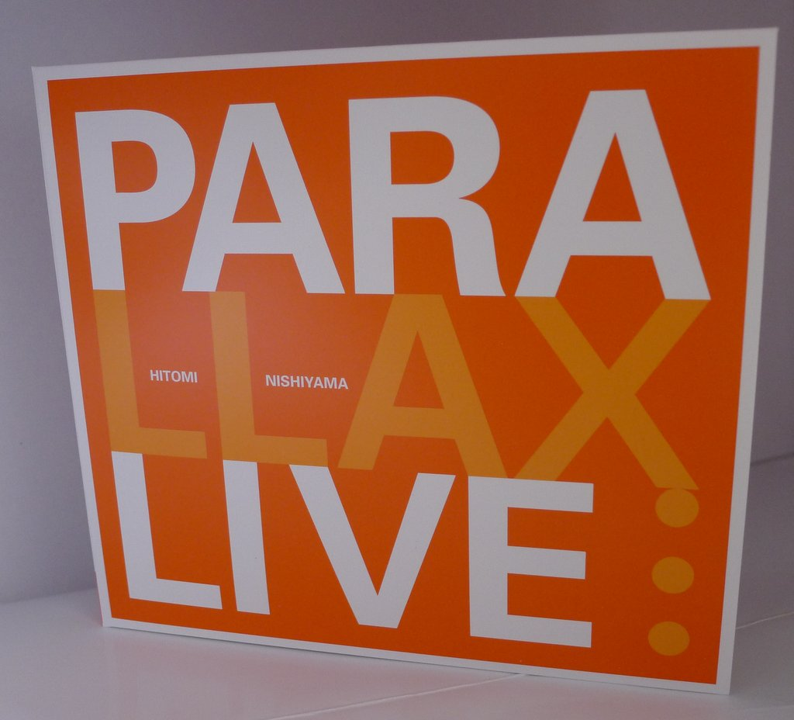
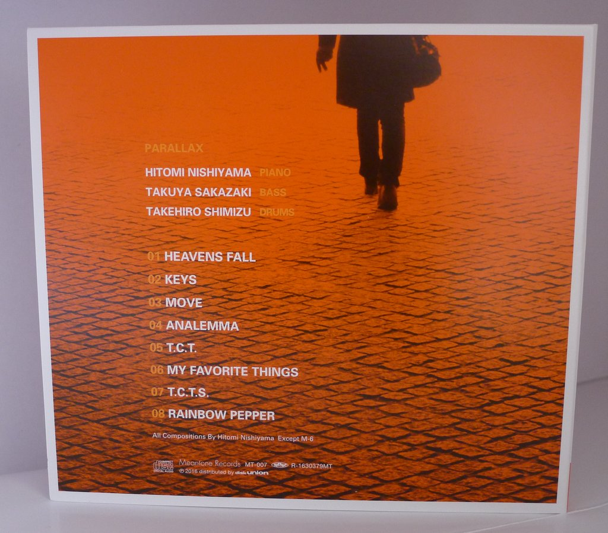
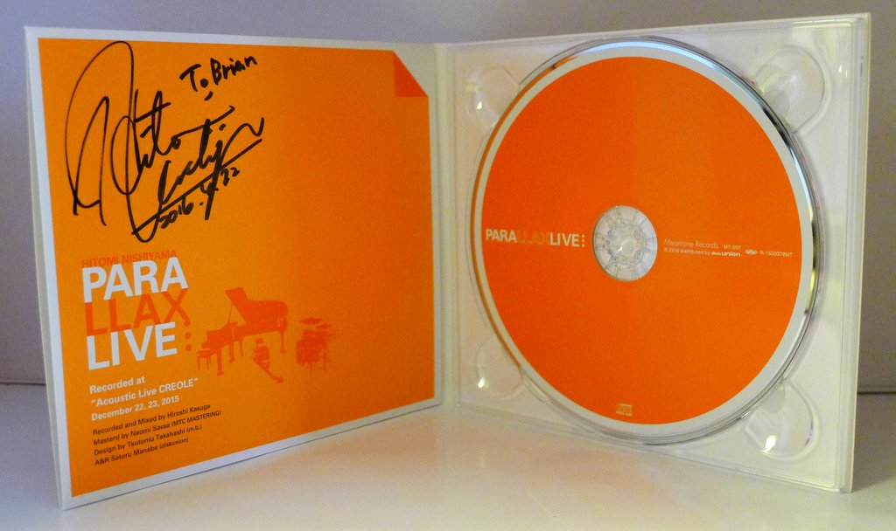
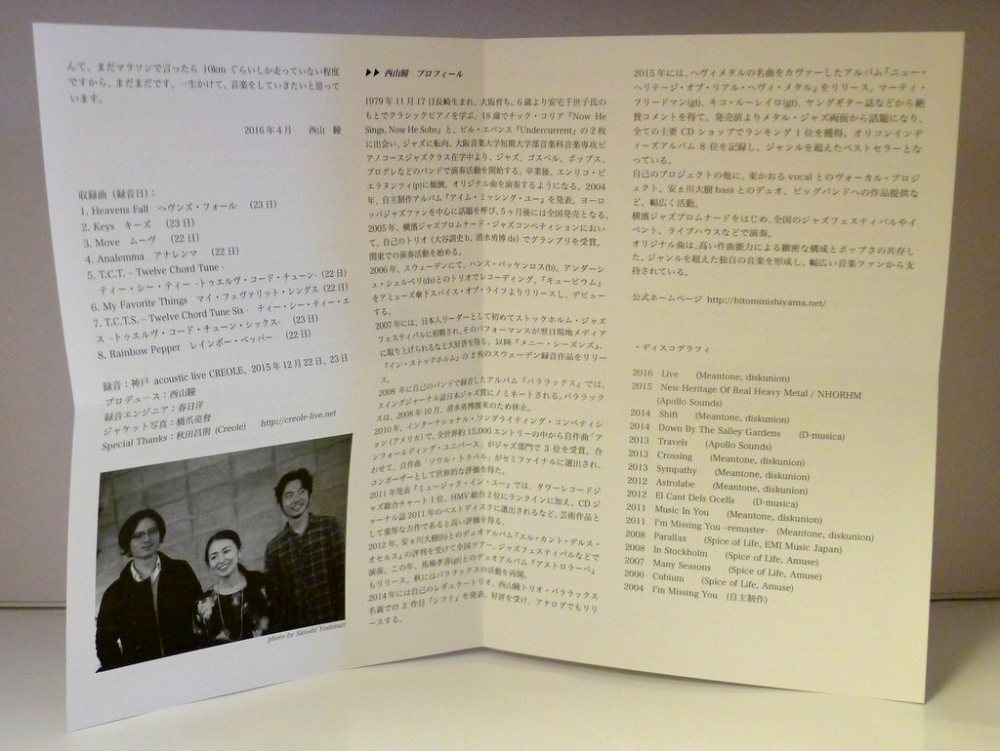

+++
title = "Hitomi Nishiyama Trio “Parallax”: Live"
author = ["Brian McCrory"]
publishDate = 2018-04-06
tags = ["Hitomi Nishiyama 西山瞳", "Takuya Sakazaki 坂崎拓也", "Takehiro Shimizu 清水勇博"]
categories = ["albums"]
draft = false
[cover]
  image = "hitominishiyama-parallax-live-460.jpeg"
  relative = true
+++

This 2016 album simply entitled _Live_ from Hitomi Nishiyama’s Parallax piano trio marks 10 years since her label debut _Cubium_ in 2006. With various projects and albums released under her name, this is the third release for her Parallax group, an edgier, groovier, and rhythmically-energized jazz piano trio.

Recorded live over two nights at the Creole jazz bar in Kobe, the eight songs feature her original compositions plus a rearranged “My Favorite Things”, with a new pulse and layers added to the popular standard.

As always, Nishiyama’s music is graced with a flowing elegance and creativity, displaying elements of European jazz with a searching, driving melodic sense. The listener is treated to odd time signatures, up-tempo jazz, elegiac ballads, some soul and rock structures, all framed in an in-the-moment live jazz setting.

As complex as the compositions may be, the recorded-live aspect brings tangible energy with a raw edge to the extended songs, and also shines a spotlight on the trio’s cohesiveness and ability to respond to each other in the moment, making music as a unit, three minds in parallel.

## Live by Hitomi Nishiyama Trio “Parallax” {#live-by-hitomi-nishiyama-trio-parallax}

-   [Hitomi Nishiyama](https://hitominishiyama.net/) - piano
-   [Takuya Sakazaki](https://jazzshiryokan.net/jazzDB/musician_detail.php?serialNumber=1791) - bass
-   [Takehiro Shimizu](https://www.mindbodyunison.com/) - drums

Released in 2016 on Meantone Records as MT-007.

_Japanese names: 西山瞳 Nishiyama Hitomi 坂崎拓也 Sakazaki Takuya 清水勇博 Shimizu Takehiro_

## Audio and Video {#audio-and-video}

-   [Promotional video featuring the first two tracks, “Heavens Fall” and “Keys”:](https://youtu.be/zQPD6kEigIA)



-   Excerpt from track #3: “Move” [mix #2](https://www.jazzofjapan.com/archive/audio/#mix-2)


