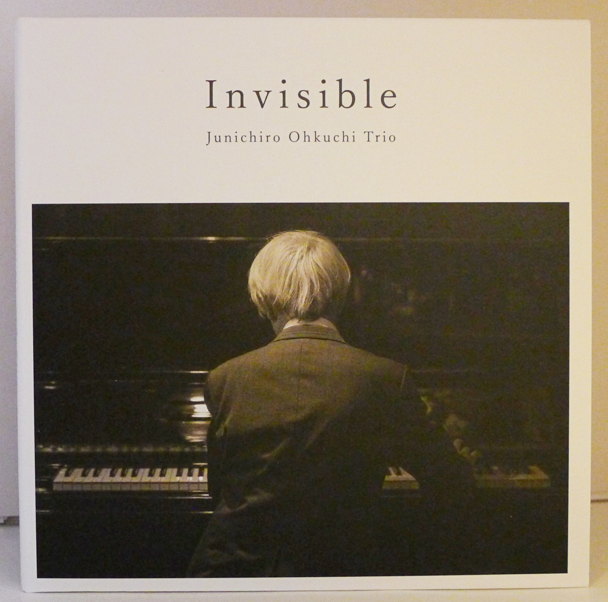
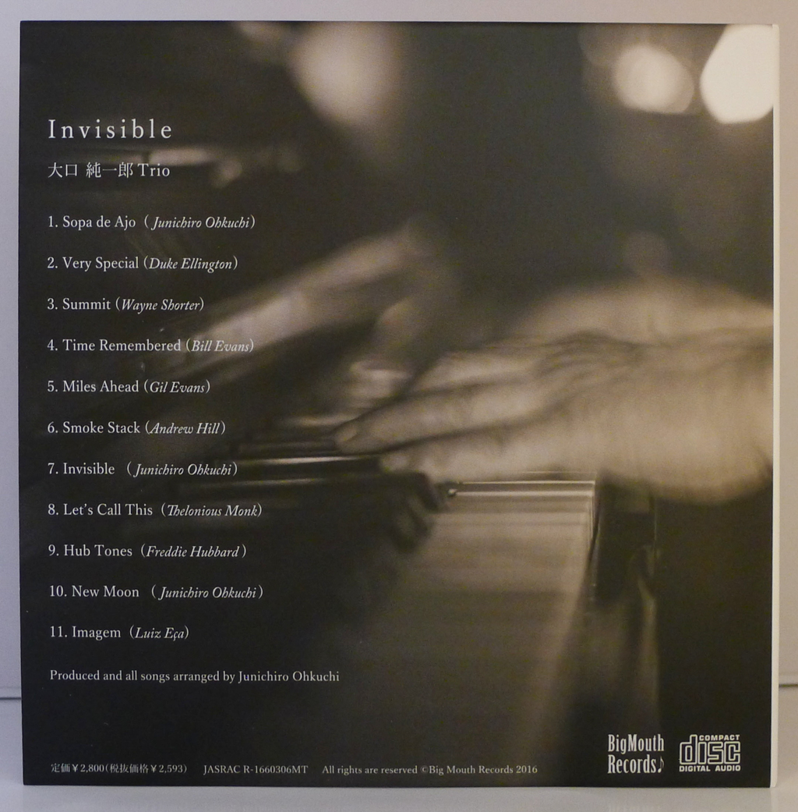
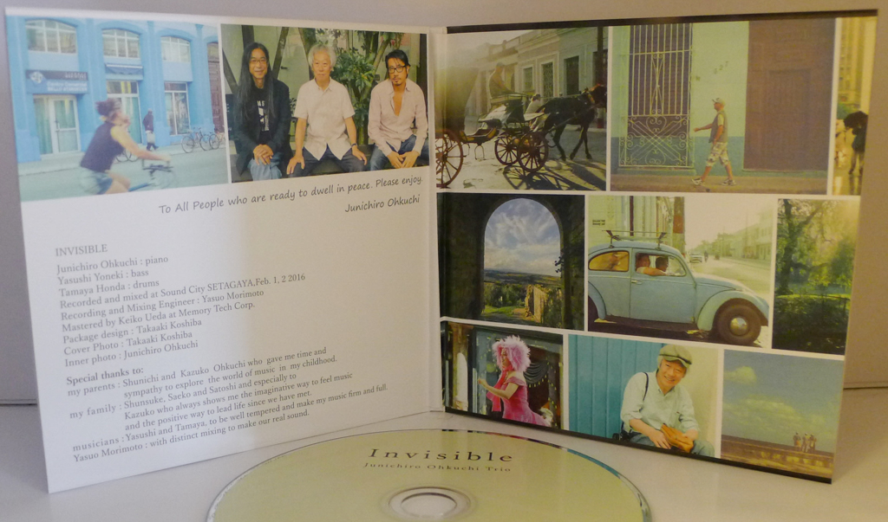
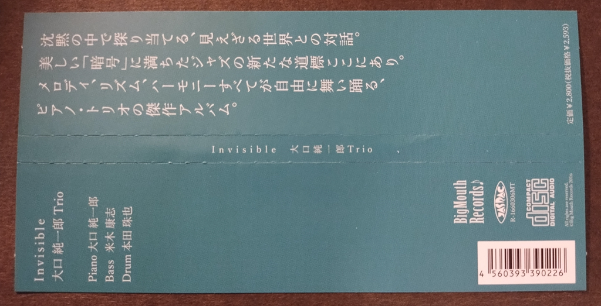

+++
title = "Junichiro Ohkuchi Trio: Invisible"
author = ["Brian McCrory"]
publishDate = 2018-02-13
keywords = ["kohsuke-mine-quintet-major-to-minor", "yuka-ueda-dois", "yuko-miyawaki-song-of-flower"]
tags = ["Junichiro Ohkuchi 大口純一郎", "Yasushi Yoneki 米木康志", "Tamaya Honda 本田珠也"]
categories = ["albums"]
draft = false
[cover]
  image = "junichiroohkuchi-invisible-460.jpeg"
  relative = true
+++

Accomplished pianist Junichiro Ohkuchi leads a trio of solid veterans in the straight-ahead jazz tradition on his 2016 album _Invisible_. The trio works well together, demonstrating the equal partnership and careful intercommunication that occurs between professional jazz musicians. Evident throughout is a confident sense of risky looseness, with complete control of timing and notes, each member supporting and energizing one another.

The pianist Ohkuchi contributes three original songs (the opener is a highlight) with other tunes by Andrew Hill, Bill Evans, Thelonious Monk, Duke Ellington, and others – undoubtedly influences on Ohkuchi’s piano style. The result is a skilled piano trio having a great time making high-caliber jazz.

## Invisible by Junichiro Ohkuchi Trio {#invisible-by-junichiro-ohkuchi-trio}

-   [Junichiro Ohkuchi](https://pianistjohkuchi.blogspot.com/) - piano
-   Yasushi Yoneki - bass
-   [Tamaya Honda](http://tamayahonda.blogspot.com/) - drums

Released in 2016 on Big Mouth Records as Invisible.

_Japanese names: 大口純一郎 Ohkuchi Junichiro 米木康志 Yoneki Yasushi 本田珠也 Honda Tamaya_

## Audio and Video {#audio-and-video}

-   [Live video of the Junichiro Ohkuchi trio in 2021:](https://youtu.be/P0qRWH6fJ2Y)



-   [Live video from 2008:](https://youtu.be/yfDZiKgt6Jg)



-   Excerpt from track #1: “Sopa de Ajo” [mix #1](https://www.jazzofjapan.com/archive/audio/#mix-1)


