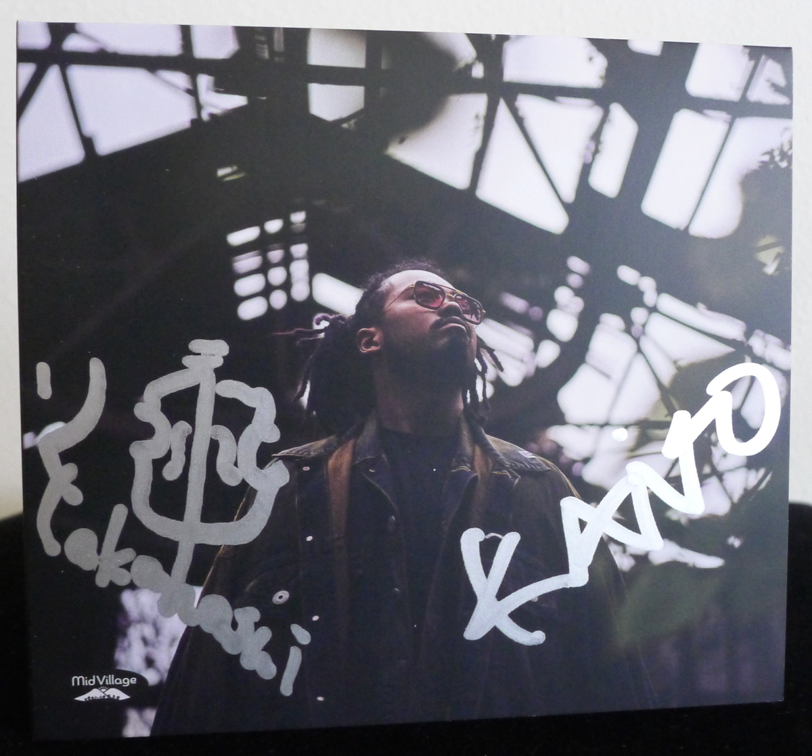
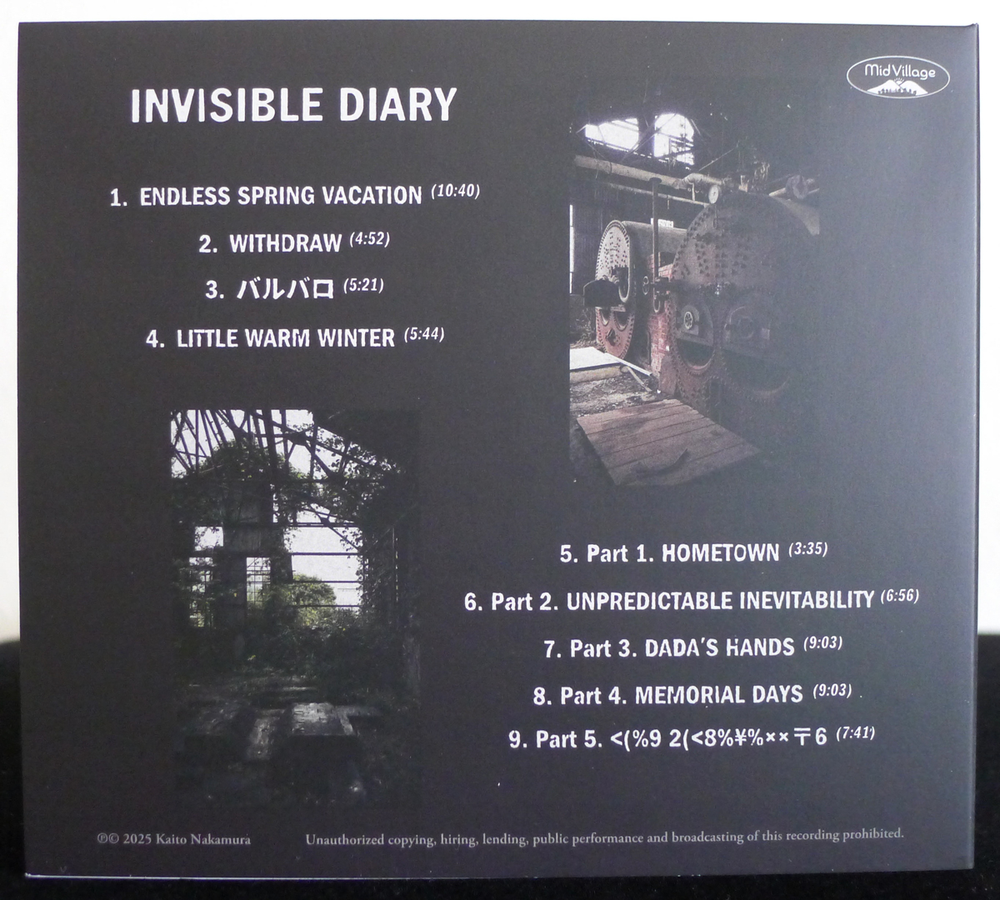
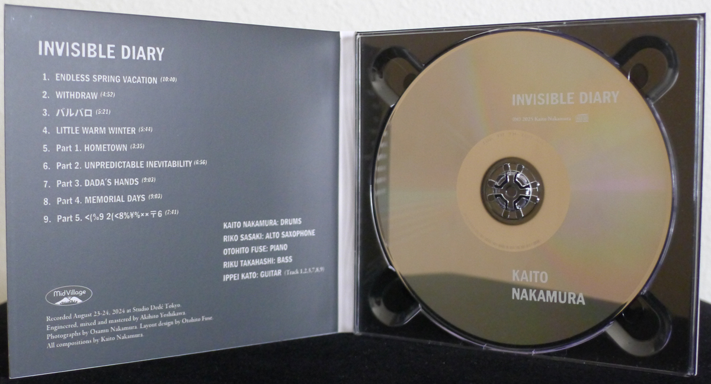

+++
title = "Kaito Nakamura: Invisible Diary"
author = ["Brian McCrory"]
publishDate = 2025-04-19
keywords = ["mamoru-ishida-afterglow", "otohito-fuse-trio-isolated"]
tags = ["Kaito Nakamura 中村海斗", "Riko Sasaki 佐々木梨子", "Otohito Fuse 布施音人", "Riku Takahashi 高橋陸", "Ippei Kato 加藤一平"]
categories = ["albums"]
draft = false
[cover]
  image = "kaito-nakamura-invisible-diary-460.jpeg"
  relative = true
+++

_Invisible Diary_, released in March 2025, is the latest release from drummer Kaito Nakamura. On this sixty-three minute, nine-track album, Nakamura plays with his regular quartet of Riko Sasaki on saxophone, Otohito Fuse on piano, and Riku Takahashi on bass, and adds guitarist Ippei Kato on six songs. The trio of pianist Fuse, bassist Takahashi, and drummer Nakamura also played on Fuse’s album debut _[Isolated](https://www.jazzofjapan.com/archive/otohito-fuse-trio-isolated)_ from last year.

This album is a follow-up to Nakamura’s first album _Blaque Dawn_ from 2022. In contrast to his debut record, _Invisible Diary_ is entirely self-produced by Nakamura and released on his own label, a move that allowed him the freedom to imagine and direct the project entirely as he saw fit. Although Nakamura does not give away too many details, the songs on this release are meant to tell one conceptual story, and the listener is invited to form their own interpretations. The songs are all original compositions by drummer Nakamura.

The song titles, or the chapters of the diary, also don’t give away much, such that meanings might be found in the composer’s designs and the musicians’ playing.

The first set of four songs includes some seasonal and descriptive themes: #1 “Endless Spring Vacation”, #2 “Withdraw”, #3 “Barbaro” (バルバロ, likely /untamed wildness /here), and #4 “Little Warm Winter”. These four songs together combine highly intense, dreamily ambient, and straight-ahead platforms.

The second half of the album contains a five-part suite with titles invoking home, sentimental memories, and mysterious fate. The enigmatically-titled last song, “Part 5. &lt;(%9 2(&lt;8%¥%××〒6” may be a section of the diary that is intended to remain obscure, or a playful puzzle for listeners to ponder. However, this orchestrated final track lucidly switches between scenes of placid calm and slightly sinister suspense for a reassuring and satisfying landing.

Throughout the album, this new music can be both edgily exciting and serene, creating contrasts and arcs in the story. From the first track, a stage is set for modern straight swing jazz with complicated structures, challenging at first, and seemingly bursting with the busy impatience of wild, youthful ambition. But the chaos is controlled masterfully by Nakamura’s confident drumming and neatly planned compositions. The slower songs are atmospheric with simple, memorable melodies that resurface between and within the soloists’ improvisations. This highlights how Nakamura’s themes are important parts of his compositions, threaded throughout and not simply brackets for extended jazz solos. In Nakamura’s music (such as the last track which leaves out individual improvisational sections), playing the composition, following the score, and employing the theme is as important as jazz conventions and adlibbing. It’s good, thought-out music, fun and engaging, alternately stimulating and reflective.

With no liner notes to explain the music, the songs speak for themselves. It’s an _Invisible Diary_ after all. The playing is powerful and the skill and ambition of the youthful group members are clear. Yet, their control over the sometimes frenzied, sometimes patient, musical passages can be seen in their group cohesion. Most of all, the diary reveals the results of Nakamura’s mindset and his group’s appreciation of the beauty of music and the strength of their collaborations, all to a modern jazz fan’s delight.



## Invisible Diary by Kaito Nakamura {#invisible-diary-by-kaito-nakamura}

-   [Kaito Nakamura](https://www.instagram.com/kaito_nkmr_d/) - drums
-   [Riko Sasaki](https://www.instagram.com/riko__sasaki/) - alto saxophone
-   [Otohito Fuse](https://otohitofuse.com/) - piano
-   [Riku Takahashi](http://rikubass.com/) - bass
-   [Ippei Kato](https://ippeih3.exblog.jp/) - guitar (#1, 2, 3, 7, 8, 9)

Released in 2025 on MidVillage as MV-001.

_Japanese names: 中村海斗 Nakamura Kaito 佐々木梨子 Sasaki Riko 布施音人 Fuse Otohito 高橋陸 Takahashi Riku 加藤一平 Kato Ippei_

## Audio and Video {#audio-and-video}

-   [Audio for “Endless Spring Vacation”, track #1 on this album:](https://youtu.be/BFIU6qem0DE)



-   [Live performance of “Part 1. Hometown”, track #8 on this album:](https://youtu.be/KPb9SzMbvIQ)



-   [Live performance of “Part 3. Dada’s Hands”, track #7 on this album:](https://youtu.be/bNlPJ1ouaxg)



-   [Live performance of “Part 4. Memorial Days”, track #8 on this album:](https://youtu.be/sbUJ7Y4b1vE)



-   [Full album playlist (Spotify)](https://open.spotify.com/album/3IzqWngysRH0gUHR2FKkxh)

-   [Full album playlist (YouTube)](https://youtube.com/playlist?list=OLAK5uy_lbhg1TDcVn4dTjRn299Fo03m2-Qrw6DyM)

-   Excerpt from track #3: “バルバロ (_Barbaro_)” [mix #13](https://www.jazzofjapan.com/archive/audio/#mix-13)


