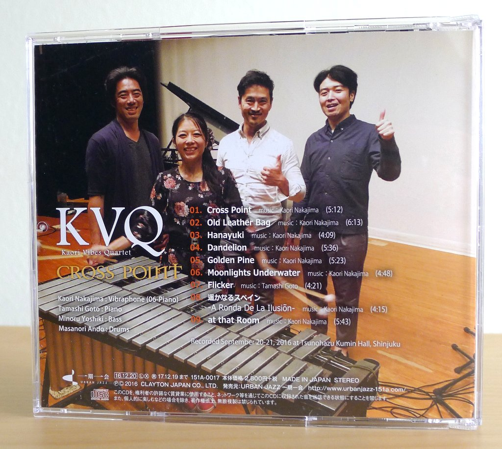
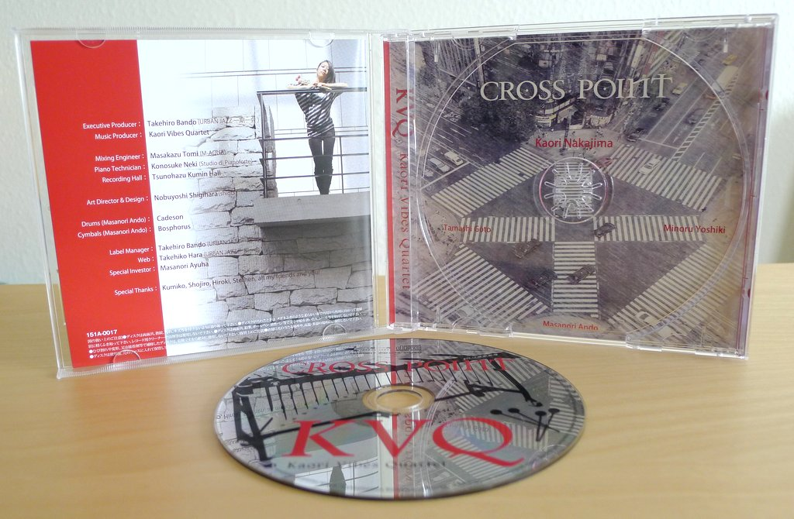
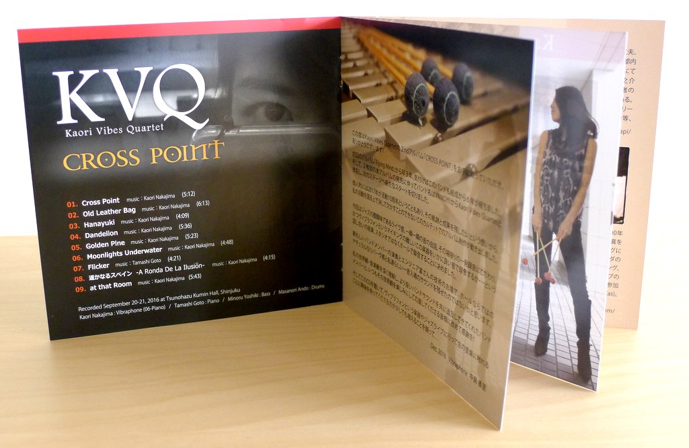

+++
title = "Kaori Vibes Quartet: Cross Point"
author = ["Brian McCrory"]
publishDate = 2018-03-23
tags = ["Kaori Nakajima 中島香里", "Tamashi Goto 後藤魂", "Minoru Yoshiki 吉木稔", "Masanori Ando 安藤正則"]
categories = ["albums"]
draft = false
[cover]
  image = "kaorivibesquartet-crosspoint-460.jpeg"
  relative = true
+++

Vibist Kaori Nakajima returns with her second album _Cross Point_ featuring KVQ: Kaori Vibes Quartet (formerly Vangy!!), a jubilant combo with jazz vibraphone springing out mellow tones at the center.

Starting with the high-energy “Cross Point”, the quartet explores directions from straight-ahead jazz and relaxed swing to quiet ballads and Spanish-tinged rubato. With skilled playing and engaging compositions, highlights include the pop-catchy “Dandelion”, the edgy “Flicker”, a nod to Horace Silver and Cedar Walton on “Golden Pine”, and the soft atmospheric reverb of “Moonlights Underwater”, summoning undulating waves in the comfort of twilight.

## Cross Point by Kaori Vibes Quartet {#cross-point-by-kaori-vibes-quartet}

-   [Kaori Nakajima](https://qqvibnkaoripp.wixsite.com/jazz-vibist-kaori-na) - vibraphone
-   [Tamashi Goto](https://ameblo.jp/jazzsoul-tamapi/) - piano
-   [Minoru Yoshiki](https://yoshikiminoru.com/) - bass
-   [Masanori Ando](http://www.andomasanori.com/) - drums

Released in 2016 on Urban Jazz as 151A-0017.

_Japanese names: 中島香里 Nakajima Kaori 後藤魂 Goto Tamashi 吉木稔 Yoshiki Minoru 安藤正則 Ando Masanori_

## Audio and Video {#audio-and-video}

-   [Kaori Nakajima plays “At That Room”, the final song on this album:](https://youtu.be/Tvni2-L10GM)



-   Excerpt from track #1: “Cross Point” [mix #2](https://www.jazzofjapan.com/archive/audio/#mix-2)


