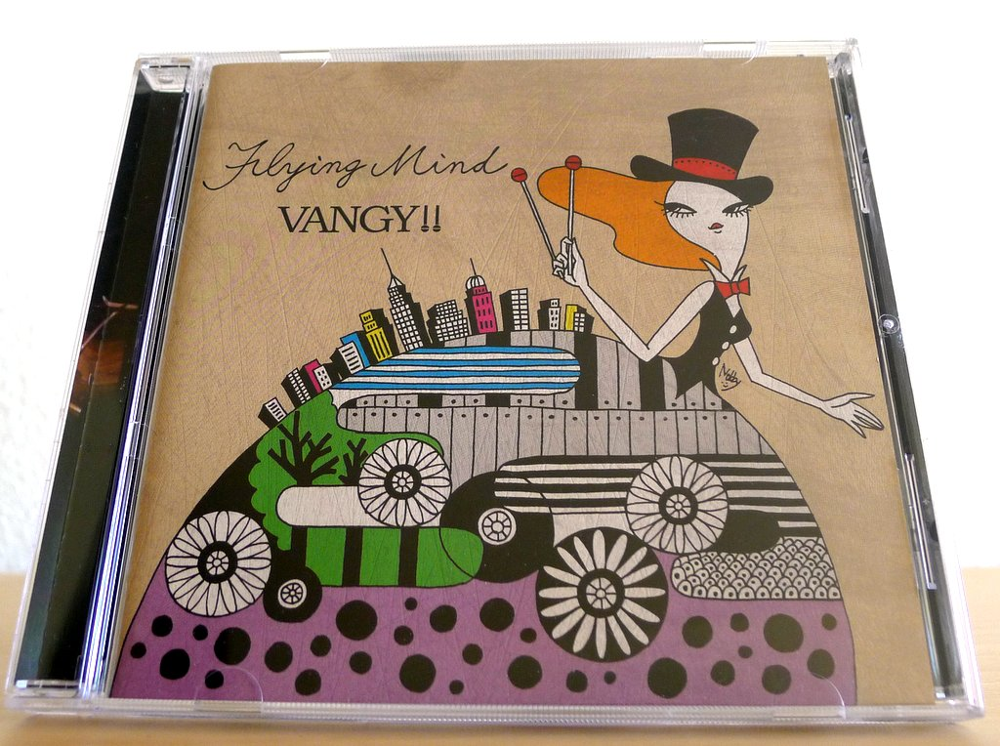
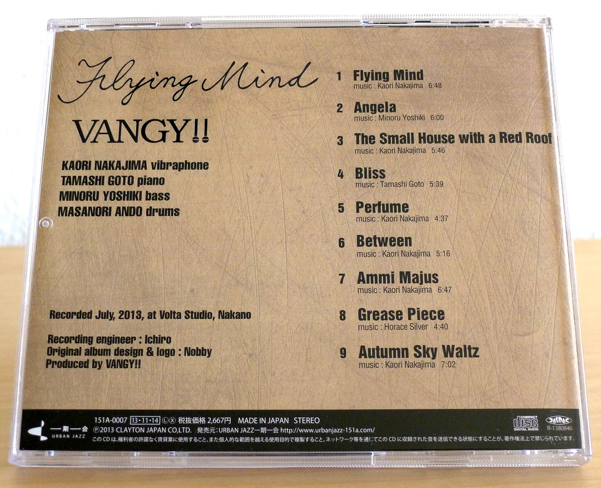
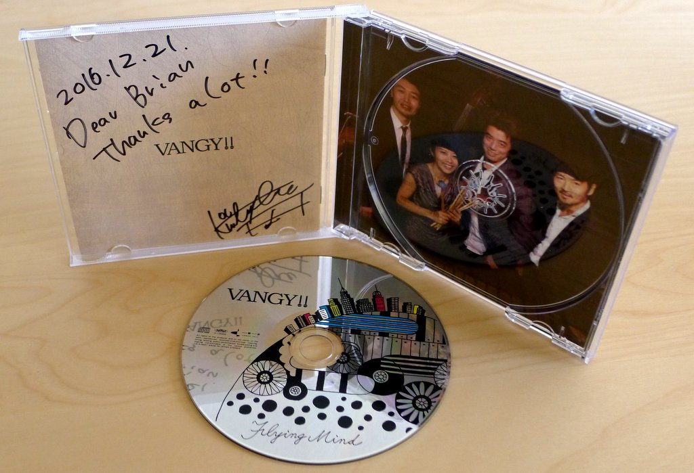
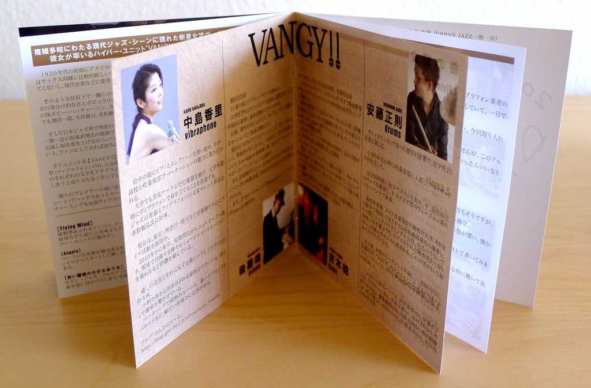

+++
title = "Kaori Vibes Quartet: Flying Mind"
author = ["Brian McCrory"]
publishDate = 2018-02-03
tags = ["Kaori Nakajima", "中島香里", "Tamashi Goto", "後藤魂", "Minoru Yoshiki", "吉木稔", "Masanori Ando", "安藤正則"]
categories = ["albums"]
draft = false
[cover]
  image = "kaorinakajima-flyingmind-460.jpeg"
  relative = true
+++

Kaori Vibes Quartet is a jazz quartet centered around the lovely ringing bell-tones of jazz vibraphone. After three years of playing together, the group formerly known as Vangy!! (note the vibraphone mallets “!!” in the name) released their eagerly awaited debut album _Flying Mind_ in 2013, much to fans’ delight.

The magically mellow yet bright sounds of the vibraphone fill the tracks of this album, bouncing through songs swinging with positivity and charm, creating relaxing, feel-good music. The compositions include foot-tapping modern jazz tunes, two pretty ballads, a soulful groovy number, and a speedy rendition of “Grease Piece” by Horace Silver – a rewarding effort for all fans of jazz vibraphone.

## Flying Mind by Kaori Vibes Quartet {#flying-mind-by-kaori-vibes-quartet}

-   [Kaori Nakajima](/tags/kaori-nakajima) - vibraphone
-   [Tamashi Goto](/tags/tamashi-goto) - piano
-   [Minoru Yoshiki](/tags/minoru-yoshiki) - bass
-   [Masanori Ando](/tags/masanori-ando) - drums

Released in 2013 on Urban Jazz as 151A-0007.

_Japanese names: 中島香里 Nakajima Kaori 後藤魂 Goto Tamashi 吉木稔 Yoshiki Minoru 安藤正則 Ando Masanori_

## Audio and Video {#audio-and-video}

-   [The song “Perfume” performed as a duo from 2015:](https://youtu.be/LKmSesjiEBQ)



-   Excerpt from track #1: “Flying Mind” [mix #1](https://www.jazzofjapan.com/archive/audio/#mix-1)


