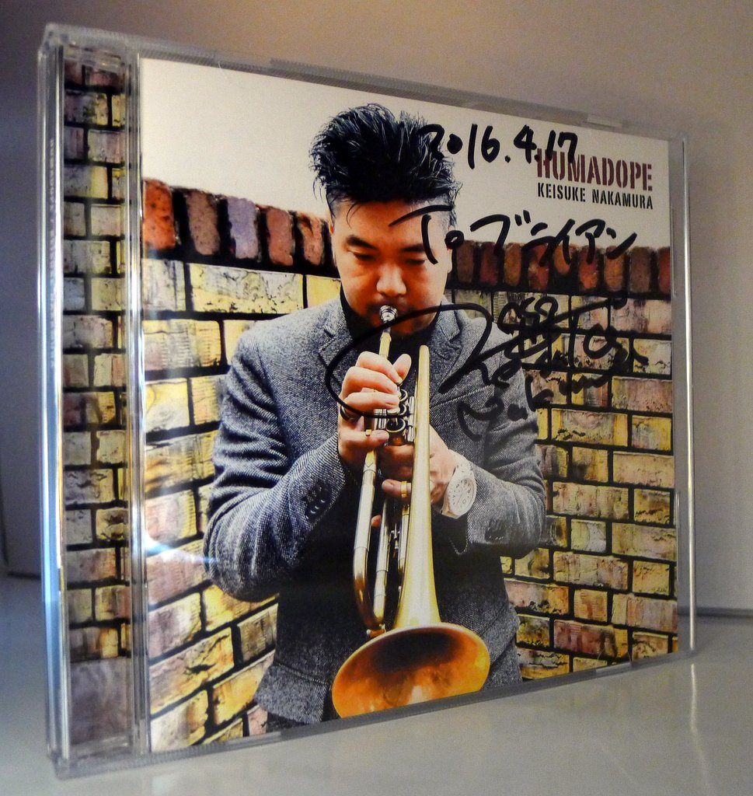
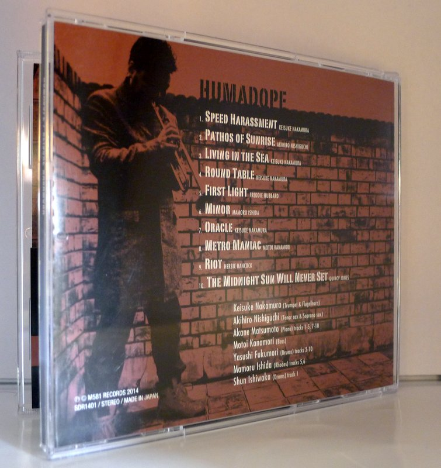
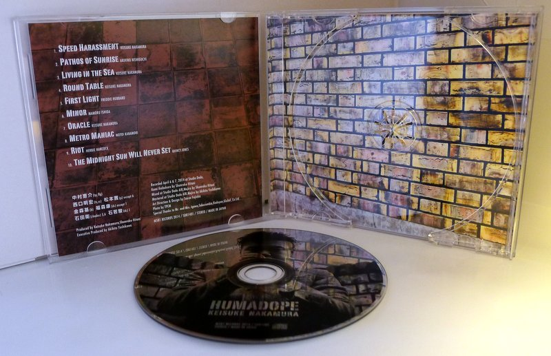

+++
title = "Keisuke Nakamura: Humadope"
author = ["Brian McCrory"]
publishDate = 2018-02-12
tags = ["Keisuke Nakamura", "中村恵介", "Akihiro Nishiguchi", "西口明宏", "Akane Matsumoto", "松本茜", "Motoi Kanamori", "金森もとい", "Yasushi Fukumori", "福森康", "Mamoru Ishida", "石田衛", "Shun Ishiwaka", "石若駿"]
categories = ["albums"]
draft = false
aliases = ["/archive/keisuke-nakamura-humadope/", "/p/keisuke-nakamura-humadope/"]
[cover]
  image = "keisukenakamura-humadope-460.jpeg"
  caption = ""
  relative = true
+++

Trumpeter Keisuke Nakamura leads a group of contemporary jazz musicians called _Humadope_, a post-bop Jazz Messengers-styled quintet with a trumpet-sax front line and piano-bass-drums rhythm section. The name itself (a mix of human/mad/dope) suggests a dangerous edge on blisteringly fast tunes as the skilled soloists riotously burn through the changes. Yet, the group handily balances this attitude with a warm sensitivity played on soulful ballads and cooler numbers.

This album consists of well-written original compositions with a few covers thrown in (Freddie Hubbard, Herbie Hancock, Quincy Jones). Overall, this is an excellent debut with a variety of moods, tempos, and exciting solos showcasing some premium J Jazz from the current crop of musicians.

## Humadope by Keisuke Nakamura {#humadope-by-keisuke-nakamura}

-   [Keisuke Nakamura](/tags/keisuke-nakamura) - trumpet, flugelhorn
-   [Akihiro Nishiguchi](/tags/akihiro-nishiguchi) - tenor sax, soprano sax
-   [Akane Matsumoto](/tags/akane-matsumoto) - piano
-   [Motoi Kanamori](/tags/motoi-kanamori) - bass
-   [Yasushi Fukumori](/tags/yasushi-fukumori) - drums
-   [Mamoru Ishida](/tags/mamoru-ishida) - Rhodes (tr. #5, 6)
-   [Shun Ishiwaka](/tags/shun-ishiwaka) - drums (tr. #1)

Released in 2014 on M581 Records as SDR1401.

_Japanese names: 中村恵介 Nakamura Keisuke 西口明宏 Nishiguchi Akihiro 松本茜 Matsumoto Akane 金森もとい Kanamori Motoi 福森康 Fukumori Yasushi 石田衛 Ishida Mamoru 石若駿 Ishiwaka Shun_

## Audio and Video {#audio-and-video}

-   [Live performance of track #4 “Round Table”:](https://youtu.be/T5bm8CoSgVY)



-   Excerpt from track #1: “SPEED HARASSMENT” [mix #1](https://www.jazzofjapan.com/archive/audio/#mix-1)


