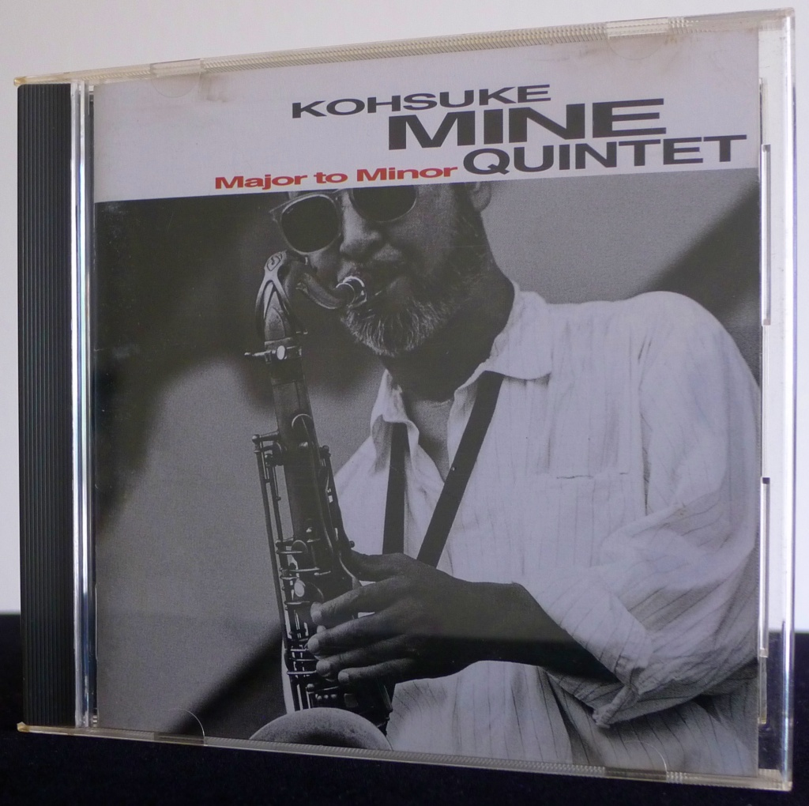
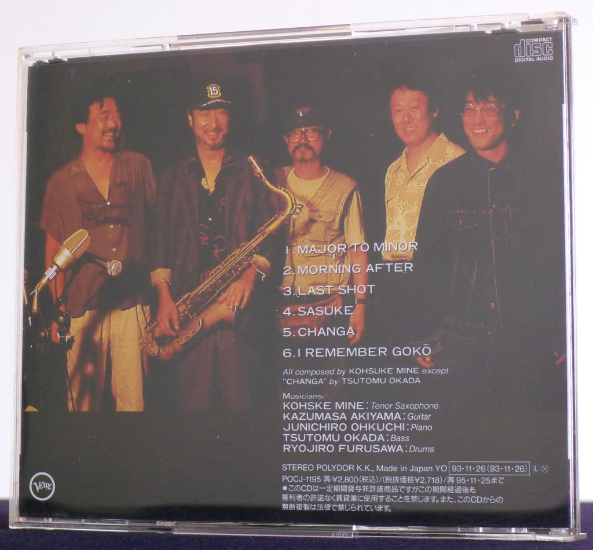
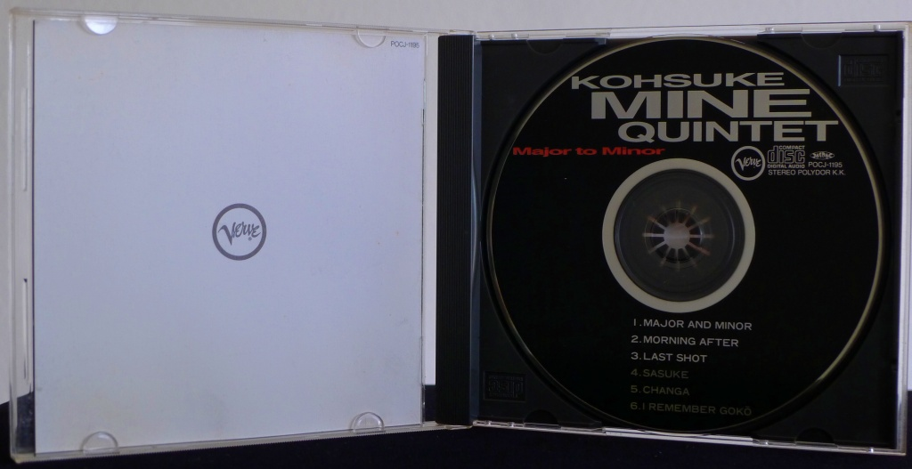
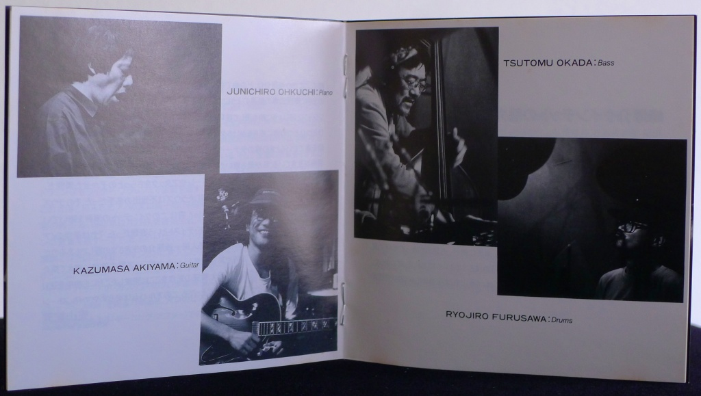

+++
title = "Kohsuke Mine Quintet: Major to Minor"
author = ["Brian McCrory"]
publishDate = 2020-08-19
tags = ["Kosuke Mine", "峰厚介", "Kazumasa Akiyama", "秋山一将", "Junichiro Ohkuchi", "大口純一郎", "Tsutomu Okada", "岡田勉", "Ryojiro Furusawa", "古澤良治郎"]
categories = ["albums"]
draft = false
aliases = ["/archive/kohsuke-mine-quintet-major-to-minor/", "/p/kohsuke-mine-quintet-major-to-minor/"]
[cover]
  image = "kohsukemine-major-460.jpeg"
  caption = ""
  relative = true
+++

Kohsuke Mine Quintet’s 1993 album _Major to Minor_ is full of life, a straight-ahead jazz outing built upon solid group unity and stimulating jazz improvisation.

Mine is a living legend who started young, releasing his first album in 1970 to immediate acclaim. He cut his jazz teeth with many well-known musicians, including Joe Henderson, Mal Waldron, Sadao Watanabe, Terumasa Hino… the list is long. For a period, he was a long-time member of the fusion jazz group Native Son, after which he returned to leading his own straight-ahead groups, touring, recording, and lighting up the jazz scene in Japan and abroad.

This album marks Mine’s return to releasing albums under his own name after participating in jazz in New York and Tokyo and his years with Native Sun. The tracks were performed with fellow Tokyo musicians at the popular Body And Soul club in 1993. The album is also noted as a transition from a fusion jazz focus to a more straight-ahead style, being likened to moving from a Wayne Shorter “Weather Report” approach to Sonny Rollins’s rhythmic bop style. In any case, Mine’s playing is top-notch and expressively original, with fluid horn flights that are stunning and exciting, soulful and jaunty.

The album’s six tracks are all originals played live, united with the raw energy of the audience. Mine’s originals are well-built frameworks, addictive grooves with enough space for the soloists to stretch and fly.

The solid swing jazz on “Major to Minor” kicks off with deep color and edge, continuing with the weighty bluesiness of “Morning After”, pulsing adrenalin of “Last Shot”, the deeply resonant ballad “Sasuke”, and the ballad-to-midtempo-walking chimera of deep jazz attitude. “Changa”, an original tune offered by bassist Tsutomu Okada, is another highlight of high-energy expression, a slow-building tidal wave of churning sound and risk-taking solos like high-wire acts over rumbling bass roots.

Throughout, the group hangs together tightly, flexible enough to decorate each other’s textures with responses and well-timed splashes of color, the rhythmic cohesion warranting as much attention as the expert improvisations.

This album received the 1993 Japan Jazz Disc Award.



## Major to Minor by Kohsuke Mine Quintet {#major-to-minor-by-kohsuke-mine-quintet}

-   [Kosuke Mine](/tags/kosuke-mine) - tenor saxophone
-   [Kazumasa Akiyama](/tags/kazumasa-akiyama) - guitar
-   [Junichiro Ohkuchi](/tags/junichiro-ohkuchi) - piano
-   [Tsutomu Okada](/tags/tsutomu-okada) - bass
-   [Ryojiro Furusawa](/tags/ryojiro-furusawa) - drums

Released in 1993 on Verve Records as POCJ-1195.

_Japanese names: 峰厚介 Mine Kosuke 秋山一将 Akiyama Kazumasa 大口純一郎 Ohkuchi Junichiro 岡田勉 Okada Tsutomu 古澤良治郎 Furusawa Ryojiro_

## Audio and Video {#audio-and-video}

-   [Kohsuke Mine performing “Blue Plum” live:](https://youtu.be/3wQtfncwoSg)



-   [Kohsuke Mine performing “Seymour” live:](https://youtu.be/mcOFpNauLDs)



-   Excerpt from track #1: “Major to Minor” [mix #7](https://www.jazzofjapan.com/archive/audio/#mix-7)


