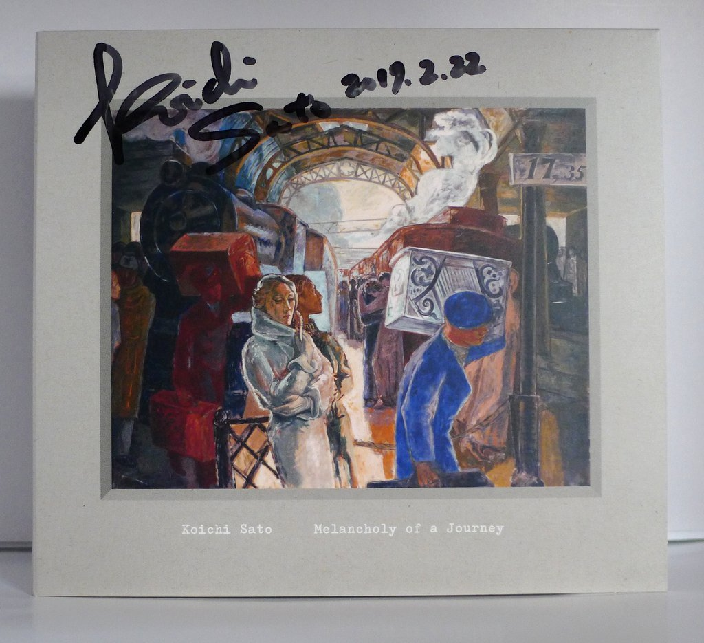
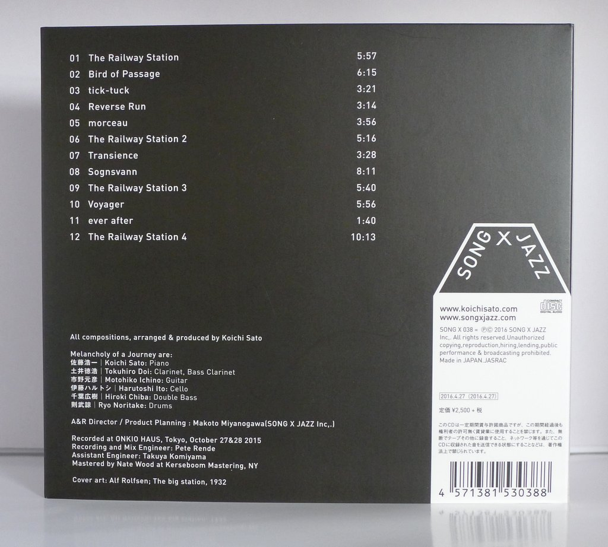
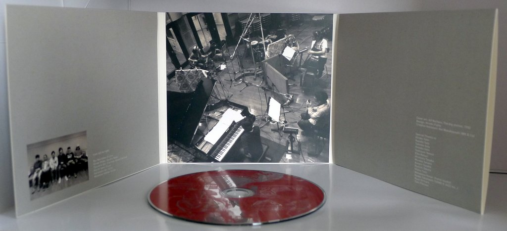
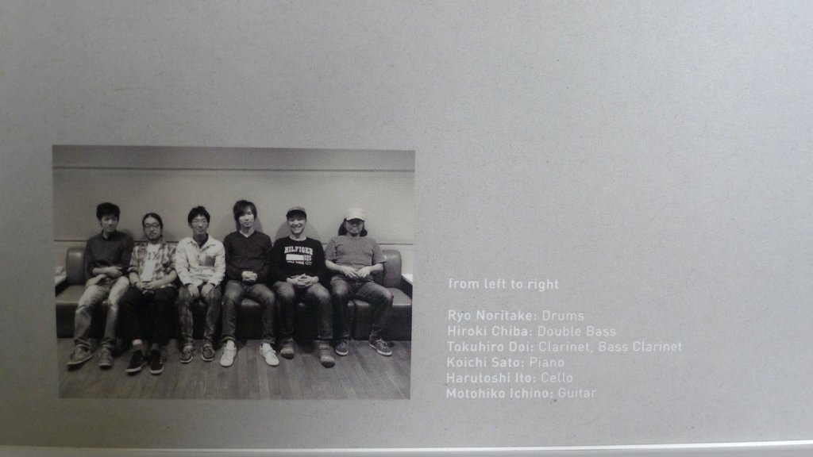

+++
title = "Koichi Sato: Melancholy of a Journey"
author = ["Brian McCrory"]
publishDate = 2018-02-20
tags = ["Koichi Sato 佐藤浩一", "Tokuhiro Doi 土井徳浩", "Motohiko Ichino 市野元彦", "Harutoshi Ito 伊藤ハルトシ", "Hiroki Chiba 千葉広樹", "Ryo Noritake 則武諒"]
categories = ["albums"]
draft = false
[cover]
  image = "koichisato-melancholy-460.jpeg"
  relative = true
+++

Pianist and composer Koichi Sato’s 2016 release _Melancholy of a Journey_ features a distinctive jazz sextet: a piano trio adding clarinet and guitar for modern groundedness and cello providing graceful maturity.

Sato conceived the main theme while traveling in Norway and viewing a certain painting. The work of art, Art Rolfsen’s “The Big Station”, graces the cover and inspired “The Railway Station”, a four-part suite arranged over four tracks. This music emerges and recedes through tracks #1, 6, 9, and 12, resulting in four distinct songs with common echoes.

From this setting and throughout the rest of the album, beautiful music blossoms and inspires scenes of travel. Dramatic compositions with full, earthy sounds create moods spanning excitement, relaxation, hectic impressionism, and, naturally, melancholy. This music embraces emotions that may arise at different times during a long journey, a soundtrack to a trip, a modern work of art.

## Melancholy of a Journey by Koichi Sato {#melancholy-of-a-journey-by-koichi-sato}

-   [Koichi Sato](https://koichisato.com/) - piano
-   [Tokuhiro Doi](https://www.doitoku.com/) - clarinet, bass clarinet
-   [Motohiko Ichino](https://motohikoichino.com/) - guitar
-   [Harutoshi Ito](https://www.itoharutoshi.com) - cello
-   [Hiroki Chiba](https://linktr.ee/Hirokichiba) - double bass
-   [Ryo Noritake](http://www.ryonoritake.com/) - drums

Released in 2016 on Song X Jazz as SONG X 038.

_Japanese names: 佐藤浩一 Sato Koichi 土井徳浩 Doi Tokuhiro 市野元彦 Ichino Motohiko 伊藤ハルトシ Ito Harutoshi 千葉広樹 Chiba Hiroki 則武諒 Noritake Ryo_

## Audio and Video {#audio-and-video}

-   [Audio samples from the CD:](https://youtu.be/HU3XNXucB0Q)



-   Excerpt from track #1: “The Railway Station” [mix #1](https://www.jazzofjapan.com/archive/audio/#mix-1)


