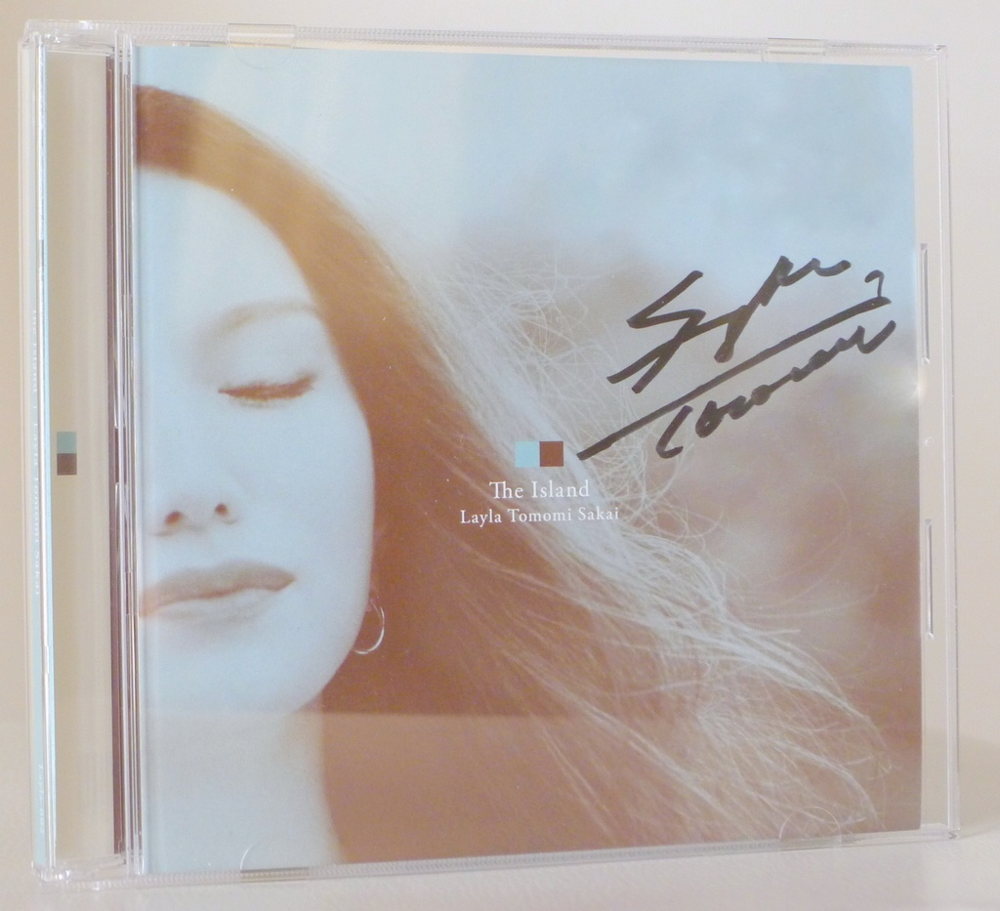
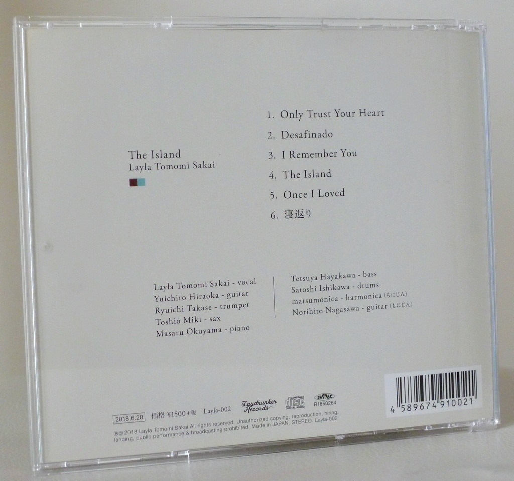
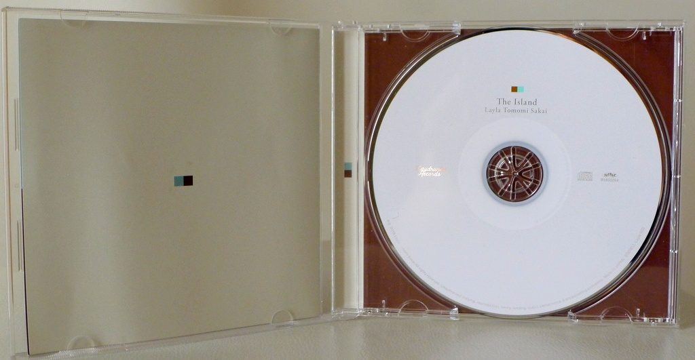
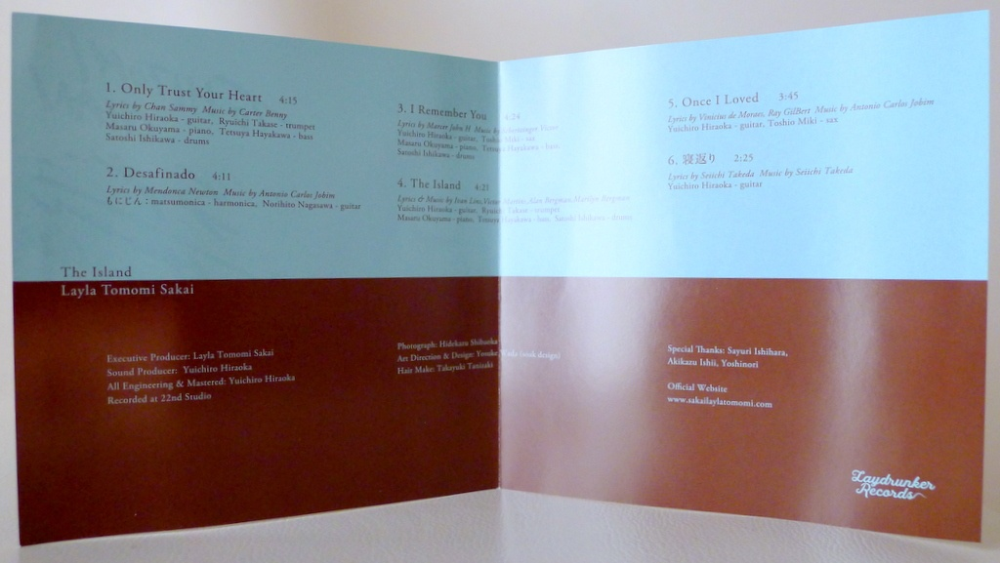

+++
title = "Layla Tomomi Sakai: The Island"
author = ["Brian McCrory"]
publishDate = 2019-07-23
tags = ["Layla Tomomi Sakai 坂井レイラ知美", "Yuichiro Hiraoka 平岡遊一郎", "Ryuichi Takase 高瀬龍一", "Toshio Miki 三木俊雄", "Masaru Okuyama 奥山勝", "Satoshi Ishikawa 石川智", "Matsumonica マツモニカ", "Norihito Nagasawa 長澤紀仁"]
categories = ["albums"]
draft = false
[cover]
  image = "laylatomomisakai-island-460.jpeg"
  relative = true
+++

Easy and breezy, as if dozing in a hammock between palm trees, Layla Tomomi Sakai’s _The Island_ stirs up visions of vacationing and relaxing in sultry lands as music floats softly by.

Sakai’s deep voice embraces the listener, dancing lightly through bossa novas and Latin-tinged music. The music is comforting, the musicians performing pieces that come and go in an uncomplicated manner, lulling the listener into a state of reassuring comfort. Sakai uses her voice gently yet confidently, producing an effect of sweet directness with an affectionate touch.

Suppressing tense energy and favoring intimacy, the album features vocal/guitar duo arrangements in traditional bossa nova fashion, with additional instruments (piano, saxophone, harmonica) sprinkled in lightly. Several songs feature Sakai singing simply with a guitar and one other instrument: Antonio Carlos Jobim’s “Desafinado” and “Once I Loved”, as well as “Negaeri”, a ballad sung in Japanese as a gentle album closer.

While maintaining the calm atmosphere, three songs also feature Sakai singing with a jazz quintet: “Only Trust Your Heart”, “I Remember You”, and “The Island” all feature piano, guitar, horn, bass, and drums, coming together to create a wonderfully pleasant sound, like an island breeze drifting softly by.

## The Island by Layla Tomomi Sakai {#the-island-by-layla-tomomi-sakai}

-   [Layla Tomomi Sakai](https://www.sakailaylatomomi.com/) - vocal
-   [Yuichiro Hiraoka](https://jazzshiryokan.net/jazzDB/musician_detail.php?serialNumber=4205) - guitar (#1, 3, 4, 5, 6)
-   [Ryuichi Takase](https://jazzshiryokan.net/jazzDB/musician_detail.php?serialNumber=1532) - trumpet (#1, 4)
-   [Toshio Miki](http://mikitoshio.com/) - sax (#3, 5)
-   [Masaru Okuyama](http://m-okuyama-home.sakura.ne.jp/) - piano (#1, 3, 4)
-   [Satoshi Ishikawa](https://jazzshiryokan.net/jazzDB/musician_detail.php?serialNumber=2841) - drums (#1, 3, 4)
-   [Matsumonica](http://matsumonica.sblo.jp/) - harmonica (from Momijin) (#2)
-   [Norihito Nagasawa](https://jinjinviolao.seesaa.net/) - guitar (from Momijin) (#2)

Released in 2018 on Laydrunker Records as LAYLA-002.

_Japanese names: 坂井レイラ知美 Sakai Layla Tomomi 平岡遊一郎 Hiraoka Yuichiro 高瀬龍一 Takase Ryuichi 三木俊雄 Miki Toshio 奥山勝 Okuyama Masaru 石川智 Ishikawa Satoshi マツモニカ Matsumonica 長澤紀仁 Nagasawa Norihito_

## Audio and Video {#audio-and-video}

-   [Layla Tomomi Sakai performing live in 2017:](https://youtu.be/xZjA59QRfj8)



-   Excerpt from track #1: “Only Trust Your Heart” [mix #4](https://www.jazzofjapan.com/archive/audio/#mix-4)


