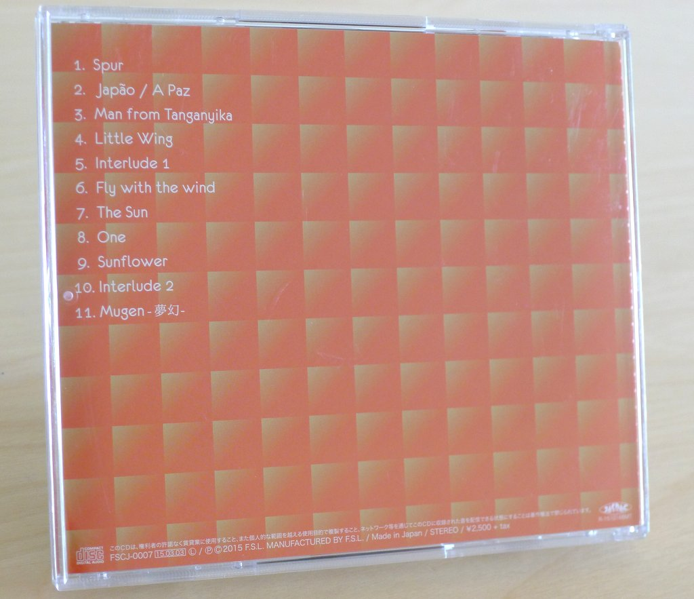
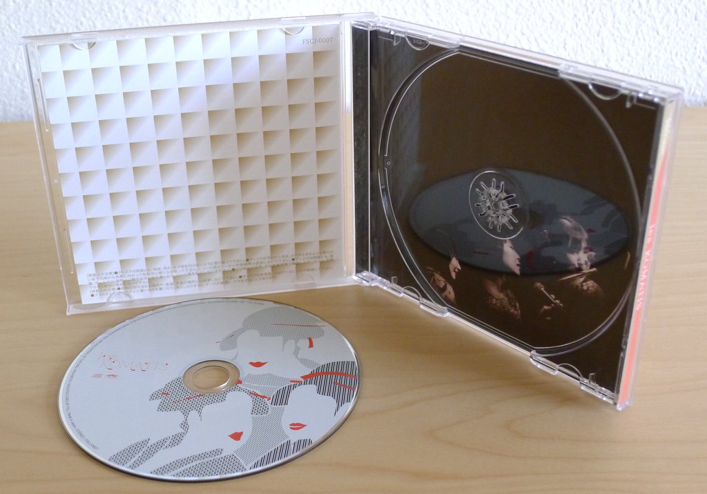
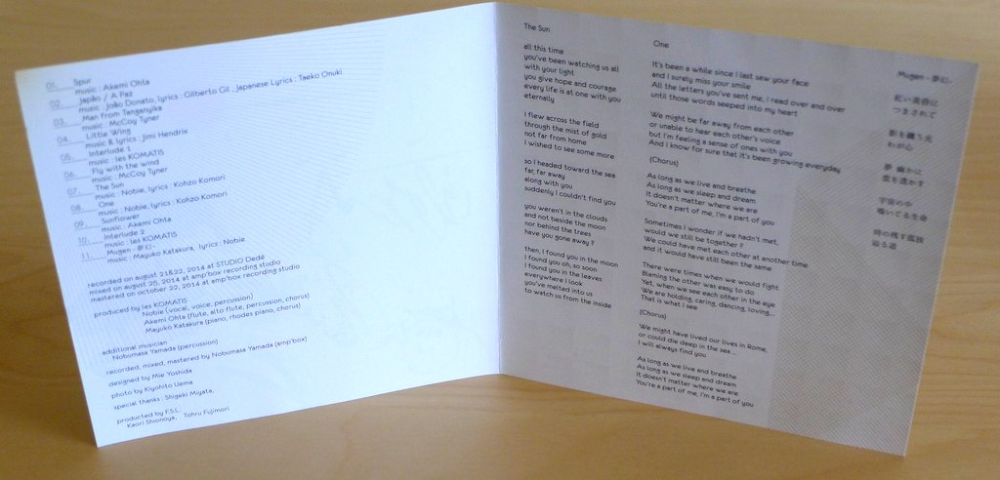

+++
title = "Les Komatis: Les Komatis"
author = ["Brian McCrory"]
publishDate = 2018-03-28
tags = ["Nobie", "ノビー", "Akemi Ohta", "太田朱美", "Mayuko Katakura", "片倉真由子", "Nobumasa Yamada", "山田ノブマサ"]
categories = ["albums"]
draft = false
aliases = ["/archive/les-komatis-les-komatis/", "/p/les-komatis-les-komatis/"]
[cover]
  image = "leskomatis-leskomatis-460.jpeg"
  caption = ""
  relative = true
+++

Three established musicians join up to release Les Komatis, a rich fusion of jazz, pop, and Brazilian influences combined for thrilling and moving music.

Voice, flute, and piano fill the aural landscape, with hand percussion adding a visceral rhythmic pulse. Starting with Akemi Ohta’s “Spur”, darting melodic lines weave over heavy piano riffs and harmonies on several songs, while other songs set up sensitive moods with ballads and bossa. The musicians even layer their voices in chorus at one point (on Jimi Hendrix’s “Little Wing”), permeating listeners with soulful warmth and passion.

Along with songs sung in English, Japanese, and Portuguese, the vocalist Nobie often features her voice as an instrument, wordlessly doubling and counterpointing the tandem flute and piano in complex arrangements and soaring improvisation.

Les Komatis balances jazz, pop, and Latin with the album’s originals, comfortable ballads, catchy interludes, and even two powerhouse McCoy Tyner covers for added energy: “Man From Tanganyika” and “Fly With The Wind”. The set closes with a Zen-like take on the final track, Mayuko Katakura’s deep “Mugen” (with 夢幻 here meaning dreams, visions, fantasy).

## Les Komatis by Les Komatis {#les-komatis-by-les-komatis}

-   [Nobie](/tags/nobie) - vocal, voice, percussion
-   [Akemi Ohta](/tags/akemi-ohta) - flute, alto flute, percussion, chorus
-   [Mayuko Katakura](/tags/mayuko-katakura) - piano, Rhodes piano, chorus
-   [Nobumasa Yamada](/tags/nobumasa-yamada) - percussion

Released in 2015 on F.S.L as FSCJ-0007.

_Japanese names: ノビー Nobie 太田朱美 Ohta Akemi 片倉真由子 Katakura Mayuko 山田ノブマサ Yamada Nobumasa_

## Audio and Video {#audio-and-video}

-   [Audio samples from bowz.shop-pro.jp](http://bowz.shop-pro.jp/?pid=86156320)

-   Excerpt from track #1: “Spur” [mix #2](https://www.jazzofjapan.com/archive/audio/#mix-2)


