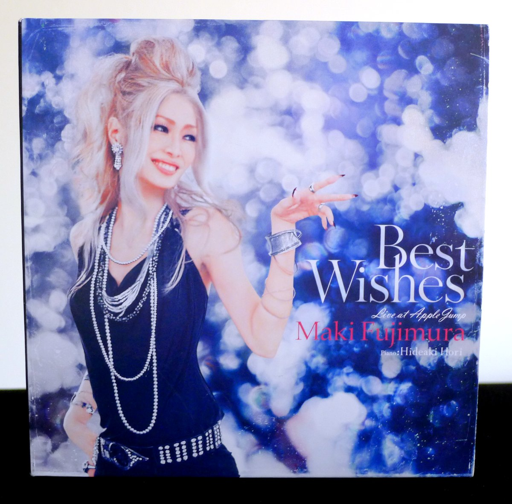
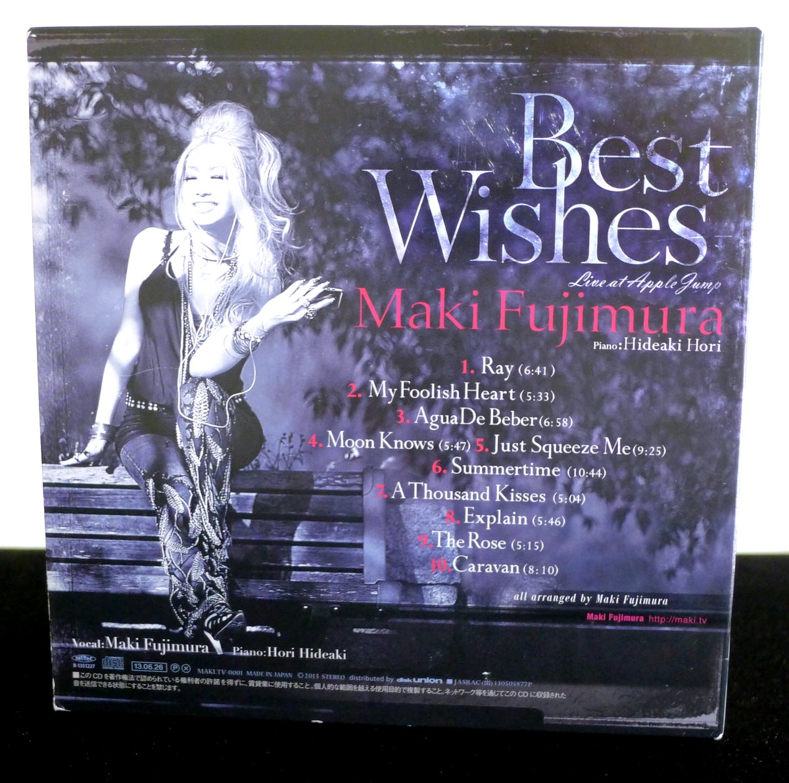
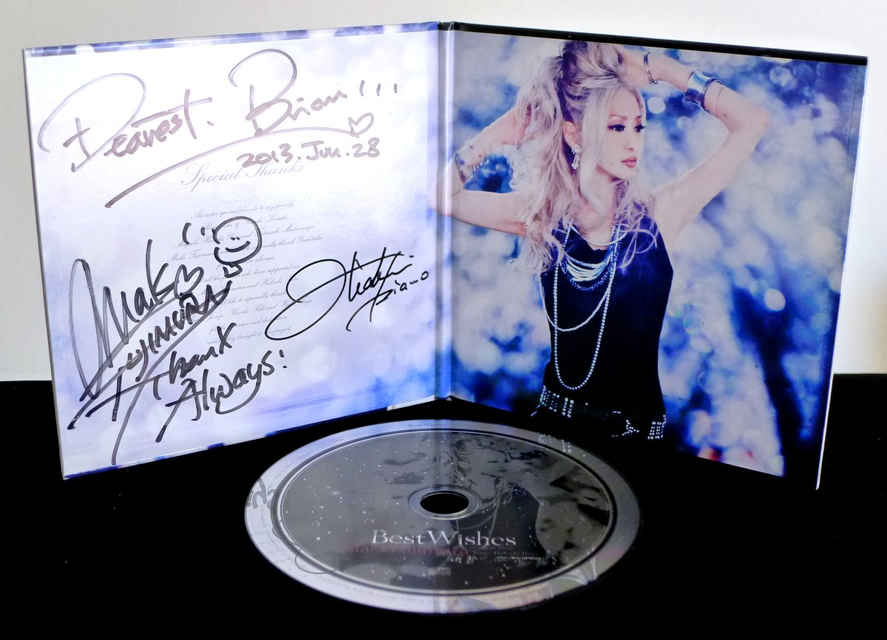
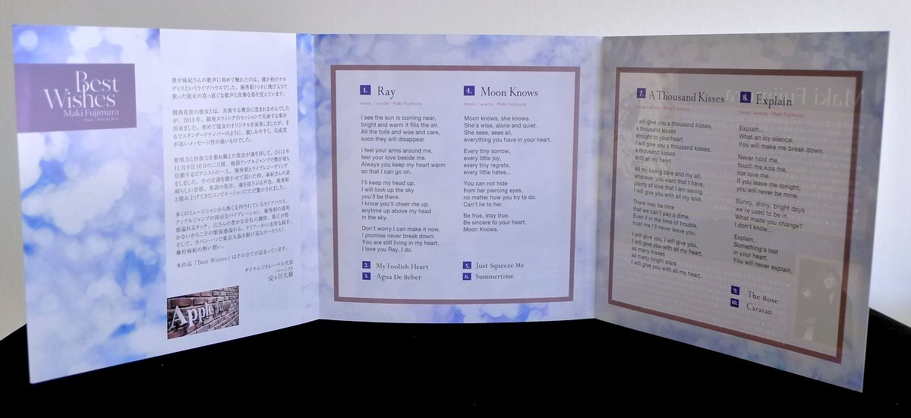
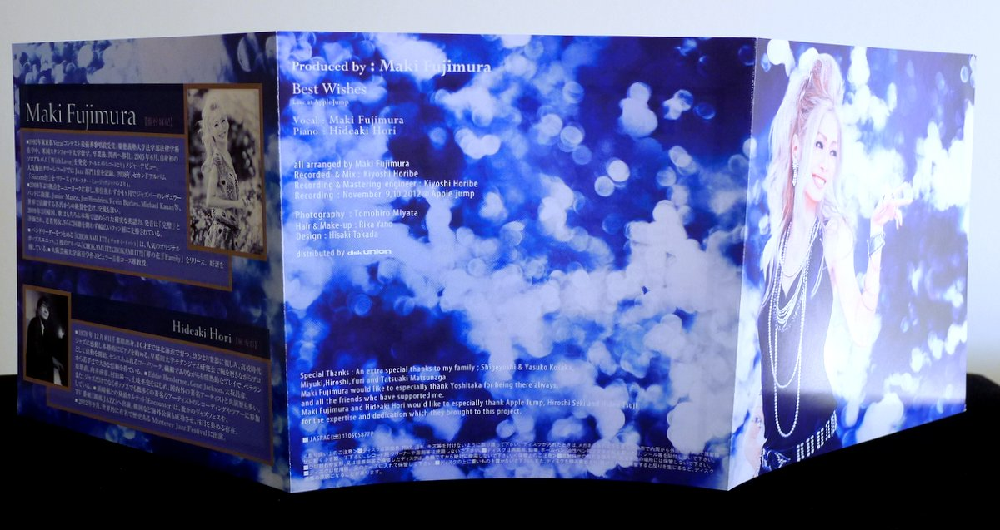
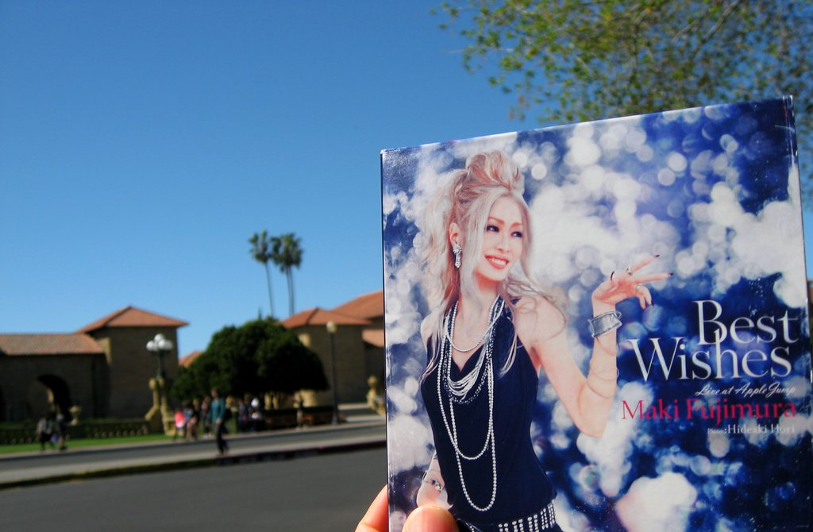

+++
title = "Maki Fujimura: Best Wishes"
author = ["Brian McCrory"]
publishDate = 2019-01-14
tags = ["Maki Fujimura", "藤村麻紀", "Hideaki Hori", "堀秀彰"]
categories = ["albums"]
draft = false
aliases = ["/archive/maki-fujimura-best-wishes/", "/p/maki-fujimura-best-wishes/"]
[cover]
  image = "makifujimura-best-460.jpeg"
  caption = ""
  relative = true
+++

Glamorous Osaka-based singer Maki Fujimura enraptures the audience with her silky voice and energetic improvisation on this live album recorded at the intimate Tokyo jazz bar “Apple Jump”.

Going by “The Duo!” together with the amazing pianist Hideaki Hori, the two musicians expertly create music with pulse, Fujimura building upon and playing with Hori’s rhythmic timing and impeccable pianistic touch, with her soft yet strong vocals gliding around the piano’s notes in perfect interplay.

Fujimura uses her voice as a musician’s instrument, moving from soft ballads to high-energy sprints, singing as a true musician in charge of her instrument with deep musical knowledge. The singer evokes moods from romantic love and positive energy to moments of moody solitude, while pianist Hori provides the perfect musical partnership gained through their years of playing together on innumerable live dates.

Recorded as-is and direct over two nights at the jazz bar, the duo performs both originals and standard jazz tunes. Two of Fujimura’s sparkling crowd-favorites are included: “Ray”, a cheery tune pledging eternal love and support, and “A Thousand Kisses”, where Fujimura’s voice floats gracefully over the piano in pretty melodic arcs as she positively fills the room with romance.

In addition, the duo thrills with arrangements of standards such as “Summertime”, “Caravan”, and a sincerely moving version of “The Rose”.

## Best Wishes by Maki Fujimura {#best-wishes-by-maki-fujimura}

-   [Maki Fujimura](/tags/maki-fujimura) - vocal
-   [Hideaki Hori](/tags/hideaki-hori) - piano

Released in 2013 on Maki Fujimura as MAKI.TV-0001.

_Japanese names: 藤村麻紀 Fujimura Maki 堀秀彰 Hori Hideaki_

## Audio and Video {#audio-and-video}

-   [Maki Fujimura and Hideaki Hori performing “Caravan” live in 2017:](https://youtu.be/oU004sMm7rE)



-   Excerpt from track #1: “Ray” [mix #4](https://www.jazzofjapan.com/archive/audio/#mix-4)


