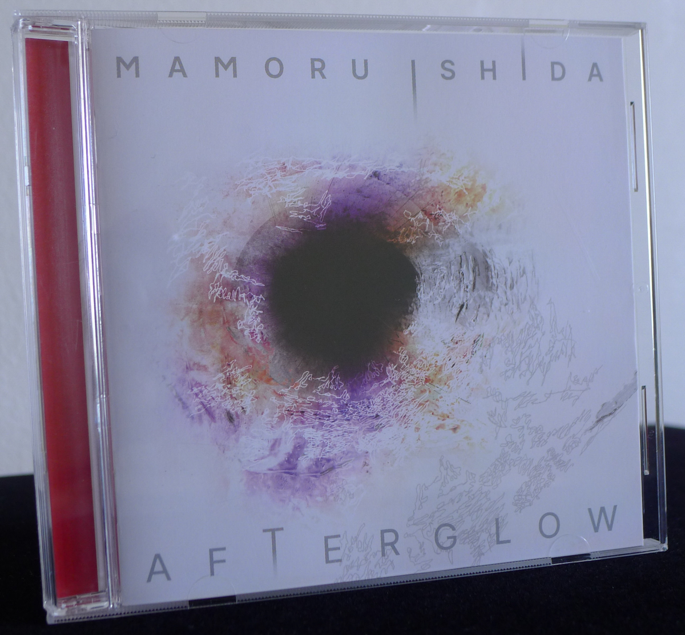
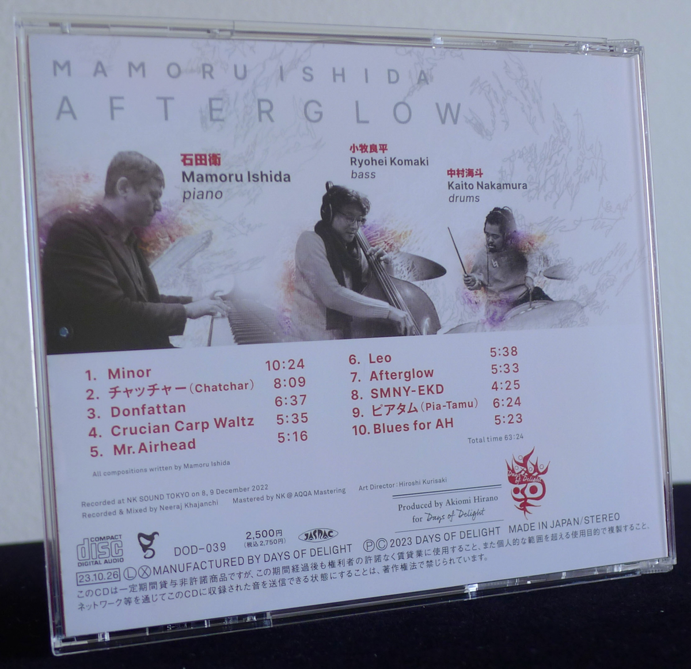
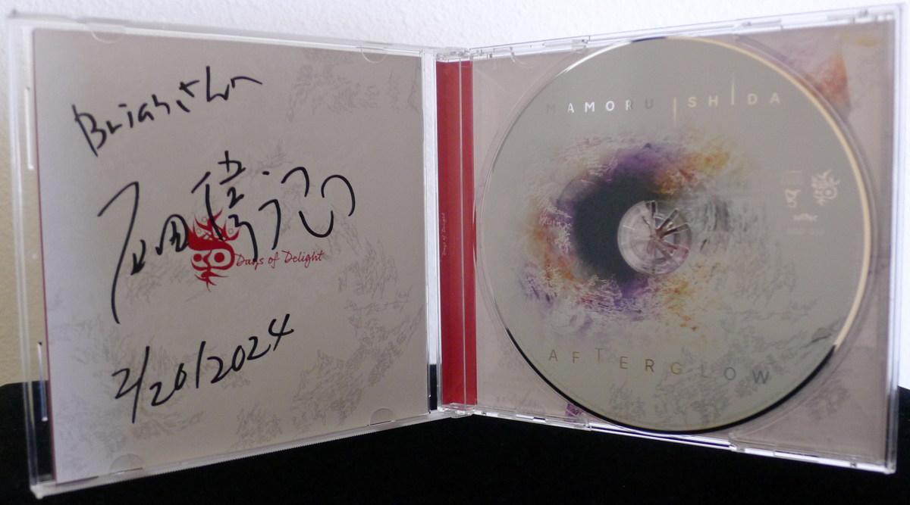
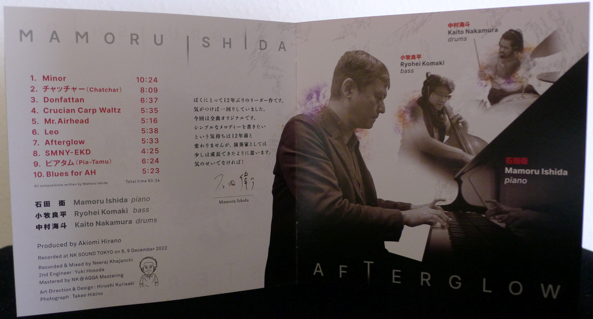
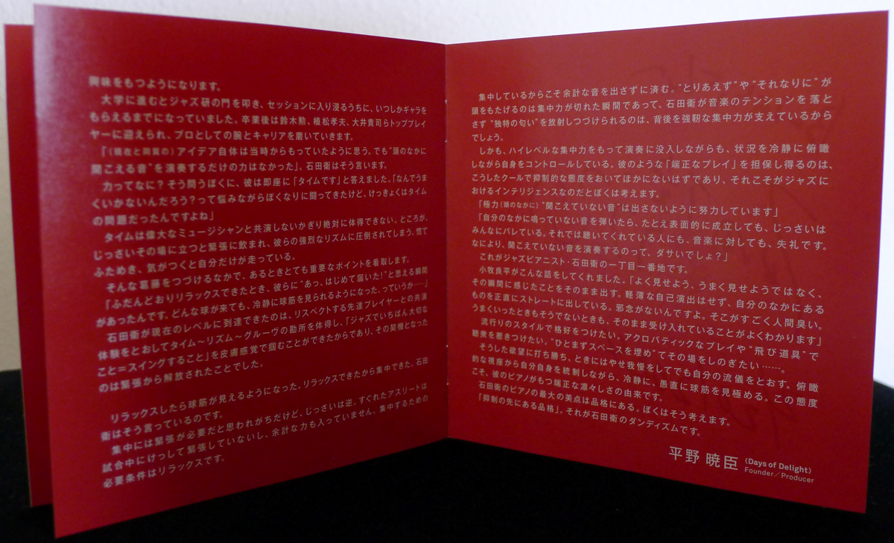

+++
title = "Mamoru Ishida: Afterglow"
author = ["Brian McCrory"]
publishDate = 2024-10-11
keywords = ["miyuki-moriya-cats-cradle", "ko-omura-introspect", "mamoru-ishida-ishida-mamoru-4-feat", "keisuke-nakamura-humadope", "daiki-yasukagawa-trio-trios-ii", "fumika-asari-introducin", "miwo-tranquillo", "nami-kano-mawsim"]
tags = ["Mamoru Ishida", "石田衛", "Ryohei Komaki", "小牧良平", "Kaito Nakamura", "中村海斗"]
categories = ["albums"]
draft = false
aliases = ["/archive/mamoru-ishida-afterglow/", "/p/mamoru-ishida-afterglow/"]
[cover]
  image = "mamoru-ishida-afterglow-460.jpeg"
  caption = ""
  relative = true
+++

_Afterglow_ is the latest recording from pianist Mamoru Ishida, released in 2023 and recorded in 2022 with his trio featuring Ryohei Komaki on bass and Kaito Nakamura on drums. The sixty-four minute, ten-track album is filled with his original compositions and is his first leader album in twelve years, although he’s stayed active with live shows and other recording sessions throughout. Days of Delight, the new Japanese record label, set the direction of having a trio format with Ishida’s originals and describes the situation glowingly in the liner notes.

Ishida’s compositions and playing contain a great balance of tradition and novelty. His style clearly reflects both the influence of and reverence for the great legends of jazz piano, but much like his fondness for wordplay and puns, he adds fine touches and subtle changes to his music to avoid playing simple imitations of jazz in the past. As an example, in several of his tunes, the chord changes or melody turn in slightly unexpected directions, intelligently and not jarringly so, with a catchy exuberance or in graduated shadings.

A quick description of the tracks and album flow includes the patient and thematic #1 “Minor”, the springy joyfulness of #2 “Chatchar”, the serious and touching nature of  #3 “Donfattan” _(a portmanteau of Tokyo jazz bars [Donfan](https://www.jazzofjapan.com/archive/donfan) and Manhattan)_, the pretty and bobbing #4 “Crucian Carp Waltz”, the goofy good-naturedness of #5 “Mr. Airhead”, the start-and-stop dreaminess of #6 “Leo”, the laidback smoky bossa of #7 “Afterglow”, the jazz-standardish purity of #8 “SMNY-EKD”, the curiosity and back-and-forth steps of #9 “Pia-Tamu” _(possibly referring to pianist-Tamura, plus “Ah Um” perhaps)_, and the good old blues groove of #10 “Blues for AH”.

The style is exquisite straight-ahead piano trio jazz with modern touches, at times bringing in influences from Hancock and Corea, Thelonious Monk, Vince Guaraldi, Charles Mingus, and Red Garland in the compositional choices and the trio’s playing. Along with the controlled moments of patient prettiness and lovely ballads are mid- and up-tempo brightness, jazz that is freewheeling and bouncing in pure pleasure. Ishida’s creative ad-libbing is original and comfortable, spontaneously flowing while in control.

Likewise, the occasional moments when a quote of a familiar theme pops up, or when listeners are draped in blankets of notes or swept up into a high-note range, are all the more effective as ideas develop and an overall effect of dynamism and real-time improvisation is achieved.

As for Days of Delight, this new label was created to promote Japanese jazz in a new era. It’s a project dedicated to the sound of Japanese jazz delivered through the curation of authentic jazz currently being played in Japan. Built on this foundation, the label strives to renew the feeling of the great era of 1970s Japan, when Japanese jazz was carving out new territory through originality and landmark recordings.

Label founder and producer Akiomi Hirano’s liner notes for _Afterglow_ are fittingly illuminating of this direction for jazz, as well as Ishida’s skills: his unique presence, neat way of speaking and playing, individuality, refinement, and poetic sentiment. And above all, how Ishida doesn’t play notes without thinking, but stays calm, concentrates, and maintains control over the big picture.



## Liner Notes {#liner-notes}

_(Translated from excerpts of Akiomi Hirano’s original Japanese liner notes.)_

…

In fact, he is the pianist who is most removed from the style of playing by rote, temporarily filling up the space with patterns or scales. There is never the sense of playing something without meaning, or getting carried away and just goofing around.

He doesn’t have “just for now” or “good enough” modes, like “For the time being, let’s do this…” or “This probably should sound like this here”… This is a not uncommon scene at some live performances, but not with him.

“I don’t want to put out a single note on wasted sounds.” That’s the spirit I feel in his performance. To play without having fingers just moving on their own, without jazz being carried along by reflexes or momentum, but wanting to always remain composed and present and have a high-level view. To maintain the tension while in a constant state of awareness. That’s what he seems to be thinking to me.

These are the roots of Mamoru Ishida that I want to release with a high level of purity. I want to capture his unique characteristics in high resolution. This is what I was thinking when I made him this offer to record as a piano trio with all original songs. This recording is packed full of Mamoru Ishida’s aesthetic sense, presented as is in its purest form.

…

“I think I had the same ideas [back then as I do now], but I didn’t have the ability to play what I heard in my head,” says Mamoru Ishida.

When I asked what he meant by ability, he immediately responded “Time.” He said, “I struggled with myself, wondering why things weren’t sounding good, and eventually realized that the problem was time—it was a matter of time.”

You can never master time to the extent that you are not playing alongside great musicians. However, when you’re actually in that situation, you can end up being filled with nervousness and overcome by the intensity of their rhythms. You can become confused and rattled, and suddenly realize that you are the one rushing.

In the midst of that challenge, he realized an important point.

“When I was able to relax normally, there was a moment when I thought ‘Ah, it’s the first time that I was able to reach them!’ It was like being able to calmly follow a ball that was coming no matter the trajectory it was on…”

Mamoru Ishida was able to reach his current level by playing together with respected mentors and acquiring the vital points of time, rhythm, and groove. He tangibly grasped the lesson that “the most important thing in jazz is to swing”. This became possible once he was able to be free from tension.

When you’re relaxed, you can visualize the ball’s trajectory. When you become able to relax, you can concentrate. That’s what Mamoru Ishida is saying.

It’s often thought that tension is necessary for concentration, but it’s completely the opposite. Elite athletes do not tense up during a match and do not exert unnecessary force. Relaxation is an essential condition for concentration.

Because of this concentration, he can avoid playing unnecessary notes. The moment the concentration breaks is when the “just for now” or “good enough” ideas surface. A strong ability to concentrate is probably what allows Mamoru Ishida to continue radiating his unique style while maintaining tension in his music.

Furthermore, he calmly possesses a bird’s eye view of the situation while in control of his playing, even while immersed in a performance with a high level of concentration. I believe that the only way to guarantee graceful playing like his is nothing other than this kind of cool and collected manner, and this is what intelligence in jazz is.

“As much as I can, I try not to play sounds that I don’t hear in my head.”

“If I play a note that doesn’t come from inside, even if it sounds good on the surface, everyone can tell that it is inauthentic. That’s disrespectful to the listeners and to the music. Above all, it’s just kind of tasteless to perform music that you can’t hear yourself, isn’t it?”

This is jazz pianist Mamoru Ishida’s most important priority.

…



## Afterglow by Mamoru Ishida {#afterglow-by-mamoru-ishida}

-   [Mamoru Ishida](/tags/mamoru-ishida) - piano
-   [Ryohei Komaki](/tags/ryohei-komaki) - bass
-   [Kaito Nakamura](/tags/kaito-nakamura) - drums

Released in 2023 on Days of Delight as DOD-039.

_Japanese names: 石田衛 Ishida Mamoru 小牧良平 Komaki Ryohei 中村海斗 Nakamura Kaito_

## Audio and Video {#audio-and-video}

-   [Mamoru Ishida Trio playing “Minor” live, track #1 on this album:](https://youtu.be/2lA7QGZyiww)



-   [Mamoru Ishida Trio playing #9 “Pia-Tamu” (short excerpt):](https://youtu.be/_-z3hbrGxl8)



-   Excerpt from track #2: “チャッチャー(Chatchar)” [mix #11](https://www.jazzofjapan.com/archive/audio/#mix-11)



## Other Links {#other-links}

-   [Days of Delight record label](https://daysofdelight-music.amebaownd.com/)

-   [Days of Delight album releases (e-onkyo music)](https://www.e-onkyo.com/feature/3865/)

-   [Days of Delight videos](https://www.youtube.com/@daysofdelight6986)
