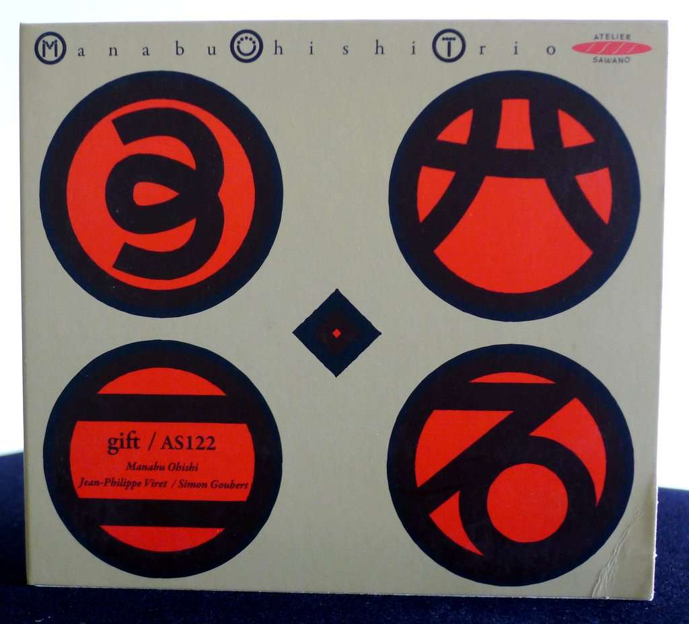
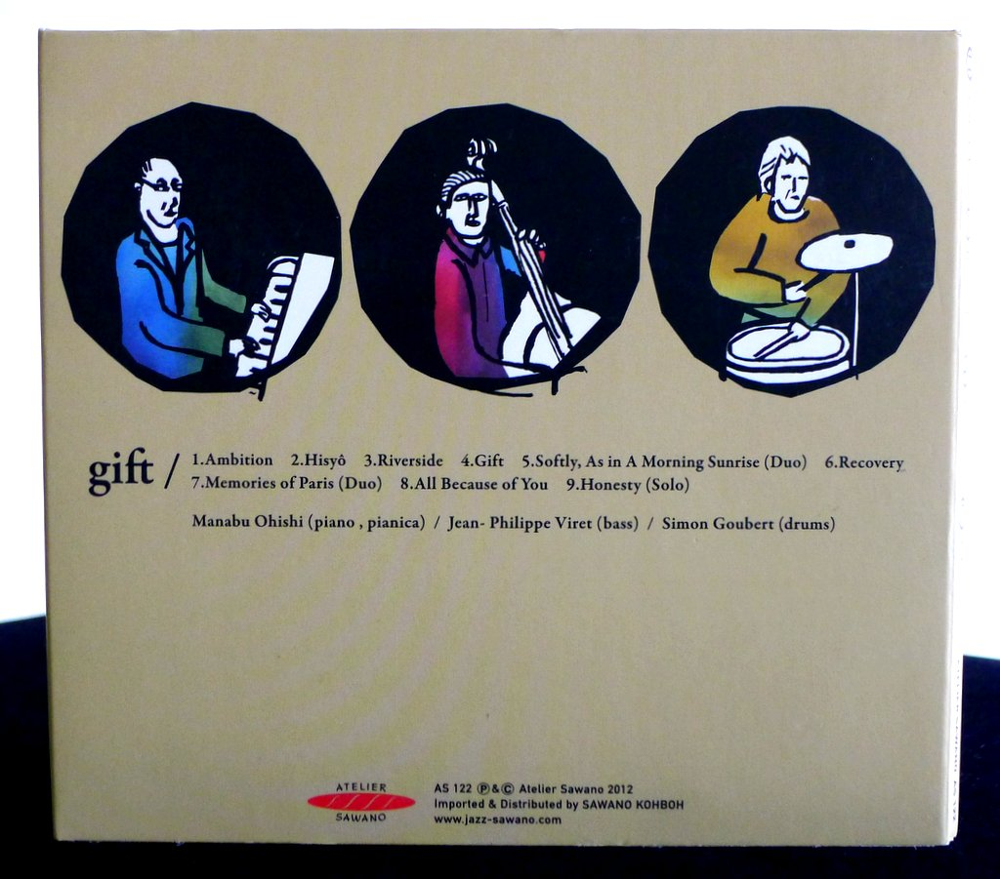
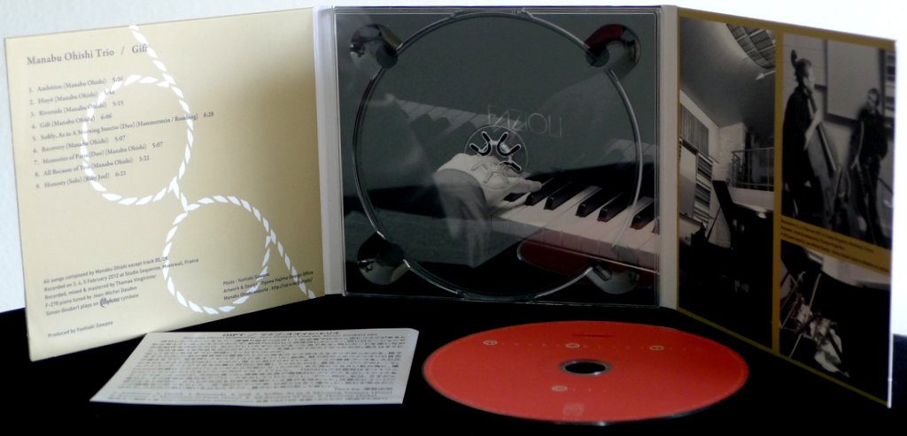
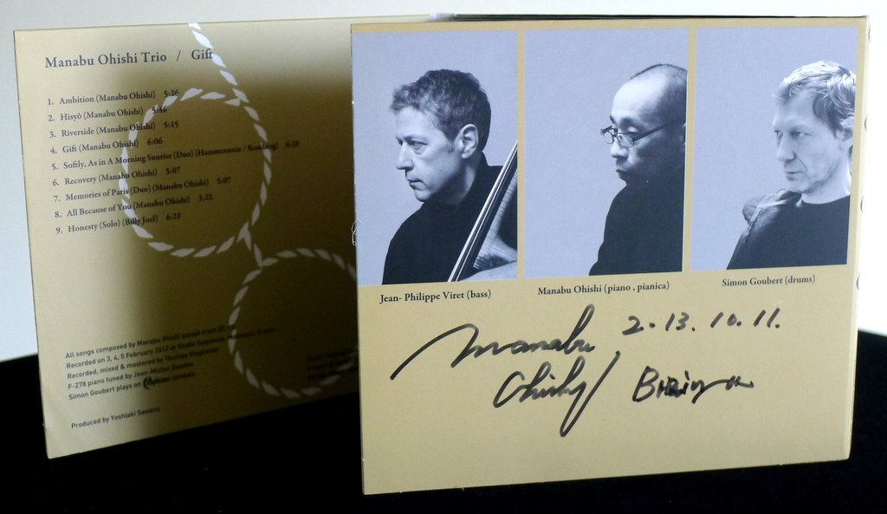
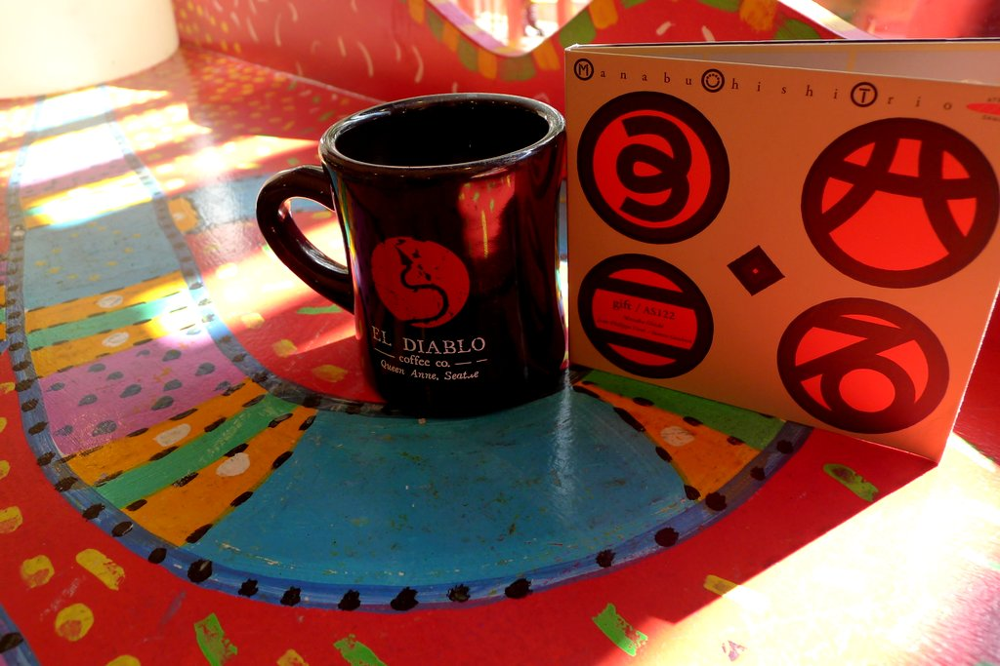

+++
title = "Manabu Ohishi Trio: Gift"
author = ["Brian McCrory"]
publishDate = 2020-03-09
tags = ["Manabu Ohishi", "大石学", "Jean-Philippe Viret", "Simon Goubert"]
categories = ["albums"]
draft = false
aliases = ["/archive/manabu-ohishi-trio-gift/", "/p/manabu-ohishi-trio-gift/"]
[cover]
  image = "manabuohishi-gift-460.jpeg"
  caption = ""
  relative = true
+++

With the jazz album _Gift_ from 2012, pianist and composer Manabu Ohishi reunites the trio from his album _Wish_ (2010) featuring bassist Jean-Philippe Viret and drummer Simon Goubert, and releases another beautifully-recorded album of Japanese/European piano jazz from the family-run Japanese label Atelier Sawano label.

Ohishi is a lyrical player, infusing his melodic touch with musical emotion and composing songs that fit well with the stylish rhythms from his French bandmates, favoring a deep groove and subtle rock rhythms over swing jazz beats.

The pianist’s compositions include the emotional ballad “Ambition”, the mysterious and alluring “Hisyô”, the uptempo and modern “Riverside”, and graceful smoothness on “All Because of You”, throughout which Ohishi conveys strong impressions that his music arises from deep and contemplative places. His song “Memories of Paris”, perhaps a nod to his trio mates, also features Ohishi playing pianica and piano simultaneously along with bassist Viret, where the whistling reed of the keyboard instrument invokes accordion-like sounds familiar to French settings.

In addition to the original numbers, a cover of the jazz standard “Softly, As In A Morning Sunrise” is painted as a languid fantasy, and a stirring solo piano version of Billy Joel’s “Honesty” wraps up the album with soulful outpouring as Ohishi wrings powerful emotion out of the keys of the piano.

## Gift by Manabu Ohishi Trio {#gift-by-manabu-ohishi-trio}

-   [Manabu Ohishi](/tags/manabu-ohishi) - piano, pianica
-   [Jean-Philippe Viret](/tags/jean-philippe-viret) - bass
-   [Simon Goubert](/tags/simon-goubert) - drums

Released in 2012 on Atelier Sawano as AS-122.

_Japanese names: 大石学 Ohishi Manabu_

## Audio and Video {#audio-and-video}

-   [A different version of the Manabu Ohishi Trio with the album “Nebula”:](https://youtu.be/Bgm0qg6goPI)



-   Excerpt from track #2: “Hisyo[^]” [mix #6](https://www.jazzofjapan.com/archive/audio/#mix-6)


