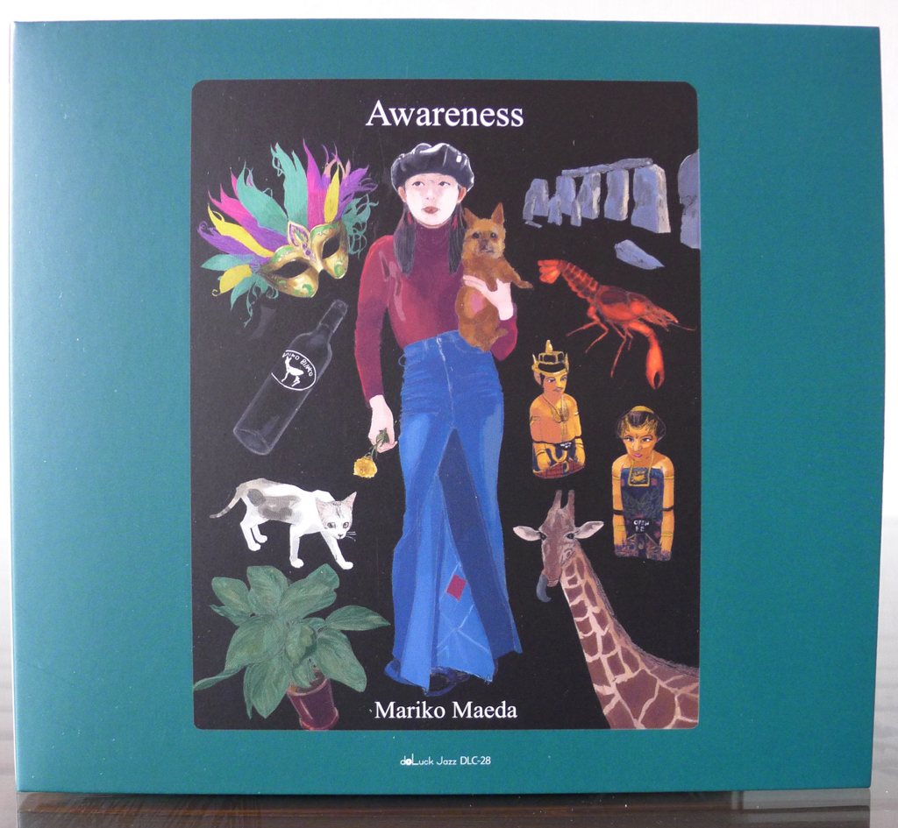
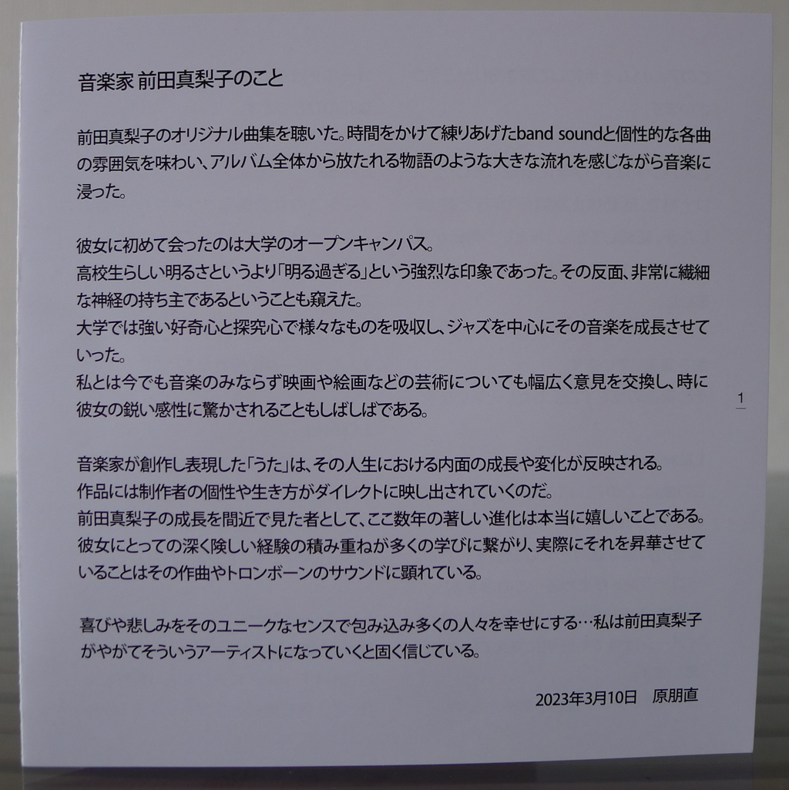
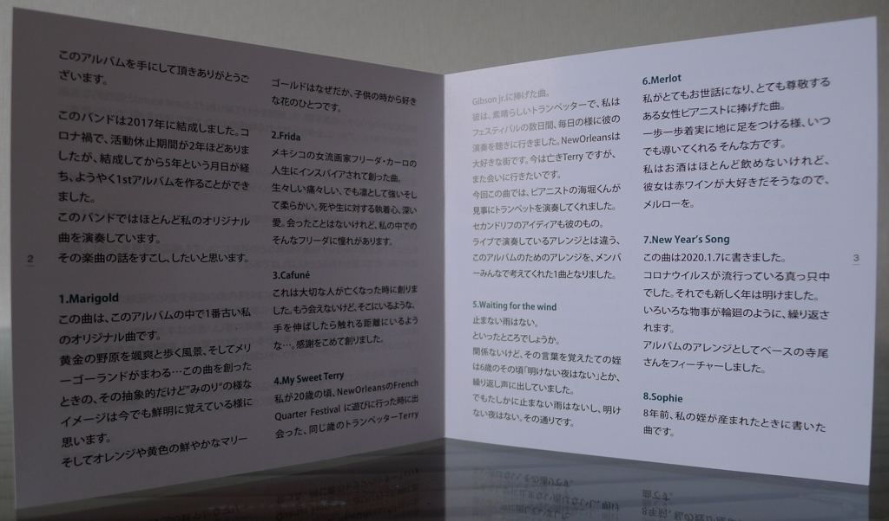
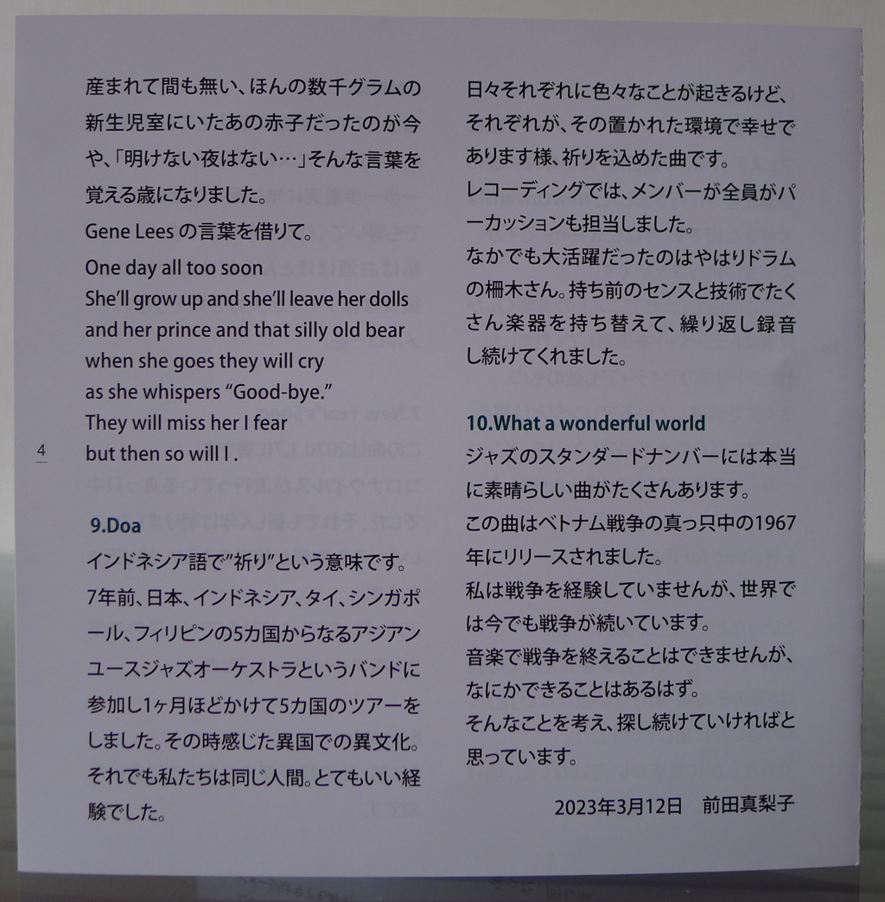
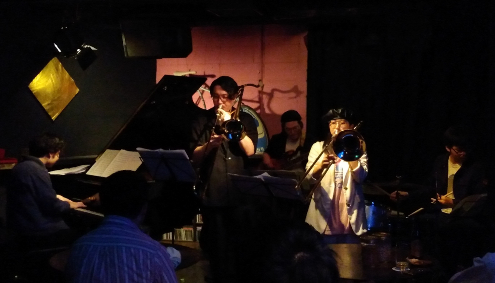
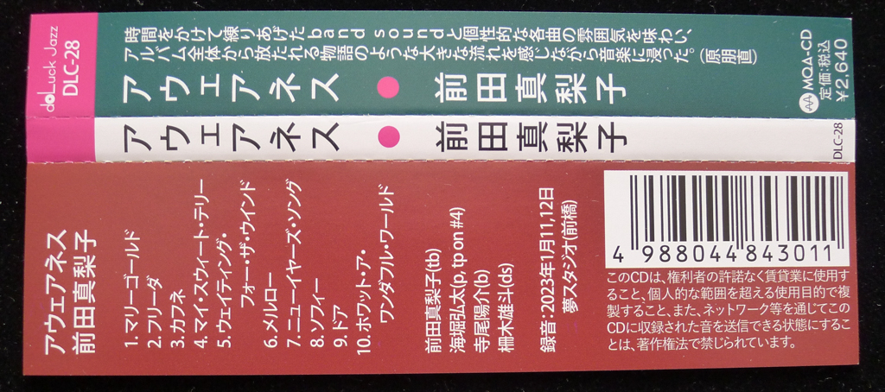

+++
title = "Mariko Maeda: Awareness"
author = ["Brian McCrory"]
publishDate = 2023-06-09
tags = ["Mariko Maeda", "前田真梨子", "Kota Kaihori", "海堀弘太", "Yosuke Terao", "寺尾陽介", "Yuto Maseki", "柵木雄斗"]
categories = ["albums"]
draft = false
aliases = ["/archive/mariko-maeda-awareness/", "/p/mariko-maeda-awareness/"]
[cover]
  image = "mariko-maeda-awareness-460.jpeg"
  caption = ""
  relative = true
+++

_Awareness_ is the inspiring title of trombonist Mariko Maeda’s debut album of newly-recorded music that her jazz quartet is currently taking on tour in Japan. This eagerly-awaited debut album introduces listeners to Maeda’s style and influences through her artful playing and compositions. Fittingly, the cover art sets the mood with a beautiful painting that shows the young musician surrounded by symbols that tempt with possible clues and associations to the ten musical tracks.

Maeda performs here with her quartet of trombone, piano, bass, and drums. Her original songs exhibit modern sparkle and creativity, great material for the musicians who also display respect for standard jazz forms and graceful sensitivity on ballads. As is natural for a leader’s debut record, the focus is on Maeda, and her melodic sense and organic tone shine on every song. Kota Kaihori’s dynamic piano solos provide a contrasting balance of sound and ideas, and the spotlight is also turned on Yosuke Terao’s bass and Yuto Maseki’s drums as well with a featured song each. Yet it is Maeda’s mellow trombone sound and engaging style that anchors the comfortable throughline from center stage on _Awareness_.

Released less than two months ago, this new album occupies the position of the most recent release currently in my collection. As a personal anecdote, I was fortunate to catch Maeda’s live performance in April, on the same day she received the just-manufactured CDs and started to offer them for sale. It turned out that my purchase was for the very first copy of _Awareness_ that she sold.

Given such fresh music, instead of summarizing the album overall with a few descriptive sentences, the following notes are improvised thoughts jotted down while listening to the album, track-by-track, from the opening to the ending song.



1.  “Marigold” opens with a gentle piano intro and builds into a medium jazz waltz. Maeda’s trombone solo is immediately jazzy and soulful in her first solo, followed by a stimulating piano solo. The title is a reference to the type of yellow flower she was fond of as a child.

2.  “Frida” is a modern mid-tempo tune played straight, a great backdrop for Maeda’s tangible and breathy tone. The stepwise melody and improvisation seem to paint contrasting images of strength and weakness, living and pain, and perhaps even life and death, themes inspired by and dedicated to the song’s great namesake artist Frida Kahlo.

3.  “Cafuné” is an elegy written for a departed loved one, and is a lovely ballad duo featuring piano and trombone supporting each other reassuringly. The title, incidentally, seems to be a Portuguese word meaning to run one’s hands through someone’s hair caressingly.

4.  “My Sweet Terry” is another song in memory of a passed-away friend. Muted trombone opens with vocal-like growls and hums and leads to an upbeat second-line New Orleans-style jazz tune. Pianist Kaihori plays trumpet for this tune, and the quartet of trombone, trumpet, bass, and drums imparts an outdoor marching Mardi Gras Bourbon Street parade feeling of joyous celebration.

5.  “Waiting for the Wind” refers in the liner notes to the quotes “There is no rain that won’t stop” and “There is no night without the dawn.” This song is a slow-beat modern jazz groove over which Maeda’s honest trombone relays a patient and beckoning vocal-like melody. There seem to be words hidden in the trombone’s melody, and one wonders what those lyrics might be.

6.  “Merlot” in another homage, this time to a woman she admires, an unnamed pianist who likes red wine. This medium-tempo tune is a satisfying jazz track with a strong swing feeling and perhaps the most orthodox track on the album.

7.  “New Year’s Song” was composed in the midst of the pandemic when the year changed, signifying samsara, a cycle of death and rebirth and all that a new year can represent in a rare period of history. The song features a bass intro after which slow jazz waltz time is set and Maeda lays out a melancholy melodic plea with her soft, melodic playing. This highlight is perhaps one of the most sensitive and affecting tracks on the album.

8.  “Sophie” is a tender ballad written when upon the birth of her niece eight years ago. With elements of free time and beautiful bowed bass, there is a sweet, wistful sound somewhat reminiscent of the gentle weightiness in Horace Silver’s classic ballad “Peace”.

9.  “Doa” (Prayer in Indonesian) is another album highlight, a Latin dance-style upbeat affair. The inspiration for this song was born from Maeda’s past experience touring with the Asian Youth Orchestra through several countries with players from Japan, Indonesia, Thailand, Singapore, and the Philippines. This experience helped her to become more aware of the shared qualities and challenges of different people and places, especially when brought together for creativity and with a common purpose. Alongside a great drum solo, the musicians play additional percussion instruments together, resulting in a buoyant rhythmic groove.

10. “What a Wonderful World” is a beloved tune in the classic jazz repertoire; Louis Armstrong’s famous version of the song is deep and appreciated by many, needless to say. For the last track on _Awareness_, Maeda plays the tune as an unaccompanied trombone solo, and she delivers the melody straight with minimal improvisation in a plain-speaking style. By doing so, she chooses this heartwarming song as an uplifting plea for peace, one voice delivered honestly and directly. Through this choice to end the album bravely alone, she shows a respectful awareness of the power of great jazz music and the message that she wants to send through it.

## Awareness by Mariko Maeda {#awareness-by-mariko-maeda}

-   [Mariko Maeda](/tags/mariko-maeda) - trombone
-   [Kota Kaihori](/tags/kota-kaihori) - piano, trumpet on #4
-   [Yosuke Terao](/tags/yosuke-terao) - bass
-   [Yuto Maseki](/tags/yuto-maseki) - drums

Released in 2023 on DoLuck Jazz as DLC-28.

_Japanese names: 前田真梨子 Maeda Mariko 海堀弘太 Kaihori Kota 寺尾陽介 Terao Yosuke 柵木雄斗 Maseki Yuto_

## Audio and Video {#audio-and-video}

-   [Promotional video for this album:](https://youtu.be/lrBK-s0-n2c)



-   Excerpt from track #2: “Frida” [mix #8](https://www.jazzofjapan.com/archive/audio/#mix-8)


