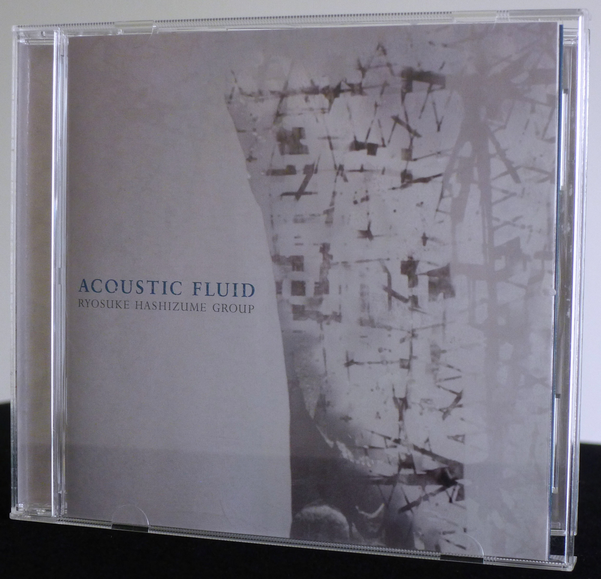
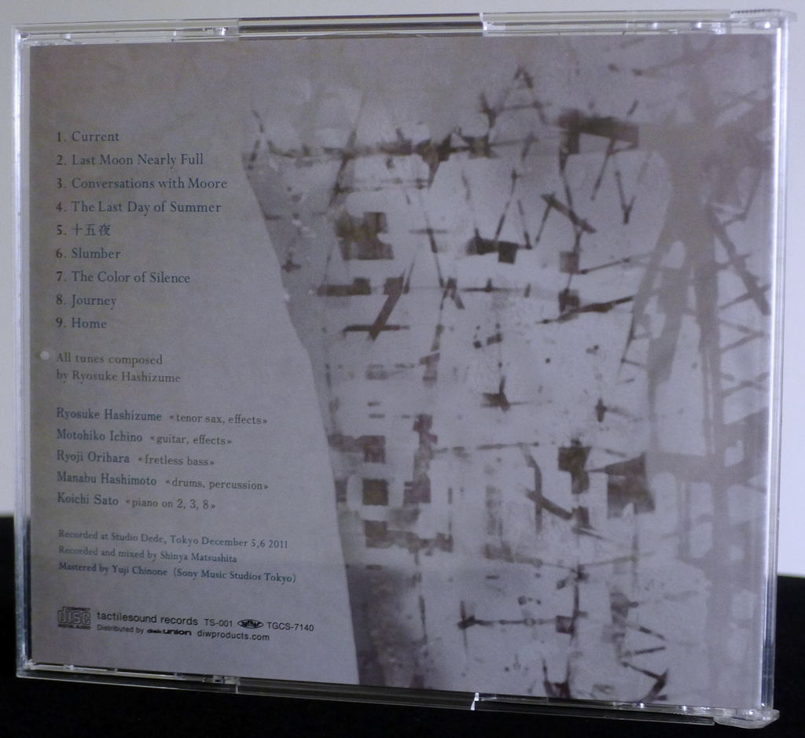
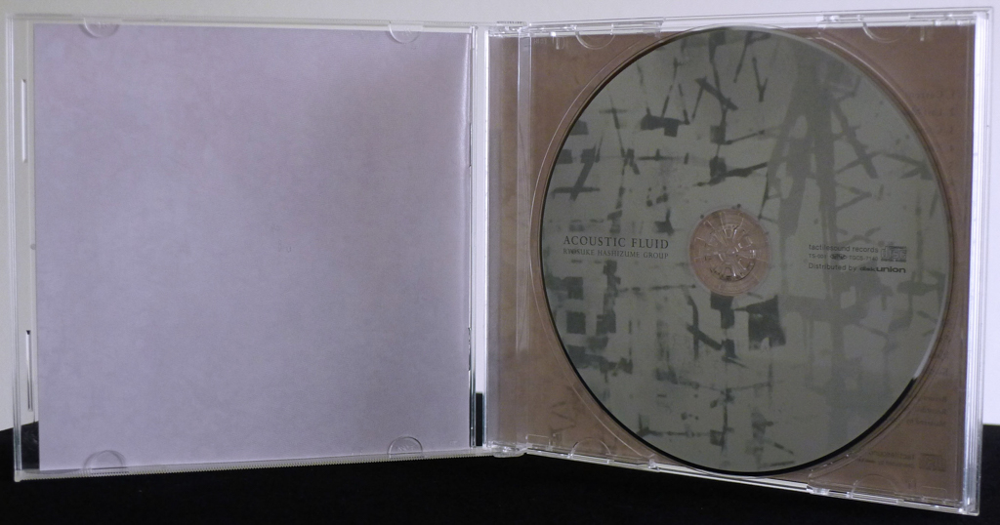
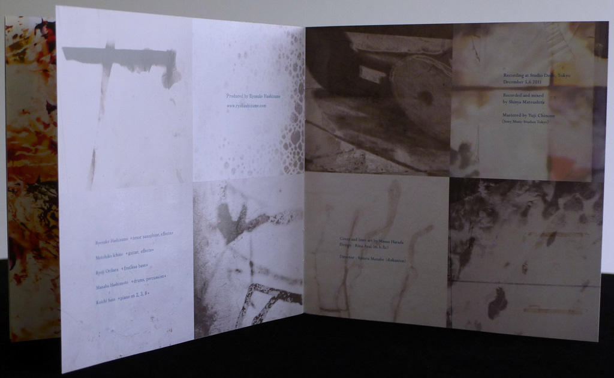
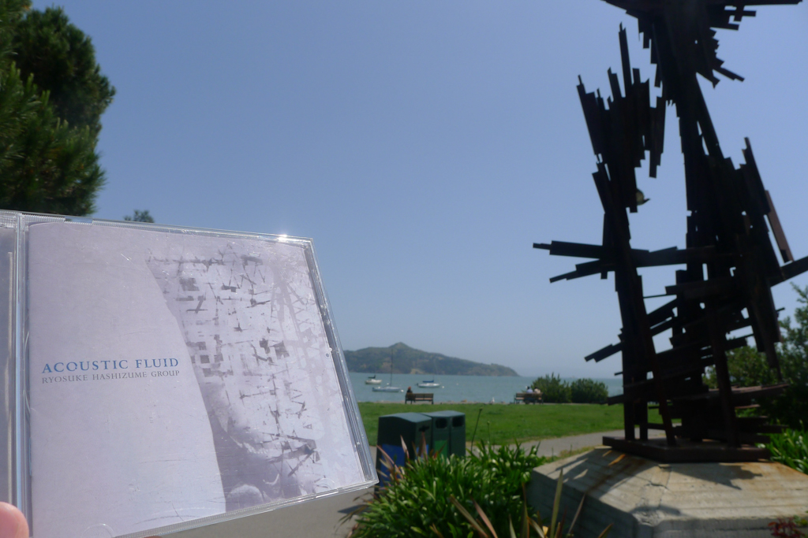

+++
title = "Ryosuke Hashizume Group: Acoustic Fluid"
author = ["Brian McCrory"]
publishDate = 2023-07-28
keywords = ["ryosuke-hashizume-group-wordless", "ryosuke-hashizume-needful-things", "ryosuke-hashizume-group-visible-invisible", "ryosuke-hashizume-group-incomplete-voices"]
tags = ["Ryosuke Hashizume 橋爪亮督", "Motohiko Ichino 市野元彦", "Ryoji Orihara 織原良次", "Manabu Hashimoto 橋本学", "Koichi Sato 佐藤浩一"]
categories = ["albums"]
draft = false
[cover]
  image = "ryosukehashizume-acoustic-460.jpeg"
  relative = true
+++

The title of the album _Acoustic Fluid_ from the Ryosuke Hashizume Group captures the essence of moving, flowing sounds that fill up this music. Like most of Hashizume’s albums and live shows, his original compositions are featured on this 2012 album, his sixth release. Throughout /Acoustic Fluid/’s nine tracks, the five-member group expands these charts with push-and-pull activity, like waves on water or breaths of air.

The music on this album alternates between slow, free sketches and mid-tempo modern jazz. The slower tracks are beautifully patient, somewhat open-ended with room for the group to pulse and grow organically while trekking through the movements.

Whether on the undertow of “Current”, the storytelling of “The Color of Silence”, or the tranquil, soft “Home”, the slower numbers are soundscapes for creating acoustic moods, a vaguely _Blade Runner_ Vangelis-esque setting of future nostalgia. The recorded warmth of the instruments adds to this with a dynamic mix of warbling guitar, artistically nimble drums, fluidly echoey sax, the magnetic attraction of fretless electric bass, and full, graceful piano.

Among the slower songs, the mid-tempo songs are latched to frames in motion through riffs, loops, or steady rhythms on which longer themes develop. Songs like “Last Moon Nearly Full”, “Conversations with Moore”, and “The Last Day of Summer” thrill with emotional, shapeshifting suspense through the peaks and valleys of the compositions layered with individual improvisation. Throughout, the album is a chimera of imagination, a satisfying journey from the initial pull of the opening “Current” to the last welcome of “Home”.

## Acoustic Fluid by Ryosuke Hashizume Group {#acoustic-fluid-by-ryosuke-hashizume-group}

-   [Ryosuke Hashizume](http://www.ryohashizume.com/) - tenor saxophone, effects
-   [Motohiko Ichino](https://motohikoichino.com/) - guitar, effects
-   [Ryoji Orihara](https://linktr.ee/ryojiorihara) - fretless bass
-   [Manabu Hashimoto](http://mh-ob.blogspot.com/) - drums, percussion
-   [Koichi Sato](https://koichisato.com/) - piano (#2, 3, 8)

Released in 2012 on Tactile Sounds Records as TS-001.

_Japanese names: 橋爪亮督 Hashizume Ryosuke 市野元彦 Ichino Motohiko 織原良次 Orihara Ryoji 橋本学 Hashimoto Manabu 佐藤浩一 Sato Koichi_

## Audio and Video {#audio-and-video}

-   [Live performance of “Last Moon Nearly Full”, track #2 on this album:](https://youtu.be/l8hat57hZYE)



-   [Live performance of “The Last Day of Summer”, track #4 on this album:](https://youtu.be/0ikWlV2HT_c)



-   Excerpt from track #3: “Conversations with Moore” [mix #9](https://www.jazzofjapan.com/archive/audio/#mix-9)


