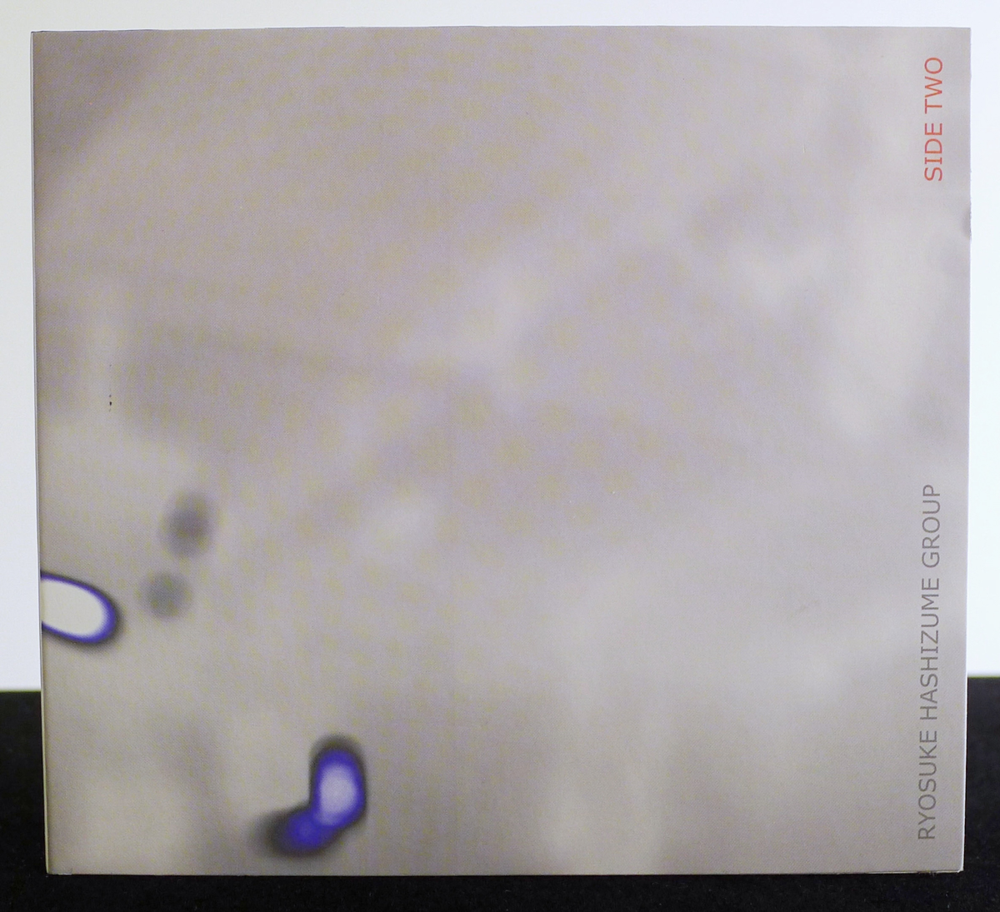
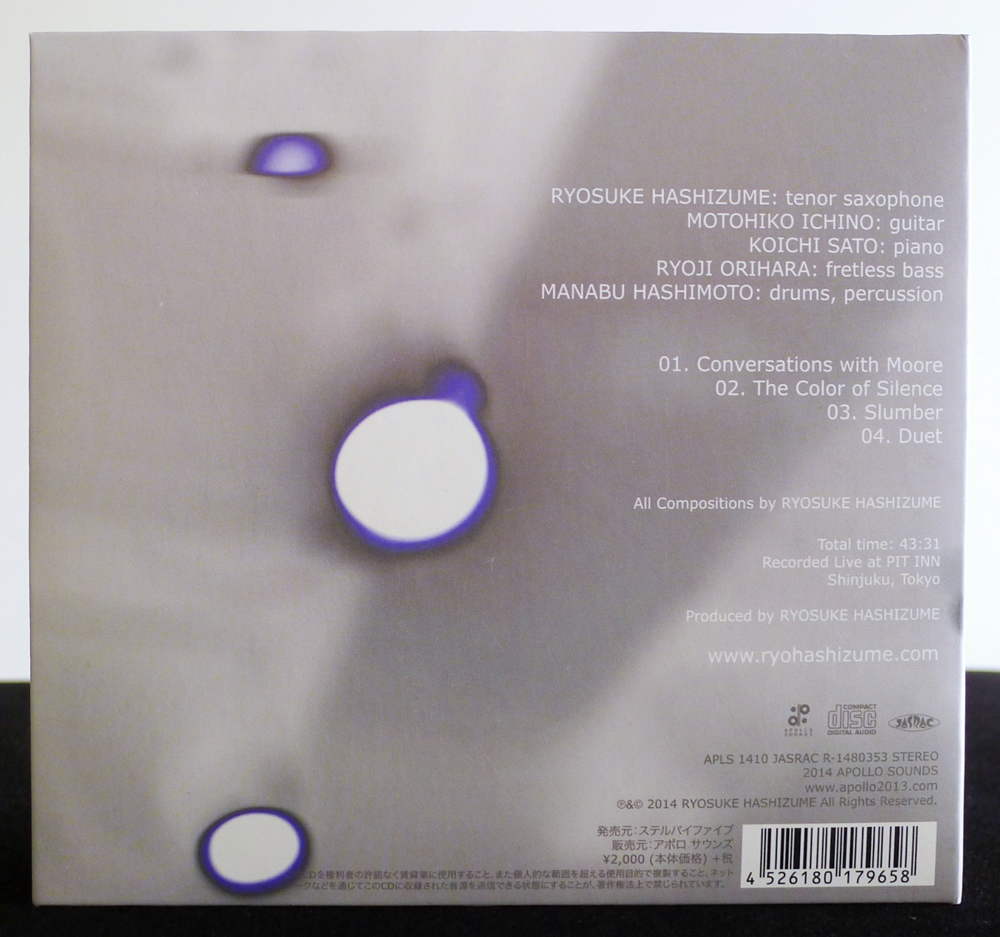
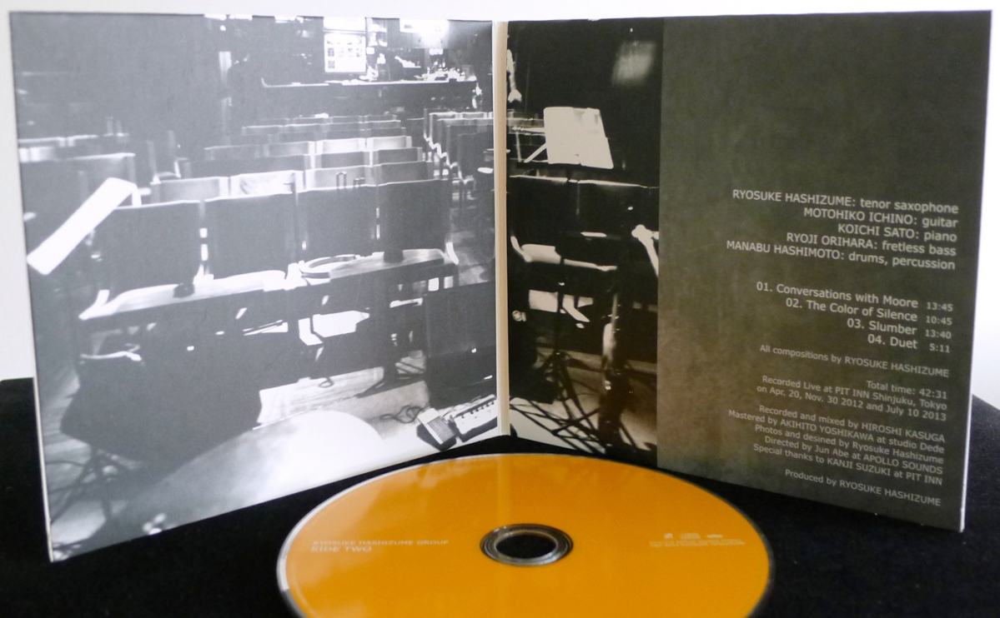
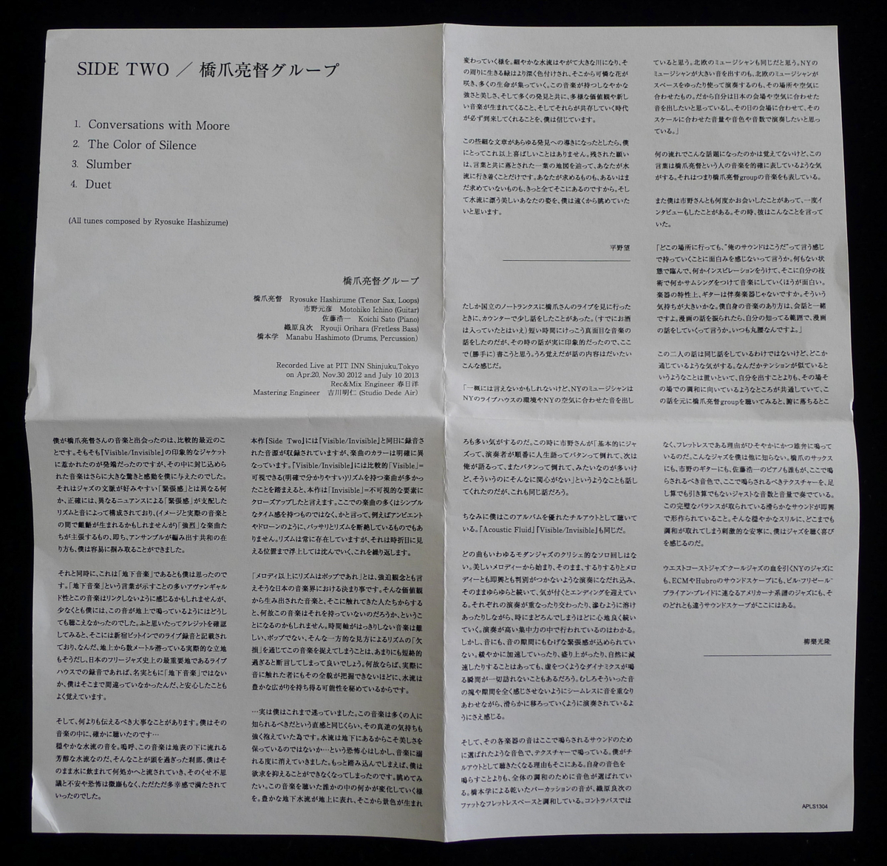

+++
title = "Ryosuke Hashizume Group: Side Two"
author = ["Brian McCrory"]
publishDate = 2024-11-08
keywords = ["ryosuke-hashizume-group-wordless", "ryosuke-hashizume-needful-things", "ryosuke-hashizume-group-acoustic", "ryosuke-hashizume-group-visible-invisible", "ryosuke-hashizume-group-incomplete-voices"]
tags = ["Ryosuke Hashizume", "橋爪亮督", "Motohiko Ichino", "市野元彦", "Koichi Sato", "佐藤浩一", "Ryoji Orihara", "織原良次", "Manabu Hashimoto", "橋本学"]
categories = ["albums"]
draft = false
aliases = ["/archive/ryosuke-hashizume-group-side-two/", "/p/ryosuke-hashizume-group-side-two/"]
[cover]
  image = "ryo-hashizume-side-two-460.jpeg"
  caption = ""
  relative = true
+++

Saxophonist and composer Ryosuke Hashizume has released six albums with the Ryosuke Hashizume Group over nearly two decades. These albums feature Hashizume’s uniquely original compositions played by his long-running group. This group has mainly been a quintet (of sax, guitar, piano, bass, and drums) with many of the same members present throughout the years.

In particular, guitarist Motohiko Ichino and fretless electric bassist Ryoji Orihara have been a constant and large part of the sound of the group. They are brilliant electric partners to Hashizume’s breathy and sawtoothed acoustic sax sound (Hashizume also dips into electricity a bit when playing his sax as cycles and drones looped through a device, occasionally).

With his other main live and recording partners pianist Koichi Sato and drummer Manabu Hashimoto (and some other members along the way), the group has developed the alternately freely abstract and grooving sound that has explored, finessed, and breathed life into his music over many years.

That flexible and imaginative sound is made up of subtly serrated edges of saxophone, digitized guitar tones like signals from outer space, tender piano touches and finessed melodic fragments, fluffy mists and lightning of drumset accents, and thick currents of low bass notes. The sound is both shapeshifting and solid.

This is applied to Hashizume’s compositional ideas of ethereal lushness, with all of its colorful layers of sound, transforming tonalities, nuanced time and meter misdirection, and dramatic development and suspense. These compositional ideas, together with the group’s sound and individual mastery, are the novel recipes that are interpreted through the musicians’ steady cooking for inspired, enjoyable results.

This 2014 album, _Side Two_, is his second-most recent album and was released a few years before his latest album _[Incomplete Voices](https://www.jazzofjapan.com/archive/ryosuke-hashizume-group-incomplete-voices)_ from 2017. Yet, as a marker on Hashizume’s album release timeline, _Side Two_ has an even stronger connection to the two prior albums released just before _Side Two_, those being his albums [_Visible/Invisible_](https://www.jazzofjapan.com/archive/ryosuke-hashizume-group-visible-invisible) (2013) and [_Acoustic Fluid_](https://www.jazzofjapan.com/archive/ryosuke-hashizume-group-acoustic) (2012). In a way, _Side Two_ could be considered a combination of live extras and alternate versions of songs from those two prior albums and recording sessions.

With a 44-minute runtime, _Side Two_ contains just four tracks (Hashizume’s original compositions, as with all his albums). The songs were all recorded live during the same performances, and with the same members, as the songs on _Visible/Invisible_. This fact can give meaning to the title _Side Two_ when interpreting this album as a continuation of the previously released live album.

But, additionally, three of the songs on _Side Two_ were also featured on Hashizume’s 2012 studio album _Acoustic Fluid_, although here with longer run times:

1.  Conversations with Moore (_Side Two_: 13:48 / _Acoustic Fluid_: 8:04)

2.  The Color of Silence (_Side Two_: 10:49 / _Acoustic Fluid_: 4:20)

3.  Slumber (_Side Two_: 13:44 / _Acoustic Fluid_: 7:50)

4.  Duet  (_Side Two_: 5:12 / not on _Acoustic Fluid_)

The album opens on solid ground with light rhythms and a short repeated piano motif. Otherworldly melodies float around faded guitars, scratchy brushes, and shimmering cymbals with a feeling of curiosity and eeriness. The next song is more abstract with a loose time feel. Long notes flow freely with tones of cautious storytelling. Suspenseful drama builds, rising and falling through the controlled touch of all five musicians acting as one. Track three builds slowly towards energetic excitement through longer melodies played in unison over echoey guitar arpeggios, repeated vamps, interesting time signature changes, breaks, and shifting structures. Finally, encore-like, the album wraps up with five minutes of the mellow and uplifting sounds of a swaying waltz with old-world charm and plenty of captivating sax, piano, and group improvisation and interplay.

All this together makes 2014’s _Side Two_ a delight especially for diehard fans, as it becomes both an extension of the 2013 live album and of the 2012 studio album with three of the songs in alternate extended versions. These extended versions get more time to breathe with more life and patient development. For the listeners, more time to absorb and dwell in these aural environments. And for the musicians who recorded this live and in the moment, no doubt more time to enjoy the freedom to give and receive inspiration from each other, from the performance setting, and from the live audience who was silently tuned in and becoming part of the experience.

## Liner Notes {#liner-notes}

_(Translated from an excerpt of Nozomi Hirano’s and Mitsutaka Nagira’s original Japanese liner notes.)_

…

This album, _Side Two_, was recorded during the same sessions as _Visible/Invisible_, but the colors of the songs are clearly distinct. Considering that _Visible/Invisible_ could be considered relatively “visible” with many songs having visible (easy to catch) rhythms, this album _Side Two_ could be called “invisible” with a close-up on unseen elements. Many of the songs here do not have simple time senses, but that’s not to say that they are completely devoid of rhythm like ambient or drone, for instance. The rhythm is always there as it surfaces to places where it can be seen, to submerge again, and to repeat.

…

If I recall correctly, I was able to chat with [Ryosuke] Hashizume a little bit at the bar when I went to his performance at No Trunks in Kunitachi. Putting aside the fact that I had already been drinking, we had a pretty serious discussion about music in this short interval. It left quite an impression on me so I thought I’d indulgently write that about here. My recollection is vague but the substance of the conversation was along these lines.

“It’s hard to generalize but I think that New York musicians play notes that match their jazz bars, that environment, and the atmosphere of New York. It’s the same for Nordic musicians. The sound of New York musicians may be loud, or Nordic musicians may use space in a relaxed manner when performing… it’s a question of how they adapt to the place and atmosphere. Similarly, I want to put out sounds that match Japan’s places and atmospheres, and I want to perform with a volume, tone, and phrasing that matches the location and the scale of the venue on that day.”

I don’t remember how we ended up talking about this, but I have the feeling that these words are an apt description for the music of Ryosuke Hashizume. That is to say, they describe the Ryosuke Hashizume Group.

I’ve also met [Motohiko] Ichino a few times, and I interviewed him once, when he said the following.

“Wherever I go, I don’t find it that interesting to go to the place with a feeling like ‘/this is my sound/.’ It’s more interesting to arrive with nothing in store, get some kind of inspiration, and then use my skills to add something to it to make it music. As instrument characteristics go, the guitar is an accompaniment instrument, isn’t it? That may play a big part. My way of making music is the same as having a conversation. If something is brought up, say, for instance, manga, I’ll try to talk about manga to the extent that I can. I’m always unarmed, you know.”

Although my conversations with these two musicians were different, I felt that they had something in common. Apart from having a similar tension somehow, there was a commonality in gravitating to harmonize with each distinct environment rather than putting themselves out in front. Listening to the Ryosuke Hashizume Group with these conversations in mind, I could understand a lot more.

Ichino continued, “Basically in jazz, it’s common to find players taking turns, telling life stories with a bang and then giving way, then the next player tells a story, bang, and gives way… I’m not very interested in that.” This conversation that I had with Ichino was probably about the same ideas.

By the way, for me, listening to this album is excellent for chilling out. So are _Acoustic Fluid_ and _Visible/Invisible_.

None of the songs make use of the “modern jazz cliché” of cycling through solos. A beautiful melody starts and flows smoothly into a performance where the melody and improvisation surge in and become hard to distinguish, continually swaying before subtly reaching the ending. Each performance overlaps and intersects, blurs together, and continues in a relaxed way that makes you lose track of time. You can tell that the music is played with a high degree of concentration. But there’s no excessive tension in the notes or the spaces between the notes. Although there are moments of gradual acceleration, crescendos, or natural deceleration, there is never a time where dynamics are used inappropriately or to catch listeners off guard. If anything, you can only hear a performance where the notes overlap seamlessly and transition smoothly, without being aware of note groupings and pauses.

Also, the sound of each instrument rings with a tone and texture that seems to have been chosen for the sound to be heard here. This is also a reason why I began to like listening to this for chilling out. The tones are chosen for the overall sound more than for their own individual sounds. Manabu Hashimoto’s dry percussion sounds harmonize with Ryoji Orihara’s thick fretless bass. The reason for having a fretless bass rather than an upright bass is quietly but eloquently heard. I don’t know of any other jazz like this. And, along with Hashizume’s sax, Ichino’s guitar, and Koichi Sato’s piano, everyone plays just the right number of notes and volume for the tone and texture here, without addition or subtraction. The perfectly balanced and smooth sound is built through the improvisation. This gentle thrill is the joy I feel when listening to jazz with the stimulating tranquility of everything in harmony. Considering New York jazz descended from West Coast and cool jazz, or the soundscapes of ECM and Hubro, or the Americana lineage related to Bill Frisell and Brian Blade, this is a different soundscape from all of those.



## Side Two by Ryosuke Hashizume Group {#side-two-by-ryosuke-hashizume-group}

-   [Ryosuke Hashizume](/tags/ryosuke-hashizume) - tenor sax, loops
-   [Motohiko Ichino](/tags/motohiko-ichino) - guitar
-   [Koichi Sato](/tags/koichi-sato) - piano
-   [Ryoji Orihara](/tags/ryoji-orihara) - fretless bass
-   [Manabu Hashimoto](/tags/manabu-hashimoto) - drums, percussion

Released in 2014 on Apollo Sounds as APLS-1410.

_Japanese names: 橋爪亮督 Hashizume Ryosuke 市野元彦 Ichino Motohiko 佐藤浩一 Sato Koichi 織原良次 Orihara Ryoji 橋本学 Hashimoto Manabu_

## Audio and Video {#audio-and-video}

-   [Promotional video for this album:](https://youtu.be/4QUUYC_JYk0)



-   [Audio for Ryosuke Hashizume Group’s “The Last Day of Summer”](https://soundcloud.com/hashizume-ryosuke/the-last-day-of-summer?utm_source=clipboard&utm_medium=text&utm_campaign=social_sharing)

-   Excerpt from track #3: “Slumber” [mix #12](https://www.jazzofjapan.com/archive/audio/#mix-12)


