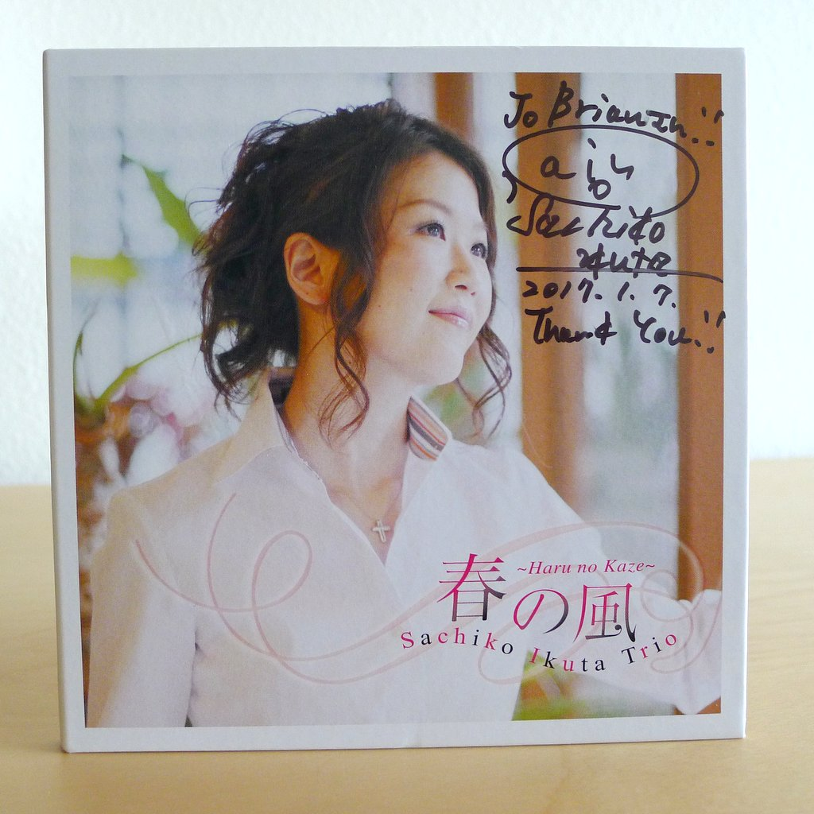
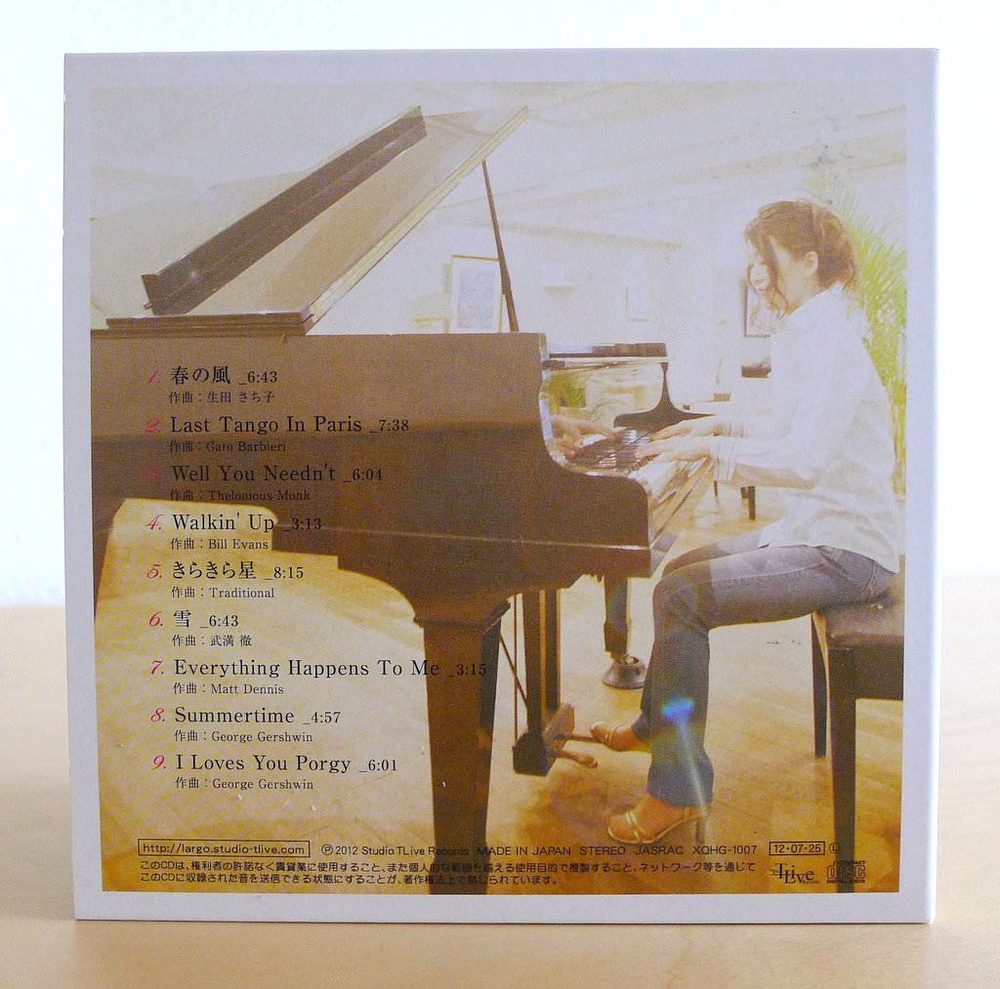

+++
title = "Sachiko Ikuta Trio: Haru No Kaze"
author = ["Brian McCrory"]
publishDate = 2018-03-04
tags = ["Sachiko Ikuta 生田さち子", "Hideaki Kanazawa 金澤英明", "Shun Ishiwaka 石若駿", "Terumasa Hino 日野皓正"]
categories = ["albums"]
draft = false
[cover]
  image = "sachikoikuta-haru-460.jpeg"
  relative = true
+++

A jazz pianist who balances lyricism with boldness, Sachiko Ikuta leads a piano trio on _Haru No Kaze (Spring Wind)_ from 2012. Legendary jazz trumpeter Terumasa Hino also joins on two songs, adding an adventurous splash of avant-garde improvisation to the album.

Starting with the title track “Haru No Kaze”, the sense of an overture is felt through the light Japanese touches of a sweet melody which turns into the whirling winds of a solid jazz piano trio locking into a tune together. The next track, “Last Tango In Paris”, introduces a mood of evocative drama and intrigue with a relaxed beat.

The album’s nine songs feature classic jazz standards, songs by Bills Evans and Thelonious Monk, two original compositions, and a charming reconstruction of “Twinkle Twinkle Little Star” which swings gracefully. Ikuta even puts her well-rounded solo piano on display with a confident rendition of “Everything Happens To Me”, showcasing her dedication to the tradition of great jazz pianists.



## Haru No Kaze by Sachiko Ikuta Trio {#haru-no-kaze-by-sachiko-ikuta-trio}

-   [Sachiko Ikuta](https://ameblo.jp/sachiko3ikuta/) - piano
-   [Hideaki Kanazawa](http://kanabass.web.fc2.com/) - contrabass
-   [Shun Ishiwaka](http://www.shun-ishiwaka.com/) - drums
-   [Terumasa Hino](https://www.terumasahino.com/) - trumpet, cornet (#3, 6)

Released in 2012 on Studio TLive Records as XQHG-1007.

_Japanese names: 生田さち子 Ikuta Sachiko 金澤英明 Kanazawa Hideaki 石若駿 Ishiwaka Shun 日野皓正 Hino Terumasa_

## Audio and Video {#audio-and-video}

-   [The Sachiko Ikuta Trio performing “Haru no Kaze”:](https://youtu.be/pIkMEHuNDDs)



-   Excerpt from track #1: “春の風 (_Spring Breeze_)” [mix #2](https://www.jazzofjapan.com/archive/audio/#mix-2)


