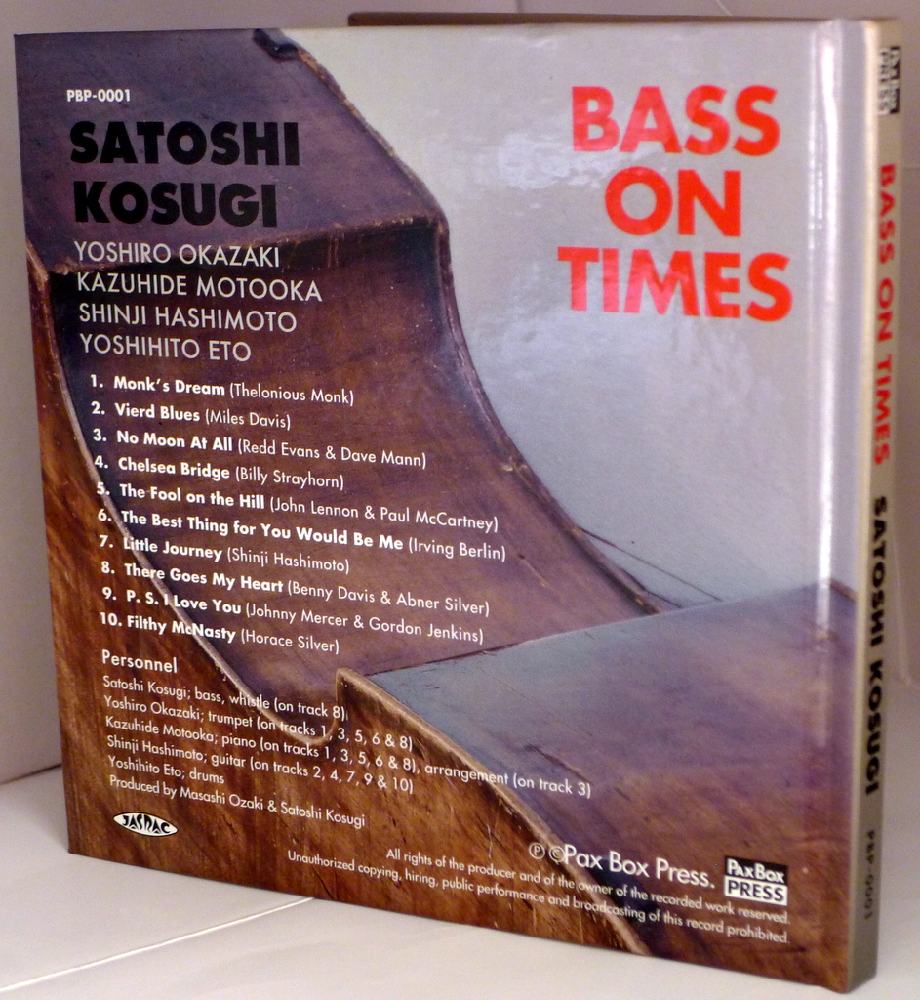
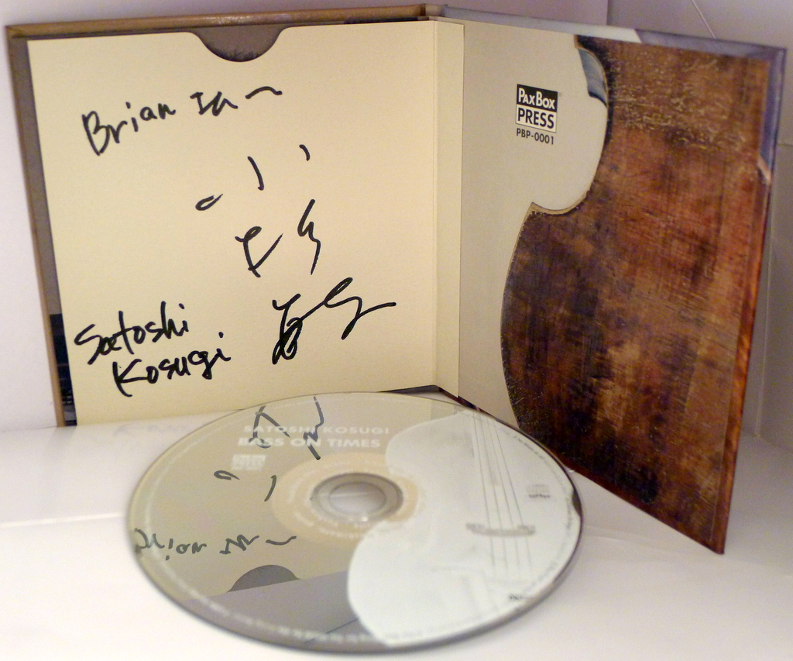
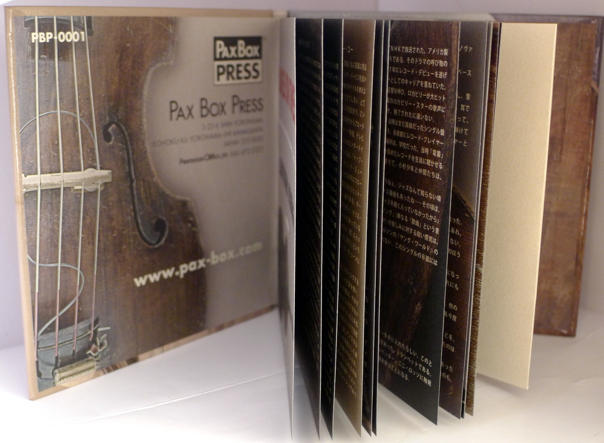

+++
title = "Satoshi Kosugi: Bass on Times"
author = ["Brian McCrory"]
publishDate = 2018-02-08
tags = ["Satoshi Kosugi 小杉敏", "Yoshiro Okazaki 岡崎好朗", "Kazuhide Motooka 元岡一英", "Shinji Hashimoto 橋本信二", "Yoshihito Eto 江藤良人"]
categories = ["albums"]
draft = false
[cover]
  image = "satoshikosugi-bassontimes-460.jpeg"
  relative = true
+++

_Bass on Times_ is a 2009 album from jazz bassist Satoshi Kosugi, a well-known and active musician in Japan’s jazz scene spanning several decades. For this recording, Kosugi assembles familiar partners and veteran players such as the bluesy Shinji Hashimoto on guitar and Kazuhide Motooka on piano, to deliver hard-swinging standards such as “Monk’s Dream”, “Vierd Blues”, and “The Best Thing For You Would Be Me”. With good arrangements and strong bass, naturally, the well-established musicians deliver quality jazz with a genuine good spirit throughout this satisfying record. One happy highlight even has Kosugi joyfully whistling the melody on “There Goes My Heart” as he doubles with his bass line to open and close the swinging tune.

## Bass on Times by Satoshi Kosugi {#bass-on-times-by-satoshi-kosugi}

-   [Satoshi Kosugi](http://www7b.biglobe.ne.jp/kosugibass/) - bass
-   [Yoshiro Okazaki](http://www.yoshirojazz.sakura.ne.jp/) - trumpet
-   [Kazuhide Motooka](https://www.discogs.com/artist/1652824-Kazuhide-Motooka) - piano
-   [Shinji Hashimoto](https://session67.jp/interview/05/) - guitar
-   [Yoshihito Eto](http://eto.mockhillrecords.com/) - drums

Released in 2009 on Pax Box Press as PBP-0001.

_Japanese names: 小杉敏 Kosugi Satoshi 岡崎好朗 Okazaki Yoshiro 元岡一英 Motooka Kazuhide 橋本信二 Hashimoto Shinji 江藤良人 Eto Yoshihito_

## Audio and Video {#audio-and-video}

-   [Satoshi Kosugi with Kanji Ohta and Kenichiro Murata playing “Chasin’ the Bird”:](https://youtu.be/mKf9_Mg3gEk)



-   Excerpt from track #1: “Monk's Dream” [mix #1](https://www.jazzofjapan.com/archive/audio/#mix-1)


