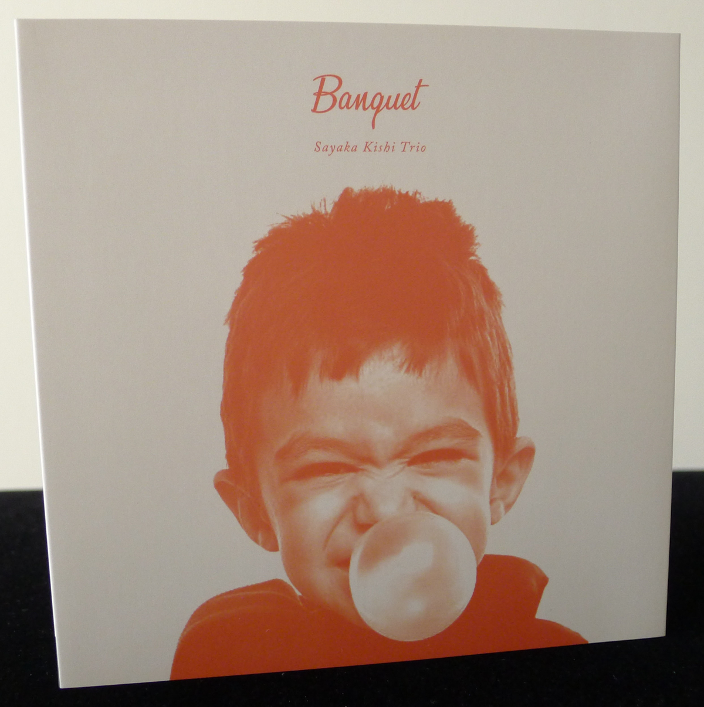
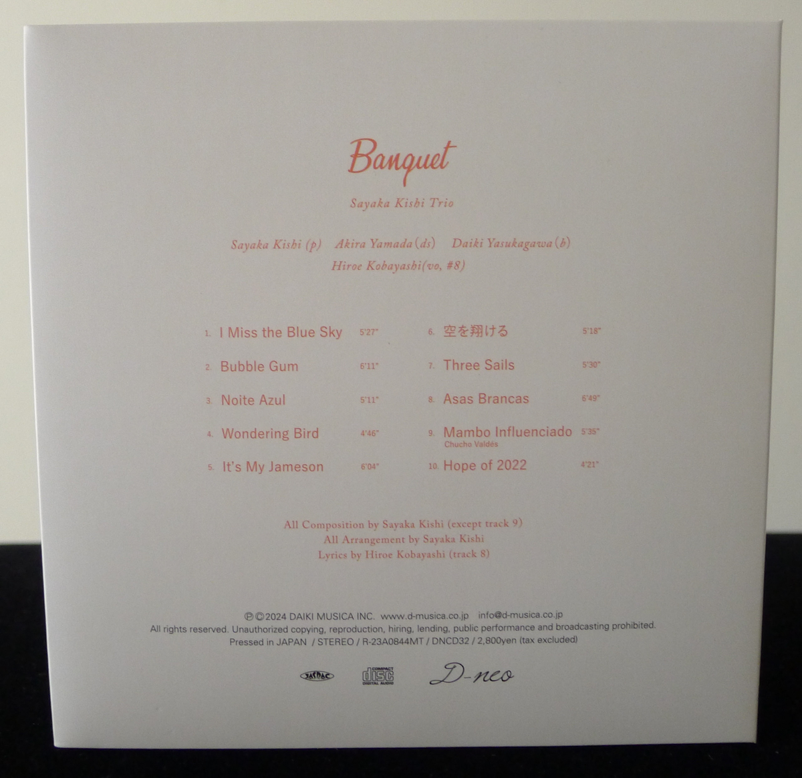
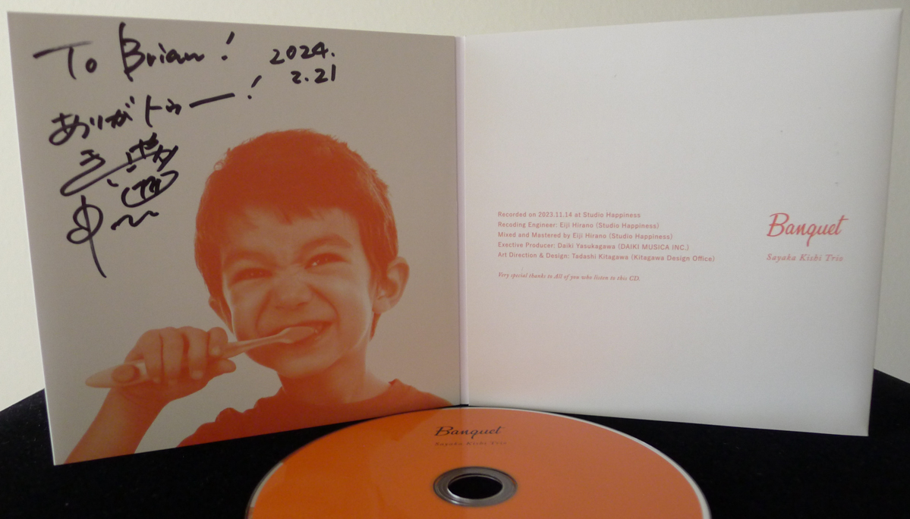
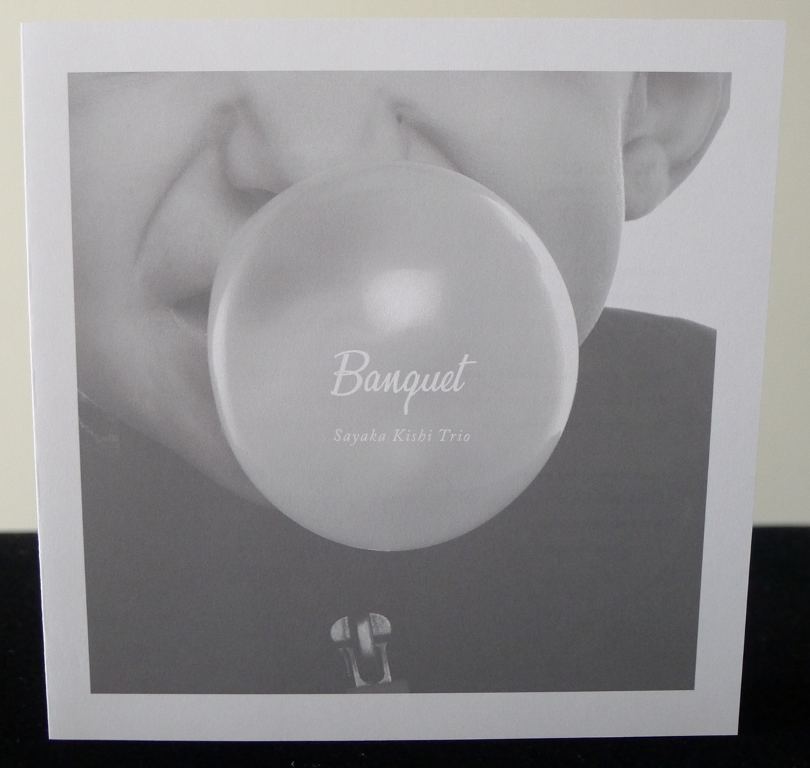
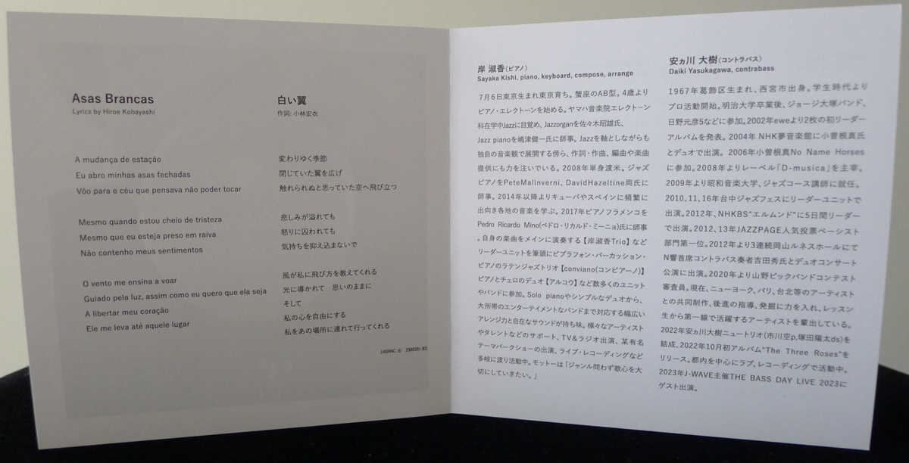
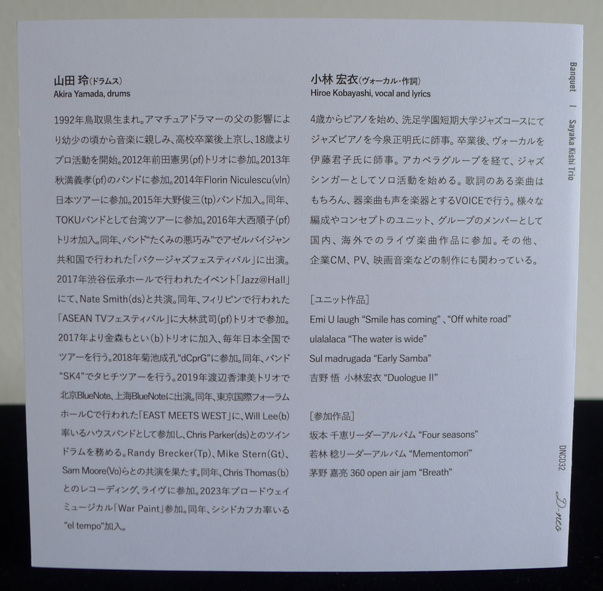
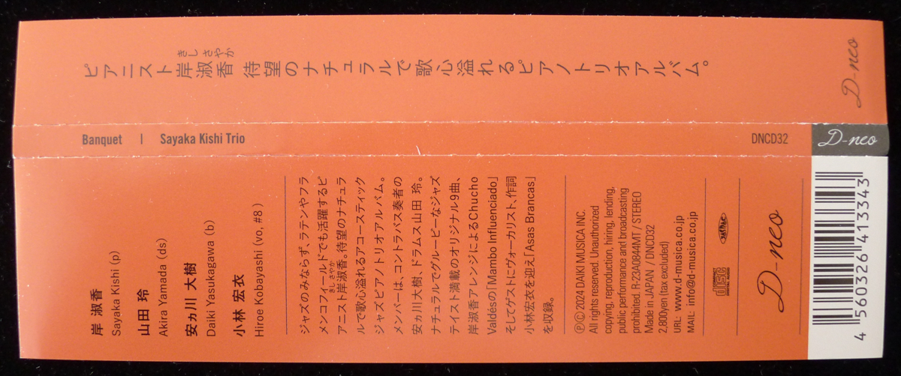

+++
title = "Sayaka Kishi Trio: Banquet"
author = ["Brian McCrory"]
publishDate = 2024-09-13
keywords = ["sayaketts-colors", "sayaka-kishi-featuring-te", "arco-asymmetry", "arco-live-at-yoncha", "arco-birth", "sayaka-kishi-trio-life-is-too-great", "sul-madrugada-luar"]
tags = ["Sayaka Kishi 岸淑香", "Akira Yamada 山田玲", "Daiki Yasukagawa 安ヵ川大樹", "Hiroe Kobayashi 小林宏衣"]
categories = ["albums"]
draft = false
[cover]
  image = "sayaka-kishi-trio-banquet-460.jpeg"
  relative = true
+++

On _Banquet_, pianist and composer Sayaka Kishi’s latest album from 2024, her piano trio brightens things up with a banquet of delights. Kishi has long been a musician who loves to explore and mix genres with a sense of fun and dedication, and she is often found playing in Latin, Afro-Cuban, flamenco, fusion, and other groups. While the genres are many, Kishi consistently pulls from her knowledge of jazz standards, pop, classical, and other roots, bound together with swing and Latin beats and ad-libbed improvisation.

This particular album of hers was released under the Sayaka Kishi Trio name and is a follow-up to the same trio’s previous recording _[Life Is Too Great](https://www.jazzofjapan.com/archive/sayaka-kishi-trio-life-is-too-great)_ (2019). Also as such, the trio music on this album tends towards primarily jazz influences. Meanwhile, her other recent releases with various groups (piano/cello, piano/vocals, congos/vibraphone/piano, sax/organ/drums, etc) span colorful moods with different instrumentalists playing across genres.

Invoking the simple pleasures of chewing bubble gum with a playful, mild rebelliousness, the ten tracks start excitedly with the peppy opener “I Miss the Blue Sky”, pop-funk of “Bubble Gum”, and the calm and memorable “Noite Azul” moving in five-four time. The nine Kishi compositions (and one cover song) subtly reflect Kishi’s humorous personality while being mindfully crafted with nuanced changes, rhythmic surprises, and unexpected elements tucked away in corners throughout the album.

The opening track’s first section, for example, launches from a bouncing and carefree theme and immediately moves to a two-minute swinging conversation between bass and drums as the harmonic underpinning moves through several musical keys. Variety, twists, and sharp ideas continue to play out inconspicuously throughout Kishi’s music, like her unique spice or secret ingredient.

The next four songs “Wondering Bird”, “It’s My Jameson”, “Sora wo Kakeru”, and “Three Sails” continue to explore fun terrain with jazz moods infused with folky country, groovy shuffle, Bacharachesque emotive pop, and jazz/Latin bop in a Horace Silver hue. The music feels bright and brisk and is especially enhanced by the captivating dynamics, strength, and skills of Yasukagawa’s bass and Yamada’s drums.

Guest vocalist Hiroe Kobayashi (her partner in the group Sul Madrugada and their 2022 release _[Luar](https://www.jazzofjapan.com/archive/sul-madrugada-luar)_) adds evocative vocals and lyrics to the next song, #8 “Asas Brancas” for a cheery foreign trip, continuing into Chucho Valdez’s “Mambo Influenciado” for some rousing peaks. Finally, the album closes with Kishi’s “Hope of 2022” for a smooth and laidback finale, sweet as dessert.

## Banquet by Sayaka Kishi Trio {#banquet-by-sayaka-kishi-trio}

-   [Sayaka Kishi](http://www.sayaketto.net/) - piano
-   [Akira Yamada](https://akry0325.wixsite.com/akira-y-drums) - drums
-   [Daiki Yasukagawa](http://daikiyasukagawa.com/) - bass
-   [Hiroe Kobayashi](https://hirosnoopyhiro.wixsite.com/mysite) - vocals (#8)

Released in 2024 on Daiki Musica as DNCD-32.

_Japanese names: 岸淑香 Kishi Sayaka 山田玲 Yamada Akira 安ヵ川大樹 Yasukagawa Daiki 小林宏衣 Kobayashi Hiroe_

## Audio and Video {#audio-and-video}

-   [Sayaka Kishi Trio playing her composition “Kin no Bitou” in 2019:](https://youtu.be/Oto0e7hAqzQ)



-   [D-musica page for this album with audio samples](https://d-musica.co.jp/?p=508)

-   Excerpt from track #1: “I Miss the Blue Sky” [mix #11](https://www.jazzofjapan.com/archive/audio/#mix-11)


