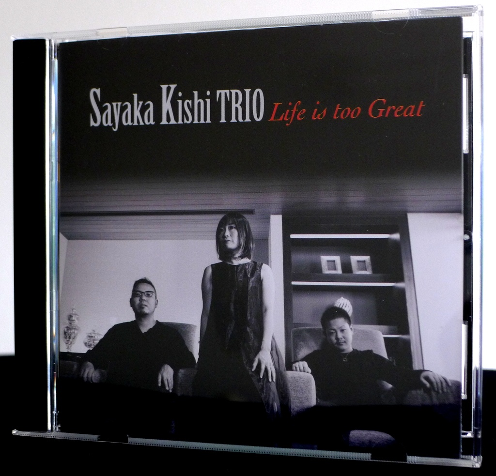
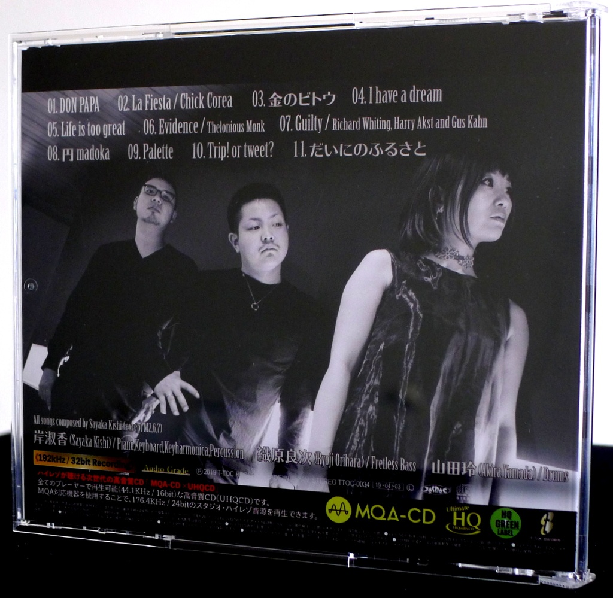
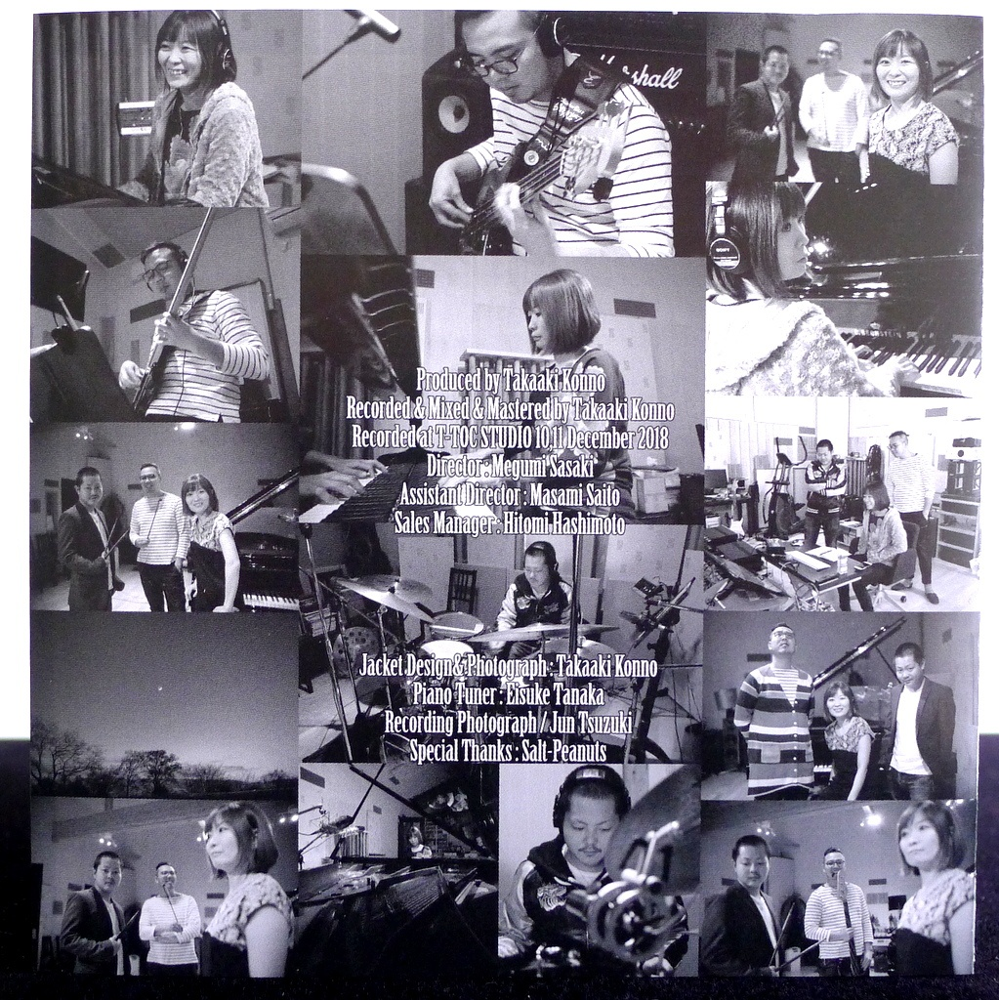
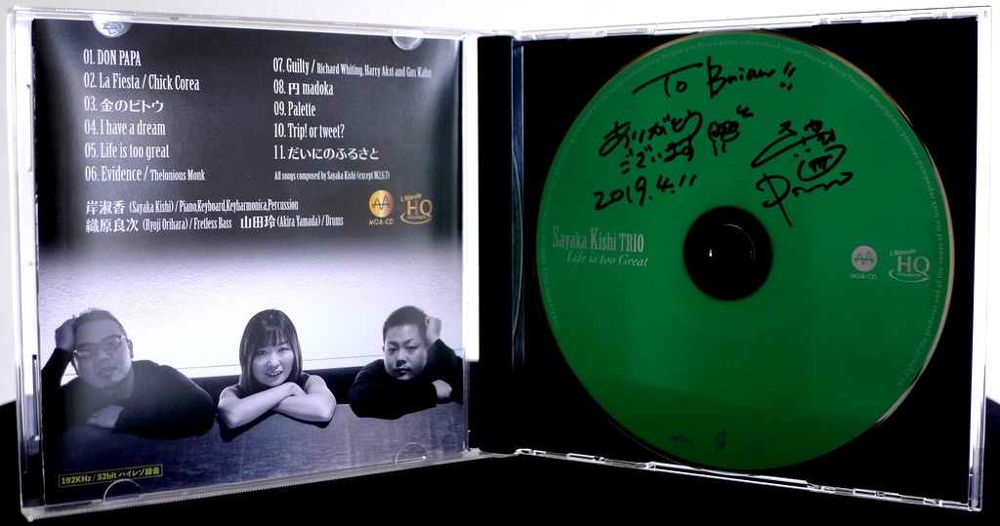
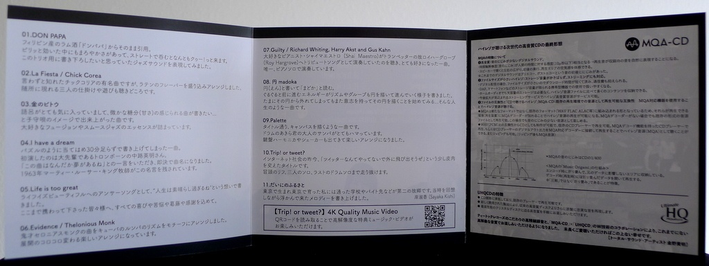

+++
title = "Sayaka Kishi Trio: Life Is Too Great"
author = ["Brian McCrory"]
publishDate = 2019-09-04
tags = ["Sayaka Kishi 岸淑香", "Ryoji Orihara 織原良次", "Akira Yamada 山田玲"]
categories = ["albums"]
draft = false
[cover]
  image = "sayakakishi-lifeis-460.jpeg"
  relative = true
+++

Expressing an exuberance for life with an original jazz spirit, _Life Is Too Great_ from the Sayaka Kishi Trio is a vivid recording, full of variety and infused with the pure music spirit of Sayaka Kishi.

Active in many groups and collaborations, Kishi returns to the classic piano trio form on _Life Is Too Great_ and leads a powerhouse jazz trio, showcasing talent and songwriting with new original tunes, with the ever-hardy, invigorating Ryoji Orihara on fretless bass and crisp rhythmic master Akira Yamada on drums.

From the swinging modern-jazz opener “DON PAPA”, the trio sparks a fire, and with such variety on the album highlights abound: the smooth fusion groove “Kin No Doto”, the darkly dramatic and tense “Madoka”, and the snappy up-beat samba “Palette” are all addictively ear-catching tunes. In addition, the album includes cleverly-arranged jazz on “I Have A Dream”, Sayaketts-style funky pop jazz on “Trip! or Tweet?”, and honestly sweet ballads on “Life Is Too Great” and “Dai Ni No Furosato”, a great album-closer full of emotion and charm.

In addition to her eight original offerings, three cover songs are included: Chick Corea’s “La Fiesta”, Thelonious Monk’s “Evidence”, and the jazz standard “Guilty”, performed as a dreamy piano solo.

On _Life Is Too Great_, Kishi’s tunes and performances are great and full of life, prismatic and memorable, befitting this polished modern jazz trio.

## Life Is Too Great by Sayaka Kishi Trio {#life-is-too-great-by-sayaka-kishi-trio}

-   [Sayaka Kishi](http://www.sayaketto.net/) - piano, keyboard, keyharmonica, percussion
-   [Ryoji Orihara](https://linktr.ee/ryojiorihara) - fretless bass
-   [Akira Yamada](https://akry0325.wixsite.com/akira-y-drums) - drums

Released in 2019 on T-TOC Records as TTOC-0034.

_Japanese names: 岸淑香 Kishi Sayaka 織原良次 Orihara Ryoji 山田玲 Yamada Akira_

## Audio and Video {#audio-and-video}

-   [Promotional video for this album:](https://youtu.be/UQTR60p8qyE)



-   Excerpt from track #1: “DON PAPA” [mix #5](https://www.jazzofjapan.com/archive/audio/#mix-5)


