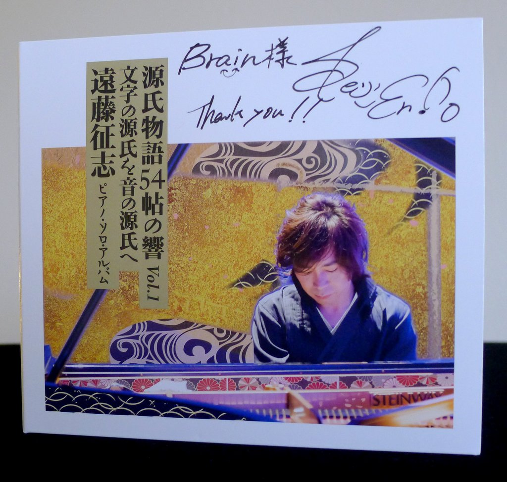
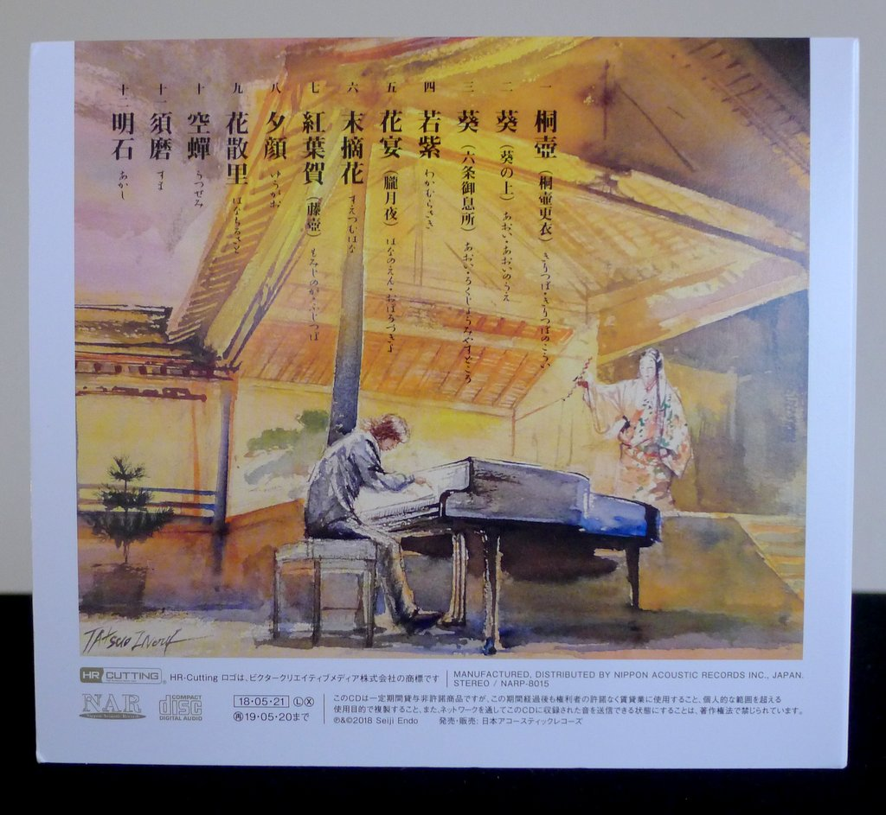
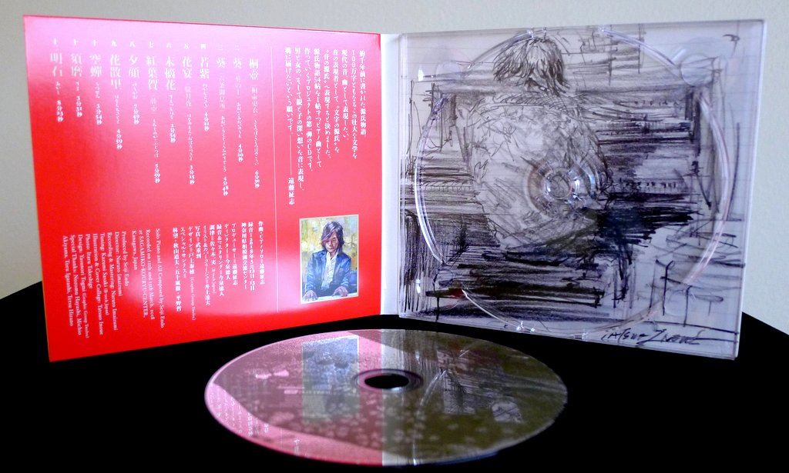
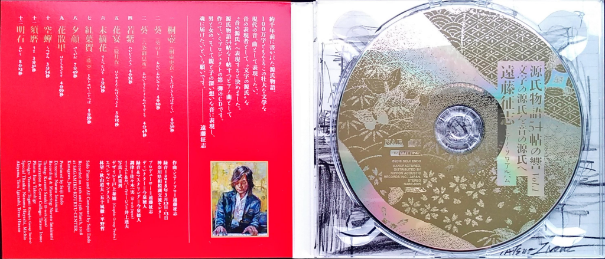

+++
title = "Seiji Endo: Genji Monogatari Volume 1"
author = ["Brian McCrory"]
publishDate = 2019-07-16
tags = ["Seiji Endo", "遠藤征志"]
categories = ["albums"]
draft = false
[cover]
  image = "seijiendo-genji-460.jpeg"
  relative = true
+++

Through a beautiful piano sound with deep reverberations, Seiji Endo’s latest solo album releases atmospheric music as if arising from the dreams and memories of ancient Japan. _Genji Monogatari Volume 1_ features the pianist performing his original compositions with dramatic textures woven from this ancient Japanese epic.

As with his previous albums _Sakura Meditations_ and _Circle For Peace_, Endo plays his entrancing music alone, freely and beautifully. On this album, the novel’s influence adds layers of exoticism to the dramatic compositions. The result is evocative and mysterious music that strikes the heart.

Endo uses scenes and characters from _The Tale of Genji_ to pull music from the text, from words to sounds (as in the extended title “Echoes of 54 Books: From the Words of Genji, Sounds of Genji”), in music that sounds classical and stately at times, romantic and sweet at other times, and innocent and playful at yet others. Throughout, the twelve songs are set against a backdrop of emotional lyricism, striking an ambiguous resignation between forlorn despair and flickering hopefulness.

Set among these musical facets, the listener may also pick up hints to classical works as well as others of Endo’s compositions, representing his imaginative fluidity while evoking the shaded atmospheres of Genji.

## Genji Monogatari Volume 1 by Seiji Endo {#genji-monogatari-volume-1-by-seiji-endo}

-   [Seiji Endo](/tags/seiji-endo) - solo piano and compositions

Released in 2018 on Nippon Acoustic Records as NARP-8015.

_Japanese names: 遠藤征志 Endo Seiji_

## Audio and Video {#audio-and-video}

-   [Seiji Endo performing his composition “Sun, Moon and Children Smile” (from his “Sakura Meditation” album) in Indonesia in 2014:](https://youtu.be/ZggxZ80F7ec)



-   Excerpt from track #1: “桐壺(桐壺更衣)(きりつぼ・きりつぼのこうい) (_Kiritsubo (Kiritsubo changing clothes) (Kiritsubo/Kiritsubo no Koi)_)” [mix #4](https://www.jazzofjapan.com/archive/audio/#mix-4)


