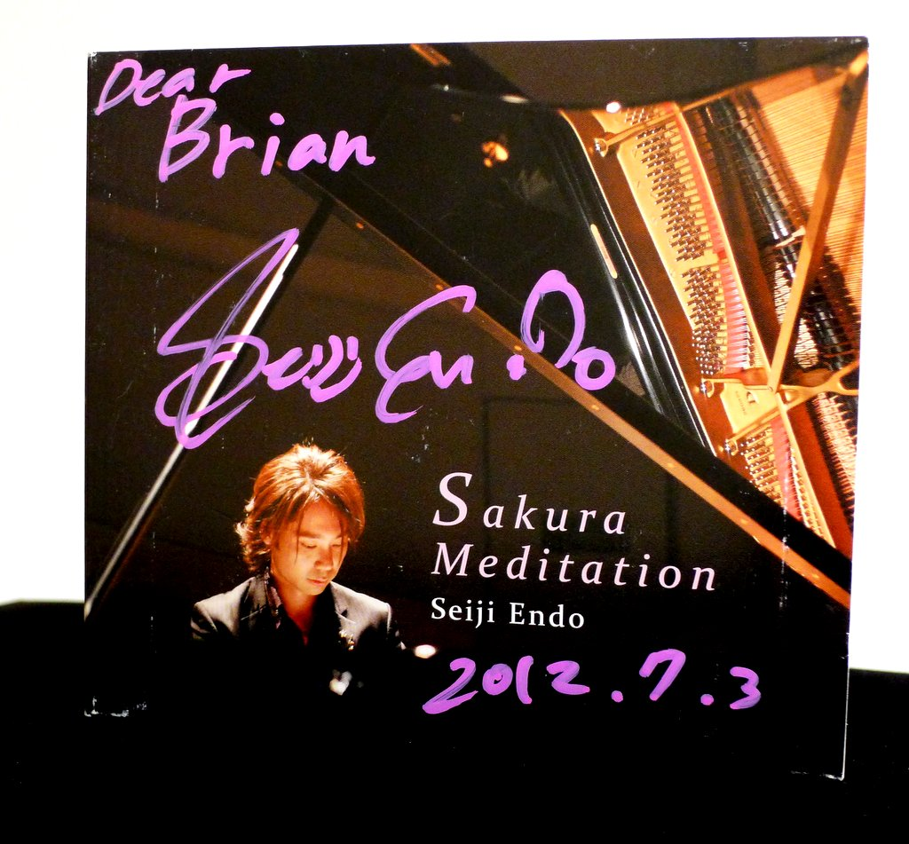
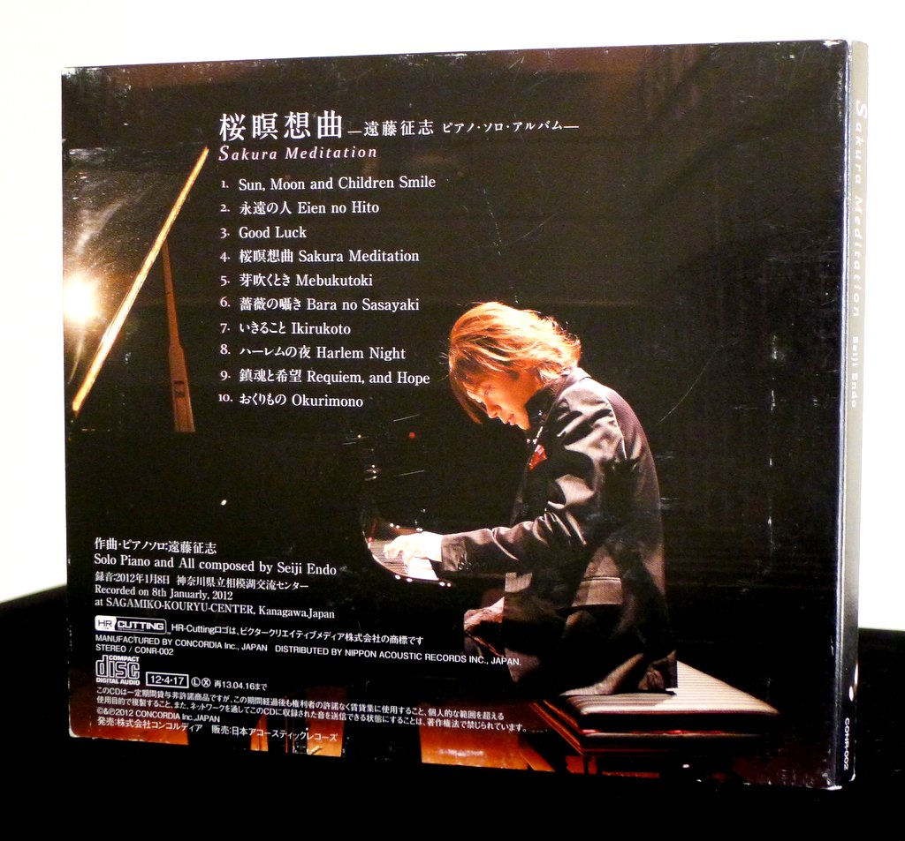
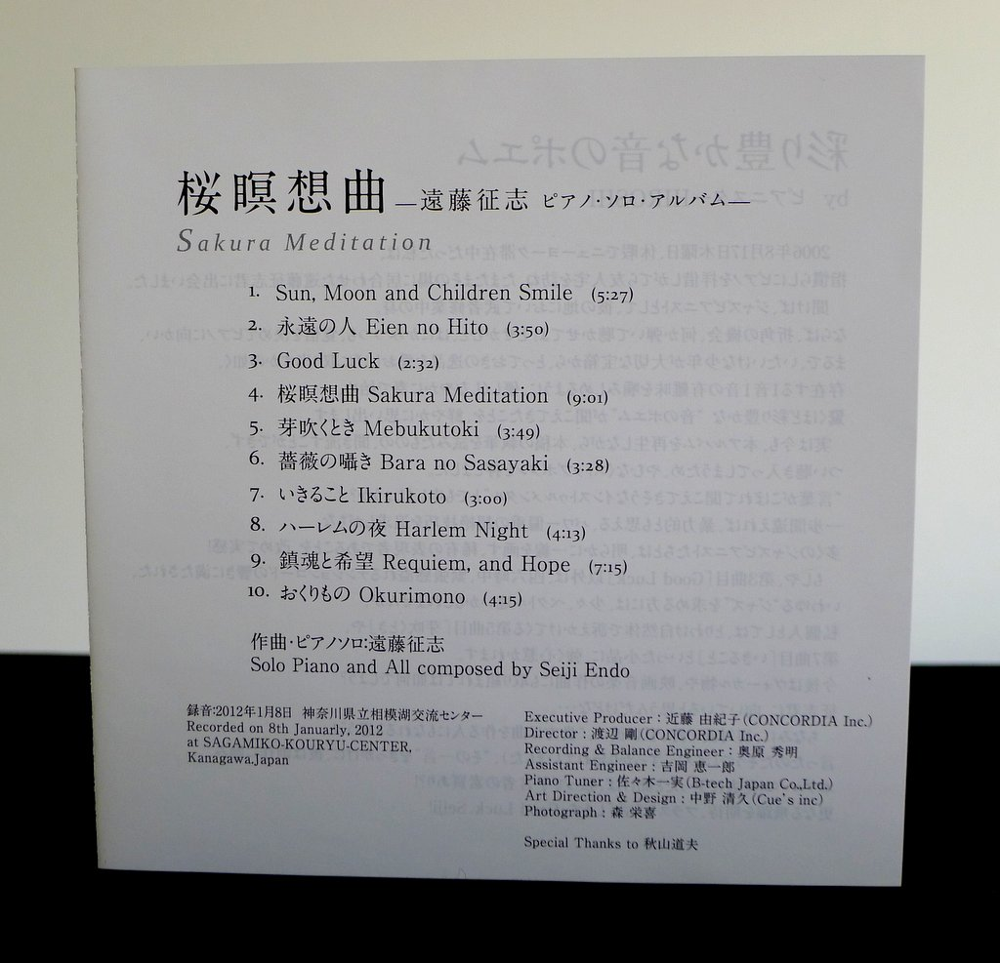
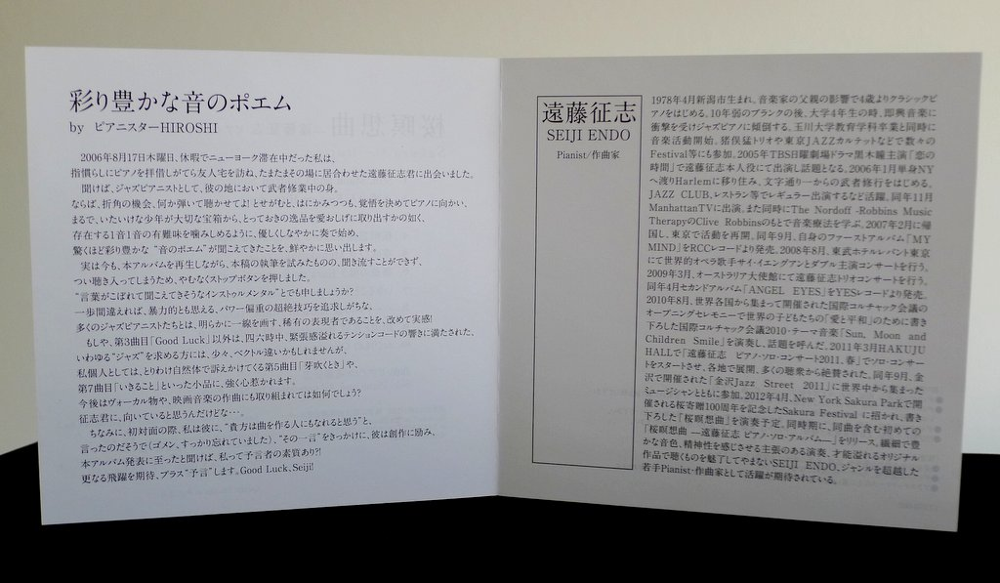

+++
title = "Seiji Endo: Sakura Meditation"
author = ["Brian McCrory"]
publishDate = 2018-10-22
keywords = ["naoko-akimoto-no-one-else", "seiji-endo-tsutaete-ikou", "ruriko-kawamura-blossoms", "rie-taguchi-gift", "seiji-endo-circle-for-peace", "hiroco-nagano-okurimono", "seiji-endo-genji-monogatari-volume-1", "rie-taguchi-the-gift-ii"]
tags = ["Seiji Endo", "遠藤征志"]
categories = ["albums"]
draft = false
[cover]
  image = "seijiendo-sakura-460.jpeg"
  relative = true
+++

_Sakura Meditation_ from pianist Seiji Endo is a gorgeous collection of evocative solo piano pieces. Through the ten tracks, Endo searches for and finds the perfect phrases and dramatic touches to draw out emotion from his beautiful and pure compositions.

Most of the songs are just three to five minutes long with strains of classical and slightly jazzy influences surface in the music. The music deeply evokes feelings ranging from pretty etude-like sketches to the childlike innocence of a lullaby, to pieces overflowing with romantic drama and emotional depth. Endo’s poetic style and his passion are directly focused through a soft touch and breath-like pulse: simplicity and brevity through understated effectiveness.

Particularly striking are the two longest songs which develop slowly and powerfully. The seven-minute #9 “Requiem and Hope” is a turbulent and profound exploration and plea, while the nine-minute title track #4 “Sakura Meditation” unfolds from a mysterious 5/4 opening, journeying through darkness until ultimately blooming in a graceful and inspiring resolution.



## Liner Notes {#liner-notes}

_(Translated from the original Japanese liner notes.)_

**Poetry of sound rich with color**

On August 17, 2006, I was on vacation in New York, and I stopped by a friend’s house to visit and exercise my fingers on his piano when I happened to meet Seiji Endo who was also there at that time.

I heard that he was on a mission, training to become a jazz pianist in his hometown. If that’s the case, I begged him, then please take this opportunity and play something for me, and although he was shy, he steadied his resolve and headed towards the piano. Almost like a young boy taking something precious out of a treasure chest and appreciating the value of the existence of each note, he began to play gently and with grace, and I vividly remember how surprised I was at hearing his poetry of sound rich with color.

Even now as I relisten to this album while trying to write this article, I have no choice but to press the stop button, as I can’t simply ignore the music without ending up being completely absorbed in listening to it.

Shall I call it “instrumental music where you can almost hear words spilling out”?

I once again experienced how the rare expressive person is set apart from the large number of jazz pianists who pursue superior techniques with an emphasis on power, where one mistake could be regarded as violent.

If you are looking for the type of so-called “jazz” filled with the sounds of tense chords constantly, this may be in a slightly wrong direction, with the possible exception of track #3 “Good Luck”.

Personally, track #5 “Mebukatoki” _(Time of Budding)_ especially appeals to me with its relaxed style, and I am incredibly drawn to short pieces such as #7 “Ikirukoto” (_To Live_).

What about composing vocal works or film music in the future, Seiji? I think it would suit you well.

Incidentally, it seems that at our first meeting I said to him “I think that you may also become a composer” (sorry, but I completely forgot about this). With this one sentence as impetus, he was encouraged to compose, and when I heard that this album was announced, I thought “Might I have the makings of a prophet?!”

I look forward to even more leaps forward, and in addition, I “predict” them. Good luck, Seiji!

_ピアニスターHIROSHI / Pianistar HIROSHI_

**SEIJI ENDO Pianist/Composer**

Seiji Endo was born in Nigata in April 1978. He started to play piano due to the influence of his musician father. After an almost ten-year break, while in his fourth year at university, he was inspired by improvisational music and devoted himself to jazz piano. He started working as a musician upon graduating from the department of education at Tamagawa University, including participating in many festivals and events with bands including the Takeshi Inomata Trio and the Tokyo Jazz Quartet.

In 2005, he appeared as himself on the 2005 television program _Koi no Jiken_ (_Time for Love_) starring Hitomi Kuroki on the TBS drama series _Nichiyou Gekijou_ (_Sunday Night Theater_) and garnered more attention.

In January 2006, he moved to New York on his own to live in Harlem and start his training from scratch. He was active as a regular performer at jazz clubs, restaurants, and the like. In November he appeared on Manhattan cable television. Also in the same year, he studied music therapy under Clive Robbins of the Nordoff-Robbins Music Therapy Foundation.

In February 2007, he returned to Japan and resumed his activities in Tokyo. In September, his first album _My Mind_ was released on RCC Records.

In August 2008, he co-starred in a double concert with international opera singer Sai Yanguang at Tobu Hotel Levant.

In March 2009, a Seiji Endo Trio concert was held at the Australian Embassy. In April, his second album _Angel Eyes_ was released on Yes Records.

In August 2010, he wrote the theme music “Sun, Moon and Children Smile” as a message of “love and peace” for the children of the world, which became a topic of conversation. This was performed during the opening ceremony of the International Korczak Association 2010 with events held by those who had gathered from countries around the world.

In April 2011, his solo concert series began with the “Seiji Endo Piano Solo Concert, Spring 2011” at Hakuju Hall, continuing to various locations and receiving high praise from many audiences. In September, he played at the Kanazawa Jazz Street 2011 together in Kanazawa with musicians who came from all around the world.

In April 2012, he was invited to perform at the Sakura Festival in New York Sakura Park to commemorate the 100th anniversary of Japan’s donation of cherry blossom trees, where plans to perform his new composition _Sakura Meditation_ there. Around the same time, he will also release his _Sakura Meditation Seiji Endo Piano Solo Album_ with the same composition for the first time.

With his delicate and rich tone colors and performances with a strong sense of spirituality, Seiji Endo’s original works are endlessly fascinating and overflowing with talent. We look forward to his continued activities as a young pianist and composer who transcends genres.



## Sakura Meditation by Seiji Endo {#sakura-meditation-by-seiji-endo}

-   [Seiji Endo](/tags/seiji-endo) - piano, composition

Released in 2012 on Concordia as CONR-002.

_Japanese names: 遠藤征志 Endo Seiji_

## Audio and Video {#audio-and-video}

-   [Seiji Endo playing “Sakura Meditation”, track #4, live in 2013:](https://youtu.be/CrcbwOTOeSM)



-   [Seiji Endo playing “Eien no Hito”, track #2, live in 2020:](https://youtu.be/GgfB0DMq9SI)



-   Excerpt from track #1: “Sun,Moon and Children Smile” [mix #3](https://www.jazzofjapan.com/archive/audio/#mix-3)


