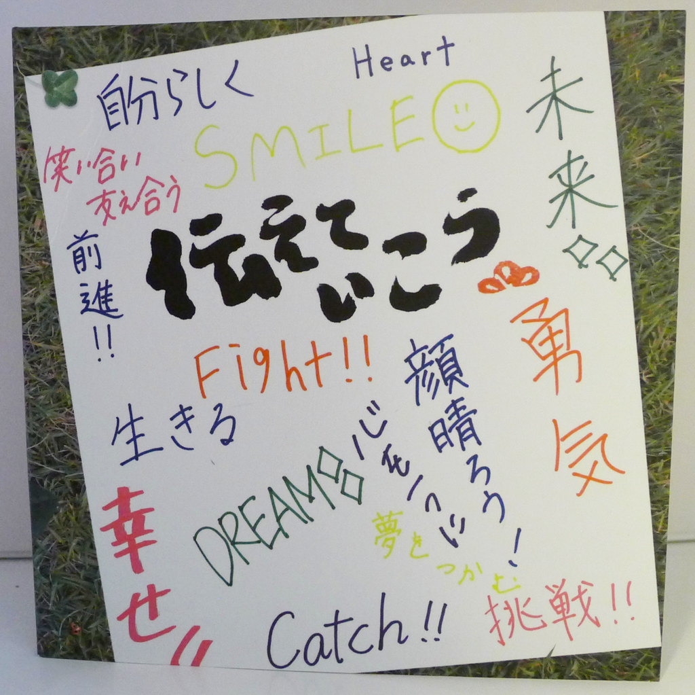
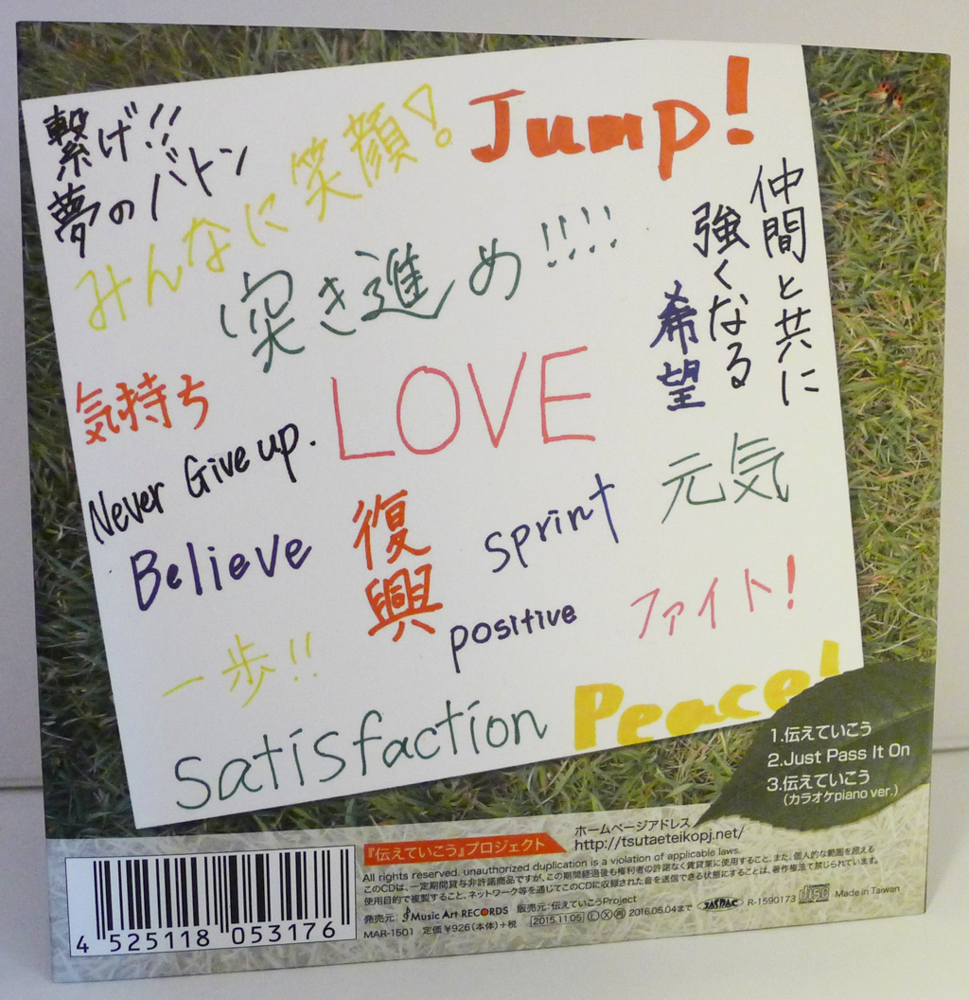

+++
title = "Seiji Endo: Tsutaete Ikou"
author = ["Brian McCrory"]
publishDate = 2018-03-11
tags = ["Hiroco Nagano 永野寛子", "Shinya Nitta 仁田真也", "Seiji Endo 遠藤征志", "Yasuhiro Hasegawa 長谷川泰弘", "Yoshiyuki Nakaya 中屋啓之", "Arata Umehara 梅原新"]
categories = ["albums"]
draft = false
[cover]
  image = "seijiendo-tsutaeteikou-460.jpeg"
  relative = true
+++

In memory of the lives taken by the devastating Tohoku earthquake and tsunami of March 11, 2011, three musicians formed the _Tsutaete Ikou_ project. Pianist Seiji Endo and vocalists Hiroco Nagano and Shinya Nitta were touched by the brave and kindhearted students they met at a benefit concert, children who became an inspiration for the musicians.

“Tsutaete Ikou” is the resulting heart-warming anthem, dedicated to strengthening the spirit of survivors and helping to soothe painful memories. The title echoes a stone monument at Ishinomaki high school which promises to tell their story forever. After disasters such as this, one may feel hopeless individually, yet the act of remembering together, passing the message on, and uniting with music does wonders to support the spirit.

The CD contains three versions of the song “Tsutaete Ikou”, and proceeds were donated to affected disaster areas and educational funds for children.



## Tsutaete Ikou by Seiji Endo {#tsutaete-ikou-by-seiji-endo}

-   [Hiroco Nagano](https://hiroconaganoofficial.amebaownd.com/) - vocal
-   Shinya Nitta - vocal
-   [Seiji Endo](https://seiji-piano-endo.com/) - piano, vocals
-   Yasuhiro Hasegawa - bass (#2)
-   Yoshiyuki Nakaya - drums (#2)
-   [Arata Umehara](https://www.aratata.com/) - guitar (#2)

Released in 2015 on Music Art Records as MAR-1501.

_Japanese names: 永野寛子 Nagano Hiroco 仁田真也 Nitta Shinya 遠藤征志 Endo Seiji 長谷川泰弘 Hasegawa Yasuhiro 中屋啓之 Nakaya Yoshiyuki 梅原新 Umehara Arata_

## Audio and Video {#audio-and-video}

-   [Video for the song “Tsutaete Ikou”:](https://youtu.be/23zd-3JgmV4)



-   [Solo piano version of the song for karaoke:](https://youtu.be/H7QlmnVCqMA)



-   Excerpt from track #1: “伝えていこう (_Let's Tell It_)” [mix #2](https://www.jazzofjapan.com/archive/audio/#mix-2)



## Other Links {#other-links}

-   [The Tsutaete Ikou project website, with piano score and lyrics](http://tsutaeteikopj.net/)
