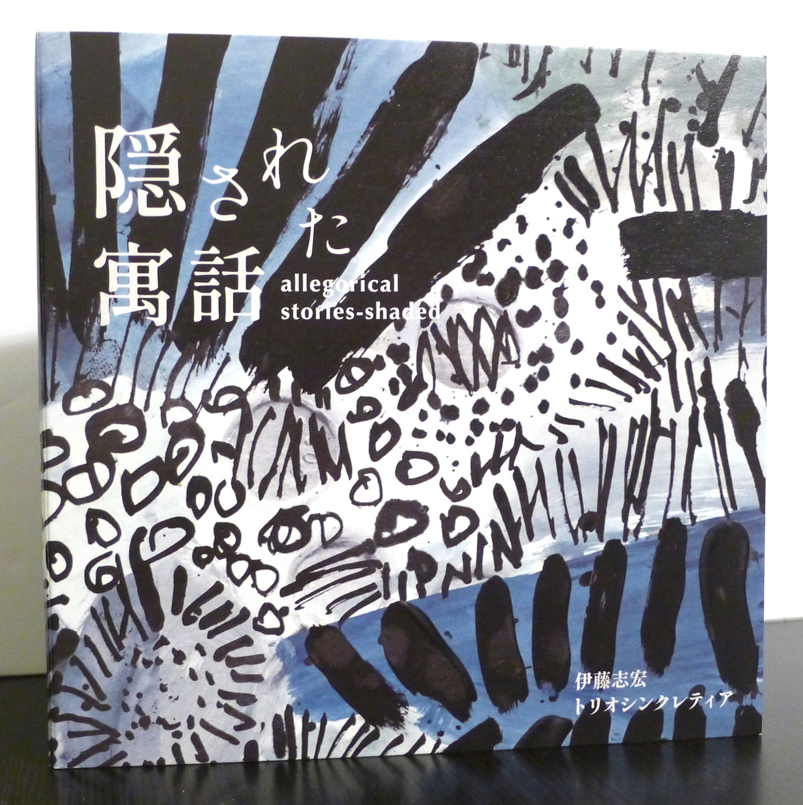
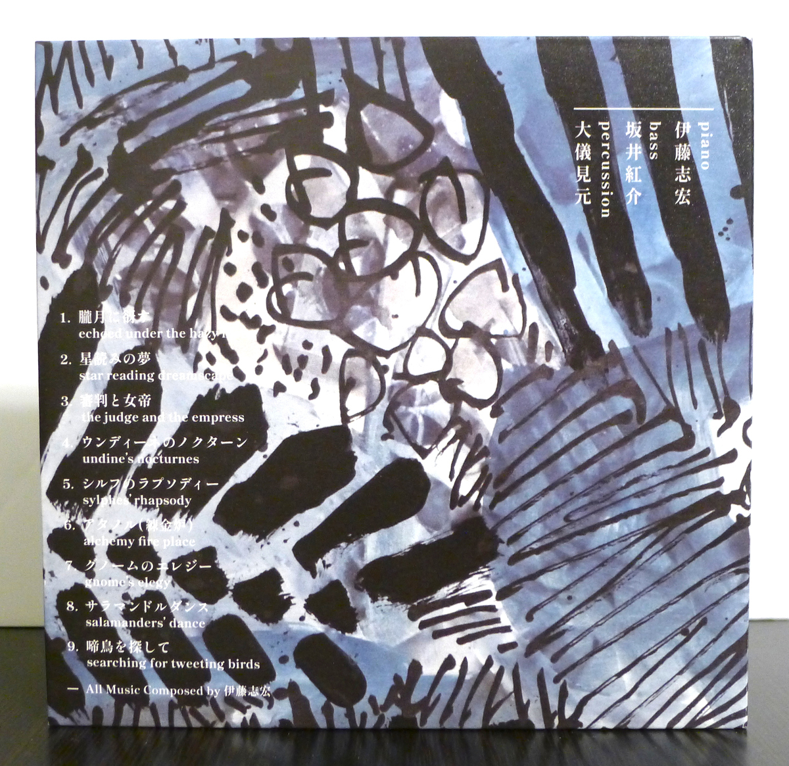
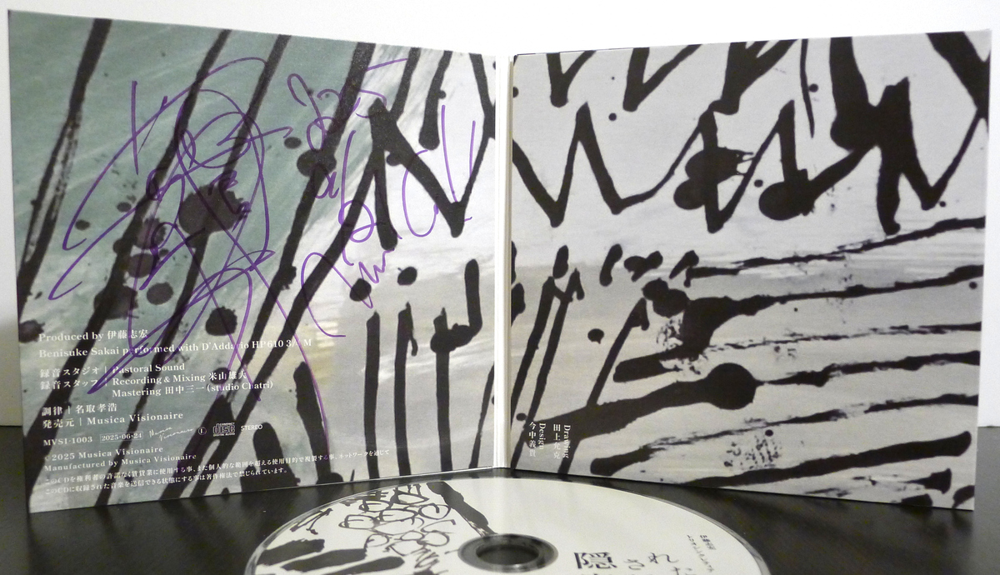

+++
title = "Shikou Ito Trio Syncretia: Kakusareta Guwa"
author = ["Brian McCrory"]
publishDate = 2026-02-22
keywords = ["fuse-live-fuse", "nobie-primary", "maiko-trio-live-three"]
tags = ["Shikou Ito", "伊藤志宏", "Benisuke Sakai", "坂井紅介", "Gen Ogimi", "大儀見元"]
categories = ["albums"]
draft = false
[cover]
  image = "shikou-ito-trio-syncretia-kakusareta-guwa-460.jpeg"
  relative = true
+++

_Kakusareta Guwa_ is a 2025 release from pianist Shikou Ito’s Trio Syncretia. A translation of the Japanese title, 隠された寓話, is also printed on the cover, and reads _allegorical stories-shaded_.

Ito’s trio is a piano-bass-percussion combo, and their music is robust and detailed, soulfully rugged. The sounds from Gen Ogimi’s percussion kit are a change from the regular drum kit that is de rigueur for jazz piano trios, and the sounds of hand drums alongside the snare, toms, and cymbals add a lot of character and color to the music. Intuitively linked to the pulse and beat is bassist Benisuke Sakai, who enhances the rhythms through his firmly connected upright bass with both grounded and adventurous playing.

On top of everything is pianist Shikou Ito, whose unrestrained style reflects his professional technique and wide experience with many jazz, pop, and non-genre musicians, not to mention his captivating free solo improvisations on other albums and live performances. On _Kakusareta Guwa_, Ito’s nine original compositions are filled with atmosphere and mystery. He writes and plays as if he is pulling inspiration from ancient secrets and foreign cultures to fashion new sounds from ethnically rich legends.

For example, through his written melodies, Ito deftly plays twists, ornaments, and scales that, in certain places, seem to have characteristics of Middle Eastern melodies and Latin traditions. Uncommon time signatures with odd meters, extra measures, and interludes are written into his music as well, enhancing the storytelling effect and increasing the musical and rhythmic interest. Ito’s use of prepared piano and damping the piano strings using one hand while playing with the other, adds an extra timbre of metallic shimmering from the altered tones. All together, Trio Syncretia’s playing is rooted in jazz with a vibrant personality aligned towards the image of _secret, hidden fables_ described by the title.

True to the ideal of artistic independence, Ito is uncompromising with his music. Although all his song titles here are in Japanese, just as with the album title, the song titles are also written with English translations on the back cover:

1.  echoed under the hazy moon - 朧月に谺す (_Oborozuki ni kodama su_)
2.  star reading dreamscape - 星読みの夢 (_Hoshiyomi no yume_)
3.  the judge and the empress - 審判と女帝 (_Shinpan to nyotei_)
4.  undine’s nocturnes - ウンディーネのノクターン (_Undīne no nokutān_)
5.  sylphes’ rhapsody - シルフォのラプソディー (_Shirufo no rapusodī_)
6.  alchemy fire place - アヌノル（錬金戸）(_Anunoru (renkin to)_)
7.  gnome’s elegy - グノームのエレジー (_Gunōmu no erejī_)
8.  salamander’s dance - サラマンドルダンス (_Saramandorudansu_)
9.  searching for tweeting birds - 鳴鳥を探して (_Meichō o sagashite_)

Themes from these titles include nature, fantasy, and musical ideas, but taken as a whole, the tales told through _allegorical stories-shaded_ are evocative and, just like Trio Syncretia’s music, absorbing and thrilling.



## Kakusareta Guwa by Shikou Ito Trio Syncretia {#kakusareta-guwa-by-shikou-ito-trio-syncretia}

-   [Shikou Ito](/tags/shikou-ito) - piano
-   [Benisuke Sakai](/tags/benisuke-sakai) - bass
-   [Gen Ogimi](/tags/gen-ogimi) - percussion

Released in 2025 on Musica Visionaire as MVSI-1003.

_Japanese names: 伊藤志宏 Ito Shikou 坂井紅介 Sakai Benisuke 大儀見元 Ogimi Gen_

## Audio and Video {#audio-and-video}

-   [Studio recording from Shikou Ito Trio Syncretia’s 2017 album _毒ある寓話_ (Doku aru guwa) from 2018:](https://youtu.be/DSEItwXDvl8)



-   [A dance set to music by Trio Syncretia:](https://youtu.be/NZtSkscf5uI)



-   [“Take the A Train” (Shikou Ito solo piano):](https://youtu.be/sBY1sKclB7w)



-   [“Everything Happens to Me” (Shikou Ito solo piano):](https://youtu.be/snvU-lEla8A)



-   Excerpt from track #1: “朧月に谺す (_Look at the Moon_)” [mix #15](https://www.jazzofjapan.com/archive/audio/#mix-15)


