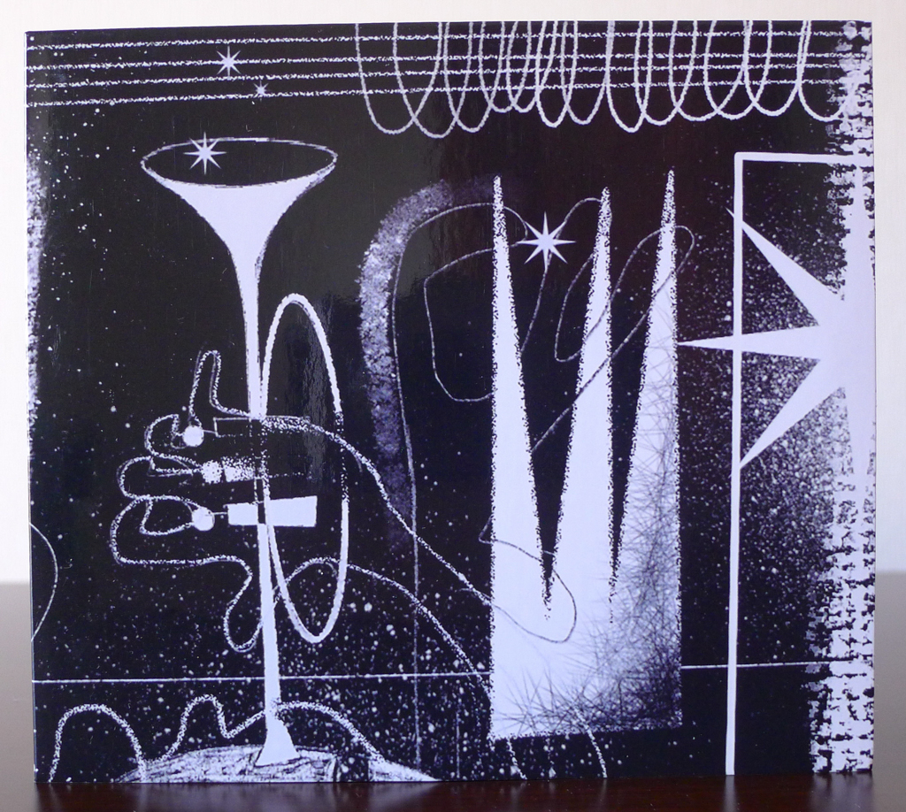
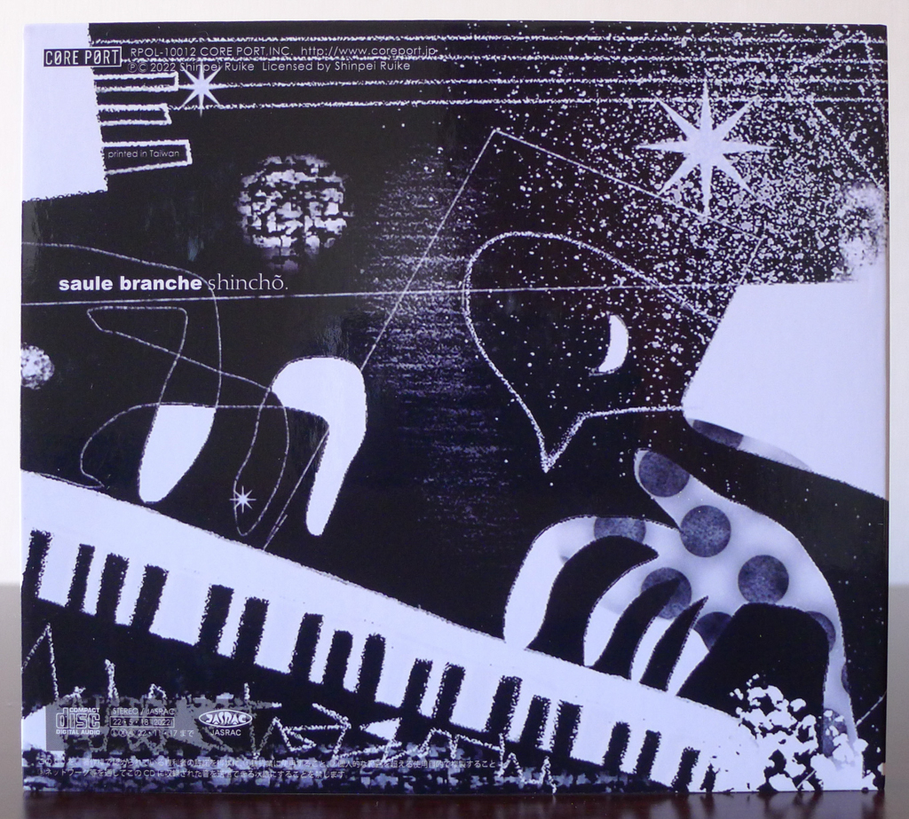
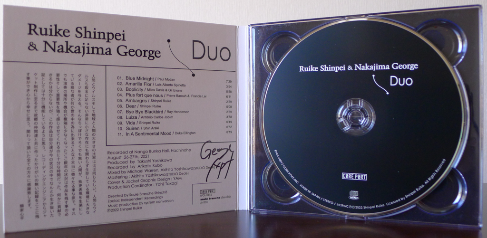

+++
title = "Shinpei Ruike & George Nakajima: Duo"
author = ["Brian McCrory"]
publishDate = 2023-11-10
keywords = ["shinpei-ruike-george-nakajima-n40", "george-nakajima-trio-first-touch"]
tags = ["Shinpei Ruike", "類家心平", "George Nakajima", "中嶋錠二"]
categories = ["albums"]
draft = false
[cover]
  image = "shinpeiruike-georgenakajima-duo-460.jpeg"
  relative = true
+++

_Duo_ is the latest album from trumpeter Shinpei Ruike and pianist George Nakajima, two Tokyo-based jazz musicians who hail from the same area in northern Japan, along with many of the people who helped to create this recording.

Like their previous release _[N.40°](https://www.jazzofjapan.com/archive/shinpei-ruike-george-nakajima-n40)_ (a reference to their mutual hometown of Hachinohe), the music on _Duo_ is atmospheric, moody, and mostly dark. The sound of Ruike’s trumpet is extremely evocative and textured. Like colors from a paint pallet, he mixes tones from husky to muted to bell-clear as his inspiration unfolds. Layers of emotion surface and mingle in his trumpet sound, as captivating as an audible patina cultivated through age and exposure like the surface of a brass horn.

Perhaps influenced by their bonded background, the flow and time sensitivity between Ruike and pianist Nakajima seems innately linked. The two musicians have a sense of how to slightly stretch and subtly bend time as they play, yet they lock into rhythms naturally, without falling off the tracks.

_Duo_ is overall a melancholy affair, with most songs taken at a slow and serious pace. This is an album that sets a scene of deep contemplation for a listener, whether they are fully absorbing the music or setting it as an unobtrusive aural backdrop. If this music were interpreted as love songs, it would be love laced with pain, as loneliness, longing, or memories keep a vulnerable flame of hope alight and protected.

With eleven tracks running for about an hour, the majority of songs are interpreted covers of music from artists including Paul Motion (“Blue Midnight”), Miles Davis (a free-range “Bye Bye Blackbird”), Duke Ellington (“In A Sentimental Mood”), and Antonio Carlos Jobim (“Luiza”). Personal highlights include the beautiful and slightly painful “Amarilla Flor” from Luis Alberto Spinetta and the pushed-through-the-horn, breathy sound on “Plus for que nous”, a song on _Duo_ that most strongly evokes the expertly controlled tone and feel of Polish trumpeter Tomasz Stańko.

Also included are three wonderful originals from Ruike: the boiling cauldron of “Ambargris”, the pretty, fresh feelings in “Dear”, and the haunting and desolate “Vida”.

## Liner Notes {#liner-notes}

_(Translated from the original Japanese liner notes visible in the photo above.)_

It seems like the relative size of humans to viruses is about the same as the earth compared to humans. And yet, while humans and viruses are insignificant and extremely small, nevertheless they can cause great damage to the environments in which they live. In this way, truly negligible differences can be made in the world by such tiny human beings, especially those who make a living through self-expression. However, living through the situation in the last few years where there were so few live performances and opportunities, there was plenty of time to strongly feel the importance and necessity of preserving recorded works. I don’t know if I can contribute anything, but I believe that this recording can serve as proof that somehow we were able to survive through these conditions. I’m so happy that we can leave this irreplaceable record that was made together with friends from my hometown, everyone from the recording engineer to the jacket designer. Thank you to everyone who was involved.

Shinpei Ruike



## Duo by Shinpei Ruike &amp; George Nakajima {#duo-by-shinpei-ruike-and-george-nakajima}

-   [Shinpei Ruike](/tags/shinpei-ruike) - trumpet
-   [George Nakajima](/tags/george-nakajima) - piano

Released in 2022 on Core Port as RPOL-10012.

_Japanese names: 類家心平 Ruike Shinpei 中嶋錠二 Nakajima George_

## Audio and Video {#audio-and-video}

-   [Live recording of “Suiren”, track #10 on this album:](https://youtu.be/ojfvmRfqrqE)



-   Excerpt from track #4: “Plus fort que nous” [mix #9](https://www.jazzofjapan.com/archive/audio/#mix-9)


