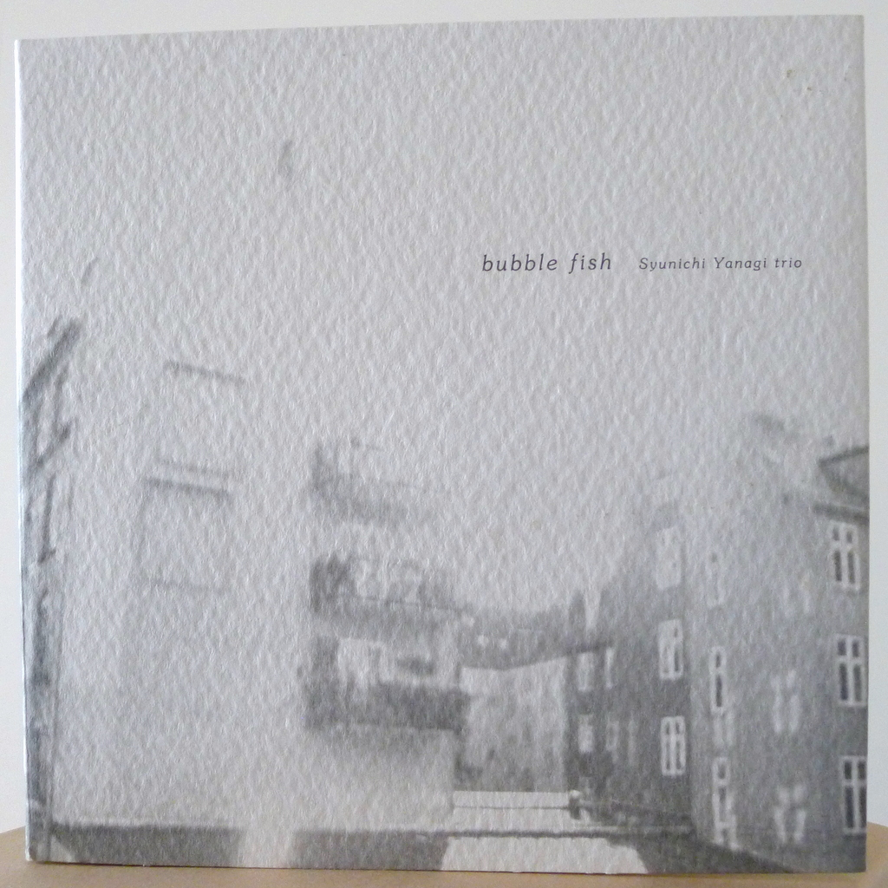
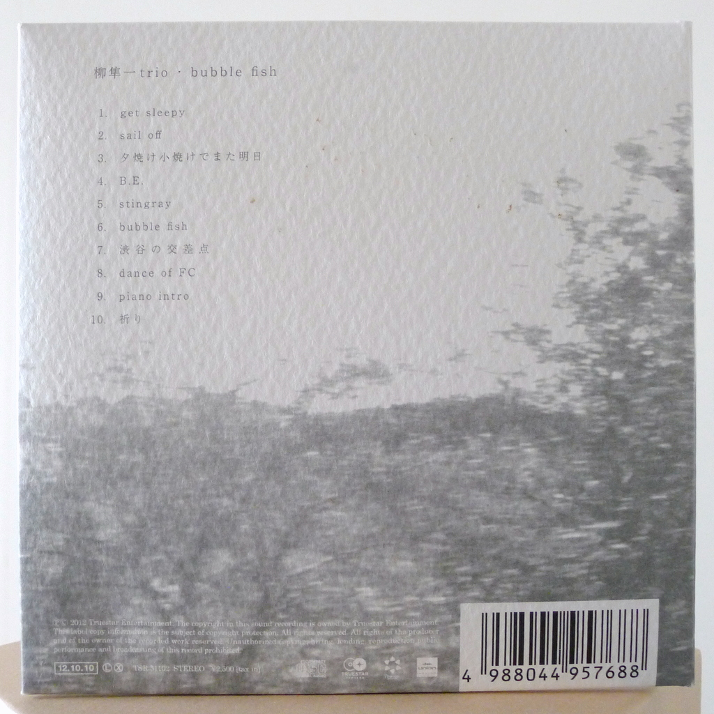
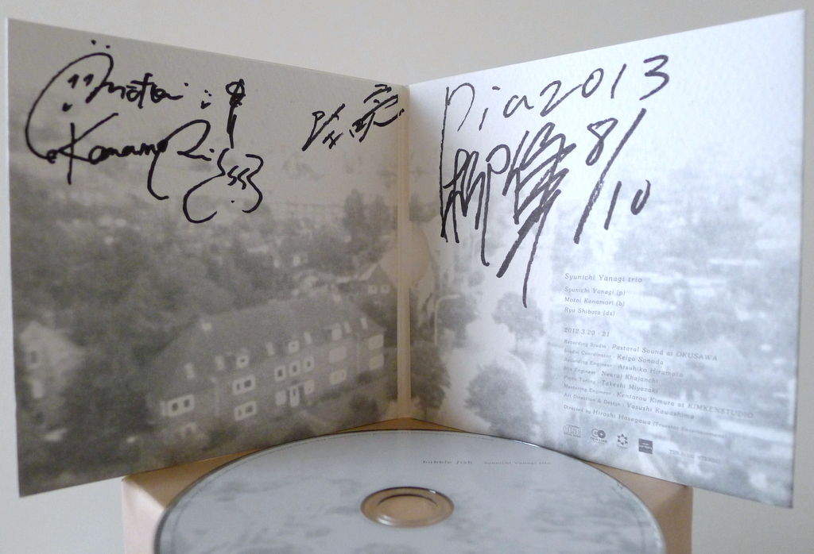

+++
title = "Shunichi Yanagi Trio: Bubble Fish"
author = ["Brian McCrory"]
publishDate = 2020-03-17
tags = ["Shunichi Yanagi", "柳隼一", "Ryo Shibata", "柴田亮", "Motoi Kanamori", "金森もとい"]
categories = ["albums"]
draft = false
[cover]
  image = "shunichiyanagi-bubblefish-460.jpeg"
  relative = true
+++

Jazz pianist Shunichi Yanagi releases a shimmering modern jazz recording with his Tokyo trio on his 2012 debut _Bubble Fish_. The ten original songs from the pianist incorporate rock edginess and hip coolness into piano jazz with attitude. Modern jazz trios like E.S.T. or The Bad Plus may have been influences to the trio’s kaleidoscopic sound, pushing traditional jazz boundaries with youthful freshness.

On _Bubble Fish_, the jazz trio uses full chords and vital grooves on their compositions, bubbling with rock and pop styles infused with jazz improvisation. Yanagi’s angular patterns run up and down the piano keys with an almost electric guitar mindset. Yet, the pianist also shows a light tenderness where soft melodies rise lightly to the surface with positive energy, particularly on album highlights such as the “Shibuya Crossing” and “Prayer”, which closes the album with calming peace.

## Bubble Fish by Shunichi Yanagi Trio {#bubble-fish-by-shunichi-yanagi-trio}

-   [Shunichi Yanagi](/tags/shunichi-yanagi) - piano
-   [Ryo Shibata](/tags/ryo-shibata) - drums
-   [Motoi Kanamori](/tags/motoi-kanamori) - bass

Released in 2012 on Truestar Entertainment as TSR-51102.

_Japanese names: 柳隼一 Yanagi Shunichi 柴田亮 Shibata Ryo 金森もとい Kanamori Motoi_

## Audio and Video {#audio-and-video}

-   [Promotional video for this album:](https://youtu.be/4OmuGFXKNlc)



-   Excerpt from track #7: “渋谷の交差点 (_Shibuya Crossing_)” [mix #6](https://www.jazzofjapan.com/archive/audio/#mix-6)


