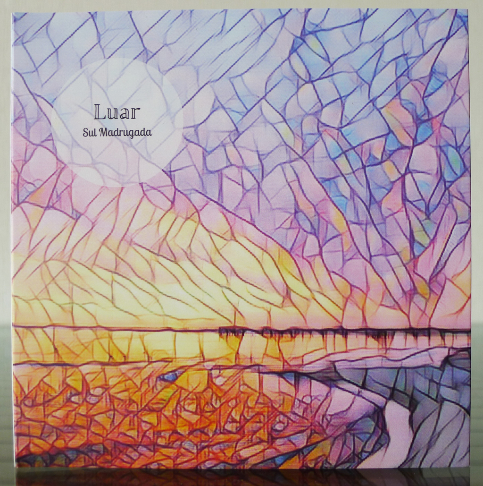
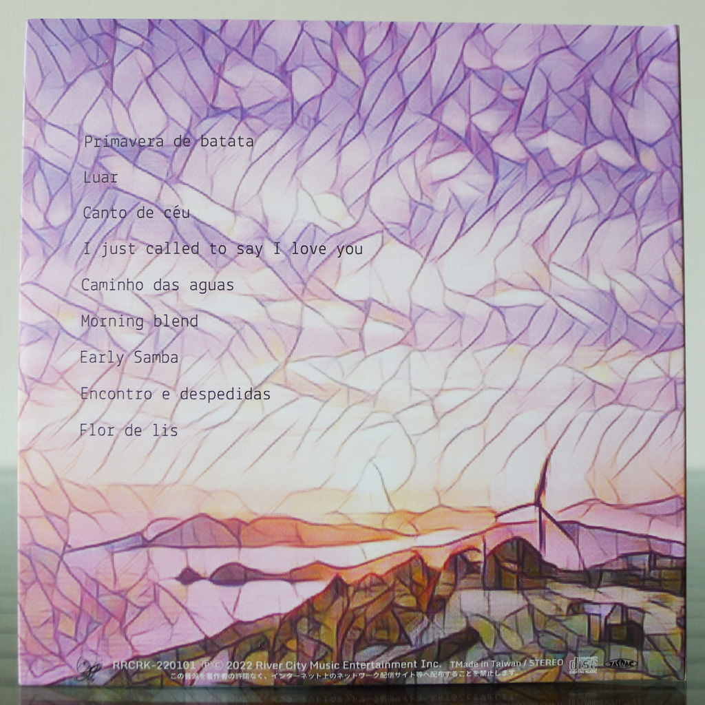
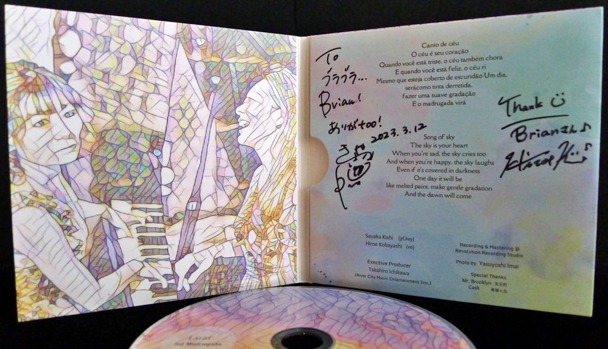

+++
title = "Sul Madrugada: Luar"
author = ["Brian McCrory"]
publishDate = 2023-08-25
keywords = ["sayaketts-colors", "sayaka-kishi-featuring-te", "arco-asymmetry", "arco-live-at-yoncha", "sayaka-kishi-trio-life-is-too-great", "arco-birth"]
tags = ["Sayaka Kishi 岸淑香", "Hiroe Kobayashi 小林宏衣"]
categories = ["albums"]
draft = false
[cover]
  image = "sul-madrugada-luar-460.jpeg"
  relative = true
+++

While leading and participating in different groups through the years, musicians Hiroe Kobayashi and Sayaka Kishi have also played together on various projects incorporating standard jazz, pop, and Latin genres, and even Disney and movie songs. In 2022, the duo released their first full-length album entitled _Luar_ under the band name Sul Madrugada. This name, Portuguese for “southern dawn”, together with the title _Luar_ for “moonlight” beautifully describes the atmospheric direction the pair gravitates towards with this Latin jazz project. On this release, the duo is devoted to creating South American music in a package that embraces nature through the icons of the sun and moon.

_Luar_ is a sparkling album with a running time of 45 minutes and contains a mix of original and Brazilian selections. Three songs from Brazilian artists are included, and the four original compositions also convey bona fide South American influences with slow ballads, catchy pop, and uptempo samba. The one exception to the theme is Stevie Wonder’s “I Just Called to Say I Love You”, played with a laidback midtempo groove for a mid-album refreshment.

While Kobayashi uses some English and Japanese lyrics, the vocalist mostly sings in Portuguese as on the covers of “Caminho das Águas”, “Encontros e Despedidas”, and “Flor de Lis”. Yet more often, the versatile Kobayashi enjoys vocalizing without words, adding nicely textured organic layers to the music with colorful _oohs_, _aahs_, and _laas_ to build up the sound by using her voice as an additional instrument.

Similar to the musicians’ other albums, the songwriting on _Luar_ is one of the main attractions. Kobayashi supplies two originals with tracks #1 and 3: “Primavera de Batana” soars lightly, with pretty harmonizing of voice, piano, and keyboard, and on “Canto de Céu”, the vocalist combines a poetry-like reading with guitar, keyboard, and distant choral singing for a wandering ambience.

Pianist Kishi’s original songs include the spiritual colors of “Luar”, the light pop of “Morning Blend”, and the spicy energy of “Early Samba”, which brings to mind another of Kishi’s groups Conviano, a popular and exciting Latin-based trio made up of conga, vibraphone, and piano.

Along with her songwriting, Kishi’s skill at juggling various instruments like piano, keyboard, and percussion is impressive. This sort of fluidity also extends to Sul Madrugada’s live shows, where Kobayashi and Kishi switch positions between acoustic piano and electric keyboard or guitar for selected songs. This vitality and variation are elemental to their absorbing music, engaging the audience like the attractive pull of heavenly bodies, sun and moon.



## Luar by Sul Madrugada {#luar-by-sul-madrugada}

-   [Sayaka Kishi](http://www.sayaketto.net/) - piano, keyboard
-   [Hiroe Kobayashi](https://hirosnoopyhiro.wixsite.com/mysite) - voice

Released in 2022 on River City Music Entertainment as RRCRK-220101.

_Japanese names: 岸淑香 Kishi Sayaka 小林宏衣 Kobayashi Hiroe_

## Audio and Video {#audio-and-video}

-   [Promotional video for “Early Samba”, track #7 on this album and the title of a four-song mini-album from Sul Madrugada:](https://youtu.be/VuPqiUUVQ_Y)



-   Excerpt from track #1: “Primavera De Batata” [mix #9](https://www.jazzofjapan.com/archive/audio/#mix-9)


