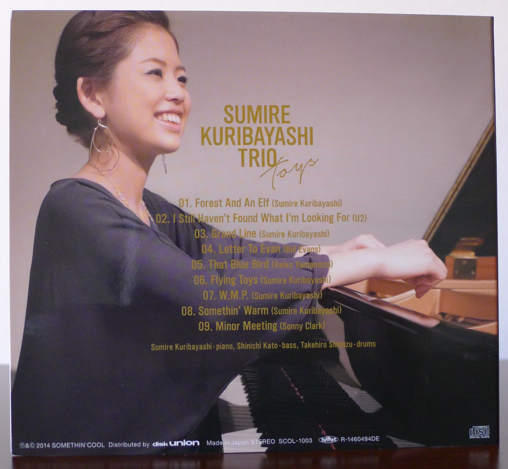
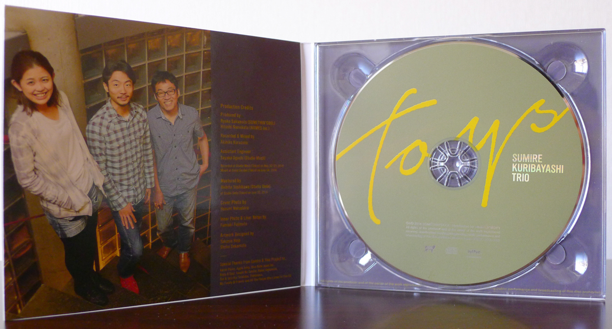

+++
title = "Sumire Kuribayashi Trio: Toys"
author = ["Brian McCrory"]
publishDate = 2024-09-27
keywords = ["hideaki-kanazawa-sumire-kuribayashi-nijuso", "reiko-yamamoto-square-pyramid"]
tags = ["Sumire Kuribayashi", "栗林すみれ", "Shinichi Kato", "加藤真一", "Takehiro Shimizu", "清水勇博"]
categories = ["albums"]
draft = false
aliases = ["/archive/sumire-kuribayashi-trio-toys/", "/p/sumire-kuribayashi-trio-toys/"]
[cover]
  image = "sumire-kuribayashi-trio-toys-460.jpeg"
  caption = ""
  relative = true
+++

_Toys_ is pianist Sumire Kuribayashi’s debut leader album from 2014. Since then, the spirited musician has been on a tear, with several more leader albums released from her own projects as well as collaborations with a variety of Japanese and international musicians.

With _Toys_, Kuribayashi plays nine tracks on the forty-eight-minute album, with five of her own songs and four beloved covers arranged together in a lively display of her musical vision. Whatever _Toys_ may mean as a concept title (hinted at in the Obi Notes), it’s a playful album that works as a perfect medium for her musical worldview.

Some of the most melodically striking and immediately felt songs on the album are Kuribayashi’s own originals. Of these five songs, “Forest and an Elf” is fluid and magical, “Grand Line” is busy yet delicate, “Flying Toys” is sparkling and exciting, “W.M.P.” is bluesily modal and modern, and “Somethin’ Warm” is patient, pretty, and sincere. The medium tempo and straight-eights time feel color the songs with modern finesse and understated power. What’s clear in each is that Kuribayashi thinks through her compositions, not only the mechanics of structure and form, but how she wants them to imaginatively feel, how the players should think about them, and where she wants them to go.

Her selection of the four cover songs also demonstrates her consideration for balance and respect. She brings together songs from distinct planes of influence, from the worldwide megapop stars U2, to the sweet lyricism of Bill Evans, to the current-day Japanese vibraphonist and musical peer Reiko Yamamoto, to a deep cut from the much-loved bop pianist Sonny Clark.

“I Still Don’t Know What I’m Looking For” is down-home groovy, “Letter to Evan” is comfortably plush, “That Blue Bird” is tender and engrossing, and “Minor Meeting”, as the last cut on the album, hooks listeners and leaves them ready to hear more from Sumire Kuribayashi’s toy trove.



## Liner Notes {#liner-notes}

_(Translated from an excerpt of jazz writer Fumiaki Fujimoto’s section of the original Japanese liner notes.)_

This debut CD is a perfect package for this lady’s charm. What surprised me during my first listen was how this whole album was overflowing with _songs_. The variety of the included songs is richly diverse, but each song is decorated with catchy and colorful melodies that are exclusively Sumire Kuribayashi’s own.

Particularly wonderful are the five original compositions. The dusky lyricism delicately woven in “Forest and an Elf”. The splendid, thrilling trio sound racing through “Grand Line”. The instinctive lifting of spirits by the invigorating “Flying Toys”. The geometrical theme on “W.M.P.”, allowing glimpses of another side of the composer. The simple and nostalgic theme that evokes quiet emotion on “Somethin’ Warm”… These songs and performances can really be seen as a crystallization of her current inner voice. The other songs are similarly good. U2, Bill Evans, Reiko Yamamoto, Sonny Clark… Her performances of their songs as covers convey her boundless love and respect for these composers, and are filled with her determination to take up challenges.

Perhaps crossed-arm critics will bemoan a lack of mind-blowing originality or astonishing technique on display. But I think that Sumire Kuribayashi’s vividly projected light certainly shines toward the future of jazz.

_(The following is translated from Sumire Kuribayashi’s section of the original Japanese liner notes.)_

**01. Forest and an Elf (Sumire Kuribayashi)**

This is a song created with a lot of inspiration drawn from pianist Aaron Parks. I was really moved when I went to his solo piano concert, where his music seemed to be resonating deep in a forest. Even when he walks down the street, he seems to be lightly floating like a woodland spirit.

This song has a lot of sections, and I made an effort to have the parts flow together seamlessly so as not to feel like a patchwork. I was having difficulty explaining this to the rest of the band, but finally, by singing what I meant, I was able to get it down.

**02. I Still Haven’t Found What I’m Looking For (U2)**

We decided to record this by thinking “We should try to do a rock cover.” We considered Coldplay, Oasis, Radiohead, and others, but this song by U2 was the best fit for me. Just around that time, I was listening to a lot of Keith Jarrett from the Impulse years, and I tried to arrange it with a little bit of that folksy feel.

**03. Grand Line (Sumire Kuribayashi)**

Several years ago I went to see a live performance of Taylor Eigsti, Reuben Rogers, and Eric Harland. Eric’s drumming was so cool at that event, and I was so excited that after going home I wrote out this song in a day.

Actually, I love video games, and I’ve been hoping that someday I could write a majestic song that could appear in that medium. I wonder if this is the sort of song where I’ve created something like that. As I explained the imagery to the band members, they laughed and responded with “This part feels like an airplane speeding off into the wide open sky!” and “This here feels like wandering lost in a cave, then finding some light and escaping!”

\*04. Letter to Evan (Bill Evans)\*/ (no notes added)/

**05. That Blue Bird (Reiko Yamamoto)**

This song was written by Reiko Yamamoto and also recorded by our group “sumireiko”. The beautiful and heartfelt melody is just so great. Someone said to me “I’d love to hear this as a piano trio version!”, so I decided to include it this time.

The key is a difficult one, so it was quite a challenge. Also, I was trying to control my touch carefully so that the piano wouldn’t ring out too much. My arms got sore (haha). Perfecting the overall sound of the trio was a hard-won fight with a lot of trial and error, but I think that the struggle made for a nice result with a good feel.

**06. Flying Toys (Sumire Kuribayashi)**

I still needed one more song for the album and was fretting over it, so I went to my usual bar to change my mood. The owner encouraged me with such strong energy that I was able to write this song in one go. First of all, I wanted to use the name of the place as the song title (haha).

I aimed for a song and performance with a catchy melody sprinting above simple harmonies, sort of like a Pat Metheny idea. The drum solo in the second half is something I begged Takehiro Shimizu for, asking him, please just beat it down! I think it’s really cool.

\*07. W.M.P. (Sumire Kuribayashi) \*/(no notes added)/

**08. Somethin’ Warm (Sumire Kuribayashi)**

This is a ballad I wrote for all those who have supported me up to now and who have listened to this CD. It expresses my appreciation for you all. It’s a simple melody that I play directly and as written, without improvisation. Shinichi Kato takes over the melody on bass partway through, and it’s amazing how his warm and kind personality also really comes through.

**09. Minor Meeting (Sonny Clark)**

During college, I studied bebop and nothing else. At first, I didn’t quite get it, but now I’ve fallen in love with it. I picked this tune to pay tribute to those beboppers. The thumping, weighty intro is also in my style of sincere respect for what’s sometimes referred to by some as “Black Jazz”. I was feeling a little Oscar Peterson in the middle with the second riff played in unison.

## Obi Notes {#obi-notes}

_Playing with the piano, toying with the notes, living in jazz._

_**Sumire Kuribayashi Trio’s Toys**_

_From the fresh, twenty-first century label “Somethin’ Cool” comes the popular pianist’s genuine debut album, already making waves online with the original song “Forest and an Elf”, and a cover of U2’s “I Still Haven’t Found What I’m Looking For”!_

_Performers: Sumire Kuribayashi (piano), Shinichi Kato (bass), Takehiro Shimizu (drums)_



## Toys by Sumire Kuribayashi Trio {#toys-by-sumire-kuribayashi-trio}

-   [Sumire Kuribayashi](/tags/sumire-kuribayashi) - piano
-   [Shinichi Kato](/tags/shinichi-kato) - bass
-   [Takehiro Shimizu](/tags/takehiro-shimizu) - drums

Released in 2014 on Somethin’ Cool as SCOL-1003.

_Japanese names: 栗林すみれ Kuribayashi Sumire 加藤真一 Kato Shinichi 清水勇博 Shimizu Takehiro_

## Audio and Video {#audio-and-video}

-   [Video excerpt from #1 “Forest and an Elf”:](https://youtu.be/j_A6v_0_res)



-   [Live performance of #1 “Forest and an Elf”:](https://youtu.be/nIOl_0JWCcQ)



-   [Video excerpt from #6 “Flying Toys”:](https://youtu.be/-SBeVpkjpa8)



-   [Live performance of #5 “That Blue Bird”:](https://youtu.be/SEv4Ac_E-e0)



-   [Video excerpt from #2 “I Still Haven’t Found What I’m Looking For”:](https://youtu.be/fw27CXVUaK8)



-   [Audio for #9 “Minor Meeting”:](https://youtu.be/gpa2oCRrO5Y)



-   [Label page with audio samples](https://www.somethincooljazz.com/scol-1003)

-   Excerpt from track #3: “グランド・ライン (_Grand Line_)” [mix #11](https://www.jazzofjapan.com/archive/audio/#mix-11)


