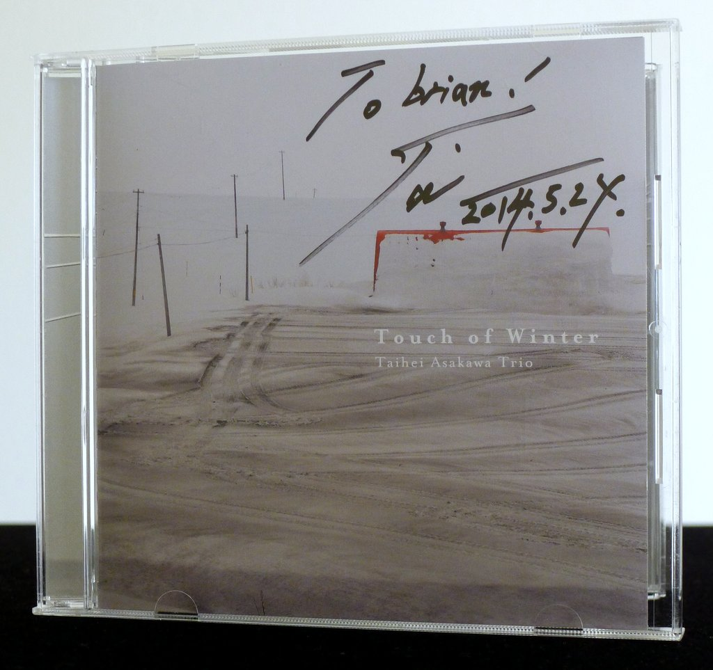
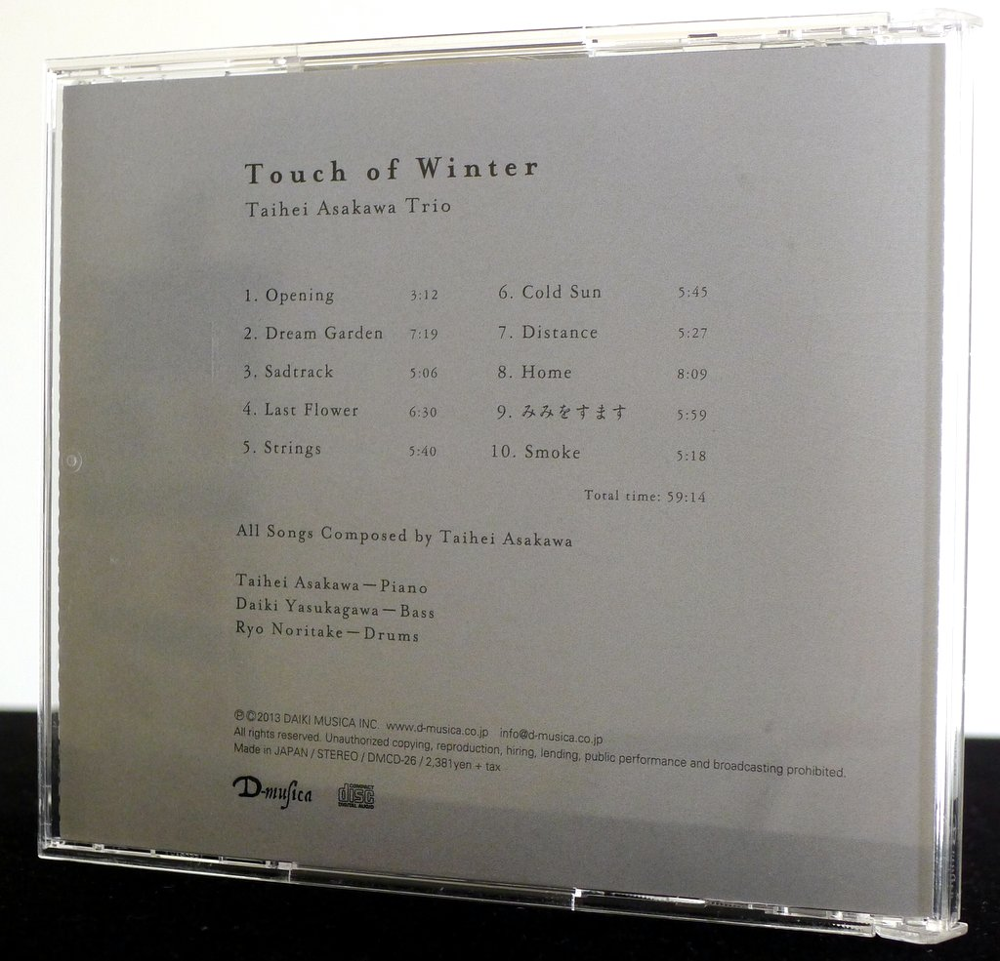
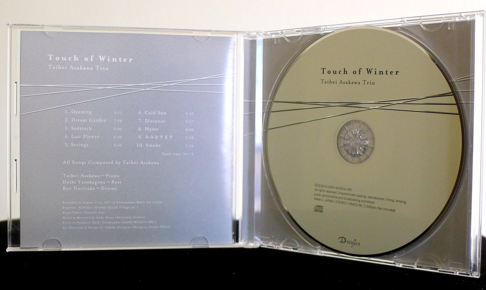
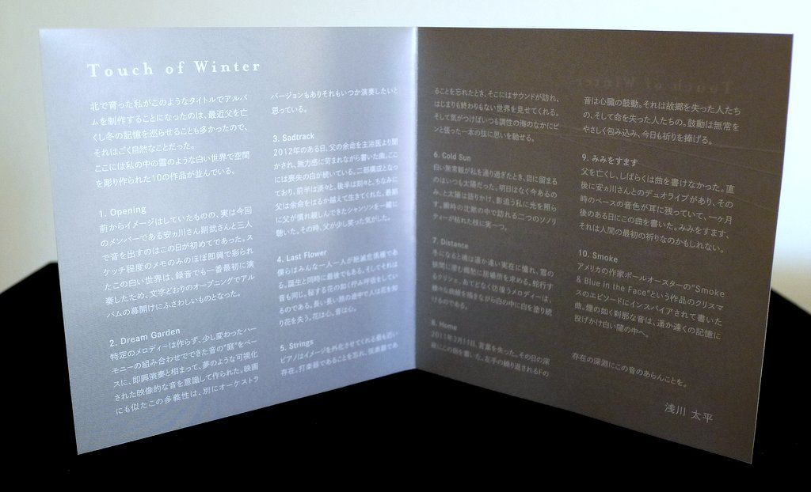

+++
title = "Taihei Asakawa Trio: Touch of Winter"
author = ["Brian McCrory"]
publishDate = 2018-10-01
tags = ["Taihei Asakawa 浅川太平", "Daiki Yasukagawa 安ヵ川大樹", "Ryo Noritake 則武諒"]
categories = ["albums"]
draft = false
[cover]
  image = "taiheiasakawa-touch-460.jpeg"
  relative = true
+++

Taihei Asakawa’s beautiful _Touch of Winter_ from 2013 is a contemplative jazz album rooted in calm emotion: Memory, melancholy, and rebirth combine to paint stimulating music on a pure white winter tableau.

The 10 original songs on this album unfold in the emotion-heavy Brad Mehldau vein of modern piano trio jazz. Patient, somber ballads lie alongside straight-ahead compositions thick with melodic effusions, traces of classical influence, and bluesy suggestions as well.

This album also includes free moments which leave the musical structure open compositionally, allowing the trio to slowly create mysterious, sensitive soundscapes, searching and reaching for expression. At times somber and wistful (with the recent death of the pianist’s father being cited as an influence on the music), there is also grace and forward-momentum on this trio’s journey through this comforting, introspective music.

## Touch of Winter by Taihei Asakawa Trio {#touch-of-winter-by-taihei-asakawa-trio}

-   [Taihei Asakawa](https://taiheiasakawa.wixsite.com/piano) - piano, compositions
-   [Daiki Yasukagawa](http://daikiyasukagawa.com/) - bass
-   [Ryo Noritake](http://www.ryonoritake.com/) - drums

Released in 2013 on D-musica Daiki Musica as DMCD-26.

_Japanese names: 浅川太平 Asakawa Taihei 安ヵ川大樹 Yasukagawa Daiki 則武諒 Noritake Ryo_

## Audio and Video {#audio-and-video}

-   [Promotional video for this album with album excerpts played live:](https://youtu.be/9UIC2PHbwgo)



-   Excerpt from track #2: “Dream Garden” [mix #3](https://www.jazzofjapan.com/archive/audio/#mix-3)


